# 裸聊、被敲诈、勒索、我查到对方在重庆开火锅店，是个抠脚大汉

> 原文：[`mp.weixin.qq.com/s?__biz=MzU4ODAwNzUwMQ==&mid=2247485862&idx=1&sn=c966ac61c1e530fe0f1e029df41b06d2&chksm=fde21884ca95919237267636afa60ea43dda71fc9907f820c008c179292a83a9f18b90e50884&scene=27#wechat_redirect`](http://mp.weixin.qq.com/s?__biz=MzU4ODAwNzUwMQ==&mid=2247485862&idx=1&sn=c966ac61c1e530fe0f1e029df41b06d2&chksm=fde21884ca95919237267636afa60ea43dda71fc9907f820c008c179292a83a9f18b90e50884&scene=27#wechat_redirect)

【黑客调查】

**该栏目主要讲述老师傅利用【计算机基础知识】，还原网络或现实中的各种骗局和真实面目，以达到让人警醒的目的。**

* * *

在灰黑领域，色情和赌博可以说是龙头产业，都是非常暴利的、隐藏在地下的非法产业。

他们研究人性、把玩人性，根据不同需求制造不同诱饵，一步步诱导受害者乖乖交出口袋里的钱。

这一行也分三六九等，他们或规模化、或单兵作战，做得大的年产值上亿，做得小的再怎么也能嘴上抹几口油。

**裸聊遭勒索**

上周末，我和老师傅开着车去郊外逛了逛，晚上找了个小酒馆喝酒，酒正喝着，突然有个读者加我微信，上来第一句话就说：**“我遇到个事儿，别笑话我，说完帮我保护好隐私。****”**

虽然平时也有很多人加我，基本上都是求帮忙的，理由千奇百怪，要么是赌博输了几十万问能不能帮忙要回来的，要么就是网上被骗求助的，要么是查女朋友是否出轨的。

甚至还有女朋友跟人跑了，想搞臭对方的。

对于被骗求助，我会直接告诉他去找警察，对于赌博输钱还想要回来的这种人，我都懒得骂他。

但这次，这位读者发来的这句话让我特别好奇，尤其那会已经凌晨一点了。究竟是什么事他要让我别笑话他，还让我听完一定要保护他的隐私。

此时我和老师傅正喝得微醺，点上一根烟的功夫我就回他：“什么事？你说。”

“刚刚无聊上网的时候，看到一个网页版的 XXX（一个打擦边的陌生社交软件），然后就在上面聊了个妹子，后来就加了对方 QQ，聊骚了几句对方就说想玩点刺激的。”

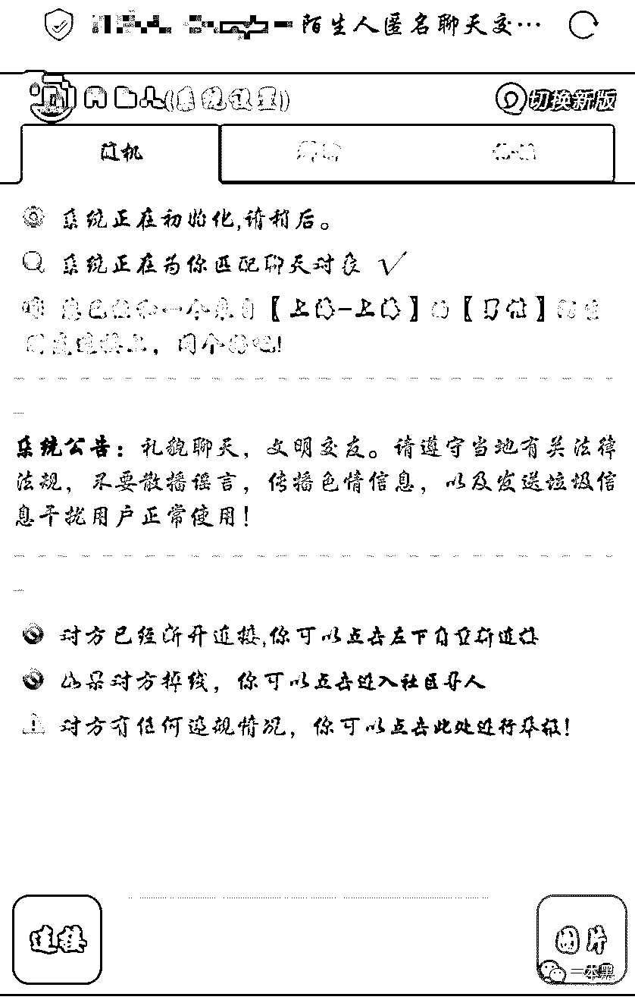

听到这里，我往烟灰缸里弹了弹烟灰，这座城市的夜晚尤其漫长，郊外的黑夜又如此安静，看着周遭微弱的灯光，我大概猜到了这哥们所遭遇的事。

紧接着这哥们说：“对方主动要求果聊，说是为了方便视频聊天，就给我发了个链接，让我下载一个软件，用这个软件和她聊天。”

“我当时很激动，心想怎么会遇到这种好事，本来大晚上的已经很困了，聊到这里突然来了精神。我下载软件安装后打开，界面显示服务器有问题，然后我就给她说软件好像有问题。

她没有立刻回我，大概过了五分钟，她说要不用 QQ 视频吧，我就说好，然后就和她接通了视频，比较污的那种。

几分钟过后，她把视频挂断了，我心想这怎么回事，正准备给她拨过去的时候，她让我添加另一个号码，我以为是用另一个号码聊，结果......

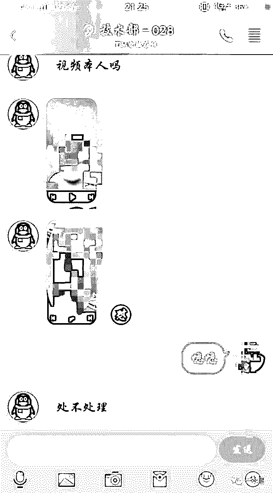

结果她录下了刚刚果聊时候的视频，问我处不处理。”

看到这里算是确定了，这哥们在网上和人果聊被抓了把柄，不出意外会被敲诈勒索。

我把这事给老师傅一说，老师傅喝完杯中的酒后顺手点上一根黄鹤楼说：“玩得够野的啊！”

紧接着我问这哥们和对方视频的时候有没有露脸，他说露了，不仅漏了脸，还把自己的小兄弟也给“卖了”。

哎，这也太不争气了。

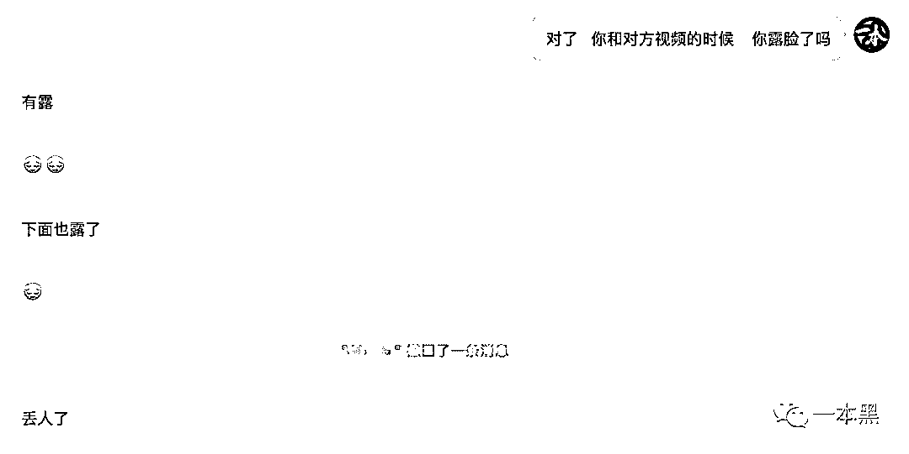

后来对方把这哥们拉到一个 7 人的群里，在群里发了几张这哥们之前果聊时候的照片，和一张通讯录截图。

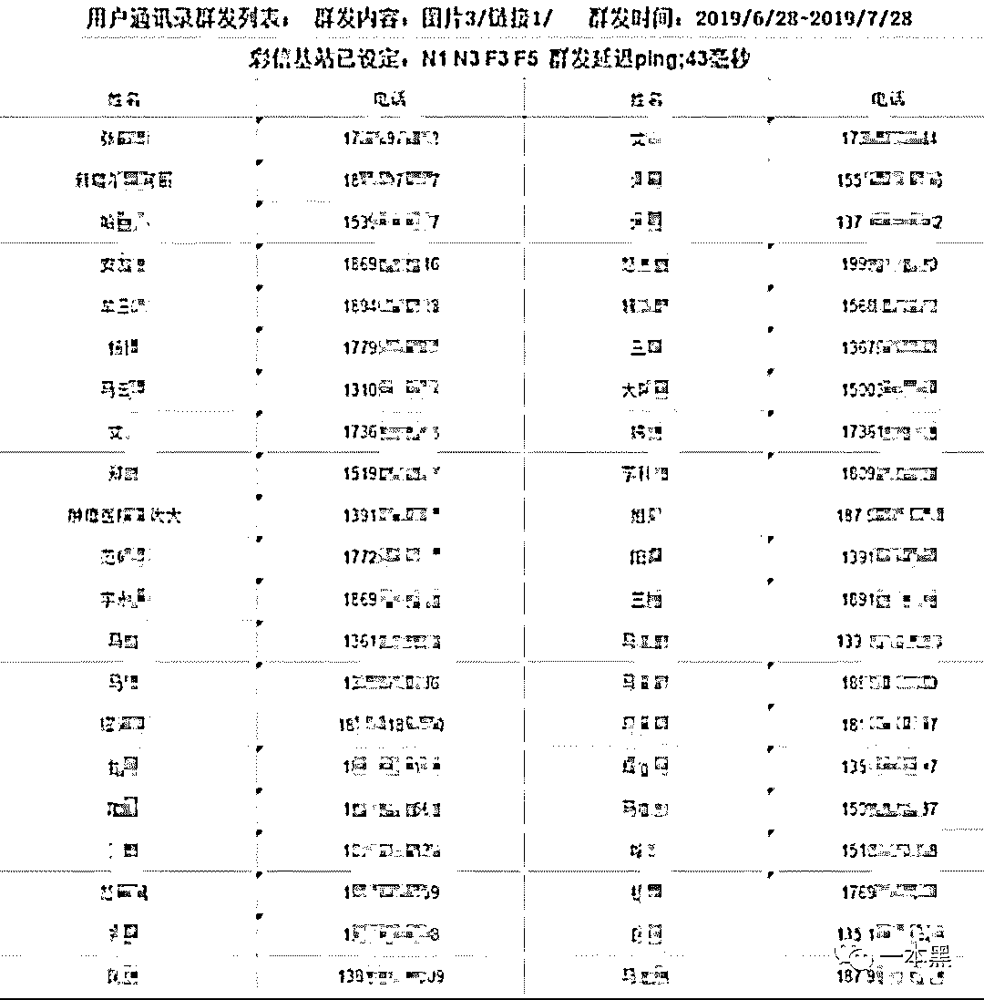

那张截图里全是他手机里的通讯录好友，有家人有朋友，他核实过，上面的号码和姓名都是正确的，这时候他才意识到，自己是被敲诈了，对方想用视频和通讯录作为要挟，给他要价 1900 元。

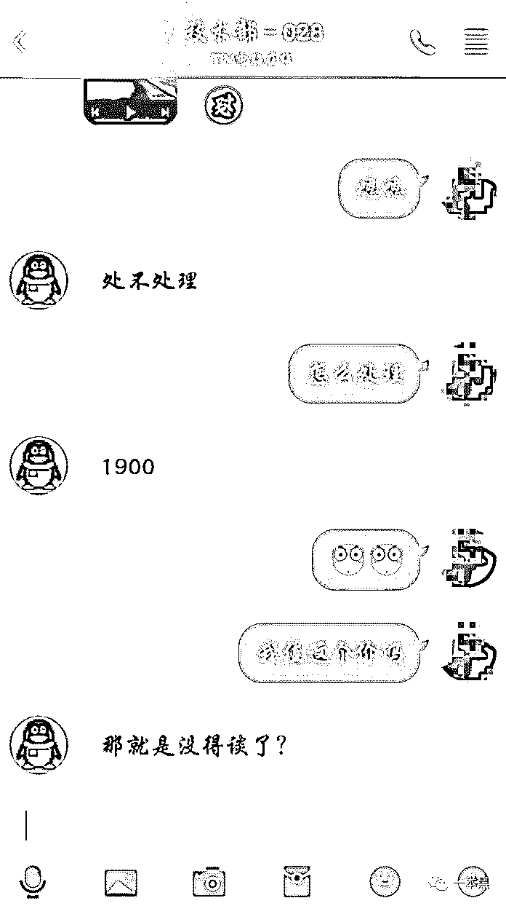

如果 30 分钟内不打钱，对方就会给他通讯录的联系人群发他的不雅视频，还发出了准备群发的倒计时截图。

截图里显示的号码全是他家人和亲戚朋友的号码，之所有最后有个号码是不全的，他说是因为当时下载那个软件后，他边视频就边把那个软件给卸载了。

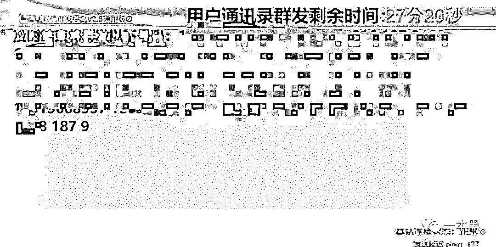

“我不知道他们是如何知道我的通讯录的，是用 QQ 知道的还是用那个软件啊？”

一看这句话就知道，这哥们没有一点网络安全知识，他这明显是手机中了木马。

还记得最开始对方给这哥们发了一个链接要求他下载一个软件进行视频吗？这个所谓的软件其实就是一个木马，通过下载植入到手机里。

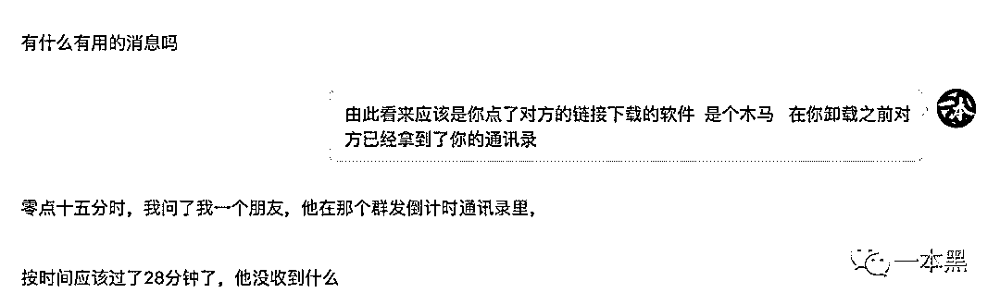

过程中有个细节，这哥们下载软件后，对方并没有理他，而是等了大概五分钟，才说软件有问题用 QQ 视频。

其实就这短短的五分钟，对方已经通过木马远程获取了这哥们的通讯录。

手握通讯录和不雅视频，还用群发倒计时威胁，这哥们是遇到果聊碰瓷的人了。

期间，对方还通过用手机号搜索微信的方式，得知对方亲人的部分信息，以此来威胁这哥们。

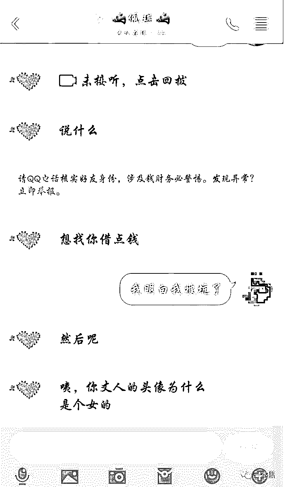

这哥们当时已经慌了，害怕对方真的会群发消息给他的通讯录好友，所以一边砍价一边问我怎么办。

哈哈，其实看到这里我和老师傅都笑了，这哥们还真可爱啊，还和对方砍价，从 1900 元砍到了 1000 元，想必这哥们现实中也是个会过日子的人，砍价小能手。

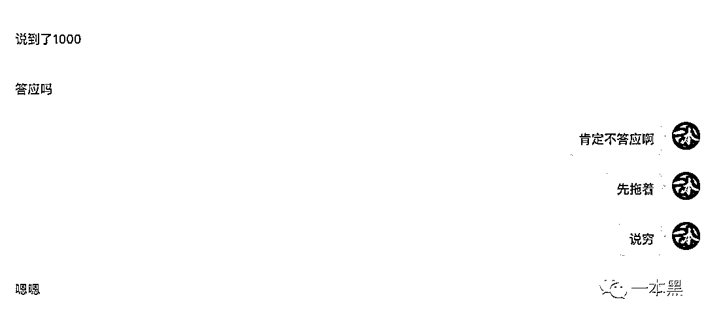

与此同时，我让他先假装同意转账，想看看对方到底会用什么来收款，如果是支付宝收款的话，就可以拿到手机号信息，这样就能查到对方是何方神圣了。

可对方也是够精的，居然死活不说用什么方式交易。

此时，这哥们依然像买菜一样和对方讨价还价，已经从 1000 砍到了 700。

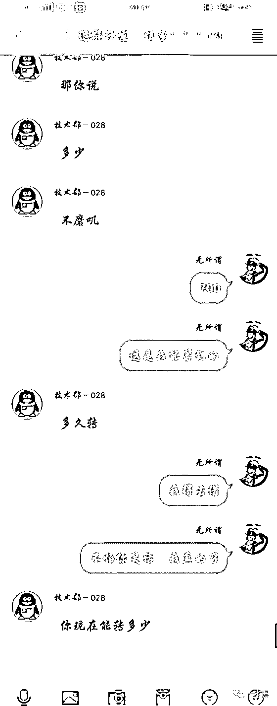

假装成交后，对方说用银行卡转账，但却一直在确定这哥们什么时候才能转账，只有确定了转账时间，对方才肯说出账号。

最后，对方发了一张截图过来，是一个招商银行的卡号和对应的姓名，姓名为*伟。

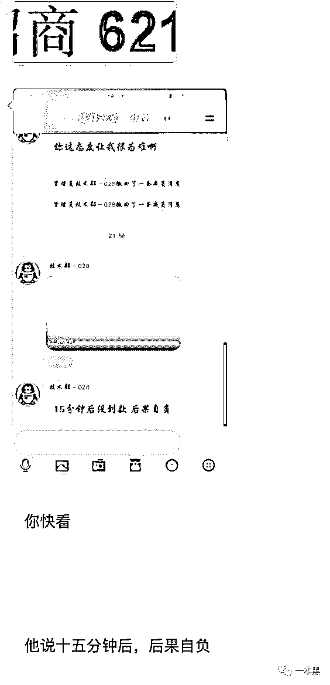

同时还继续威胁这哥们说，十五分钟后，款不到后果自负，这哥们让我赶紧帮他想招，十五分钟后不转对方就要开始群发了。

我一直安慰他不要慌，找理由拖延，对方不会群发的，他们不敢把事情闹大，但这哥们还是很忐忑，对我的话半信半疑。

期间他依然不忘继续和对方砍价，说自己很穷，一时半会拿不出这么多钱。

对方却说支持花呗和信用卡付款，看到这里，我想到了如今街头乞丐的行乞方式，没现金没关系啊，支持扫码支付。

都是一帮狠人。

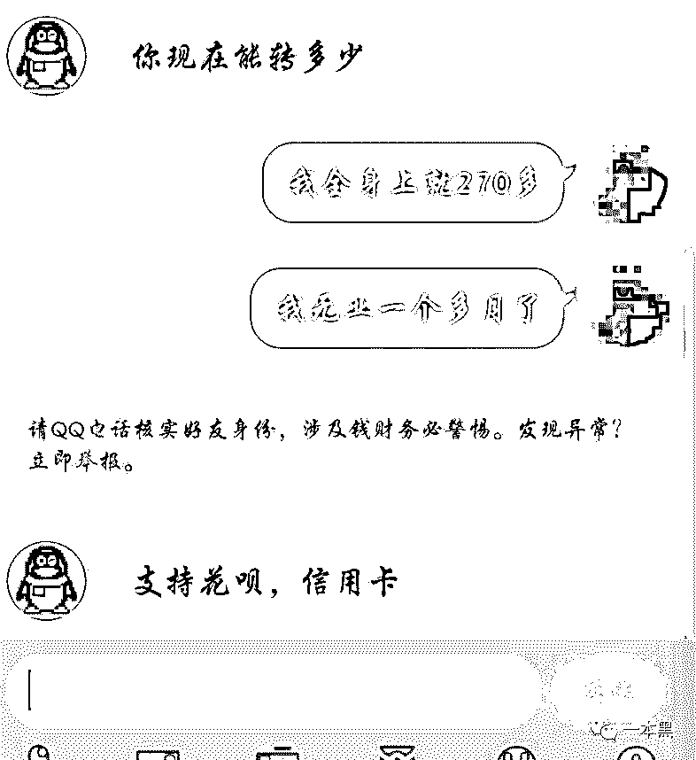

整个过程中，这哥们被对方牵着走，对方用视频和通讯录作为要挟的筹码，不断进行威胁，再我的再三劝阻下，他最终没有妥协地向对方转账。

其实，这种网上果聊敲诈的例子不在少数，大部分人都经受不住威胁向对方转账，但可怕的是，只要向对方妥协转账一次，就会有第二次第三次，这完全是个无底洞。

曾经就有新闻报道，南京一小伙李某，经历和这哥们一模一样，说自己在网上果聊被人敲诈，最终经不住威胁的压力，被迫向对方转账了 500 元。

原本以为这事就这么完了，结果第二天对方再次进行骚扰，称自己有急事缺钱，向李某索要 5000 元，并扬言如不汇款，就把视频进行群发。

此时，李某才意识到自己被盯上了，最终选择了报警。

**老师傅出马**

对于这哥们的遭遇，我和老师傅表示很同情。

这群整天在网上搞敲诈勒索的人确实是够可恶的，你说你搞搞擦边行业就算了，起码能给人提供点刺激的东西能学习的东西，但你这完全是无成本的敲诈，那就太没有职业道德了。（其实擦边行业也别搞）

针对这种情况，我和老师傅一般是看不下去的，所以，我们准备干他娘的一炮。

现在收集到的线索，只有对方的 QQ 账号，对方提供的银行卡账号和*伟的姓名，和一个木马链接。

对于 QQ 账号来说，不用想就知道对方用的一定是个干净账号，常规手段也反查不出什么有用的信息。

果不其然，通过翻看对方的 QQ 账号信息，除了空间里几条不痛不痒的动态，并没有什么有价值的线索。

所以我准备让老师傅看看对方的木马链接。

我和老师傅从小酒馆里出来已经是凌晨两点多，结账后我俩叫了个代驾，在车上的时候，我和老师傅就在讨论这伙人，猜想他们的这种勒索方式坑了多少无知少年。

夜晚的交通无比通畅，就像那些被骗少年打款时候的天真模样。

回到家我和老师傅先在楼下买了两包烟，心想着今晚一定得查到这群坑蒙拐骗的伙计到底藏在哪。

可能是酒喝多的原因，老师傅在分析对方木马的时候并没有找到什么线索，通过暴露的域名和抓包拿到的一些邮箱，经过对比核实也并非对方。

此时已经凌晨三点多，窗外对面的大楼依然灯火通明，而我和老师傅早已睁不开眼，打算先告一段落，明天再说。

第二天一睁眼，已是中午，好久没在周末睡到自然醒，我起来叫醒老师傅下楼吃了个饭，期间继续讨论昨晚那事。

老师傅说这个木马的安全策略做得还是不错的，并没有暴露出太多信息，另外这个木马不一定是这伙人做的，即便拿到一些信息，和他们应该没什么关系。看来从木马获取信息这条线是断了。

除了木马这条线外，我们还有一个对方提供的银行卡账号和姓名，通过转账行为进行验证，发现姓名和银行卡号是匹配的。

但还有一点，如果对方是专业搞诈骗的，这张银行卡应该不是他们自己的银行卡，黑产从业者一般会购买大量的四件套（身份证、银行卡、U 盾、手机卡）作为作案工具。虽然现在四件套的成本越来越高，但如果诈骗利润足够大的话，诈骗团伙会想方设法弄到这些工具。

因为银行卡的归属地是可以通过公开网络查询到的，所以我们找了个工具进行查询，想知道这张银行卡的所属位置。

但不知为何，换了好几个工具都查询不出来。

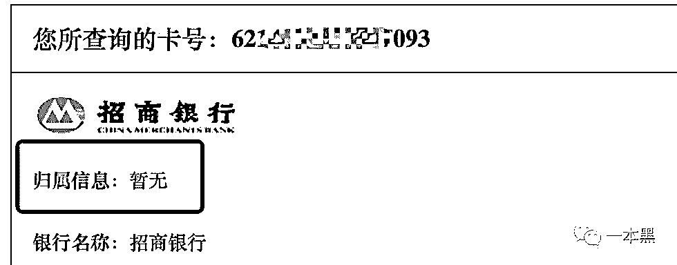

紧接着，我们想到一个方法，给银行的客服打电话，谎称因为转错账，需要知道该账号主人的联系方式，这样一来，只要拿到对方的手机号，就可以挖出更多的信息。

可是，遗憾的是，招行却说不能泄露自己客户的信息，但可以代替进行联系。

由此可见，招行在这一点上，对用户的隐私的保护还是比较到位的。

虽然不能直接拿到对方手机号，但通过****************，我们查到了这张银行卡的开户地，位于重庆分行解放碑支行。

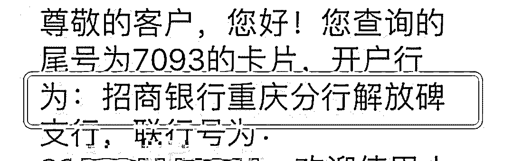

到这里只能再换个思路，我们使用该账号在招行 APP 上进行尝试登陆，通过找回密码，拿到了一个不完整的手机号，号码为 185****018。

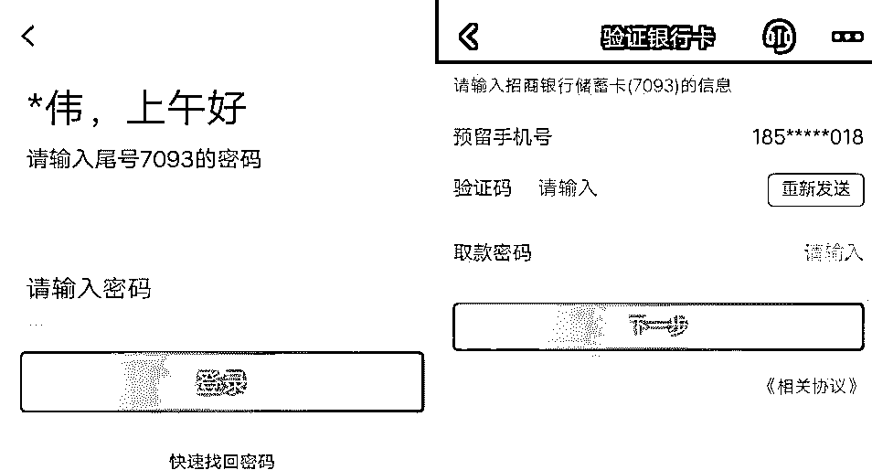

拿到的号码并不完整，但从 185 开头和银行卡的归属地来看，可以确定这是个重庆的联通号码。

因为整个中国手机归宿地号码排布总共有几十万之多，组合的话得有几十亿的号码，但如果在知道归属地的情况下，通过一些工具是可以进行筛选的。

所以老师傅找了个工具进行查询，通过前三后三号码，加上归属地重庆，筛选出了位于重庆的符合号码，将近 5000 个。

虽然比起上亿的排列组合，五千个号码已经很少了，但想在这五千个号码中确定出我们要找的那一个，依然是大海捞针。

到这一步，老师傅的思路完全断掉了，只能暂停下来。和往常一样，每到这种时候老师傅肯定会点燃一根烟，想下一个思路。

**顺藤摸瓜**

**“要不试试钓鱼？”**

**我提议老师傅试试钓鱼的方式，看能不能钓到对方的一些账号密码。**

**老师傅熄灭手中的烟说：“试试吧！”**

**紧接着，老师傅用一个新号加对方，打着想要玩点刺激的借口先让对方相信来意，和之前那哥们的遭遇一样，聊了没多久对方就让下载软件进行聊天。**

**老师傅借口链接打不开，下载不了，对方一脸懵逼给发了发几遍，趁这时候，老师傅给他发了一个伪装成视频的钓鱼网站过去，该钓鱼视频需要登录微博账号才能观看，为了让对方更容易上当，我和老师傅测试过效果后才试着给她发了过去。**

**原本以为对方是不可能上当的，结果链接刚发过去，老师傅这边就收到了对方上钩的提示，于是老师傅顺其自然的拿到了对方微博的账号密码。**

**微博账号可以多端登录而不会有提示，所以老师傅赶紧登陆了对方的微博账号，可观摩了一阵对方的微博账号，依然没有发现有价值的信息，倒是在他的关注列表里发现了一些东西。**

**由于该账号只关注了 7、8 个人，除了一些明星账号外，另一个普通的账号非常可疑，点进去发现是一个地址位于重庆的账号，下面还贴出了一个 QQ 账号。**

**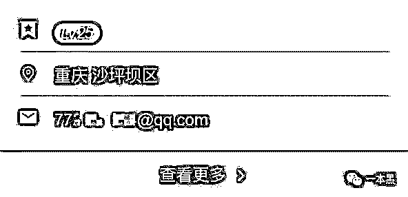**

**通过翻看内容，也不能确定此人和勒索的人是同一个人，但是意外拿到一个 QQ 账号，只能用代入法先假装这就是对方的个人账号，里面的 QQ 账号就是对方的私人号码。**

**到现在为止，拿到对方一个微博小号的账号密码，以及一个疑似对方的私人 QQ 号。**

**从经验来看，现在大部分人都是一个密码走天下，既然我们已经拿到了一个微博账号密码，这个密码就有可能也是其他账号的密码。**

**为了验证这一猜想，我和老师傅等到了深更半夜，确定对方已经睡了以后，用这个密码去登录了对方诈骗的 QQ 小号和这个疑似大号的 QQ 账号。**

**你猜怎么着，两个账号居然都登上了，在对方诈骗用的账号中，我们发现了不少上当的人，里面的分组很明确，分为“yis”、“死鱼”、“钓鱼中”等几个分组。**

**从备注中可以看出，“死鱼”应该为没有敲诈成功的人；“钓鱼中”则为正在敲诈的人。**

**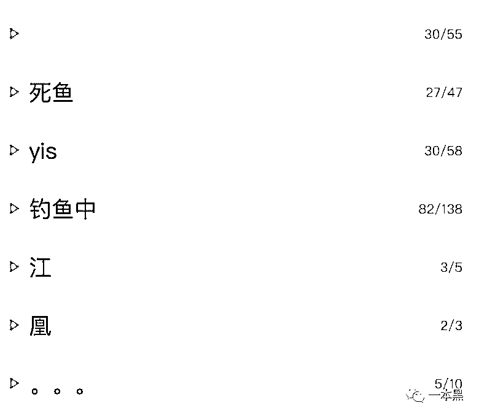**

**而另一账号中，通过分析对方的动态，加上微博账号发布的信息，基本可以得出此人的画像特征，喜欢王力宏、16 年毕业、去过深圳、卖过一段时间的流量卡、性别男、开过火锅店......**

**而在其 16 年发布的动态中，我们看到了他的完整手机号码，前三 185 后三 018，可以确定，这就是对方的手机号。**

**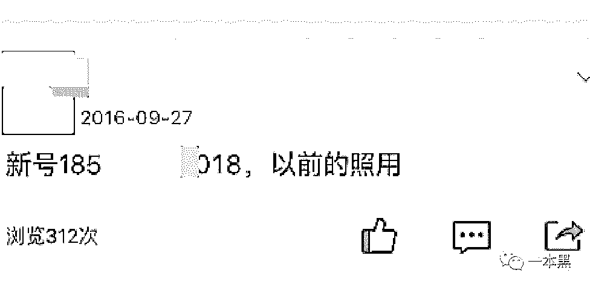**

**为了更进一步的确认，我们还通过支付宝搜索转账的方式，验证了对方的手机号和姓名。**

**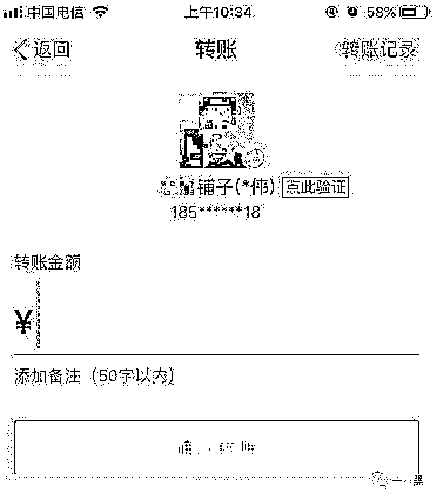**

**至此，我们通过公开可查询的手段，查到了此人的实名信息，包括手机号 185*****018、银行卡、姓名*伟、支付宝“**铺子”、地址重庆******、以及此人的画像特征。**

**把收集到的线索整理好之后，我们把信息同步给了被勒索的哥们，让他去报警。**

**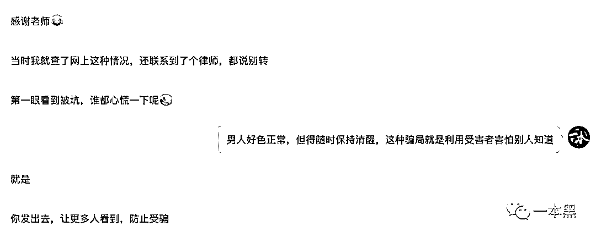**

**整个过程持续两天，支出四五包烟，通过各种细节、猜想、验证、再猜想再验证，总算是成功了。**

**至于对方是否是团伙作案，我们并不关心，写这篇文章只是想告诉广大男性一个简单的道理，好色正常，但得时刻保持清醒。**

**也提醒那些做灰黑产业的，积点德，钱不是你们这样赚的。**

**多行不义必自毙，都长点心吧。**

****

**还原事实｜专扒黑产**

**微信 ID：darkinsider**

****

**知乎 一本黑**

**微博 一本黑 007**

**投稿、爆料、招聘、转载**

**请联系微信：chenchen_19940612**

**约稿、内容合作、联系：yibenheiSW**