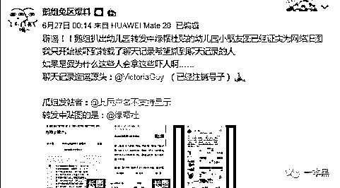
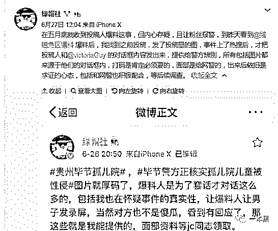
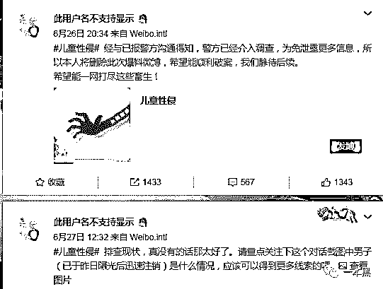
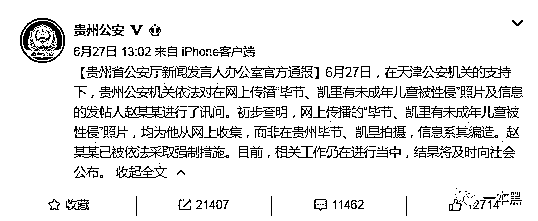
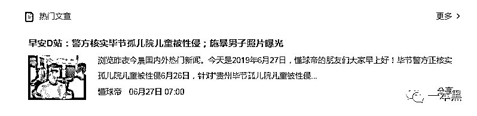
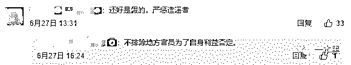
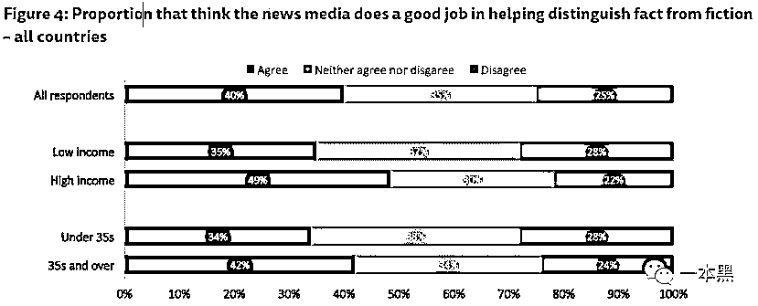

# 造谣、带节奏、吃人血馒头，无脑自媒体究竟是蠢还是坏？

> 原文：[`mp.weixin.qq.com/s?__biz=MzU4ODAwNzUwMQ==&mid=2247485826&idx=1&sn=2314ef55155cb475492c1f98b7634ec8&chksm=fde218a0ca9591b693ea87c0b5b8b7baf674ccfd13fbd96cc5b237c228899131030a6a7e909f&scene=27#wechat_redirect`](http://mp.weixin.qq.com/s?__biz=MzU4ODAwNzUwMQ==&mid=2247485826&idx=1&sn=2314ef55155cb475492c1f98b7634ec8&chksm=fde218a0ca9591b693ea87c0b5b8b7baf674ccfd13fbd96cc5b237c228899131030a6a7e909f&scene=27#wechat_redirect)

【黑话连篇】

**该栏目更多的是揭露事件或对事件的看法，以达到让人精神得到升华的目的。**

> “我的天啊！！我要吐了！！”一句简单的吐槽再一篇未经核实的文章，在短短几个小时里成为全网的焦点。
> 
> 当吃瓜群众持续愤怒，人人索要真相时，真相如期而至 —— 这是一场无谓的谣言。

为什么谣言来得如此轻易？为什么我们的情绪那么容易被操控？

6 月 7 日，微博大 V@绿帽社表示毕节、凯里存在恶魔，隐晦地表示这两地孤儿院存在一些不正常的行为。6 月 26 号，豆瓣网友“柯”发帖，正是曝光毕节、凯里孤儿院问题，文中有大量图片为证，随后微博用户[鹅组兔区爆料] 转载该帖子，事件迅速燃爆，引起轩然大波。帖子转出去不到两个小时，晚上贵州公安回复正在核实真实性。次日发通告，这只是一条谣言。

一个迅速发酵，又迅速终止的谣言。

在感慨警方高效率的同时，我也不禁疑问，这个谣言到底是从哪来的？发谣言的人到底想要干嘛？

**谣言从哪来**

* 喵叔 / 文*  

这个谣言到底是哪来的？根据以上时间线和出现的人物，我们可以把目光锁定在关键人物 [鹅组兔区爆料] 身上，因为他的微博给我们直接列明了此次事件中的主要参与者。

对于这次事件，他们各自的态度十分值得玩味，每个人说的话都不一样但却有着同一个中心思想：不关我事啊，我只是个搬运工。

*   **鹅组兔区爆料：不关我事啊，我只是转了篇文章。**

当事件迅速发酵，引起警察关注，并且睿智的网友已经开始行动时，事件的疑点一点点浮出水面。

鹅组也迅速出面澄清态度，“我被吓到了，我转载文章希望能抓到坏人，他们怎么可以吓人呢。对不起，我不是故意转发那个文章的。我只想做点好事，但是他们利用了我的善良，他们真没良心，我以后再也不理这种事了。不过幸好事情是假的，好开心，警察叔叔真棒。”

*   **绿帽社：图是我贴的，但我不信。**

鹅组爆料上热搜之后，绿帽社赶紧把收到的图片发了出来，说是要给警察叔叔提供资料。还说，他们在五月就收到爆料了，但对于这件事的真实性存在怀疑，呼吁爆料人自己去报警。

也就说他虽然不相信爆料完全是真，但为了尽快破案，热心市民绿帽社还是把照片 po 了出来。

*   **此用户名不支持显示 ：帖是我发的，但是资料是别人给的。**

“警察叔叔来了，我撤了。为了不泄露信息，帖子我删了，希望早点抓到那些畜生。请警察叔叔重点关注 VictoriaGuy 这个人，他昨天被曝光之后马上就注销了微博。难道是有隐情？”

*   **VictoriaGuy ：抱歉，该账号不存在哦。**

“完了，网友开始扒我了，他们发现我造谣了，快溜。顺便把账号注销，应该可以保住老命。

被抓了：对不起，事情是我捏造的，不存在的，图片是我在网上搜的，我感到非常愧疚、极其愧疚。”

*   **警察：假的，都是假的，人已经抓起来了**

经讯问和排查，证实【毕节和凯里存在孤儿院儿童被性侵】一事系造谣，图片为赵 XX 在网上搜集而来，信息系其编造。目前赵 XX 已经被依法采取强制措施，相关工作仍在继续，届时会向社会公布结果。

在这个事件里，VictoriaGuy 是始作俑者，在此前没有任何关注度的普通网民，豆瓣发帖人【此用户名不支持显示】 微博粉丝 2891，豆瓣关注 114，而鹅组和绿帽社作为不知情的传播者，利用其百万博主的影响力，迅速将小范围事件推上舆论巅峰。

好像除了 VictoriaGuy，其他人都是和你我一样，都是不知情的无辜吃瓜群众。纵有百万粉丝，但一句“我不知情”可以抵消一切过失。

**造谣一张嘴，辟谣跑断腿**

每次一个热点事件还未出官方通知的时候，我们就能够从各个渠道听到五花八门的小道消息。一般这种信息都来自：我同事的上司 / 我闺蜜的闺蜜 / 我远方表妹的同事等等。

然后你会发现，不仅你听说的事情是假的，甚至连结果也是假的。

6 月 27 日上午 7 点，当警方还未公布事件结果时，已经有营销号在微博传播此次案件的结果“警方核实毕节孤儿院儿童被性侵；施暴男子照片曝光。”

点开新闻一看，呵，该账号竟然比警方更有权威，已经给此次事件定了案——的确存在性侵事实。而所谓的施暴男子，指的则是早些时候深夜暴打女性的大连男子。

原本是两件毫不相干的事，就这样被他们强行牵连在一起。有意思。

      

这个名叫懂球帝的账号是一个足球 APP 的官方账号，微博粉丝 55 万，但是发文就和放屁一样随意。

从其微博所发布的内容能发现该账号一贯喜欢蹭热点，至于目的自然是为了宣传旗下 APP。

但是往往这类小道消息的传播速度最快，信的人也更多。没有其他原因，无非对主流媒体缺乏信任。而小道消息总是由内部知情人透露出来，越是不可明说的似乎越值得信任。

伴随着深夜暴打女性视频的曝光，一系列的流言也随之而来。仅仅是在同一个微信群里，我就看到了不下五种猜测。而每一种猜测都足以让受害者身败名裂。

> *1、从着装分析：该女子身穿白衬衫+一步裙+高跟鞋是夜总会的标配，该女子一定是夜总会小姐；*
> 
> *2、从男子行为来看：深夜还能约出改名女子，说明女子也不是正经人，该女子可能是男子的情妇，云云；*
> 
> *3、知情人士透露：据说这个女生是夜总会小姐姐，以例假为推脱拒绝工作，男子不信，暴打该女子后拖到无人角落进行检查；*
> 
> *4、福尔摩斯上身：该男子肯定有什么不可告人的背景，不然把人家打成这样，女生也没去告他；*
> 
> *5、网上传言：据说周围的摄像头被拆了，有个歌舞团停止营业，这两人肯定都不是什么好鸟。*

谣言止于智者，始于社交媒体。开放的环境、自由的话语权，不仅带来了思想的碰撞，也可能带来无知和恶语中伤。

不论是毕节孤儿院还是深夜暴打女子，这些谣言发布者都精准地抓住了社会的痛点，弱者、女性、儿童最容易引发关注，也最容易激起愤怒。只要情绪上来了，他们的目的就达到了。

在自媒体时代，所有人都知道流量为王。因为流量代表话语权，流量带来收益。同一样事件，先说出口的那个肯定占了先机，且不论事件是否真实，起码该有的流量有了，先发声的形象有了。

就算最后是不实言论，起码可以来一句，**“我不知道这是假的，但我担忧的心是真的。****”**

2018 年，一本黑的好朋友浅黑科技曾发过一篇名为《赌博网站的骚，闪瞎了我的腰。。。》的文章，披露了某官媒发布的一则讲述大学生利用其专业知识破解赌博网站牟利的事情。你以为事情到这就结束了吗？

骚的还在后头，在官媒发布的该篇文章里多张对话截图，清晰无码地显示了该网站的网址，并告知了玩法。

666，打着新闻的旗号，干着宣传菠菜网站的事情，这和 XX 时报有什么区别呢？这篇文章的最终阅读 10w+，跟帖 3w+，你猜有多人去注册了？

你再猜猜这些自媒体是有意还是无心，是为了钱还是为了钱呢？

你猜二更食堂意淫空姐遇害细节是为了流量还是为了流量呢？

   

**为什么我们不相信真相**

 

6 月 27 号，贵州公安发布通报之后，我们仍然能在侠客岛（人民日报海外版的官微）的微博评论底下看到这些评论：怀疑、阴谋论和脑补。而一些人甚至认为“原本是不信，但是看到官方辟谣都出来了，我觉得这事基本是真的，”

人们好像不太愿意相信真相了？又或是说人们不再相信主流媒体了？

     

路透社 2017 年的一个调查显示，仅 40%的人认为新闻媒体是可信的，25%认为不可信，剩余的 35%觉得不好说。

新闻的核心是真实，但同时新闻也需要有良心。可是遗憾的是很多新闻媒体也正在向流量妥协，汤兰兰一案让很多新闻媒体丢掉了那点仅存的良心。比如 X 湃，比如新 X 报。有良心的新闻媒体越来越少，有态度的自媒体越来越多。

只有自己真的相信的才是真相，所以大众相信的事情通常带有情绪，有情绪就会偏向，也就无所谓公正。所以对于一个热点事件的评价，自媒体的文章总是在调动情绪，要么愤怒、要么同情、要么惋惜。

而主流媒体只是陈述事实，讲清楚一件事情的来龙去脉，没有煽情，没有撩拨，有深度但不会深刻。信不信随你，反正我说清楚了。

对于事实的探究，要么相信媒体调查，要么自己调查，但是墙的存在让我们只能相信媒体。可是媒体已经没那么有公信度，于是我们转而相信自媒体，于是我们成为一些自媒体的钱袋子，一些自媒体传播谣言的帮凶。

我们无意站在道德的制高点评判任何人，毕竟我们什么也没干，毕竟我们什么也不是。

但是我们依旧想和所有的自媒体和大 V 说一句，在发文时，先问问自己：

**这一条是为了 KPI？还是为了真相？**

参考资料：

*造谣“孤儿院儿童被性侵”是怎样发生的？背后究竟是什么居心？，新民晚报*

*重大突发事件中的网络意见领袖研究——以药家鑫事件为例.pdf；华中科大，张剑*

*19 小时惊魂破谣：贵州毕节孤儿院事件，知微数据*

还原事实｜专扒黑产

微信 ID：darkinsider

知乎 一本黑

微博 一本黑 007

投稿、爆料、招聘、转载

请联系微信：chenchen_19940612

约稿、内容合作、联系：yibenheiSW