# 中国最忙碌的虚假广告表演艺术家，我感觉你个***的在骗我

> 原文：[`mp.weixin.qq.com/s?__biz=MzU4ODAwNzUwMQ==&mid=2247485782&idx=1&sn=0100c9f8fbeb6e6fc47d7cf741ac300c&chksm=fde21874ca9591627228f4547033be0ac9ae819a62b9c01c2f994da3c37236d51a66c31c683c&scene=27#wechat_redirect`](http://mp.weixin.qq.com/s?__biz=MzU4ODAwNzUwMQ==&mid=2247485782&idx=1&sn=0100c9f8fbeb6e6fc47d7cf741ac300c&chksm=fde21874ca9591627228f4547033be0ac9ae819a62b9c01c2f994da3c37236d51a66c31c683c&scene=27#wechat_redirect)

【黑话连篇】  

**该栏目更多的是揭露事件或对事件的看法，以达到让人精神得到升华的目的。**

在我国，有一群著名的“医药广告表演专家”，也许你未曾留意，但江湖中不乏他们的传说。

差不多的身份——“资深专家”，差不多的理想——“为国人解除病痛”，差不多的语调——“声嘶力竭，痛心呐喊”，差不多的药品——“包治百病”。

他们时常出现在电视中，也广泛存在于广播电台里。

甭管你是男是女，病情是轻是重，在“表演专家”的眼里都差不多，只要你“遵医嘱”，啥病都能治好，要是没治好，也就是“再来一个疗程”的事儿。

他们是现代歪解版的“差不多先生”，也是一群“视人命为草芥”的刽子手。

你和他们之间，只差一个订购电话。

**「谁还没个粉丝咋的？****」**

文/木子

上个月末，我收到一位粉丝的爆料，称其父亲遭遇了电台广播的虚假医药广告，差点被骗。

爆料人称其父在 2017 年突发脑梗，经及时送医治疗后，恢复效果非常好，仅休养半年就重返工作岗位，但愈后仍留有轻微后遗症，如说话语速较慢，视力些许下降，需要一直服药。

平日，家里虽然还是有说有笑，但偶尔还是能够感受到父亲想要完全恢复的急迫心态。

之前父亲住院时，为了解闷，便买了一个收音机，出院后，许是视力下降的缘故，父亲不似从前那般爱看电视，而是换成了听收音机。

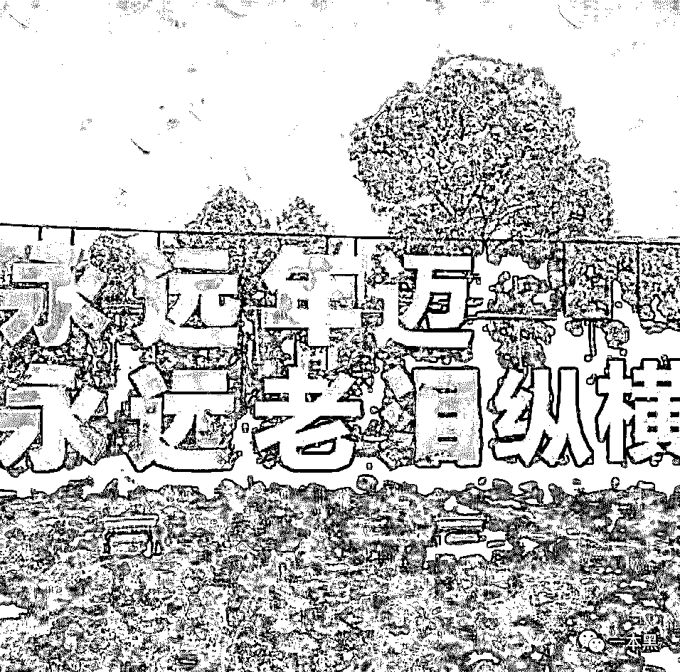

正是在收音机中，父亲遇到了一位“神医”。

“神医”自称张为民（音译），推销药品名为“雪蛤干细胞口服液”（音译），神医称该药属于“干细胞疗法”，能够“激活人体干细胞，以细胞治愈细胞，疗效非凡”。

“神医”一天出现两次，分别为早八点和晚八点，很准时。

每次出场，都是从自身的传奇经历开始，先详细讲述自己是如何接触到干细胞疗法的，而后惊奇于干细胞疗法的神奇效果。

在收音机中，“神医”称“国际卫生组织在认真评判后，把‘国际新型医学奖’（音译）颁发给了‘干细胞疗法’”。

与其搭档的女主播不停的称赞，“张教授啊，我特别崇拜您，您看您研究出了‘干细胞疗法’，并把它带回国内，治好了数以万计的国民。”

而张教授则谦虚的回应：“不用崇拜我，这都是我应该做的，有句话说得好，当官不为民做主，不如回家卖红薯，这话同样适用于我们科研人员。”

接下来，“神医”开始宣扬自己的爱国情怀，打感情牌推销药品。

从空巢老人的苦，讲到当下的看病难、看病贵，在戳中目标人群的情感后，话锋一转，称“干细胞疗法”已经处在国家大力推广的阶段，“目前已知所有的疾病，都是细胞引起的，干细胞疗法可以从根本上解决问题”。

总而言之一句话：“甭管什么冠心病，糖尿病，脑中风，风湿骨病，哮喘，肺病，眼病，这药都能治，**买就对了。**”

为了增强信任度，“神医”讲解完，还是熟悉的电话互动环节，各种口音的反馈电话被一个个接入，传达出一个精髓：**这药管用！**

本来最开始并不相信，连续听了两个星期后，爆料人的父亲开始动摇：也许真的有用呢？于是，先瞒着家里人打了订购热线，成功订购了一个疗程，药价为 6900 元，货到付款后，才说出这件事。

得知此事后，全家人开启了劝说模式，然而统统都不管用，只好偷偷打开父亲的通话记录，抄下了号码，想要把药品退掉，结果，电话却始终打不通。

这款所谓的“雪蛤干细胞口服液”（音译），在国家食品药品监督管理局网站上根本查询不到，药店也从没听说过。

最终，在搜索引擎的帮助下，结合众多网友的真实反映，终于使其父亲相信了这是个虚假广告，药品成分不明，从而在货到付款时，回绝了快递小哥。

拿到这个 400 电话后，我尝试拨打，只听电话里传来提示音：“你好，这里是 400 订购热线，您的来电我们已经记录，稍后会安排工作人员回复您的来电，请您挂机等候，不要重复拨打，我们会按照来电的先后次序给您回复。”

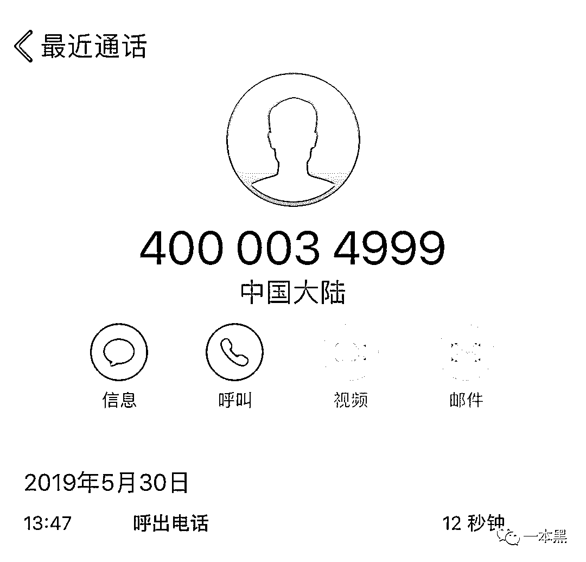

按道理，我拨打电话后，应该很快会接到对方的回复电话，询问我想要治疗的病症，并向我保证绝对能治好，然后记录下我的地址，安排发货。

我猜也许是因为我的号码归属地，注定我无法参与后面的精彩演出，这种限定地区和频率的电台广告，属于地区精准投放，一开始就排除了非投放地域。

为了验证我的猜想，我让一个与爆料者同地区的朋友拨打订购热线，果然，三分钟不到，他就接到了电话。

一个归属地为吉林长春的固定电话。

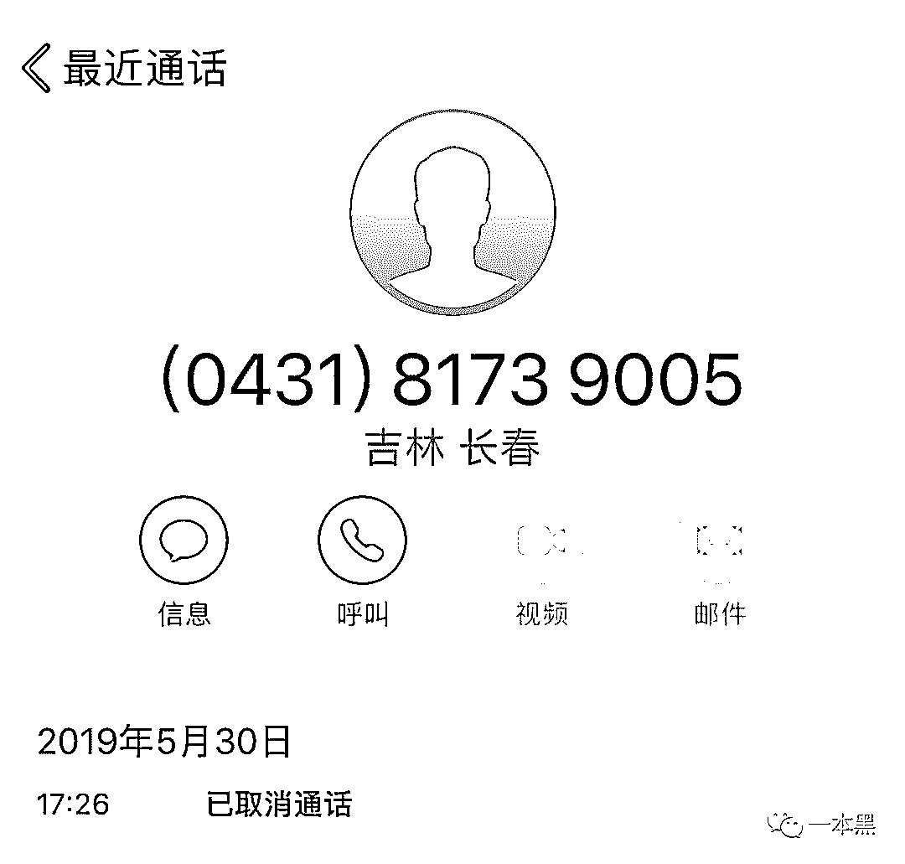

狡猾，骗子都是认真的。

**「是金子，在哪儿都能发光？」**

谈起虚假医药广告，就不得不提到一位奇女子。

她是一位“百变神医”，于 2014 年-2017 年间，她频繁出现在众多电视台，代言了数种虚假药品，最为神奇的是，她的姓名、民族经常变化，真实身份却始终是个谜。

因使用多个身份推销药品被曝光后，她被网友戏称为**“中国最忙碌的虚假广告表演艺术家”。**

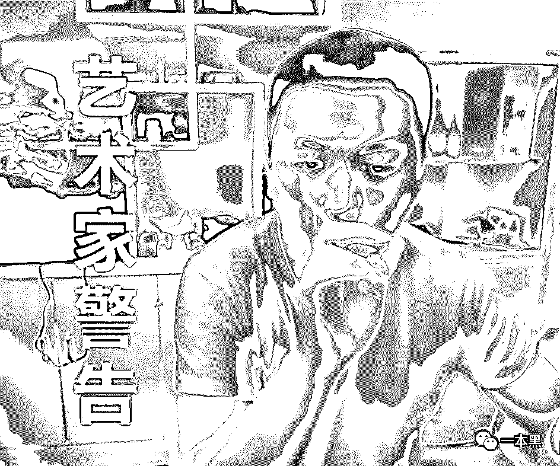

她先在西藏卫视治咳喘，自称叫刘洪滨，拥有一个拗口的绝技，叫“苗医鲜药穴位吃药拔痰定喘”，代言药品为“苗仙咳喘方”；

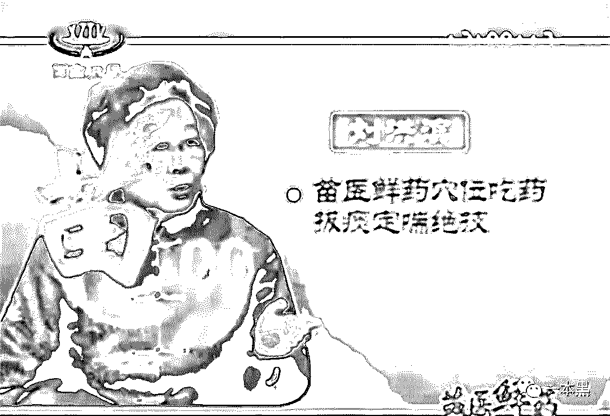

为西藏人民治好了咳喘，她来到了甘肃卫视治咳喘，姓名没变，却新增了一个头衔，“中华中医医学会咳喘分会副会长”，代言药品为“穴位吃药定喘方”；

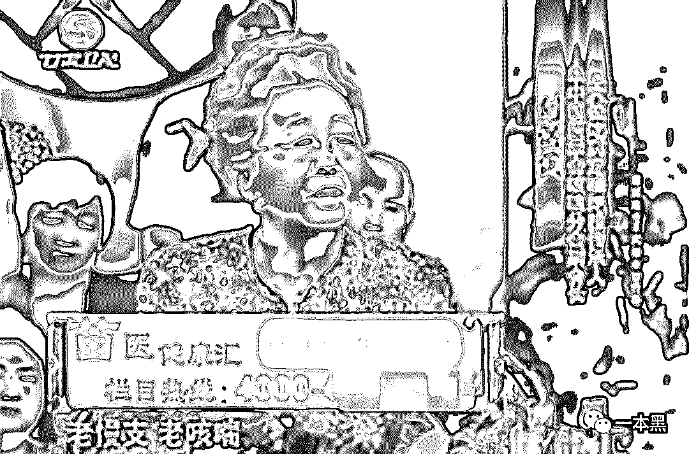

不知是不是甘肃卫视给的出场费高，在此，她还代言了其他药品。

一会儿是“中医养生保健专家”，推销起了包治百病的天山雪莲。

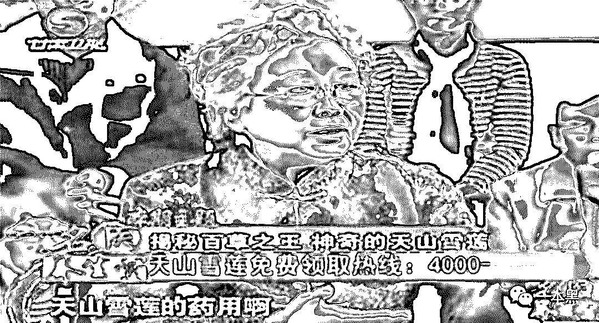

一会儿是“中华中医医学会风湿分会委员”，卖起了宫廷秘制“药王风痛方”。

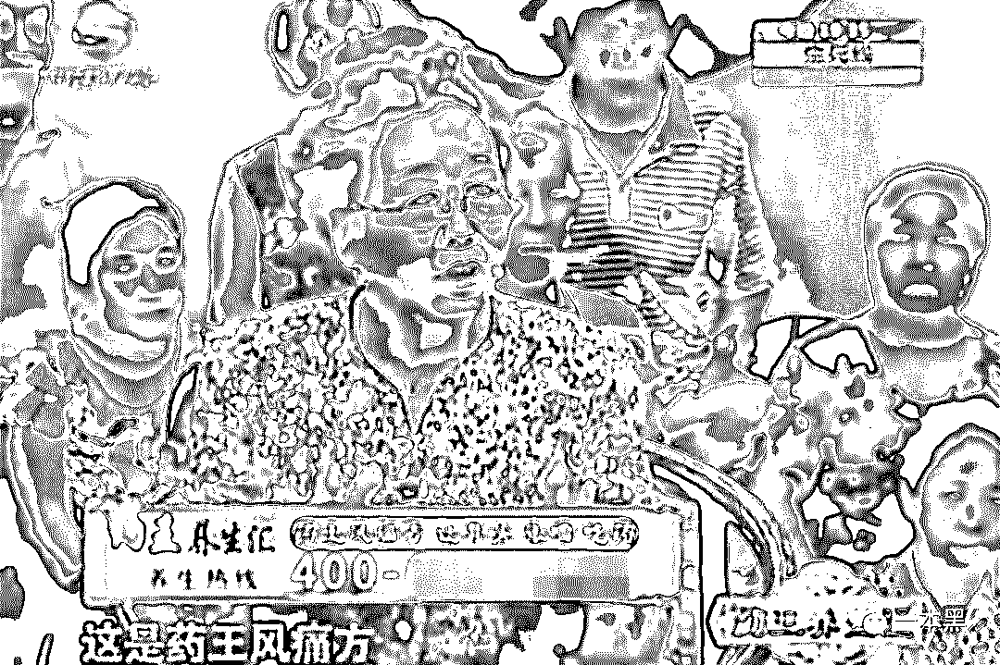

离开了甘肃卫视，她又马不停蹄的来到了青海卫视，卖起了拥有 300 多年历史、可攻克各种风湿骨病的“苗家活骨方”。

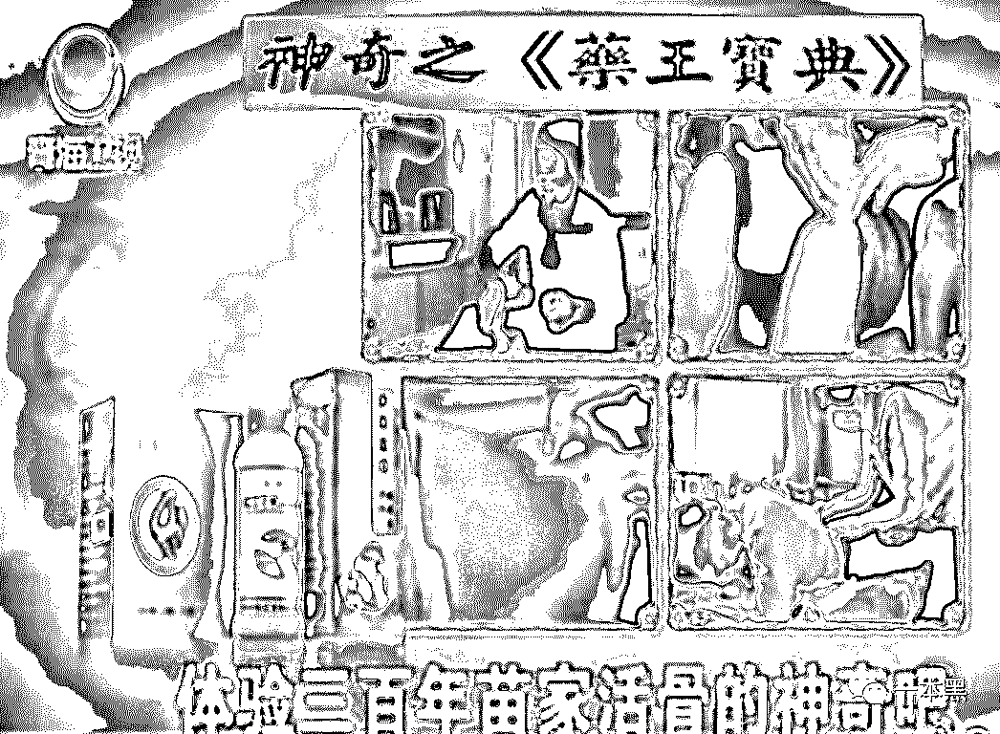

紧接着，她又到了内蒙都市频道，把名字中的“滨”字换成了“斌”，摇身一变成了“刘洪斌”，脱去了苗医身份，穿上蒙古服变成了蒙医，“从医五十年，只治心脑病”，卖起了祖传药品“蒙药心脑方”，“脑血栓、冠心病当天见效，心梗、中风百天治愈”。

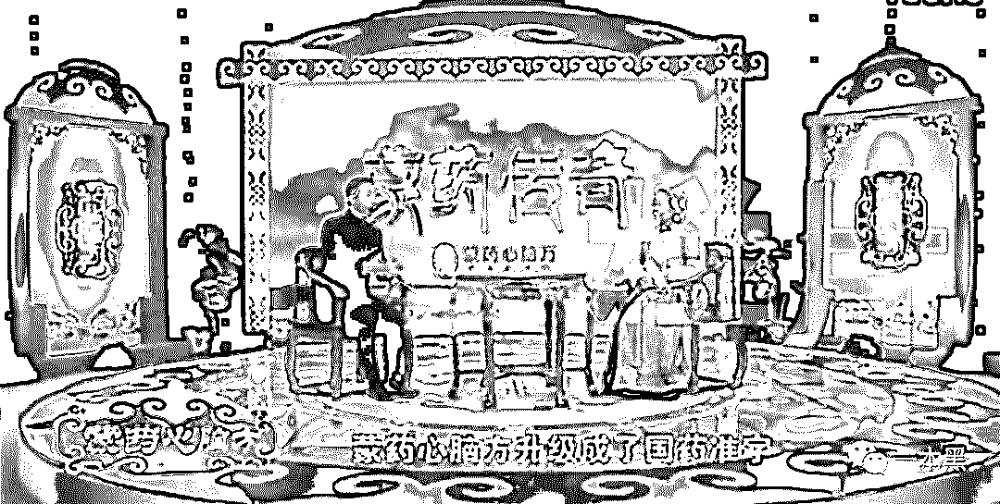

治好了内蒙的心脑病，她飞到河南有线电视频道，成为北大专家，治起了糖尿病。

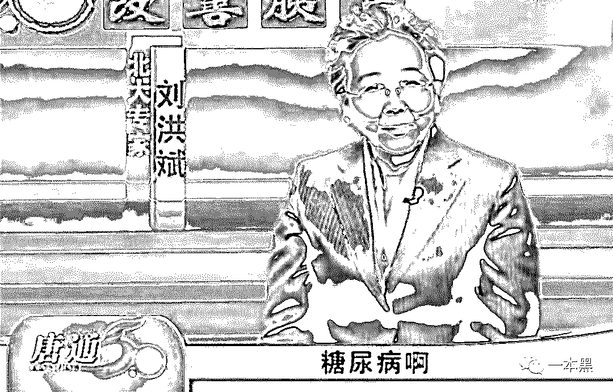

离开河南，她又成了吉林卫视的“著名老中医”，推销起了助眠晚餐；

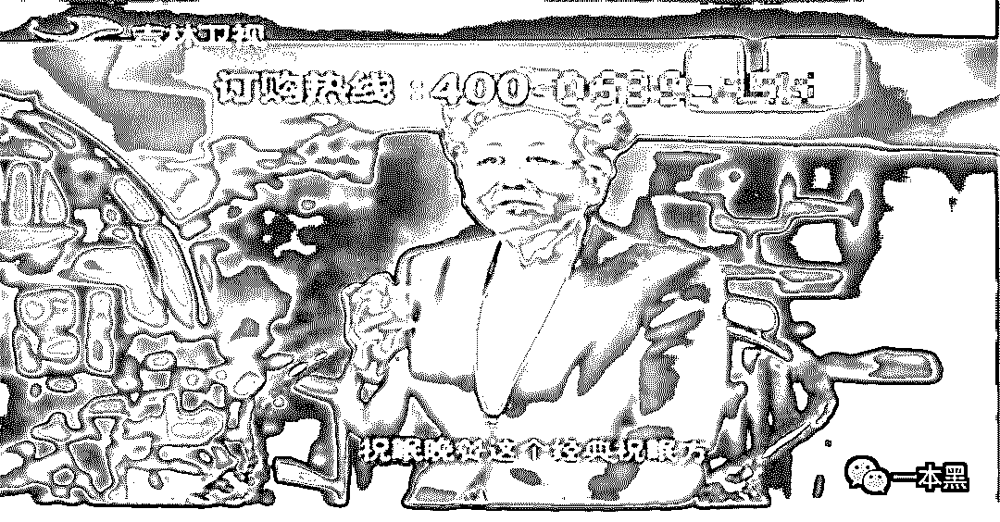

随后，她出现在福建东南卫视，以“老院长”的身份，卖起了“老院长祛斑方”。

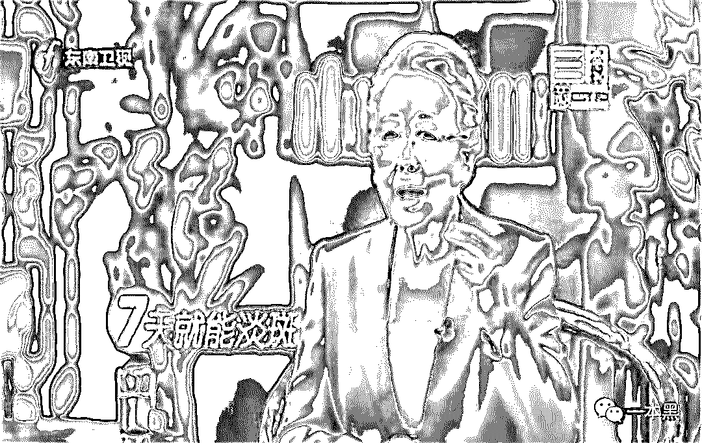

身份的不停变化，领域的从容转换，唯一不变的，只有她的性别。

而江湖中，还有另外三位“医药广告表演专家”，个个都是实力派，他们四人，是名副其实的**“电视假药广告四大支柱”。**

这些“医药广告表演专家”，出现在电视上，好歹还能看个脸，没准儿啥时候就能发现他们的多重身份。

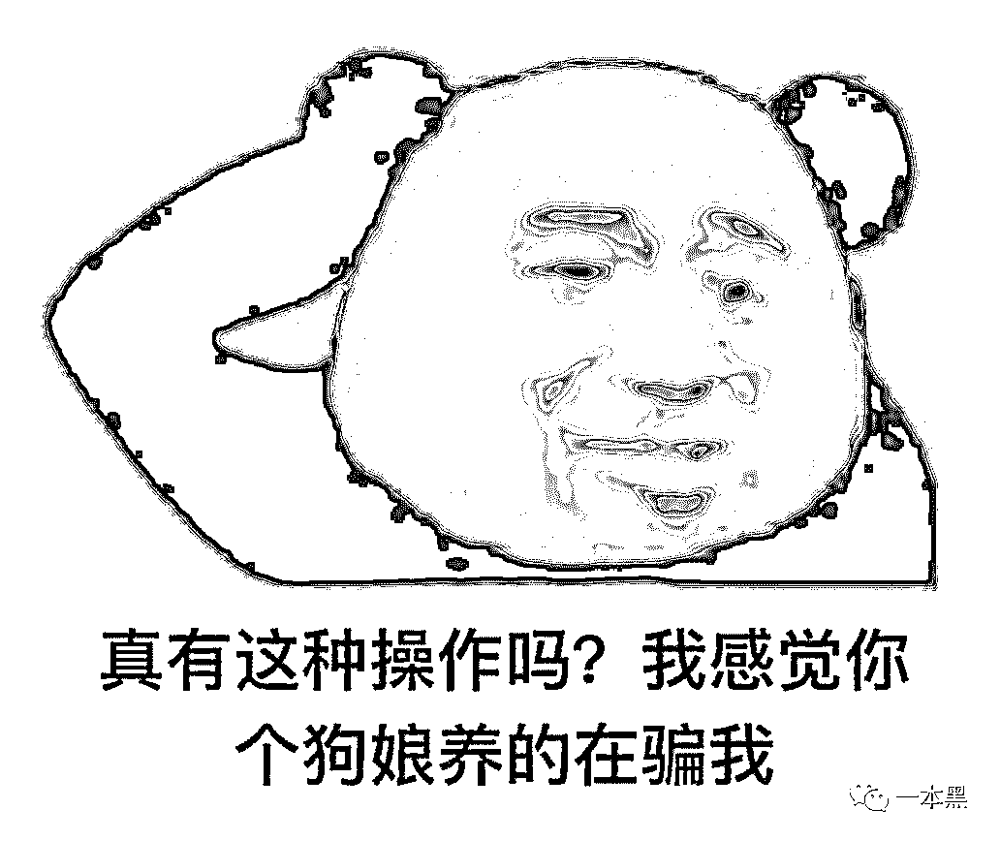

而要想在收音机不同广告中分辨是否为同一人，反正我是做不到。

请牢记：有病痛找医生，不随意购买、服用来路不明、成分不清的保健药品。

**「流动的本营，流动的药贩子」**

除了用来日常解闷的收音机外，很多司机对虚假药品广播也并不陌生，各种宫廷秘方、国家专利、祖传神药，能增高减肥、壮阳补肾、延年益寿，包括那些令人难以启齿的病症。

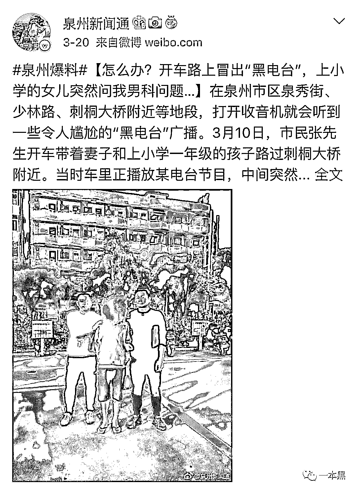

没有经过相关部门认证的保健药品，正在广播电台上疯狂肆虐，煽情讲述、优惠买赠、无效退款等字眼，刺激着每一个听众的脑神经。

**“试试，万一有效呢？”**这是绝大部分购买者的心理，病急乱投医就是“专家们”的底气来源。

你以为订购热线的那头，就是你听到的这位“专家”，其实，背后是你一无所知的黑色利益链。

收音机那头侃侃而谈的“专家”，大多都是药贩子雇佣来的，有的干脆就是药贩子自己。

**在电台虚假医药广告中，“专家”不是头衔，而是职业。**

药贩子会提供稿件，“专家”只需要声情并茂的照读就行，只要你识字，只要有演技，你就是“专家”。

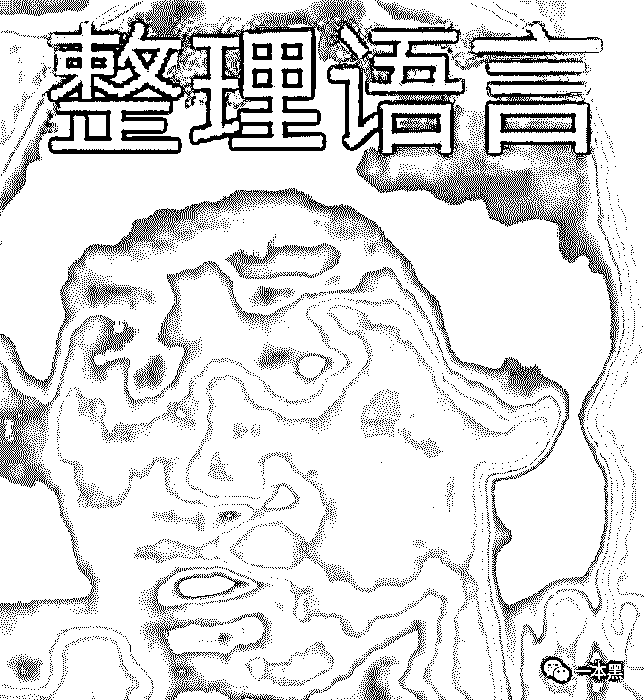

“专家”的档期大多都安排的很紧凑，一天可能要“出席”数档讲座，所以有时会发生记混药名、药效的意外，但这都不是什么大事儿。

“专家”不需要坐在专业的录制间里，只要有个能和电台连线的手机就行，这也就意味着，当你在听他慷慨激昂时，他很可能正坐在马桶上使劲。

为何电台愿意接纳这样的“讲座”？众所周知，利益驱使，责任划分不明确，导致踢皮球现象频发，在此不多说。

等“专家”卖力的演讲完，就轮到患托登场了，这是一个场内外互动的感人环节。

不同口音、语调的场外电话轮流被接通，基本就是反馈药效、表达感谢、营销造势的内容，让人忍不住认同“专家”的专业。

这些患托，其实都属于药品炒作。

在 QQ 这个深不见底的江湖中，众多找兼职的人被招募来做患托，一通电话虽然只能挣几块钱，但苍蝇再小也是肉，况且只需喷溅一点唾液就能完成。

为什么所有的反馈电话都是报喜不报忧？真的没有真实观众拨打电话反馈吗？

当然有，只是导播根本不会把这样的电话接进来，除了事先安排好的患托，其余电话都会被过滤。

唯一能够接入的场外电话，就是订购，当你在电话里咨询药品是否能够治愈自己的病症时，对方统统表示可以，还会强调可以无效退款，在你完成订购后，药贩子就会安排快递发货。

至于药品的成分，有点良心的药贩子会使用无治疗功效的保健品，丧尽天良的药贩子就难说了。

当你收到药品，满怀希望的按时服用，疗程结束却发现毫无效果后，运气好的还能打通电话，但对方很有可能借口称是个体差异导致，愿意给你优惠，让你继续购买疗程服用；运气差的，拨出电话就会发现，该号码已经不再使用。

药贩子早已习惯于打一枪换个地方，在同一个城市停留一年都算有耐心，有时才几个月时间就溜了，换个城市再来一遍。

**没被抓住，就永远流动。**

**「隐藏的黑电台」**

更有一些药贩子，他们不愿意搞直播这么繁琐，而是选择提前录制好，通过黑电台重复播放即可。

黑电台，是指占用国家正规频率、未经许可的电视广播。

显著特征是：不报电台名称，不间断循环播放同一种内容，节目形式多为“医患”电话互动，所售药品无法通过正规渠道查询，只允许货到付款。

一套黑广播专用设备，加提前录制好的内容，就可以自行设置播放时间、播放次数，甚至可以远程操控。

违法人员将黑电台设备隐藏在小区中，以达到精准推送的目的。

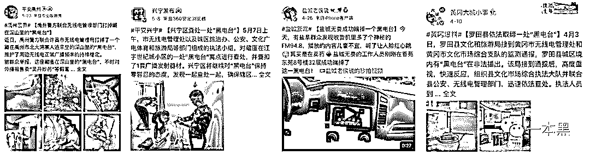

对违法人员来说，黑电台设备让他们的药品销售变得省时省力，但对于附近居民来说，可不是。

除了给居民带来精神上的骚扰外，这种“黑电台”设备的辐射超标严重，还会给附近居民带来身体健康方面的影响。

令人深恶痛绝。

* * *

随着听众警惕性的提高，这些赤裸裸的药品推销，也渐渐披上了健康养生讲座等易被人接受的外衣。

小白兔的外表下，隐藏着嗜血的大灰狼。

说不准何时，它就会蹦蹦跳跳的出现在你面前。

你猜，它的红眼睛在看什么？

还原事实｜专扒黑产

微信 ID：darkinsider

知乎 一本黑

微博 一本黑 007

投稿、爆料、招聘、转载

请联系微信：chenchen_19940612

约稿、内容合作、联系：yibenheiSW