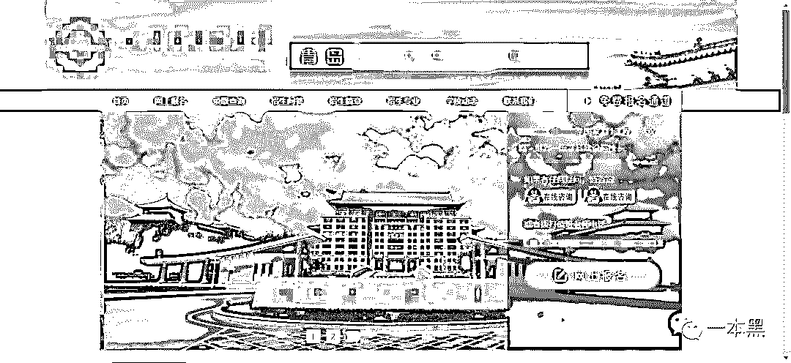
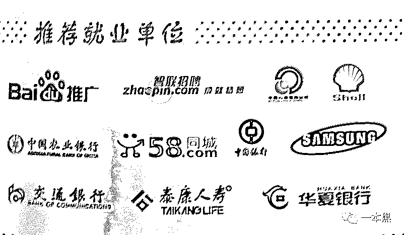
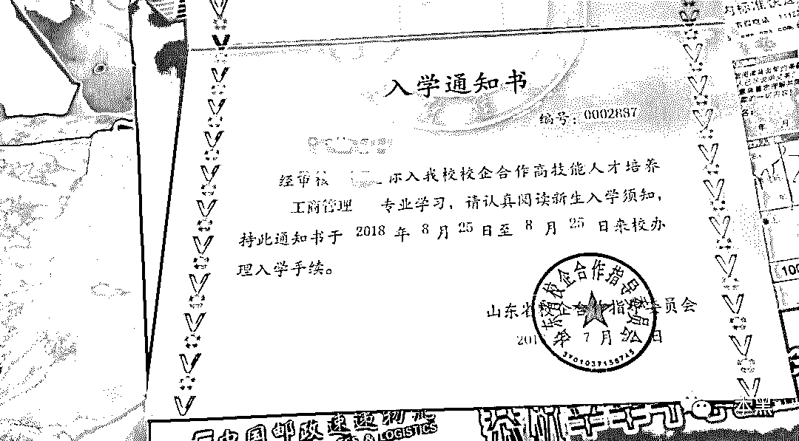
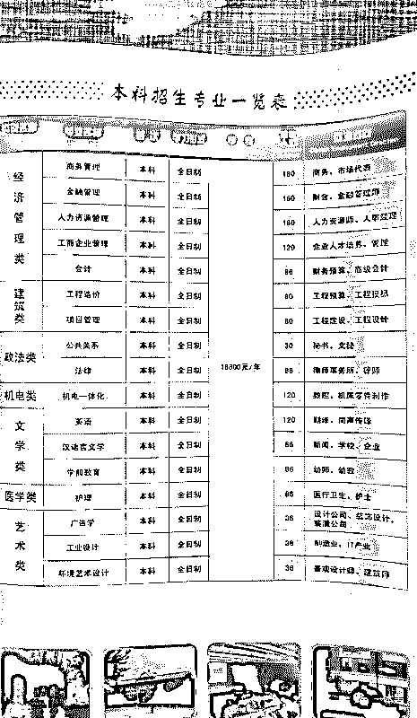
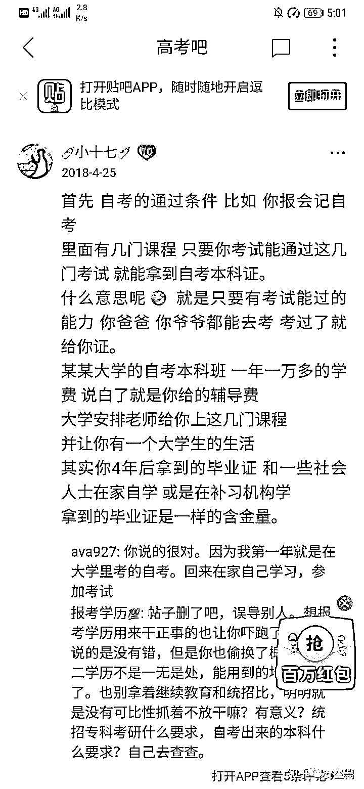
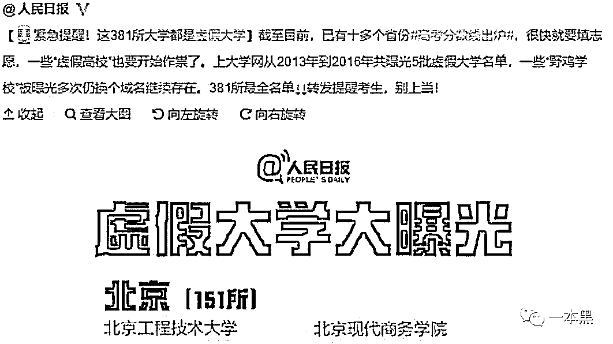

# 高考招生骗局 ：那些声称 400 分就能让你上 211 的，全 TM 是骗子

> 原文：[`mp.weixin.qq.com/s?__biz=MzU4ODAwNzUwMQ==&mid=2247485749&idx=1&sn=c7ca97931f34448eab2b2ebb5ffe6dcd&chksm=fde21817ca959101241c7a7277b763169494a0d6814a72edcce636bbb0d2713c450a8bc05b9d&scene=27#wechat_redirect`](http://mp.weixin.qq.com/s?__biz=MzU4ODAwNzUwMQ==&mid=2247485749&idx=1&sn=c7ca97931f34448eab2b2ebb5ffe6dcd&chksm=fde21817ca959101241c7a7277b763169494a0d6814a72edcce636bbb0d2713c450a8bc05b9d&scene=27#wechat_redirect)

**【地下职业】**

**该栏目主要讲述大众看不到的职业故事、人生经历，与黑暗有关、与欲望有关、与人性有关。**

高考，之所以能引发全社会关注，很大程度上是因为：潜力。毕竟，不能让任何一棵韭菜倒在尚未割下之前。

但高考完全是两个世界。

一个是全世界联合起来帮你的忙：屏蔽考场手机信号；出租车免费送行；关键时刻警车开道；美团外卖电动车都自愿给你让路……

另一个是全世界联合起来骗你的钱：提高智商口服液高考必备；高考答案只售三万；枪手代考保上北大……

# 

**一**

 may/文

成绩足够好，可以 “合法” 读本科，而成绩不够好，又想读本科，这样你就需要……

“虽然成绩不好，但我也想有本科学历，毕竟，第一学历是大专，这就已经输在起跑线上了，很多单位你就进不去。”

高考结束没多久，小南接到一个自称是山东某高校招生办老师的好友申请，没多想就直接通过了。

在聊天中，对方介绍说，他们学校有一个实践本科，也就是一个校企合作。录取分比较低，但现在名额有限，还想报名的话可以找他。

对方称在该校毕业后不仅有 211 本科院校的毕业证，而且有相应专业的学位证，信息可以在学信网上查询。

接着对方发来了招生手册和报名网站链接。网站 title 是山东某高校，但事实上只是一个自考报名网站，根本不是该大学的官网。

       

招生手册上明确说该项目是校企合作，毕业后会有企业来学校对口招人。百度、58 等名企赫然在列。 

              

这位招生办老师不断进攻，就差直接说出专科成绩也能读 211 了，小南有点动心。

“当时我就问那个老师，你们学校的编号和编码是多少？我填报志愿的时候好填一下。那个老师就说这个学校是自主招生，不需要再网上填报志愿。”

后来想想，他就没有招生资格，他当然不能网上条报志愿了。

但小南完全没有多想，就把自己的身份证号、准考证号和家庭地址发了过去。

7 月 22 号左右，小南收到了学校的入学通知书。注意，是入学通知书，不是录取通知书。通知书上的印章还是山东省校企合作指导委员会，都不是大学的。

             

入学通知书上告知 8 月 25 日开学。远比其他高校开学早，这是该类学校的重要特点，越早变数越少，最好不要有变数。

为了让学生相信这是一个真实存在的学校，同时也为了敛财，刚到学校，就被拉到一个鸟不拉屎的地方。

同批军训的约三四百人。当问到一个学校怎么这么少人，老师给出的答复是：这只是一个系的人，还有别的系在别的地方军训。

军训时实行全封闭管理，上交手机，不能与外界联系。

军训十天左右，小南们首次来到学校，在招生手册上承诺的空调、整洁优美的宿舍统统都没有。而所谓的“其他系”也没有，他们是这个校区仅有的学生。

  **二**

我们来看两个不同的概念：自考本科与统招本科。

自考本科学历：学历教育，只要考试通过就可以拿文凭，不需要进行在校学习。

统招本科学历：通过高考，被本科院校录取，经过四年学习获得相应的学历和学位证书。

二者最大的区别在于含金量的区别，而并非是否全日制在校学习。

       

很多正规大学都有继续教育学院，自考就属于继续教育学院的业务范畴。

而将小南招来的这所学校，却是一个只有自考培训资格，却假扮有高校招生资格的培训班。

或者称作 “全日制自考助学班”，这是他们比较正规的名称。该类机构往往租用 xxx 大学老校区（那种几乎搬空了的校区），然后直接用学校名义招人，而该学校却推脱并不知情。

小南反映：“当时招生的时候，我们学校是打着某某学院的旗号招生的，说是实践本科，又是校企合作。过段时间，那个学校官方了解到这个情况，就在他们学校的官网上声明这不是他们的招生。然后我们这这就又换了一个说法，说是高技能加人才培养。”

但事实上，只要交过保护费，学校的宗旨是知情但不制止。

在这个学校里，根本看不见老师，几乎都是学生管学生。说是助导，其实就是在别的校区比我们大一级的学长。

更离谱的还在后面。

小南报考的城市轨道运营管理专业，却被分到旅游管理。老师给出的解释是：这个专业才是本科专业。

至于学习内容，就是重新学一下高中学的内容，方便参加成人大专。说是必须有大专这个跳板才能考这个本科。

这是一所并没有大学资质的大学。读这种助学班的人，严格来说，根本不算在校学生。

不能以大学生的身份参军，学校也不会提取你的档案。你的人事档案还是留在你的高中没有提走，毕业的时候还需要自己去合档。

“我有很多同学要去参军，需要学校开证明，学校就找各种理由开脱。事实上，本校根本不承认我们”

甚至，连报考四六级考试、普通话考试这类常见证书的资格都没有。

自考本科必须具有大专学历才能参加考试。因此，首先是参加自考专科考试或者成人高考的专科考试，取得大专学历以后再参加自考本科考试。

毕业以后，即使你拿到自考的本科文凭，这个也是属于你的第二学历，你的第一学历还是高中。

# 

**三**

就这样稀里糊涂地过完了大一。到了该上大二的时候，学校要求部分同学外出招生。

一个学生利润，底层代理能拿到 1500 到 3000 元的提成。

这也就是为什么此类学校的学费往往是正规院校的数倍，高达 18000——30000。   

 

之前的套路再次运转，学校开始对这些要去招生的学生洗脑。

首先，是进行混淆概念。

自考=全日制自考 

成人学历=全日制学历

这就是他们的洗脑套路：他们对外宣称通过自考能拿到跟普通大学一样的毕业证和学位证。自考不是自考，而是 “高技能人才培养” 、“校企合作本科”，是可以拿到统考本科学历的正经学校。

因为原先的学校不承认，并且已经发出声明，他们就去找了另外一所学校，以另外一所学校的名义来招人。

一个孩子努力了三年，毕业了说白了就是个高中生，大学白上。要么放弃学校，重回高中；要么在这里，拿到一个自考学历。

# 

**四**

某天，大学同学群里，一个同学发了张图：2019 年保送清北中学排行榜。

在我们齐声感叹人与人之间差距的时候，某装 X 成瘾的同学回复说：“外国语的都直接出国了，保送的应该是差生”。

朋友，这是我等凡人共同使用的微信群，不是平均收入过百万、人人都是 985 的知乎。

真正的现实是，即便在上海、天津这些开启天堂模式的地区，985、211 类高校的录取率也不超过 5%；而处于地狱模式的广东、河南更是在 1%左右。清北这种高校，能考上的都是凤毛麟角。

更多的同学可能要选择一个不喜欢的学校，不喜欢的专业。还有一些学生，可能要直面残酷现实。比如：“野鸡大学”

              

根据百度定义：野鸡大学也称“学历工厂”、“虚假大学”、“学店”，其办学以营利为目的，通常采用与知名大学院校容易混淆的名称，以混淆视听的方式招收学生，以各种手段钻相关国家法律漏洞，滥发文凭。

对野鸡大学的了解，是从很多年前对打工皇帝唐骏的打假开始。

当时的媒体是这样报道的：唐骏毕业的西太平洋大学，里面空空荡荡：没有一个学生、一间教室或一个教授，只有一个很小的办公室，里面坐着 2 个电话接线员。

之后是如雨后春笋的国外野鸡大学来中国开办的 MBA 班，不用出国不用学英语也不用脱产学习。硕士收费在 3 万至 8 万元不等，博士一般在 10 万元以上，只要有钱就能拿到手。

据当时的江湖传闻：某位教育学者曾向南方周末提供了某野鸡大学 MBA 班的学员名录，其中 60%以上学员为国企或国家事业单位的中高层管理人员，20%是形形色色的干部，年龄普遍偏大。

唐骏及这些 “成功人士” 之于野鸡大学，是金凤玉露一相逢，彼此各取所需。你要一个 title ，我只要你的钱。

当然，还有国内的一些野鸡学校，他们有着看上去很厉害的名字，如“中国邮电大学”，上海经济贸易大学，换上正经名字，将网站做成牛逼模样，转身就能出来骗钱了。

很多学生，在不知情的情况下，辛辛苦苦四年，花费远超普通大学的几倍的费用，最终到手的只是一张“废纸”

* * *

写这篇文章的时候，刚好看到清华大学的招生视频。

视频的主题是，70%的在校生都是家里的第一代大学生，也是整个家庭的骄傲。

知乎上有人评价说，在孩子们心中什么是中国梦？就是不论你的出身，只要你努力，国内的顶级学府会看到你，会给你走出大山、走出沙漠、走出贫困、走上舞台的机会。

这类骗局的受害者，很多来自中西部地区，且家境多不宽裕，迫切需要好的就业改善经济状况。

高考之于他们，是一次分流，很多人顺势而下，一生可能就此决定。

还原事实｜专扒黑产

微信 ID：darkinsider

知乎 一本黑

微博 一本黑 007

投稿、爆料、招聘、转载

请联系微信：chenchen_19940612

约稿、内容合作、联系：yibenheiSW