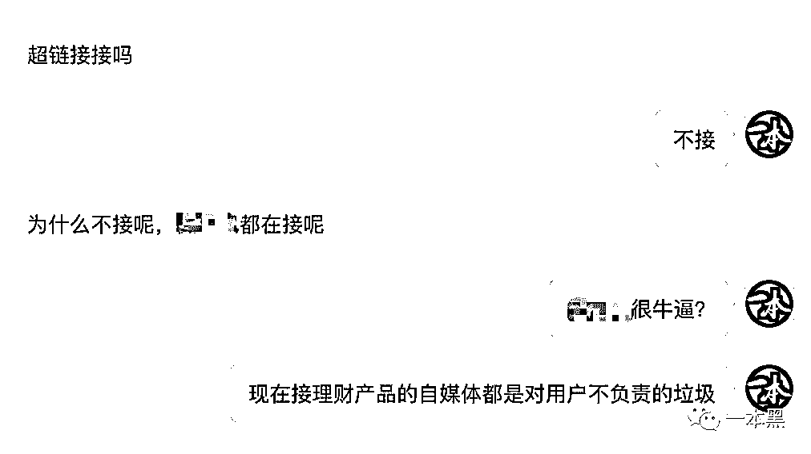
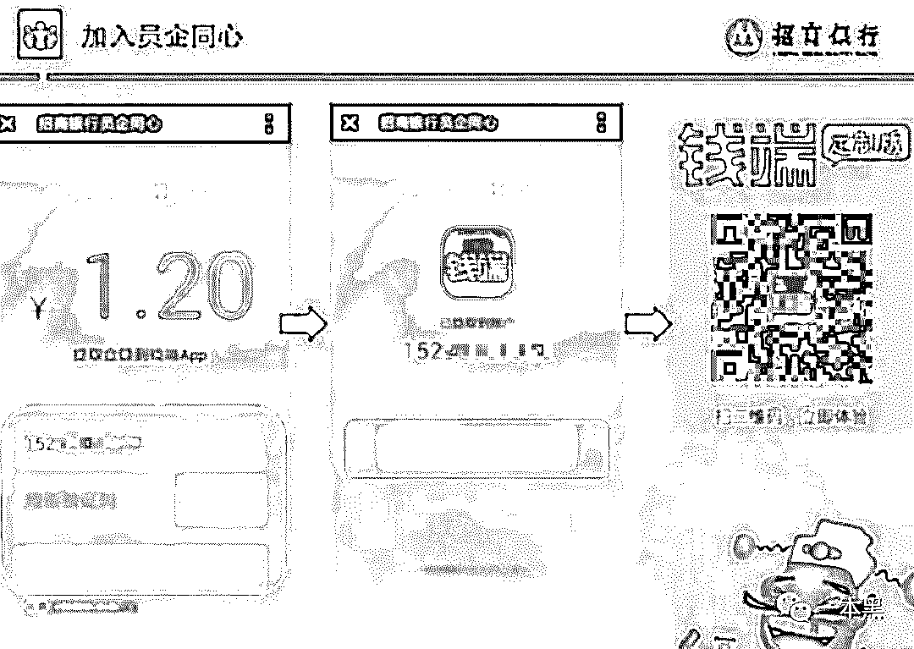
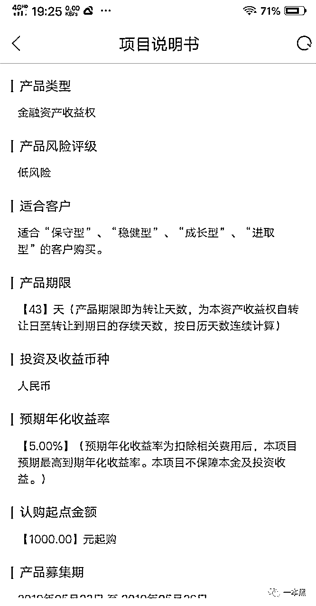
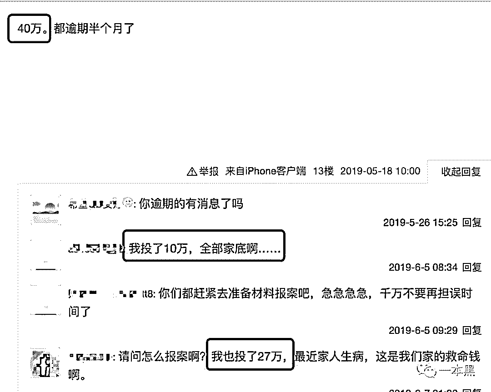

# “银行理财”也会爆雷？非法吸金 14 亿，近万人被骗，这谁顶得住啊

> 原文：[`mp.weixin.qq.com/s?__biz=MzU4ODAwNzUwMQ==&mid=2247485748&idx=1&sn=030e9c12d536e6bbb7aae0e1ebe0fa56&chksm=fde21816ca959100dcde8617f489ceb27977430805c97a5a6886482a73c0e06acf56b1e3c867&scene=27#wechat_redirect`](http://mp.weixin.qq.com/s?__biz=MzU4ODAwNzUwMQ==&mid=2247485748&idx=1&sn=030e9c12d536e6bbb7aae0e1ebe0fa56&chksm=fde21816ca959100dcde8617f489ceb27977430805c97a5a6886482a73c0e06acf56b1e3c867&scene=27#wechat_redirect)

【黑话连篇】

**该栏目更多的是揭露事件或对事件的看法，以达到让人精神得到升华的目的。**

* * *

在粤语里，仙人跳俗称“捉黄脚鸡”，是指一种利用猎艳心理给人设计圈套，骗人钱财的行为。

往往以开展“动作交流”为借口，由女方把男方约到指定地点，准备做些闭门切磋的事情。

这时候，女方的同伙，一般是高大威猛的男性，会突然踢门而入，为了不让事情张扬出去，也为求自保，掉入圈套的男方只好把身上的钱交给这对同伙，于是他们就达到了敲诈的目的。

但现在大多数人都熟知了这种套路，导致轻易上当的人越来越少，这时候这两同伙就想到了一个招，找个小有名气的人做代言或者推荐，说起来也算是“信用背书”了。

于是开始有越来越多的人相信这场“闭门切磋”是靠谱的，纷纷带着激动的心情来到约定地点，可万万没想到，这他么的还是一场骗局，是一场个人对个人、彻彻底底的骗局。

**俗称“P2P 爆雷”****。**

**一**

**经常有广告商过来找我投广告，除了正常的品牌、教育类广告，还有大量的理财广告。**

**因为熟知理财产品的风险性，所以对于理财广告我是坚决不会推荐的，即便广告主给出的价格高于其他类广告数倍，我依然认为理财广告接不得。**

****

**前段时间就有广告主想在一本黑投理财产品的广告，还质疑某大号都接了，我为什么不接，我就给他回了句：“现在接理财广告的自媒体都是垃圾。”**

**这里提到的某大号是一个比一本黑粉丝多 50 倍的大号，粉丝在千万以上，可想而知一条理财广告打出去，会有多少人因为所谓的“信用背书”而入坑。**

**大家一定要清楚一点，任何大 V 或者自媒体推荐的理财产品，并不代表其产品的可靠性，不论你是做推荐还是做销售分成，最终的解释权还得是理财产品的发行方。**

**比方说，有一天你在某大 V 的推荐下购买了一款理财产品，但最后这款产品爆雷跑路了，虽说该大 V 有一定的责任，但最终你不能说找大 V 给你赔钱啊，你得找产品发行方。**

**之前大量 P2P 爆雷，不少人亏得老泪纵横，连内裤都不剩。本以为 P2P 模式会就此消停，可没想到最近又出事了。**

****

**前几天刷朋友圈看到一篇文章，讲的是一名女研究生，通过招商银行的介绍，下载安装了一款叫“钱端”的 APP。**

**当事人声称自己从来不碰网贷，为保险起见，偶尔会买个银行理财。**

**在看到招商银行和钱端 APP 的合作后，就自信满满的在“钱端”上买了一个理财产品，收益率大概在 5%左右，一共投了 80 多万，投资的资金包含了其父母、婆婆的钱。**

**可当她准备把钱取出来买车的时候，却发现钱已经逾期取不出来了。**

**事后经过了解，银行告诉她，双方已经取消了合作关系，至于资金去向，银行也不知道。**

**总之，钱就是逾期要不到了。**

****

**所以，这件疑似由招商银行站台，第三方互金公司广东钱端商务服务有限公司的“圈钱”事件，在圈子里炸开了锅，接近上万人进行了投资，金额高达 14 亿元。**

**事件一出，双方因为 14 亿元的去向问题陷入了一场激烈的口水甩锅战。**

**一方面是“钱端”多次强调自己曾被招行“包养”，自己闯下的祸还得你招行帮我想办法解决。**

**另一方面招行一直想甩掉这个烫手山芋，发布声明说双方早已解除合作关系，14 亿元的逾期事件和自身无关。**

**通过查询公开资料我发现，招行曾表示自己在 2017 年 4 月份就终止了和钱端公司的合作，所以招行和钱端 APP 无任何关系。**

**针对招行的声明，钱端 APP 在 5 月 28 日发布通告予以反驳，大意就是说在 2017 年 4 月以后，招行仍然在钱端 APP 上发布、销售投资产品，并且一直对钱端 APP 各方面工作进行督导。**

**一来二去，招行和钱端的”甩锅“之战就此上演，特别是 14 亿逾期事件发生后，双方的口水战完全演变成了一场罗生门。**

****

**钱端的运营主体是广东钱端商务服务有限公司，成立于 2014 年，同年上线”众金所“平台，后来改名为“钱端”，与此同时，钱端的二维码出现在招行的小企业 e 家官网。**

****

**虽然从工商信息上看，不能断定招行和钱端的关系，但曾有媒体援引招行员工的话说：”钱端实为招行小企业 e 家的升级版，只是不便对外宣传。”**

**不管钱端到底是不是招行自家的崽，招行前期为钱端站台做推广已是实锤，大部分的投资者正是因为相信招行的影响力，所以下载了钱端 APP 进行投资理财。**

**导致如今的投资者们陆续收到平台公告，称自己认购的项目无法按期履约，搞得众多投资者人心惶惶。**

**更骚的是，在这件事中，本来应该是投资者们要说法的关键时候，招行却和钱端打起了官司，原因是招行认为钱端在合作终止后，擅自使用招行的标识和名称，误导投资者。**

**至今，对于近万名无辜的投资者，招行和钱端并没有一方站出来负责，而是沉浸在彼此的“甩锅”中无法自拔。**

****

**这就好比孙悟空和菩提老祖，孙悟空利用自己在菩提老祖那学到的 72 变大闹天空，损失的本来是玉皇大帝，可玉皇大帝在要说法的时候，孙悟空却和菩提老祖打起了官司，原因是自己之所以闯下大祸，菩提老祖也脱不了干系。 **

**这时候玉皇大帝找来如来调查此事，玉皇大帝只能说：“人家有官司在身，只能走程序等等。”**

****二****

****古有“明修栈道，暗度陈仓”，今有招行钱端互相甩锅罗生门。这一骚操作多少让人觉得窒息。****

****本来是一桩很简单的案子，却在 XX 的配合下演绎成了一部荒诞的悬疑片，简直就是现实版的人民的名义。****

****在贴吧里，有受害者说自己打了某 XX 的电话，询问钱端事件是否能够立案，却被告知钱端事件还是定位在经济纠纷案，未构成诈骗性质，并强调因为钱端和招行还在打官司，凡是都得走流程，介入调查可能会影响最终结果。****

********

****但奇怪就在于，对于近万名投资者的 14 亿元究竟去哪了，招行和钱端并未作出解释。****

****双方却悠然自得的打起了官司，损失惨重的投资者们苦苦维权但是投诉无门，大家只能聚在贴吧里、各种维权群里苦苦等待，看不到希望。****

****曾经有记者去过钱端公司，见到了其法人冯巍。可对方却说他只是一个挂名的傀儡法人，只负责公司的后勤保障，什么都不知道。****

********

****钱端的实际控制人为网金控股的大股东陈强。网金控股是知名 P2P 平台，而其实控人陈强被披露在外有高达 8 亿以上的金融欠款，所以有很多受害者怀疑其是否有可能把资金挪为己用。****

****还有人说钱端的老板拿钱去买上市公司的壳，结果没有买成，壳退市，钱就打了水漂。****

****各种维权群里也炸开了锅，大家最关心的是，他们的钱到底去哪了，现在是否安全，是否能拿回自己的本金。****

****更有很多没有办法的受害者自发组织去起诉招行，因为他们都是通过招行了解到钱端的，自己的资金出现了问题，钱端也不做声，只能先去起诉招行。****

****其实，要想起诉招行是比较困难的，虽说招行前期给钱端做了推广，但是用户的钱是没有直接进入招行的，招行只是一个推广的角色。****

********

****这就好比地铁公司给某奶粉公司做广告，过了没多久，发现奶粉出现致癌物质，这时候你也只能去控告奶粉公司，而不是做推广的地铁公司。****

****之前的很多 P2P 是因为高额的利息，导致很多人被卷进去，但是钱端的利息并不高，只有 4%，产品的风险评级也是属于低风险，可如今还是变成了这幅模样，理财产品的安全性真的让人唏嘘。****

********

****在各种贴吧和维权群里，我看到很多受害者抱怨自己投了几十万甚至上百万，不仅严重影响自己的生活，还差点闹得家破人亡。****

********

****其实，整个事件对于投资者来说并不公平，招行和钱端打官司和这些受害者没有半毛钱关系，他们需要的是尽快调查出 14 亿资金的去向，还受害者一个公道。****

****明白人都知道，一个官司下来不拖个一年半载的肯定没完，到那时候投资者们的 14 亿早就不知道飞去哪了。****

****小黄车几百亿的押金现在不也照样没个信吗！****

********

****整个事件看下来，不管是招行和钱端演双簧暗渡陈仓，还是出现了什么不可逆转的情况，本质上这都是一场资本的游戏。****

****写到这里，我突然想到，以前有人为了买房而人为制造假离婚。为的就是能以更低的首付和更高的杠杆来买下另一套房，实现利益最大化。****

****在这个资产荒的年代，普通人总在以一种投机的方式来实现资产增值，也不能说是贪婪。但无论是假结婚还是假离婚，这种乱象的背后存在的是焦虑和无奈。****

****而放眼 P2P 领域，何止这个道理。****

********

****还原事实｜专扒黑产****

****微信 ID：darkinsider****

********

****知乎 一本黑****

****微博 一本黑 007****

****投稿、爆料、招聘、转载****

****请联系微信：chenchen_19940612****

****约稿、内容合作、联系老黑：yibenheiSW****