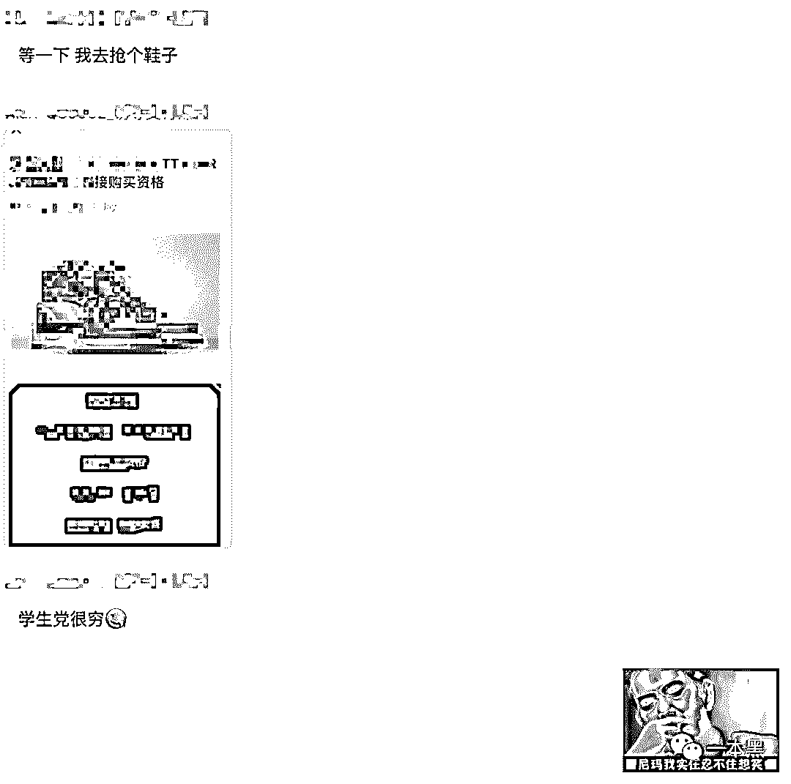

# 制作色情直播软件、攻击抄袭别人程序，他 17 岁实现经济独立

> 原文：[`mp.weixin.qq.com/s?__biz=MzU4ODAwNzUwMQ==&mid=2247485701&idx=1&sn=ea037879f1d7e076fee8ecd6c66ae6ed&chksm=fde21827ca95913124e0f5649643dee197b4869f42377013124b331ffc83a801a75b00bf6822&scene=27#wechat_redirect`](http://mp.weixin.qq.com/s?__biz=MzU4ODAwNzUwMQ==&mid=2247485701&idx=1&sn=ea037879f1d7e076fee8ecd6c66ae6ed&chksm=fde21827ca95913124e0f5649643dee197b4869f42377013124b331ffc83a801a75b00bf6822&scene=27#wechat_redirect)

**【地下职业】**

**该栏目主要讲述大众看不到的职业故事、人生经历，与黑暗有关、与欲望有关、与人性有关。**

* * *

栏目并非以一个揭露的视角去掀开世界的另一面，而是以一个平等的态度去交流和对视待在鲜为人知黑产世界中的芸芸众生，展示独属于自我的态度。

面对黑产暴利，很多业内人士只有刻意仰赖认知控制，才能抑制这份冲动，但当孩子认知尚未健全，面对菠菜推广月入 10w 的高额利润，他会做出什么样的选择，他会经历什么样的生活？

这次找到我们的是一个即将出国的高二少年，他叫莫平（化名），一个每挣一万就捐款 100，最后捐款总额达到上万的少年。

他二年级学会“入侵”，五年级开始制作钓鱼程序，初三正式迈入黑产行业，17 岁实现经济独立。

这期间，他抄袭别人的程序、攻击别人的网站、联合比自己大十几岁的程序员做了几个色情诱导支付软件。

他也曾想过去菲律宾等地做博彩，但慢慢的，他发现自己越陷越深，甚至开始惶恐起来。

他把自己的经历告诉我们，希望可以给大众提供观察世界的另一个视角。

**全因好奇入行**

** 老黑/文**

**从小，我渴望经济独立，2019 年 17 岁的我，貌似做到了。**

**儿时的我只觉黑客是个很酷的角色，从小便向往。但我眼中的黑客，不是像某些小学生挂着一个 V 字仇杀队的头像，还扬言分分钟盗 QQ。**

**他们到处装逼，但实际上没有任何技术。**

**我认为的 Hacker 是默默在暗处工作的，利益也好，正义也罢。随后，我便开始凭着兴趣在网络上游荡。**

**第一次入侵经历我记得非常深刻，小学二年级，同学有一部按键手机，我俩打开手 Q2007，用条件搜索找到一堆 QQ 号，抄在作业本上，利用课余时间，一个个尝试密码 123456 或者 123456789。**

**那时候啥都不懂，只是有这么个思路，现在说起来叫弱密码，而那时候我俩干的可以说叫人工撞库。虽然是碰运气，不过效果还不错，在我们抄的近 100 个 QQ 里，成功了 3 个。**

**下午在微机课上登录了这几个 QQ。其中有个还是超级 QQ，级别贼高，当时别提多开心了！满满的成就感，可过了一会，QQ 被顶下线，号主也改了密码。**

**小学五年级开始接触易语言，当时没有钱，全是在网上找的教程，没谁专门教过我。一般是用百度看一些教材、视频之类的。**

**我还记得我做的第一个程序是刷 QB 钓鱼，用易语言写了几周。效果大概就是对方填了账号信息后，对方的信息就会发到我的邮箱。**

**之所以做钓鱼程序是因为我看到市面上别人也在传播这东西，那时我就在想如果我也能做出一个，同学们应该会觉得我很厉害。**

**所以程序的功能刚写完，我就到处向同学炫耀。**

**不过那时候因为技术问题，这款钓鱼程序很容易被电脑管家秒杀，所以也就没有进行传播，但我依然很兴奋，因为是自己做的，除了成就感，更多的是有装逼的成分。**

**等念到初中，我开始听说刷钻，但究竟是如何实现的我并不知道。对此，我又产生了强烈的好奇，随后便开启了探索之路，和大多数新手一样，这个过程也免不了上当受骗。**

**当时不知从哪找到一个教刷钻的人，花 50 块钱拜了个师，交钱后，师傅丢给我个卡盟链接和邀请码，然后就没有然后了。**

**虽说被“师傅”坑了，还被绑定成他的下级（我买什么他都有提成）但起码还是摸索到了一些门道，现在想起来有点哭笑不得。**

**这个过程中我慢慢接触到卡商、猫池，这是我此前从来没听说过的东西。**

**头回赚钱是初一暑假，那时候赚了 2000 块。第一件事就想买台电脑，但又不想花爸妈的钱，因为我渴望独立和自己给予的安全感。**

**当时我在卡盟进货，也就是低买高卖。大概做了十天的样子，后来开学后因为时间问题就没再继续做。赚的钱我一般会存支付宝里，几乎没动。**

**慢慢的，我混到卡盟分站站长级别，那时觉得很牛逼。还花了很长时间给网站做装修，现在看起来多少有些幼稚。**

**卡盟一个月能给我带来 5000 收入，虽然不多，但对于当时的我来说已经比较满足了，渐渐地，我开始产生了不上学的想法。**

**等到初三，我已经算是一只脚踏进了灰色产业，我的思路和想法较同龄人来说已经很不一样了，在每一个我加入的群里，我会看哪些信息值得收集。**

**比如说收到一条广告，其他人的反应要么是骂骗子，要么质疑是不是真的，而我会思考这条信息的利润点在哪，是否能够复制和改进它。**

**带着这样的敏锐观察力和思考，我看到一个盗号软件，广告是这样的：“下载软件后，想盗谁号盗谁号。”**

**使用后我才知道，这是个诱导分享 APP，使用者需要分享给几个群才能使用，但其实都是扯淡的，这群人玩的是裂变模式。**

**后来我就在想，我能不能也做一个？但安卓程序我不懂，我想到反编译，只需更改一些文字或接口，就能达到我需要的效果。**

**相当于盗版别人的软件，把它分享的内容一改，就是我的了，当时靠着这个思路，我成功引流了几个 2000 人的群。**

**有了流量当然就能变现，至于变现渠道，那时候我做的是 CPA，推广秀场等色情直播软件。**

**后来我开始玩薅羊毛。羊毛党有个圈子，里面人年龄都不大，他们之间有个特征：喜欢各种装逼，有没有真本事看不出来，你装来我装去，个个月入 10 万，实际都在吃土。**

**我们会在里面交流自己的羊毛项目，印象最深的是钱宝网注册送 28，随便买，0 成本买了几千块的东西，特开心！**

**更爽的一波是聚美优品送红包，平均一个号有几十块红包，我撸了近 2000 块的零食，成本只花了十多块钱。**

**那天上午，当时最大的接码平台服务器一度崩溃，就像被 CC 了一样，全网都在玩聚美，利润是真大。东西到手，满满的成就感侵占着我，现在看来太低阶了。**

**说起 cc 攻击，我最早接触到的是一个程序，代理 ip 进行 cc 攻击，一台电脑基本可以秒掉很大一部分的中小型网站，效果极好。于是我攻击了曾经坑过我的卡盟，就像笨拙小学生，但也让那傻逼网站瘫了一周，殊不知，这只是站群中的一个站。**

**随后我接触到 DDOS 圈，说白了也是个 QQ 群，里面有接单的，有菠菜集团重金求打压同行的，有卖远控服务端的，还有聊 3389、1433 端口抓鸡的，很高深。**

**我在群里下载了一个名为 “xxx 远控”的服务端，发现 xxx 生成的远控木马竟可以轻松过掉电脑管家、360 等主流杀毒。**

**那一刻，我突然明白：网络并不安全！而且，xxx 还是一个有后门的远控，我抓的鸡同时也会贡献给作者，谁叫他免杀还免费呢 ！我们这种小白做点贡献应该的。**

**那段经历挺难忘的，有那么一刻我会突然觉得自己和身边的朋友不是一类人。**

**那时我跟朋友去网吧，他们在网吧玩游戏，而我在写程序。可能是我游戏玩得很菜，也可能是我对游戏不感冒，我觉得赚钱能给我带来比游戏更多的乐趣。**

**我还记得我爸对我说过一句记，到现在我还记得：“你玩任何游戏，即使升到满级，你又得到了什么呢？这就像吸毒带来短暂的快感，你浪费的其实就只有时间。”**

**他们在玩游戏的时候很自由，而我想的却是：今天我该完成什么，我该做些什么。但与此同时我内心会有种格格不入的感觉，毕竟人是群居性动物。**

****真正迈入黑产圈****

****初三暑假，我学会 app 反编译，反编译了一款“一键无痕视频”的软件，网页源码一抄，宣传广告词一改，就变成了我的程序。****

****初三暑假后的一个月，我赚了 3w。****

****实现“财富自由”的同时，我观察到这类 app 利润普遍很大，后来联系了一个会 e4a 的朋友，跟他一起开发了一款假视频诱导软件，软件也给我带来了几万的收入。****

****再后来，我开始开发独属于自己的 CPA 程序：一个美女视频软件的诱导支付广告计费模式，我联系了支付接口和视频接口，从一个群里认识了兼职 PHP 开发的陈哥（我日后的合伙人），我给了他 2k，叫他帮我写一个后台。****

****全都搞定后，这款产品运营起来很受欢迎，很多同行都在帮我推，我很良心，没怎么扣量，月利润保持在 3w 左右。****

****到了 12 月份，我跟陈哥聊天，我说我想搞“蜜 X 直播” ，一款诱导直播产品。****

****跟陈哥一聊，发现 app 没有加密，随后我们开始了长达一个多月的 APP 反编译与后台开发的道路。****

****陈哥平时忙，只能晚上写，我经常陪他熬到很晚，讨论后台数据方案和反编译方案。****

****这套后台没用任何框架，从数据库到代码，每一行都是我们辛苦敲出来的，很费时间精力，近两个月后产品终于上线了。****

****第一周，一天只有一两千的流水，还是亏本状态，陈哥有些沮丧。但等到第二周，凭借我的关系，每天能到上万的量，那时候我最喜欢干的事儿就是看着后台不停刷新，支付金额一直上涨的快感冲击着我。****

******峰回路转******

******做了没多久我们就收手了，有俩因素，第一，陈哥感觉风险大，我一直劝他尽量把安全做好，可他一直拖，但实话实说：再怎么做都没有绝对的安全。******

******陈哥某天晚上对我说，他现在坐在客厅，满地的烟头，他太害怕了，这种事儿早晚会出问题。陈哥技术挺好的，他朋友曾叫他去缅甸，搞些直接可以播放的软件，利润很多。******

******陈哥没去成，他 30 多岁，有个小女孩，家人舍不得。******

******陈哥对自己家庭看得很重，他女儿很小，他该做个合格的父亲，他不想因为钱让自己失去自由导致家庭破损，他放弃了去缅甸的事情，同时也跟我掰了。******

******第二，我一个月才赚三五万，实在觉得人力成本都不止三五万。费了很多心思，熬了太多夜，没达到我预期效果。换个角度说，就算达到了也不一定是好事，走偏门捞到钱或许也不是好事，从产品上线到收手，也就一两月时间。******

******陈哥与我的分歧点在于：陈哥认为不安全，我认为可以通过做安全隐藏自己。我叫陈哥去做安全，几个下午过去，陈哥拖着说不想做，我被鸽了，非常不爽。******

******别看我年龄小，但我也会说他，有时比较激动，后来陈哥把钱还给我了，说不做。我说那算了，我也放弃。有种闹崩了的感觉，现在想起来，大概是人性中的稳妥与胆怯。******

******陈哥好像和我身边二十几岁的年轻人们一样，他们甘于自己一个月几千或者一两万的工资。我曾叫身边的人炒比特币，起码资本可以翻到十倍，他们说风险大，他们追求银行一年 4%的利息，而不是追求比特币，一天 40%。******

******他们很容易满足，不愿意去闯，除去对未知事物的担忧，还有一点，他们觉得实体经济比较稳妥。******

******做人要有底线，有些东西，最好不要去涉及，我有个朋友在做菠菜引流，他叫玄（化名）。我们线下也见过，玄知道我这边可以做，问我要不要一起干，我要做的话，一个月再怎么也有 3-10w。******

******我拒绝了，菠菜不干净，害人，破坏别人家庭。很多家庭都毁在菠菜上，如果他能看到这篇文章，我想劝他不要再做下去。******

******同时，也想跟很多菲律宾、柬埔寨、马来西亚的老板们说：做人，赚钱不在多，得对得起自己良心。******

******就好像陈哥，他有正规工作，一个月不到一万的工资，辞职出来跟我一个高中生干，我估计他的心情就像跟某些朋友被带到菲律宾搞菠菜一样，赚钱是赚钱，但害怕，孤独又想家，不习惯国外的喧哗。******

******很多人在异国他乡思念故土，或许菠菜集团的菠菜没有妈妈做的菜好吃，员工酒店宿舍没有自己家乡的床软，菲律宾 ktv 里的辣妹没有家乡女朋友亲切。******

******说到底，他们无法在异乡得到归属，从而于内心深处滋生一种无法忽视的放逐感，这种永恒的不确定性是任何金钱上的获取都无法弥补的，并一次又一次的将他们推入惶恐与质疑自我的深渊。******

******想家了就回头。******

******这次赚了几万块，我没赚爽，但想想还是算了吧，知足常乐。我这个年龄，拥有几十万存款，放同龄人里面，已经算很多的了。******

******黑产利润大，但活在断送前程的惶恐中，真不自在。******

******后来我有个习惯，每赚 1 万块钱，我会捐出一百块。支付宝上有一个公益项目，现在算下来捐了上万了。******

******不为别的，可能是自己心里的一种赎罪吧！******

******因为我觉得我搞出来的这些软件，说白了有点骗人的意思，赚钱太过容易，该对社会有点回馈。******

******现在很多人为了赚快钱不择手段，如果他们肯反哺于需要帮助的人，冰冷的人世间也会因为他们的力量多出一丝温情吧。******

******如今，由于学习的原因，和陈哥的影响，我也决定做一个普通人，前面运营的盗版 app 的服务器也关闭了，一切都放下了。******

******没钱，其实挺自由，挺轻松的。如果有机会，我想亲手给老师傅递中华。******

************

*******因为地域原因，我跟老师傅并没有和莫平线下见面，但从电话采访的某些细节，我能感受得出这个未满 18 岁少年的性格和他的想法。*******

*******稚嫩、张扬、气质上完全不同于踏入社会的人，但他在这个充满稚气的年龄，却过早的接触了一些人性和利益的东西，这和他所处的环境和年龄状态本该是不符合的。*******

*******我也能感受到他心中那种骄傲的状态，或者说是一种脱离大众、区别群体的一种满足感。*******

*******但他内心深处依然是个不满 18 岁的大男孩，大大咧咧，想出头也好想装逼也罢，这是青春的模样。*******

*******电话采访过程中发生过一个有趣的细节，当时接近凌晨 12 点，莫平正说着自己和陈哥的那段经历，突然他就挂掉了电话，随后发消息过来说自己要去抢个鞋子。*******

**************

*******整个电话采访结束后，我回忆起这个细节，突然有点感动，因为我觉得即便他接触了这么多灰色的东西，但他的内心依然保留着年少的那份美好，这东西说不清是什么，也没法描述。*******

*********反正就是一种感觉，一种可以凌驾于任何仁义道德、可以跃然纸上的东西。*********

**************

*******还原事实｜专扒黑产*******

*******微信 ID：darkinsider*******

**************

*******知乎 一本黑*******

*******微博 一本黑 007*******

*******投稿、爆料、招聘、转载*******

*******请联系微信：chenchen_19940612*******

*******约稿、内容合作、联系：yibenheiSW*******