# 招聘骚操作：爬虫“偷”简历、监控“打报告”、还能给你推广告

> 原文：[`mp.weixin.qq.com/s?__biz=MzU4ODAwNzUwMQ==&mid=2247485676&idx=1&sn=0b174961fee6ad5f6289fd2093d40f7c&chksm=fde219ceca9590d8582228b81834650c3bb017eea50251ff87dbdb13a97d737c1fbc9d5c0daa&scene=27#wechat_redirect`](http://mp.weixin.qq.com/s?__biz=MzU4ODAwNzUwMQ==&mid=2247485676&idx=1&sn=0b174961fee6ad5f6289fd2093d40f7c&chksm=fde219ceca9590d8582228b81834650c3bb017eea50251ff87dbdb13a97d737c1fbc9d5c0daa&scene=27#wechat_redirect)

这世上，很少有能够牢记初衷的人。

**在《黑镜》第一季第一集中，原本推进所有剧情发展的起因，是解救被绑架的公主，谁能想到，当直播如期进行，全国人民都围在电视机前，目不转睛地观看首相和一头猪发生 X 关系时，没人注意到，公主早已晕倒在空荡荡的街道中。**

**同样，也很少有“包装”摆不平的事情。**

****所有人都拼命想要守护的隐私，却能够在一连串的“包装”下，成为一家数据公司的亮点业务，获得李开复等人的青睐，堂而皇之的贩卖着个人隐私。****

****B 轮融资，拥有 38 个 B 端招聘产品，累计非法获取 37 亿份简历，超过 10 亿份通讯录信息。****

******“不告而拿”你的简历，还“偷偷给老板”打你的小报告。******

****何其骚也。****

******01 ****谁在背后打我小报告？******

****上个月的一天，大半夜的，我被朋友老胡拉出来喝酒，半瓶啤酒下肚，他狠狠咬下半串牛蹄筋，含糊不清地吐出一句话：“真他妈倒霉。”****

****原来，他被裁员了。****

****在“资本寒冬”这个词高频出现的情况下，裁员本来不是个稀罕事儿，但老胡被裁的原因，却令人大跌眼镜：****

******在招聘平台更新了简历，明明已经屏蔽了公司，却不知怎的，还是被 HR 知道了。******

******紧接着，一连串意想不到的事情，顺其自然的发生了。******

******老胡被人事叫进了办公室，在一番很官方的交流后，老胡面前出现了一份解除劳动合同通知书，在追问原因时，HR 说：“既然你已经打算要走了，继续在这里工作很可能会影响团队合作，所以很抱歉。”******

******正当老胡要解释的时候，HR 端着水杯离开了。******

********“上个项目刚刚完结，我只是把它增加到了简历中，这有什么不对吗？****求职意向一栏，明明还是不考虑新机会，怎么就说明我打算要走了？****再说，我已经屏蔽了公司，为什么 HR 还能看到我的简历更新情况？”********

******老胡发出灵魂三连问，巧的是，我好像、正好知道答案。******

******去年年初，因为工作需要，我代管过三个月公司的招聘账号，有天早上，我照例打开 HR 邮箱，想要寻找合适的候选人，突然一封邮件吸引了我的注意，标题是：“**你公司有 3 人可能会跳槽，请及时查看**”。******

****好奇之下，我点开它，发现邮件内容很简单，只说“X 先生等 3 人有跳槽可能，点击这里查看详情。”****

****按捺不住好奇，我跟随指示，在微信上关注了一个叫做“助**猎”的公众号，然后绑定了公司。****

****第二天一早，我就收到了一条消息推送，“**监测****结果提醒**”**：****新发现 1 名员工要跳槽**。****

****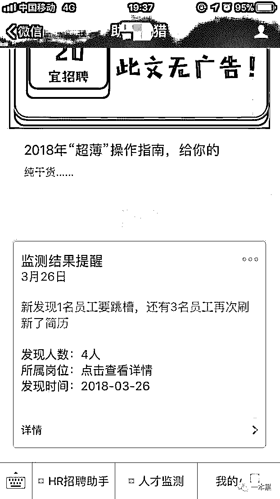****

****而我之所以现在还保存着这张截图，是因为当天晚上，我跟两位做 HR 的朋友做了分享，深入探讨了一下这种现象。****

****随后，我们得出一致的结论：“这家叫做北京机*网络科技有限公司的公司，干的这事儿，真是有够狠的。”****

****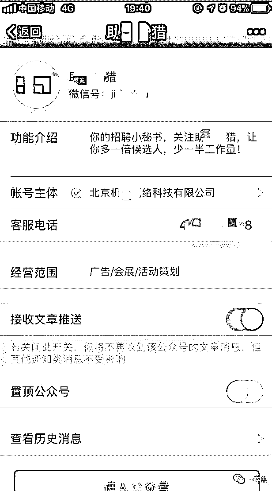****

****那次骂完后，我就渐渐淡忘了这件事，谁料时隔一年多，类似的事情在老胡身上发生了，遗憾的是，我当时站在信息推送的上游，而老胡正好相反。****

****我让老胡想办法打听到他前东家 HR 获知员工简历动态的平台，几天后，有了进展。****

****那个平台，叫做“助手*猎”。****

****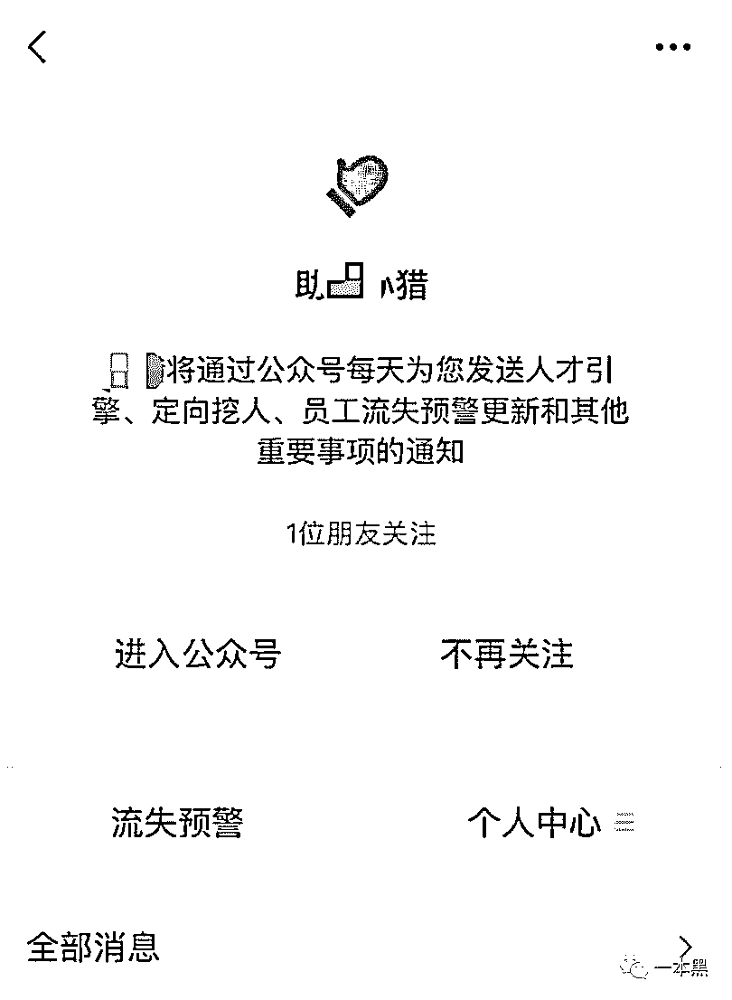****

****好眼熟的名字，难不成跟我去年遇到的是同一家公司？一看资料，发现不一样，这是一家深圳的公司。****

****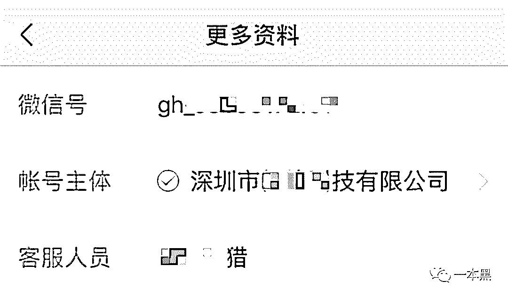****

****再仔细一看，这家公司去年年底才成立，公众号也是今年年初刚刚注册的。****

****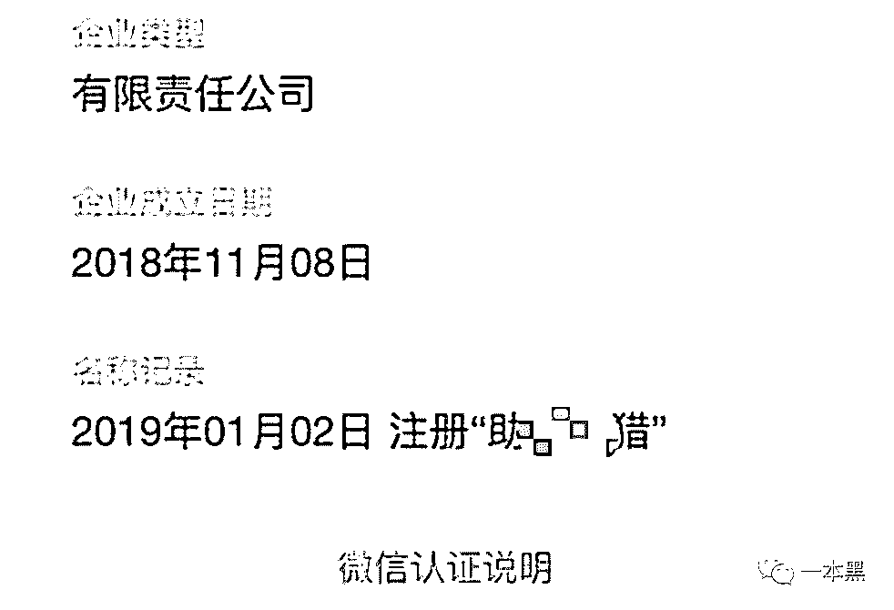****

****为了试试这个打着大数据旗号的产品，我按照公众号的指引，输入了老胡之前所在的公司名称。****

****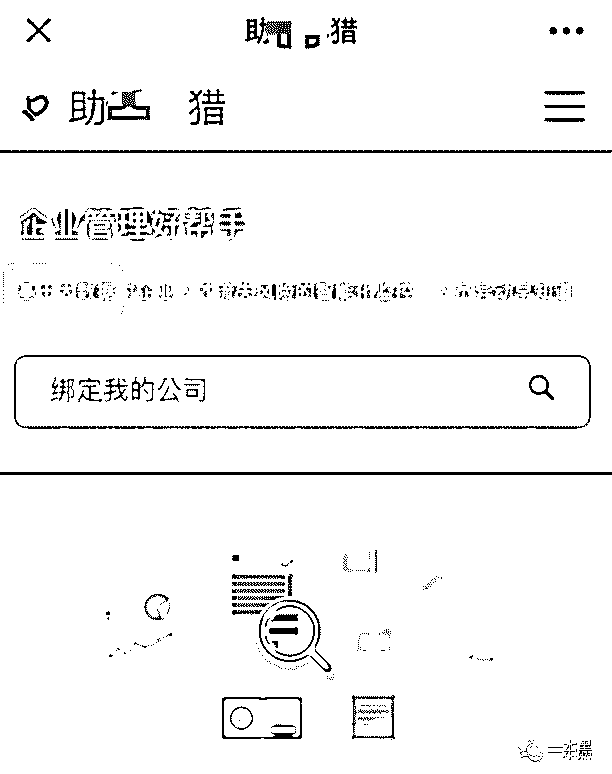****

****随后，“员工流失预警”出现了，但在未登录的情况下，只显示最新的一个。****

****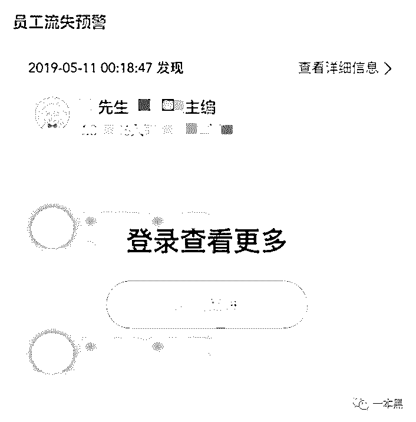****

****如果想查看所有预警的详细信息，并实时收到平台的监测提醒，则需付费，限时折扣价 1350 元/年。****

****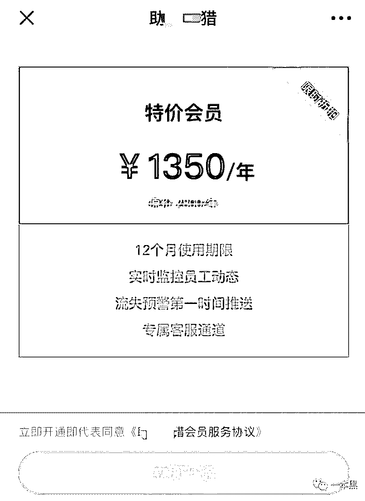****

****我在网上查了一下，发现此类平台有很多人吐槽，但确有公司愿意为此付费。****

****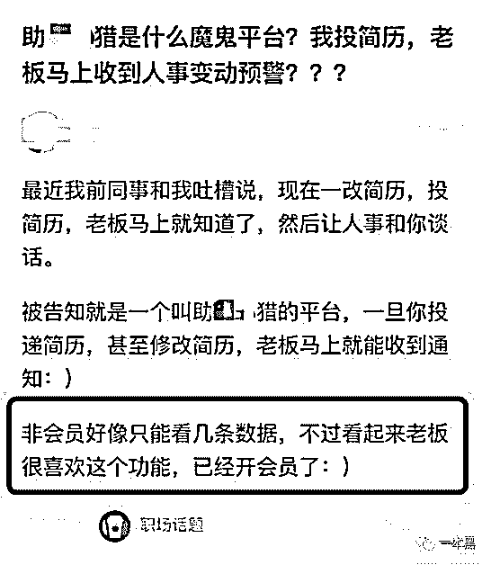****

****不得不说，此类平台还真是有胆量。****

****在互联网如此发达的今天，难道他们不知道上一家提供这种服务的公司，已经蹲进去了？****

******02 ****爬取简历，替老板监视员工******

****今年 3 月末，大数据领域遭遇了一场龙卷风，卷走了 36 个人。****

****成立于 2014 年的简历大数据公司——**巧达科技，涉嫌违规盗取、兜售用户隐私**，办公室被查封，员工悉数被警方带走。****

****据公开资料显示，巧达科技成立 5 年，先后获得由李开复创办的创新工场数百万美元的 A 轮融资，及中信产业基金数千万人民币 B 轮融资，虽只融资到 B 轮，且团队人数不足 50 人，但它却是一家**悄咪咪赚大钱**的公司。****

****创业第三个年头，巧达科技全年营收就已超过 4 亿，净利润接近一半，然而，在细究巧达科技的业务时，你会发现，它**赚钱靠的是数以亿计的简历**。****

****燃财经曾拿到一份巧达数据给客户的商务合作 BP（商业计划书），这份文件称：**巧达科技旗下共有 38 个 B 端招聘产品，拥有超过 170 万的招聘者用户，数据库有 2.2 亿自然人的简历、简历累计总数达 37 亿份。******

********此外，巧达科技还有**超过 10 亿份通讯录**，并且掌握着与此相关的社会关系、组织关系、家庭关系数据。********

****令人唏嘘的是，巧达科技获取数据的手段，是**爬虫**。****

****巧达科技主要数据来源于“乔大招”产品矩阵，旗下拥有“简历时光机” “爱伙伴”等 10 余款产品。****

****这些产品到底有多骚？估计很多人都想不到。举两个例子：****

****“简历时光机”，这名字让我想到动漫哆啦 A 梦中，大雄房间里那个神奇的抽屉。实际上，这款产品确实很秀，它能够拼命发掘你简历上所有的秘密，让 HR 看到简历上所有曾有过的修改历史，无论你是新增、修改，亦或删除，统统都逃不脱。****

****“爱伙伴”，是一款可以“**监测员工离职动向**”的工具软件，它可以监测到员工更新、投递简历等动作，以及员工简历被 HR、猎头查看次数等信息。****

****也就是说，无论你是准备跳槽，静待机会，还是被猎头看中，所有的动作都会被实时监测，并推送给单位相关负责人。****

****虽然干着违法的事情，却有足够勇气腆着脸为自己洗白，真不懂是无知还是故意诱导。****

****“爱伙伴”产品负责人刘博曾向媒体表示：**简历中不存在法理规定的个人隐私信息，并且乔大招只解析简历信息中个人教育经历和个人求职经历两部分，是属于“个人可向公众开放并知悉”的信息。******

********对于简历中的照片、联系方式、身份证等不在乔大招的获取范围，解析前已经做了脱敏处理。********

****兄 dei，没事能不能多看看书，你这产品负责人是走后门得来的吗？****

******公民个人信息包括**姓名、年龄、有效证件号码、婚姻状况、学历、工作单位、履历、电话号码、家庭住址等能**够识别公民个人身份，或者涉及公民个人隐私的信息、数据资料**。****

****《中华人民共和国网络安全法》中明确规定：“**任何个人和组织不得窃取或者以其他非法方式获取个人信息，不得非法出售或者非法向他人提供个人信息。****”******

******除了向老板和 HR 打小报告外，巧达科技还将这些信息卖给广告主，广告主以此来向用户做精准营销，买房买车、贷款保险，至于你能遇到哪一种，随缘。******

******不知道在被抓的那一刻，巧达科技有没有想明白是为何。******

************

******自诞生伊始，大数据就已是万人争夺的屠龙宝刀。******

******若守不住底线，最终也只能自食苦果。******

******然而，一个巧达科技倒下了，千千万万个“巧达科技”又冲上来，继续争抢和蚕食着简历大数据市场。******

********03 ****平台霸气回怼的勇气，究竟是谁给的？********

******针对监测员工简历动态这件事，虽然在更早的时候，就陆陆续续有人发声，但真正开始产生舆论影响，却是源于拉勾网联合创始人的回应。******

******去年，一位网友在微博，爆料了这波骚体验，提醒称：“**如果你还没有从上家公司离职就开始在拉勾上更新简历，寻找新的就业机会，拉勾是会发一份邮件提醒你的老板，有员工可能会跳槽**。”******

******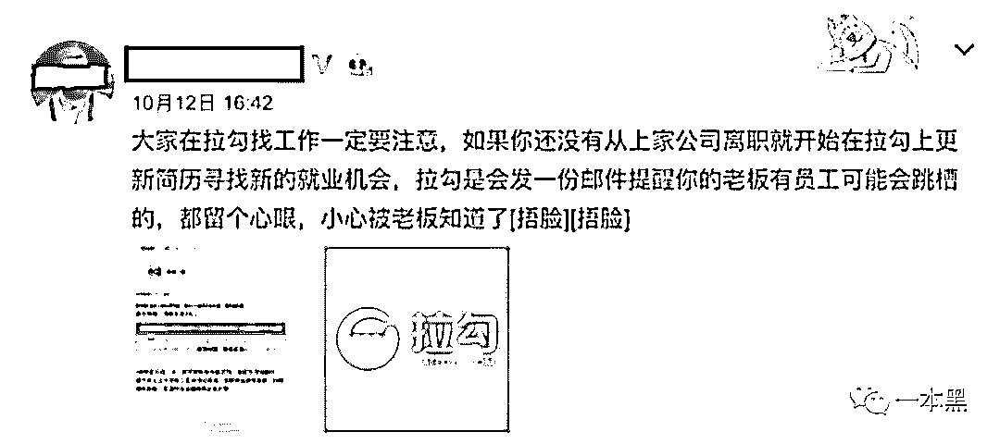******

******次日，拉勾网联合创始人鲍艾乐实名回复，称**这是其他公司提供的服务，与拉勾网毫无关系**，请网友带着智商来看待这件事，切勿瞎哔哔。 ******

******     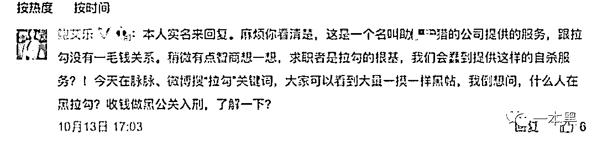******

********这波回应看似霸气，实则是甩锅。********

******虽然这类第三方平台的所作所为令人不齿，但是，平台确实从拉勾爬取到了用户的简历，这最起码能够说明，拉勾网的反爬虫机制是存在漏洞的。******

******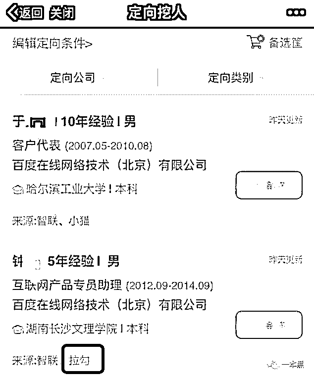******

******既然说求职者是拉勾的根基，那么，现在你的根基出现了问题，没有丝毫自查反省，反倒甩锅甩了个干净，这就是拉勾的社会责任感所在？******

******别忘了，水能载舟、亦能覆舟。******

********04 ****仁者见仁，智者见智********

******大约 2 个月前，有两条新闻曾引发激烈讨论。******

******一条发生在南京，关于**给环卫工人佩戴智能监测手环**。手环除具备显示时间、天气等基本功能外，还有一项特殊功能：当环卫工原地停留超过 20 分钟，手环会自动发出语音提示：“短暂的休息之后，继续努力工作吧，加油！”******

****     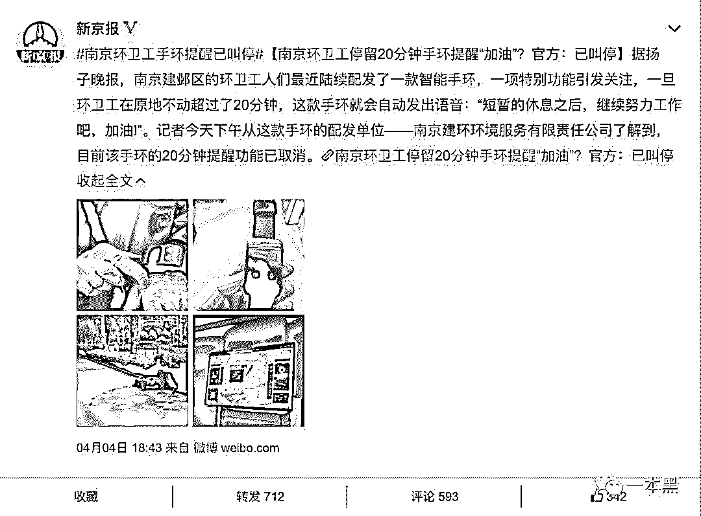****

****另一条发生在浙江，关于**员工频繁跳槽会影响征信**。浙江省人社厅副厅长葛平安发言称：“个人频繁辞职和就业的话，他的信用就成问题了。而后，浙江人社厅回应：针对的是恶意频繁跳槽行为。****

****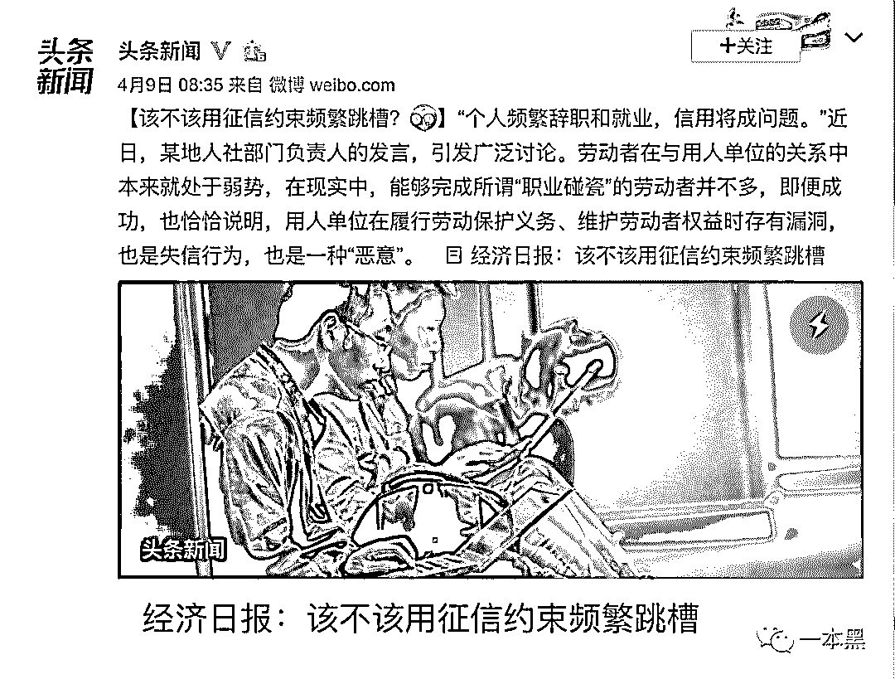****

****“员工动向监测预警”与这两条新闻搭配在一起看，你别说，简直毫无违和感，就连散发的气质都那么相似。****

******科技进步的太快，人文思想却没能跟上。******

******曾经风靡资本届的大数据行业，在风口上高速起飞，一直是舆论和资本的焦点，但由于大数据和个人隐私具有天然的相关性，这使得一大批只愿向钱看的大数据公司，不惜干着违法又缺德的买卖。******

******敢情这类公司的员工，不在意自己是否被监控？你别说，人家可能还真的不 care。******

******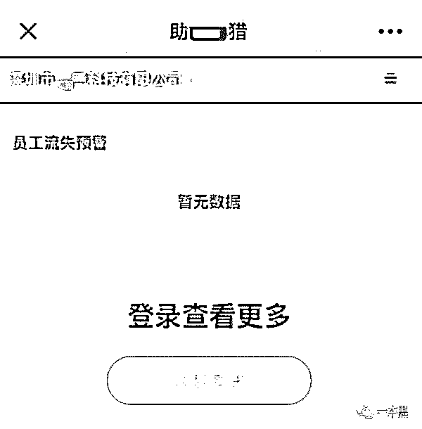******

******对于这类贩卖简历大数据、并向企业管理者提供员工简历实时监测的行为，网上站成两队。******

******一部分人认为，这会让原本处于弱势的求职者更加受困，同时，对公司形象也有所影响。******

******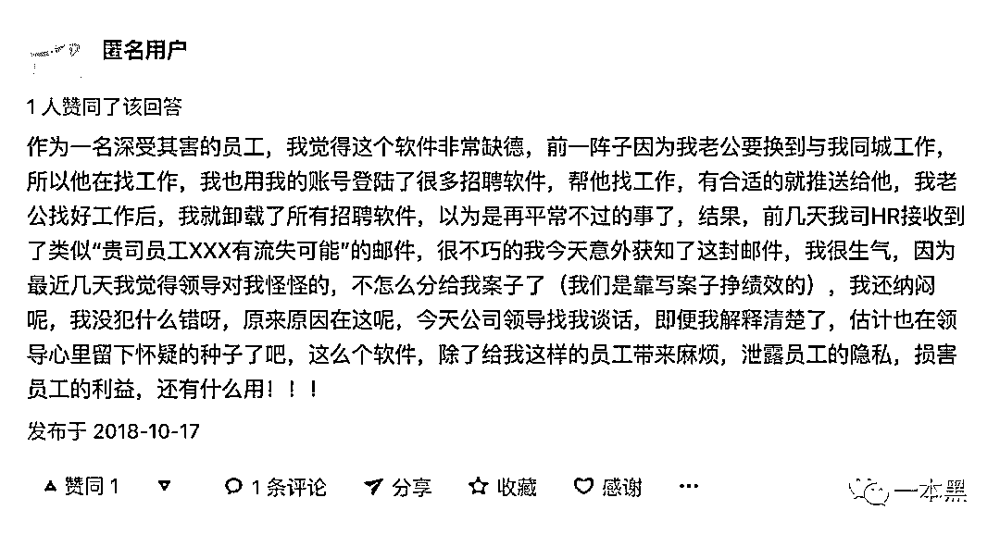******

******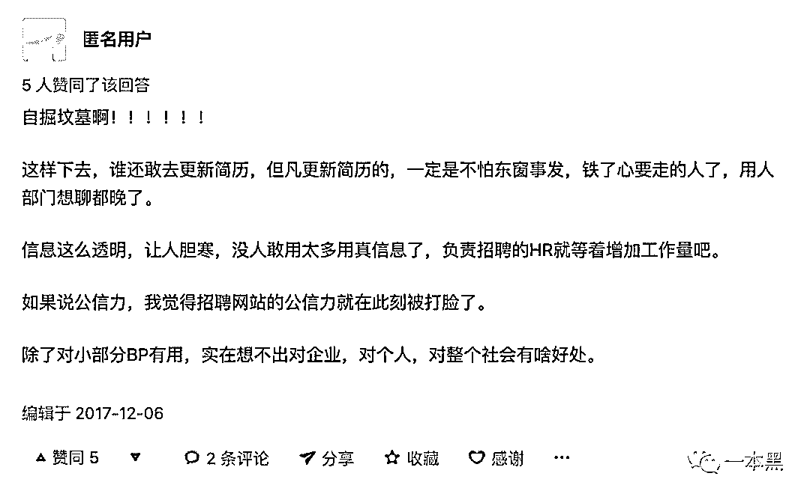******

******另一部分人则认为无所谓，内心坦荡，无惧变化。******

******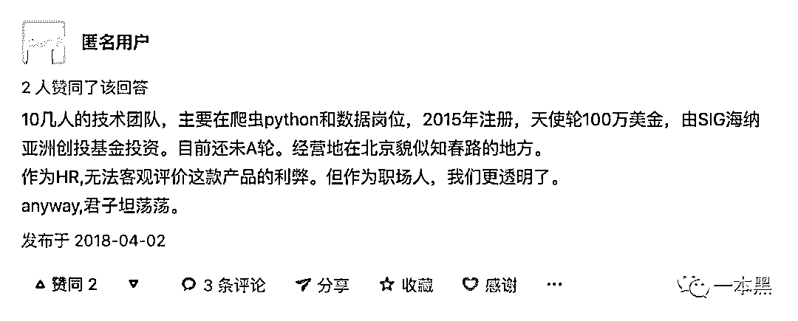******

******果然，人的注意力都很容易被转移。******

********当围绕“对员工的简历监控是否合理”这个话题展开辩论的时候，很多人都忘记了，这种在未授权情况下恶意获取公民信息并谋取高额利益的行为，根本就是违法行为啊！********

******果然，艺术源于生活，而又高于生活。******

******看来，我要重温一遍《黑镜》了。******

************

******还原事实｜专扒黑产******

******微信 ID：darkinsider******

************

******知乎 一本黑******

******微博 一本黑 007******

******投稿、爆料、招聘、转载******

******请联系微信：chenchen_19940612******

******约稿、内容合作、联系：yibenheiSW******