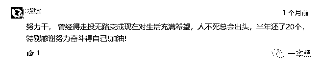
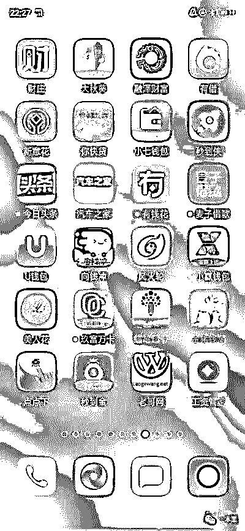
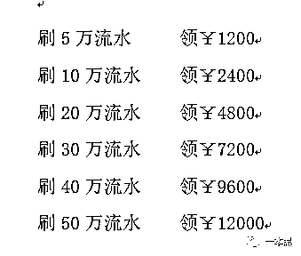
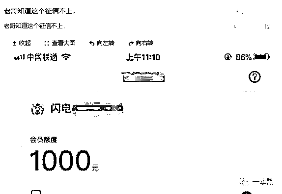

# “ 714 套路贷之后，我又遭遇了 101 个骗局 ”

> 原文：[`mp.weixin.qq.com/s?__biz=MzU4ODAwNzUwMQ==&mid=2247485661&idx=1&sn=ad6a644db8174c7b3afbcc68b494fea5&chksm=fde219ffca9590e972a8f1ac4aa97bb4a7b40be15753079a17b793b96bb9762b10a507abb8b1&scene=27#wechat_redirect`](http://mp.weixin.qq.com/s?__biz=MzU4ODAwNzUwMQ==&mid=2247485661&idx=1&sn=ad6a644db8174c7b3afbcc68b494fea5&chksm=fde219ffca9590e972a8f1ac4aa97bb4a7b40be15753079a17b793b96bb9762b10a507abb8b1&scene=27#wechat_redirect)

【黑话连篇】

该栏目更多的是揭露事件或对事件的看法，以达到让人精神得到升华的目的。

我们已经熟悉了这样的故事：一时缺钱，借下高利贷，以为自己能够按时还款，然而接下来却是更多的债务，直到自己无力承担。

背上巨额债务，只是开始。

714 一直是网贷行业的热议话题，在今年 315 央视上被点名后，曾经沉默过一段时间，但最近好像又开始有了些死灰复燃的迹象。

在开始今天的文章之前，我想给那些不知道 714 的读者普及一下，什么是 714 高炮。

顾名思义，714 高炮就是期限为 7 天或 14 天的高利息网络贷款，这其中包含高额的“砍头息”和“逾期费用”。

能和 714 相提并论的，当属 55 超级高炮，714 升级版，期限为 5 天，50%的砍头息，借款 1000 元，到手 500 元，5 天后还款 1200 元。

# 

**01**

**有读者在后台留言，说自己遭遇了 714，这才让我意识到，即便是 315 央视的曝光，也依然动摇不了网贷行业的嗜血行为。**

这位哥们说他当时只想借 1500 元，因为临近发工资，他觉得自己能够马上还清。

然而，7 天后为了还贷，他又在另一个 网贷 App 上借了钱……

上周，他发现自己已经欠下 10 万贷款，但实际到账仅 6 万左右。

这就是臭名昭著的砍头息。出借人给借款者放贷时先从本金里扣除一部分钱，这部分钱就叫做砍头息。

借款时长，说是 7 天，实际上 5 天之后就开始催款，并要收逾期费用。

平台会天天打电话，满口脏话的催债，挂掉换个号接着打。不仅打给借款人，他们还会打给借款人身边的亲戚朋友。

这种情况一度让这哥们感到崩溃，之后他为了寻找解决办法，想看看相同经历的人都是怎么样面对的，所以他去了几个贴吧论坛逛了逛，不仅没有找到解决问题、缓解焦虑的办法，还让他发现了有那么一群人，正在将手伸向这群背上高利贷的人。

在贴吧论坛中，充斥着大量诈骗信息：

如：打着帮你成功上岸旗号的，实际上是另外一个放贷推广平台。

             

或者：利用你背负巨额债务后的无奈心理，用撸口子的“高收入”吸引你进入新的借贷陷阱。

宣传语大多表现得励志可靠，甚至有点微商的风格在里面，比如：“还在拆东补西吗？早都强制了，现在天天各种 lu，今天又过了俩，哈哈，不怕你黑，只要坚持总会有成果。”

但在这些苦口婆心的励志嘴脸下，掩盖的却是一个忽悠你加入的网络赌博游戏陷阱。

             

 其实，类似 714 和 55 高炮这种网贷模式，最早是由那些传统放高利贷的人员，通过线下转线上的方式进行放款，由于操作效率和回报率极高的原因，越来越多的人加入进来。

同时也刺激了很多不合法不合规的 P2P 的增长，加之民众消费观念的改变和疯狂借贷，让这个行业越来越完整且容易复制。

听一个曾经做过网贷行业的朋友说，当时他们拉了几个人，凑了一点钱，搭了一套系统，一个网贷产品就诞生了。

任何产品的诞生都离不开宣传和广告，网贷行业也不例外。

平台搭建好以后，他们就开始买流量，按点击进行计费，一个点击大概在十几块钱不等，这还只是一个点击的价格，用户到底有没有申请贷款那是另一回事，总之平均下来一个有效用户的广告成本在一两百左右。

可能有人会说，一个点击就要这么多钱，那这些网贷平台推广期间得烧多少钱啊。

确实，这种规模的广告费用是相当高了，但比起他们的收益，这点广告成本根本不算什么。

比如前面提到的，借款 1000 元，到手只有 500 元，期限为 5 天，50%的砍头息，5 天后还款 1200 元。

如果逾期还款，加上不断的利滚利，那一年下来的收益可想而知。

# 

**02**

在贴吧里，各种金融广告争相吸引人的眼球。“是人就可以”、“只要身份证号和银行卡号，钱马上到账。”……

在短视频平台上，借钱说得跟捐款一样的贷款软件，是四大热门广告之一，与其并列的有：买了就送 VIP 的倾家荡产真传奇，搭讪就不怕妻离子散的约会 APP，高配生活里简装的香辣蟹。

在微信群里，漂亮小姐姐会主动加上你的微信，接下来就是给你推送各种借贷平台。“发发帖、在群里丢丢广告，以这样的低成本方式，一天也能招来上千的新增用户。”

很多用户进去后发现，这些平台只是“挂羊头卖狗肉”，实际上是一个贷款超市，推荐的是利率更高的产品。

他们打着帮助“老哥上岸”的旗号，圈最底层的借款人群。

被一个平台扫荡之后，你会被同个系统的另外一个平台接收。也就是说：你在这个平台上借下 1500 元之后，该平台催收很快通知同系统的借贷平台：快，又一条鱼上钩了。

一个接一个，背上几十个平台的高利贷也就不足为奇。

       

然而，这对刚刚尝到网贷甜头的年轻人是个巨大的诱惑。

曾有人发表过看似段子式的感想，大概意思就是深受网贷之毒，离开网贷简直活不了。

这样夸张且真实的描述，也正是众多迷失在网贷深渊的人的真实写照。

非法高利贷平台的资格审核很简单，手机实名认证，人脸认证，基本信息，运营商认证，有的可能还会加上芝麻信用。

钱 20 分钟之内到账，轻轻松松，你根本没有意识到自己借了多少钱。

混乱的个人财务管理，加上借贷平台的有心引诱，吸引着你一步步走进深渊，被榨干最后一点剩余价值。

可能有人又会说了，本来这种网贷就是违法的，大不了不还了。

网贷平台其实早就想到了这一点，他们也不会担心用户不还钱，因为用户在申请借款的时候，他们会读取借款人的通讯录，一旦某个用户不还钱，他们就会以通讯录作为要挟，不还钱我就让你通讯录的所有人知道你是个老赖。

大多数人害怕自己的名声遭到破坏，也只能乖乖还钱，毕竟谁也不愿戴上个借钱不还的帽子。

不过也还是会有些墙头草，天不怕地不怕，就是故意赖账，一般情况下这些网贷平台使尽了招数后也就会自动放弃，就当这钱打水漂了，毕竟总体的利润补上这点窟窿还是绰绰有余的。

昨天，这位受害者说，催债的拿着他的个人信息去别的平台借贷了！

# 

**03**

俗话说天外有天人外有人，套路中也会有不少的套路。

推口子（口子：也就是贷款平台）的同时可能也是网赌 App 的推广中介。当贷款中介了解到你负债到一定程度，不能再继续贷款，就会给你推荐网赌 App。

不想赌博不要紧，还可以做网赌平台代理，从中抽成，帮助你早日还清赌债，成功上岸。

有的网赌伪装成必赢的刷水套利，教你在网赌中能够屡战屡胜，用从网赌中赚到的钱来还高利贷。

一个个成功上岸的真实案例，让早已被催债骚扰得烦不胜烦的你颇为心动。

打开《绝密刷水套利教程》，只要 500 元本金投入，“跟我学刷水，快速上岸”，他们疯狂安利的样子像极了骗子。

               

这其中，他们会给用户推送一个叫做龙虎斗的刷流水套现教程。

刷流水：比如我龙压 100 块，虎压 100 块，无论开龙还是开虎，龙/虎赢的 100 加上本金 100 扣掉平台手续费 7 块，实际到账 193 块。

那么问题来了，一直这样压下去，手续费也扣没了，说好的屡战屡胜呢？

“放心，我们会给你发教程视频，有固定的数字让你倍投，输的机会绝对小于赢的机会。”

但是，想要从中赚钱是不可能的，开个长龙（游戏术语），你的钱就一分不剩了。有人说带你上岸，带你刷水，也不过是让你成为他的下家，你刷水时，抽取你的反点而已。

在开始这个游戏之前，你可以通过平台注册拥有属于自己的推广二维码，也就是发展下线。

不仅想要你参与进来，还要吸干你身上仅有的剩余价值，要求你拉身边的人下水。这样才有新鲜血液。

# 

**04**

在贴吧里，交流最多的是有哪些平台不上征信，不会回访（有读者称：就是确认一下是不是本人操作，很少回访的，我用了 30 多个，回访不超过五个）。

       

贷款平台也大都使用反撸平台进行征信调查。所以，不回访，不上征信，这是首选。

很多人被高炮平台缠住吸血，不过是还想护着通讯录。通讯录被爆之后，很多人一下就想开了，觉得最糟糕也不过于此。

想想背上的几十个、上百个平台债务，去他妈的！

专业撸口子疯狂反扑，成立自己的复仇者联盟，他们把这称为“领工资”。

“我们小县城胆子大的人靠这个发了笔小财。先从各种 app 直接贷出几十万，然后换号码，对方打电话来就跟对方对骂，有种来我们县城这里找我，要是轰炸手机就跟对方互炸。过了一年大部分 app 都不了了之了。”

然而，不断的撸口子，是在透支自己的人生。

一旦走上撸口子的生活，也就失去了走回正轨的机会。

* * *

微博上有评论说：

先从民间非法集资一波，然后 714 和 55 高炮一放，平台里的钱积攒到一定程度或者被薅羊毛薅死了就跑路，普通（贪婪）的老百姓把辛苦钱投进来然后血本无归，老百姓没办法就去找政府吵吵，真 TM 一地鸡毛。

从 P2P 到 55 高炮，一个完美的闭环，正如一个庞大的资金盘，资金断裂之后，跑路的跑路，破产的破产，在这场游戏中，没有一个胜利者。

还原事实｜专扒黑产

微信 ID：darkinsider

知乎 一本黑

微博 一本黑 007

投稿、爆料、转载

请联系：chenchen_19940612

约稿、内容合作、联系：yibenheiSW