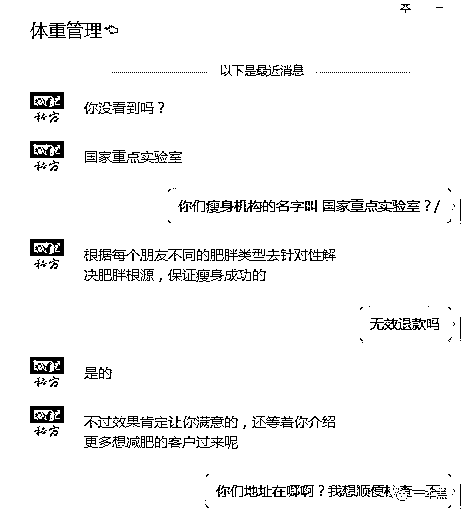

# 百度壮阳药、微博减肥茶、闲鱼软色情，互联网硬核垃圾广告大赏

> 原文：[`mp.weixin.qq.com/s?__biz=MzU4ODAwNzUwMQ==&mid=2247485599&idx=1&sn=e75fa0ab48ab5f445acf6e4b5f8fe6a0&chksm=fde219bdca9590ab0d44876ecf15fc706834ee6db14e30a2256896f9f00ab4fde847daf9dab3&scene=27#wechat_redirect`](http://mp.weixin.qq.com/s?__biz=MzU4ODAwNzUwMQ==&mid=2247485599&idx=1&sn=e75fa0ab48ab5f445acf6e4b5f8fe6a0&chksm=fde219bdca9590ab0d44876ecf15fc706834ee6db14e30a2256896f9f00ab4fde847daf9dab3&scene=27#wechat_redirect)

【黑话连篇】

该栏目更多的是揭露事件或对事件的看法，以达到让人精神得到升华的目的。

“

硬核广告谁家强？

椰树椰汁？nonono；

铂爵旅拍？非也非也；

脑白金？大错特错。

最硬核的自然是互联网公司啦，微博减肥茶、百度壮阳药，有需要的吗？朋友。

**01** **百度壮阳药**

百度上搜养肾，页面底端能看到几条小广告。经查询这三家公司法人代表都为同一人，注册时间从 2019 年的 3 月到 2019 年的 5 月不等。

点开链接是做测试推老师的套路，我测了三次，结果给我推荐的都是同一个老师 。

加了微信，刚通过就问我是太小、太短还是太软。这怎么聊的下去，太侮辱人了。

但是不能不聊，于是我只得和她说我想更大、更强、更持久。但是对方根本不顾及我作为男人的尊严，继续用一些羞耻的问题折磨我的神经。

 

在我即将崩溃的边缘，她终于对我的病下了定论：我不行，我肾亏。

对方说她是一家百年中医馆的执业医师，并出示了她的医师执照。但是好巧哦，我一打开百度就搜到了证书模板，连发证日期和证书编码都一模一样呢。

我假装天真地和她说，我有个朋友和她同名，都叫秦玲（后文称她为秦医生）。秦医生回答说她的名字太大众化了，哪都能碰到一样的，真是有缘。

紧接着秦医生说，她为了量身定做了一款由 77 味名贵中草药制成的中药膏，能够有效治疗我的肾，帮我重振男性雄风。

我问能给我药方吗？秦医生说这是医院的机密， 不能外传。

我说想去医院检查一下再决定是否吃药，秦医生说普通医院的仪器根本无法检测出我的问题，甚至会让我的 X 能力出现障碍，建议我直接吃药，效力强又不伤身。

按照我目前的情况，需要服药两个疗程，共 40 天。一个疗程 1000 块左右，问我是先交定金还是付全款。

可是秦医生她们公司是做医疗器械销售的啊，怎么还卖起了中药？这谁顶得住啊。

于是我和秦医生说我下周要去西安出差，想去他们院做个检查到时候现场拿药，秦医生很大方地给我发来了下面的地址。

地图显示那个地址的确有家医院，但却不是秦医生所在的百年名医馆呢。这是怎么回事呢？

哦豁，我太太喊我恰饭了。

再见啊。

**02 ****微博减肥茶**

说起来就气，前两天我刷微博的时候，系统居然给我推荐了增高和减肥的广告。我看起来像是需要这两样服务的人吗？这不是瞧不起人吗？大数据和 AI 算法到底是干什么吃的？

但是气归气，气完了还是得去看看这到底是些什么东西，增高是用不上了，我去看看减肥药吧。

点开链接，还是让我做测试，填了年纪、身高、饮食、生活习惯等资料，但是测完之后并没有建议和结果，只给我推荐了一个老师的微信号码。

添加微信之后，老师又问了我年纪、性别和身高、体重，一一回答之后又问了饮食习惯和体重可能上升的空间。

我思考了三分钟，说不知道。

但是这丝毫不影响老师的诊断，老师在了解我的情况之后就给我推荐了他们店里的一款瘦身汤。一包看起来像泡脚药包的东西。

我问老师主要成分是什么？她说是对身体好的成分。在我的持续追问之下，老师和我说，这是纯草本配方哦，很温和的。

我说我想知道成分，她说不会拿我的身体开玩笑，让我相信她。

我说不，我不信。

老师说我应该信，因为这个配方是为我量身定做的，里面有首乌、菏泽以及茯苓，能够从源头帮我调整身体，溶解脂肪，让我变成易瘦体质，一次减肥，永不反弹。

50 天就能轻松减掉 24 斤，甚至不需要节食运动，忌口就行。

从肥仔到靓仔，只要不吃萝卜和海带。

50 天的价格是 980，老师问我先给定金还是直接付全款。我说有些担心，想了解清楚再决定，于是老师给我发了深圳北大研究院某国家重点实验室的地址。

我问老师他们的机构就叫国家重点实验室吗？她有点生气，反问我是不是看不见。然后又给我发了一遍地址，这次是肿瘤化学基因组学国家重点实验室。

？？？？我就买个减肥药，咋还和肿瘤科扯上关系了。老师让我莫慌，她们那既有瘦身的，还有肿瘤科呢，非常专业的哦。

我问老师这是医院的配方吗？她说这是她们的秘方。

当我说我离她们实验室很近，想要自己上门取货的时候，老师又说她们店不在那，仓库也不在那。去了找不到人，让我给地址发快递就好了。

但是我坚持要先做检查再买药，老师又生气了，她觉得我在浪费她时间。

我说我就要做检查，我关心自己的身体。老师怒了，她说我的肥胖根本就不严重，做个毛的检查。到底要不要减肥，要减肥就把地址发她。

老师说她每天要发很多快递，没精力指导我。我对她的服务态度很不满意，因为她凶我。我买个药居然凶我。但她说自己只是实话实说而已，态度没有哪里不对。

嚣张得很呐。

这是要逼我出绝招呐。

**“我付钱，我检查付钱的。”**

老师说：**“那好吧，那你自己导航过来哦。”**

于是她又给我发了一个地址。一个距离肿瘤实验室 19 公里的一家美容养生馆。但她坚持以快递的形式给我发货，理由是，要对全国所有想要减肥的兄弟姊妹们负责。

感情我上门自提还是不负责任的行为？？？

我问这个产品有没有包装、说明书和批号，老师回答我这个瘦身汤绝对没有副作用。

“先交定金还是付全款啊？”

“老师给你配好药，你一会过来检查完就能直接发货了哦。”

“你人呢？怎么不回复老师呢？”

“？？？”

我，我不想减肥了，谢谢，老师再见。

**03** **闲鱼软色情**

由于平常有健身的习惯，器械越买越多，用不上的就会在闲鱼转手。照例打开鱼塘，看看最近大家都在聊些什么。翻了翻，感觉不太对劲，结果越翻越不对劲。

不是二手平台吗？鱼塘不是兴趣交流区吗？怎么全是性感美女的视频，还都带着那么些暗示的气息。虽然健身都是穿紧身运动衣，但。。。这 TM 有点过火了。

拍摄的角度有点偏，动作有点 emmmm 过分狂野，文案配的有点歧义。

点开发布者的信息，居然是一个卖莆田鞋的？现在卖东西都要用这种手段了吗？二手平台卖新货，也不是不可以；卖高仿也不是不行，但是打色情擦边球就有点过分了。

整个健身区都是一水的清凉美女视频。而评论区除了开黄腔的、围观的、骂娘的还有公然卖片的。

那些健身、舞蹈视频的来源不清晰，或许是朋友圈，或许是健身房偷拍，或许是淘宝评论区，或者其它来源，但有一个共同点：视频主角都不是发布者本人。

时间再往前推一个月，我还曾在闲鱼搜到过原味丝袜以及不能明说的服务项目。或许近期有整顿，原味已经被和谐了，但是卖片的更加明目张胆了。

除了卖片，我还在闲鱼找到了医疗手术视频、上古神兽、徒手整容宝典等奇奇怪怪的东西。

要是你去闲鱼逛逛，你会发现这个二手买卖平台变味了，它似乎正在向 P 站看齐。

不，P 站现在可以学高数了，它们还是不一样的。

**04** **黑五类广告的锅谁来背**

不只是这些平台，趣头条、今日头条等各类资讯平台的上的广告更加没底线。除了购物平台，这类广告都是以信息流的方式展示（也就是竞价广告）。

百度的竞价广告开户只需要 7000 块（6000 块预存费用+1000 服务费），排名越靠前，收费越贵，具体按点击次数收费。

根据一家微博广告代理商透露，在微博发布竞价广告只要需要预存 10000，连明令禁止的减肥类广告都可以投放。

但是这些广告都进行了伪装，单从文案看，并不能直接定性是黑五类，但是文章中都会出现微信号。

等你加了微信之后，套路就开始了。各种三无减肥茶、壮阳药、菠菜，甚至增高秘术都来了。

他们的套路还都是一样的，除本配方/医院以外，其他人都无法治愈你的病症，甚至连检查都做不了，即使是三级甲等医院。

要是你问他配方是什么，都会说保密，但疗效极佳。要是你问他机构叫什么，一定答：**专业/百年名店。**

想要投诉这类广告？哦，对不起没有这个选项。

当我打开壮阳药的链接，准备投诉的时候，从头到尾没有找到投诉的按钮，甚至网页连备案都没有。不过该公司的官网倒是写着有在江苏省备案，可惜，也查不到。

       

不过，不能投诉没关系啊，百度有网民权益保障计划啊。

前提是：你必须是百度的注册用户。一旦发生经济损失最多可以付一赔三，但是赔偿总金额不能超过 1 万。超过了也没关系，反正也不会给。

另外，

*因为涉黄、涉赌、非法产品/信息交易、违法网络兼职、商业信誉作弊等这类广告被骗的，不赔。*

*投资、理财、买文物被骗的，不赔。*

*交易时没登录百度账户的，不赔。*

*超过 30 天申请赔偿的，不赔。*

*证据不足的，不赔。*

*（详情见百度网民权益保障计划服务协议）*

而微博的处理就更谜了，微博的投诉理由里有虚假信息、时政相关、色情、谣言、隐私、人身攻击、冒用信息、抄袭、诈骗、垃圾信息，可就是没有虚假广告这个条款。即使举报成功了，也只是删除或者关闭微博处理。

用户在平台被骗只能自认倒霉。2018 年底，微博发布公告：头部账号发广告需备案和审核。可是，你见过刘亦菲发增高药、鹿晗推壮阳丸吗？哪个大 V 会明目张胆发诈骗、虚假广告呢？

难道这样就不需要审核了吗？

根据《互联网广告管理暂行办法》药品、保健品、医疗器械、烟草等广告是必须经过审核才能发布的，然而现实并非如此。

你说，黑五类广告的泛滥究竟是因为平台审核不严还是广告主太狡诈呢？

* * *

如此硬核的互联网广告，并非今天才有，从人类有欲望开始，从互联网诞生开始，它们就一直存在着，也将继续存在，但这不是平台不作为甚至容忍的理由。

在互联网广告法愈加完善与严厉的今天，黑五类广告依然横行，各个平台的广告审核机制，是否也应该与时俱进一下呢？

赚钱固然重要，底线也别丢。

还原事实｜专扒黑产

微信 ID：darkinsider

知乎 一本黑

微博 一本黑 007

投稿、爆料、招聘、转载

请联系微信：chenchen_1994061