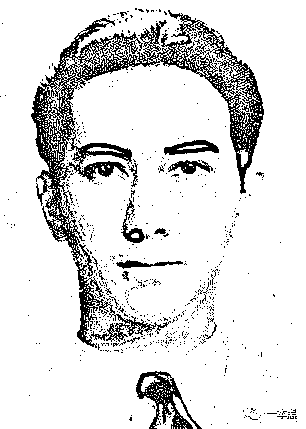
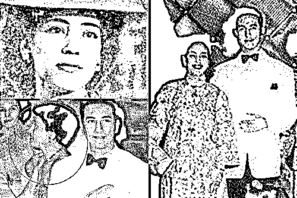
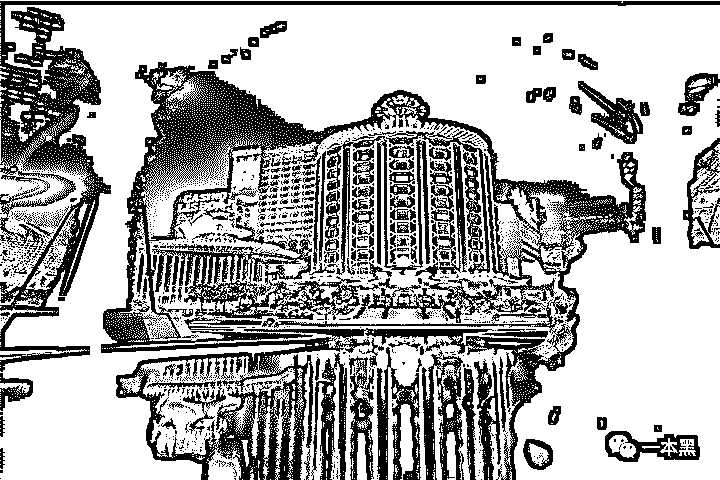
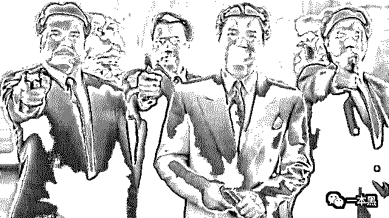
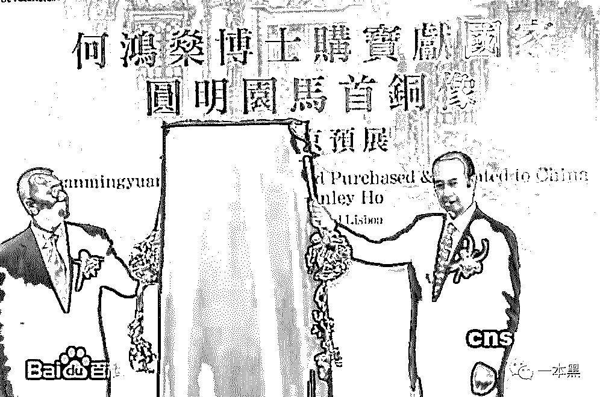
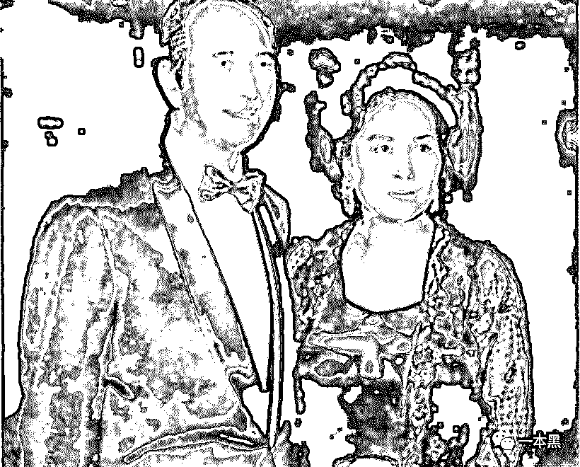
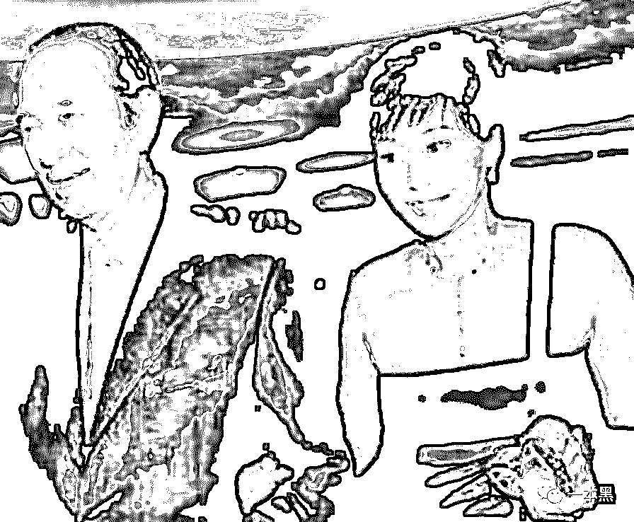
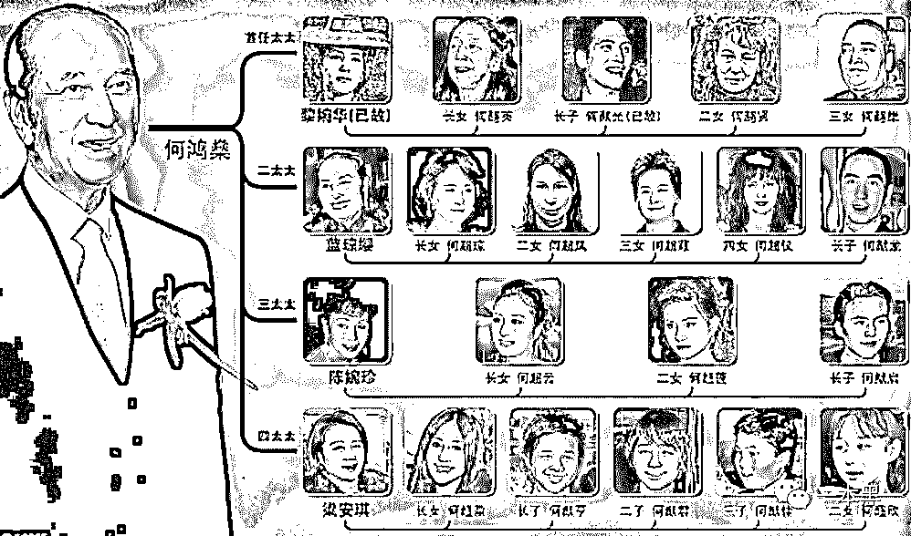

# 躲暗杀、怼黑帮、战海盗：风流赌王是如何炼成的？

> 原文：[`mp.weixin.qq.com/s?__biz=MzU4ODAwNzUwMQ==&mid=2247485569&idx=1&sn=87d7a9e55232f0546b86797796784e79&chksm=fde219a3ca9590b564dd28e6d0e6371c6b98ff3f68e0a6d8cc59563ae2d4c508b0e221aca157&scene=27#wechat_redirect`](http://mp.weixin.qq.com/s?__biz=MzU4ODAwNzUwMQ==&mid=2247485569&idx=1&sn=87d7a9e55232f0546b86797796784e79&chksm=fde219a3ca9590b564dd28e6d0e6371c6b98ff3f68e0a6d8cc59563ae2d4c508b0e221aca157&scene=27#wechat_redirect)

**【今日人物】**

该栏目主要讲述人物背后的故事，这里有他们一步一步走过的鲜活日子。

* * *

前不久，很多人的手机都被博彩信息轰炸了，**“打开 iMessage，你就得到了整个澳门”**。  

而何猷君求婚奚梦瑶一事，也让不少人感慨：豪门又“扩招”了。

甭管是澳门博彩，还是豪门扩招，背后都离不开一个核心人物。

**出生富贵却遭家道中落，先后入义勇军，战海盗，怼黑帮，开赌场，躲暗杀，共拥有四房太太，17 名子女。**

**晚年，却因家产纷争，屡屡被推上舆论的风口，甚至将最宠爱的女儿告上法庭。**

他，就是一代传奇赌王——何鸿燊。

**01 ****天生异象，非凡之子**

1921 年 11 月 25 日，港英政府时代的香港四大家族之首——何东家族，降生了一名男婴。

据传，**这名男婴出生时，胎盘为白色，而在香港，白色胎盘是帝王的象征。**

当然，放在现在来看，这是一种叫“胎盘白色梗阻”的病，不过这是后话了。

何世光老爷喜出望外，决心要给他起一个好名字，于是请来了一位算命先生。

算命先生看后，说这个孩子天生聪颖，深受祖辈荫庇，有大富大贵的运势，且会拥有不计其数的女人，但命中多金需适度克制，按五行相克来讲，名字中需带火。

而按照族谱，这名男婴属于“鸿”字辈，为避免水火不容等不良命势，算命先生写下了一个“燊”字，取“兴旺”之意。

何鸿燊是四国混血儿，有着犹太、荷兰、中国、英国四个国家的血统，浓眉大眼，外表相当帅气，放在现在，绝对是“少女心收割机”。

（青年何鸿燊：图片来源于网络）

时年，恰逢何世光当选为香港华商会主席，便送给小儿子何鸿燊一幢海景别墅，以示庆祝，彰显富贵。

何鸿燊 10 岁进入香港著名的皇仁书院读书，也许是富裕的家境让他毫无危机感可言，何鸿燊的成绩连续多次排在倒数，最后，只得被安排进了成绩最差的 D 班。

在这个钟鸣鼎食之家，若家业平顺，无心学习倒也不妨事儿。

可是，命运最喜欢跟人开玩笑。

**02 ****家道中落，学渣逆袭**

1934 年，何世光炒股失利，一夜之间，倾家荡产，负债累累，只得逃往越南躲债，往日风光的妻子也要靠替人做工，才能维持生计。

家境突遭变故，13 岁的何鸿燊首次尝到人情冷暖。

有一次，何鸿燊患了蛀牙，都说牙疼不是病，疼起来要人命，万般无奈之下，何鸿燊求助于一位当牙医的亲戚，谁知却只得到一句：“没钱还补什么牙，拔掉算了”。

想到母亲和自己这些日子所遭受的冷眼和嘲笑，何鸿燊痛下决心，要发奋读书。

一改往日的散漫，何鸿燊开始勤学苦读，成绩突飞猛进，在期末考试时已排名第一，获得校奖学金，**开创了皇仁书院 D 班学生荣获奖学金的记录**。

后来，何鸿燊顺利考入香港大学理学院，把所有的时间都用来学习，烦闷时会找学校的神父聊天，到大二时，何鸿燊的成绩在理学院名列前茅，生活逐渐平稳安定下来。

可是，命运再次跟他开了一个玩笑。

随着抗战全面爆发，1941 年底，日军大举进攻香港，大学停课，学生全部参加义勇军，何鸿燊也被安排在防空警报室做接线生，虽然只做了短短十几天，但这期间，何鸿燊结识了英籍日商斋藤，何鸿燊的胆大心细，给斋藤留下了很深的印象。

在斋藤的帮助下，**何鸿燊带着做接线生所获得的 10 元港币，以难民的身份前往澳门避难。**

仅仅 17 天，香港便失守了。

**03 ****澳门掘金，突遇爱情**

对于何鸿燊来说，澳门是块福地。

来到澳门后，在斋藤的邀请下，何鸿燊进入澳门联昌公司，担任秘书一职。

据说，何鸿燊记忆力超群，澳门当时的 2000 多个电话号码，他可以倒背如流，颜值加才华，让何鸿燊很快上升为公司的合伙人，并立下汗马功劳。

如日中天的何鸿燊，在命运的安排下，邂逅了“澳门第一美人”黎婉华，第一眼看到她，何鸿燊的心就被丘比特之箭射中了。

为追求黎婉华，何鸿燊主动创造机会，多次与黎婉华见面，最终，何鸿燊的踏实认真打动了黎婉华，有情人终成眷属。

（图片来源于网络）

婚后，何鸿燊把眼光放的更加长远，他想要拥有更好的生活。

由于澳门的地理位置独特，战争期间，走私兴起，一种叫做“押船”的生意火了起来，也就是把货物运到海上，在海上完成钱货交易。

押船虽然收入高，但完全是在刀尖上挣钱，天灾、人祸，都可能丧命，但何鸿燊深知风险与机遇并存，毅然决然的开始“押船”。

除了海啸等自然风险外，由于当时公海被日军封锁，何鸿燊在“押船”时，曾多次遭遇日军盘问、海盗抢劫，几次死里逃生。

一次，何鸿燊带着三十万元前去公海收货，到了约定时间，一艘船朝着何鸿燊所在方向开过来，还未靠近，何鸿燊就听到枪声 ，并看到船上一名船员摇晃几下后跌入海中，来不及反应，对方船只已经靠近，并举起了枪。

按照对方的要求，船上人员都举手抱头，尽数交出所带财物，何鸿燊在混乱之际，瞅准时机，让一名大计（船员）迅速开船，听到马达声响，对方持枪连续向何鸿燊所在船只射击，何鸿燊冷静的指挥继续开船。

刚远离这艘海盗船，还没松口气，日舰又朝着何鸿燊开过来，船上原本的太阳旗却被海盗扔了，若不悬挂太阳旗，很有可能会被日军格杀，危急之下，何鸿燊扯了个帘子，用红漆画了红圈，贴在窗上，待日舰靠近后，何鸿燊说起了日语，这才逃过一劫。

何鸿燊的出色表现，老板一一看在眼中，毫不吝啬地分了 100 万红利给他。

何鸿燊用这笔钱，独立创办了澳门火水（煤油）公司，还投资购买了一艘载客数达 300 人的“佛山号”客轮。

煤油作为生活必需品，市场需求量很大，靠着这家公司，何鸿燊的财富开始有所积累。

日渐富有的何鸿燊，影响了原属于澳门一些地头蛇的既得利益，多次遭到威胁和恐吓，在夫人黎婉华的劝说下，何鸿燊带着 200 万携妻离开澳门，回到香港继续发展。

战后的香港，百废待兴，何鸿燊瞅准地产行业，与他人合资创办了利安建筑公司，承建多个商业和住宅项目，甚至是军方宿舍，俨然一位地产大亨。

没几年功夫，何鸿燊的资产已经达到 1000 万，富豪榜上有名，但何鸿燊并未安于当下，而是把目光再次转向了澳门。

**04 ****重回澳门，跨入赌业**

从 1930 年开始，澳门一直实行赌业专营制度，政府只发放一张赌牌，赌博行业由持牌人垄断。

而到了 1961 年，葡萄牙政府将博彩业列为澳门经济发展的支柱产业，时任澳督的马济时，开始积极整顿澳门博彩业，试图以引入财团的方式，打破垄断现状。

在政策的支持下，何鸿燊接受邀请，与叶汉、霍英东、叶德利结成联盟，最终，以 17000 澳元的优势，拿到了澳门博彩业经营权。

**万事开头难，谁能想到，后面更难。**

政策的开放，并不意味着原有掌握赌业的人愿意放手，如此暴利的行业，怎能轻易容外来人插手？

仗着多年来在葡萄牙和澳门培养起来的势力，原有垄断澳门博彩行业的家族，视何鸿燊为眼中钉，誓要阻断其开设赌场的路。

旧垄断家族从场地入手，在威胁恐吓下，全澳门无人敢租场地给何鸿燊，最后，只得澳门政府出面，将爱都酒店以政府物业的形式租给何鸿燊，这才解决了场地问题，赌场得以顺利开业。

开业时，何鸿燊大摆宴席，谁知却只有寥寥几个西洋人出现，其他人都怕遭报复而不敢参加，但何鸿燊毫不介意，他认为只要能开业，就是个好的开始。

**眼看一计失败，旧垄断家族又生一计。**

他们雇佣百十来个乞丐，围坐在何鸿燊的赌场门口，这阵势，让想上门的赌客都自行折返了，何鸿燊以其人之道还治其人之身，同样用钱请走了这群乞丐，轻松化解了这一难题。

连续两次的失败，让旧垄断家族气急败坏，他们索性将往返于澳门至香港的轮船全部停航，让香港赌客无法来到澳门。

要知道，当时澳门赌场的客源，大多来自于香港，而要从香港到澳门，只能靠这一条水路。

没有客源，这让何鸿燊坐不住了，他只得拿出自己当初投资购买的那条“佛山号”客轮，又加急从伦敦购买了另一条船，每日不间断的往返于港澳之间，勉强可以维持。

就这样过了一年多，旧垄断家族没有看到何鸿燊有任何退缩，便再次尝试从政治层面遏制何鸿燊。

他们借助于在葡萄牙政府内部的影响力，直接干涉澳门当局，对何鸿燊百般阻扰，何鸿燊为打破这一困局，六飞葡萄牙，终于如愿签到了赌牌。

这时候，何鸿燊收到了旧垄断家族发出的“八大威胁”，第一条就是：**取何鸿燊性命。**

面对致命威胁，何鸿燊选择见招拆招。

出价 100 万，并放出风声：“**如果我被打死，48 小时内，谁能把凶手杀死，这 100 万就归他所有，可到我的律师处支取**”。

在被威胁赌场要投掷手榴弹时，何鸿燊毫不示弱：“**你投一个，我回敬一个；****你投一对，我还一双。**”

就这样，在 1962 年，在冲破了旧垄断家族一次次的阻挠之后，何鸿燊终于成立了澳门旅游娱乐有限公司（简称澳娱），生意兴隆，客源不断。

1976 年，出于扩张考虑，何鸿燊在往来珠海和澳门的新口岸附近，兴建了一幢集商城、娱乐、餐饮和住宿于一体的综合性酒店——**葡京酒店**。

（图片来源于网络）

酒店落成后，立即成为了澳门的新地标，并一度成为旅行团必打卡地之一。

在何鸿燊的管理下，葡京酒店以艳舞招揽赌客，同时，变更了之前贴士（赌场小费）归赌场所有的规矩，将 70%的贴士按一定标准分给赌场工作人员，这样的做法，使得赌场工作成为人人争抢的“金饭碗”。

**长达几十年的时间里，澳门有近三分之一的人，都直接或间接受益于何鸿燊的公司。**

因此，他也被澳门人亲切的称为“米饭班主”。

**05 ****热衷公益，从不沾赌**

上世纪 90 年代是港片最辉煌的时候，众多港片中的赌王形象，都是以何鸿燊为原型，例如《赌城大亨》中，刘德华饰演的角色，便是影射何鸿燊。

（《赌城大亨》剧照：图片来源于网络）

然而，虽被称为赌王，但何鸿燊却从不沾赌。

相反，他还经常劝别人，应当把赌博看做是一种休闲娱乐， 千万不要过分赌。

叱咤赌场数十载的何鸿燊，早已见惯了因赌博而倾家荡产的事情，他非常认同“十赌九输”这个说法，在一次采访中，何鸿燊说到：

“你永远赢不过赌场的，因为我们是抽水的，我没那么笨，不会去赌一份的。”

赌王不赌，而是热衷于做公益。

何鸿燊参与支持澳门各项旅游、文化等活动，积极推广澳门独有的中西文化。

2003 年，圆明园猪首铜像在美国被寻访到，在积极争取后，何鸿燊以 600 多万元将猪首铜像购回；

2007 年，何鸿燊以 6910 万港币的价格，买下“八国联军-圆明园遗物”马首铜像，将其捐赠给国家。

（图片来源于网络）

2008 年汶川地震，何鸿燊捐赠 1000 万港币用于赈灾。

**06 ****家产纷争：****“四房十七杰”**

何鸿燊一生风流倜傥，有四位太太和 17 个孩子，被称为“四房十七杰”。

**原配夫人黎婉华**，是何鸿燊能够在澳门取得成功的一个重要因素，育有一子三女，可惜天妒红颜。

1957 年，黎婉华突患结肠炎，何鸿燊遍寻名医无果，由于并发症，最后只得切除胃部，靠流质食物为生，体重锐减至 31 公斤；

1973 年，黎婉华在葡萄牙遭遇车祸，脑部遭受重创，行动困难；

1981 年，黎婉华唯一的儿子因车祸身亡，痛失儿子的黎婉华一蹶不振，于 2004 年去世。

与黎婉华的身体状况相反，何鸿燊的事业蒸蒸日上，因忙于应酬而经常出入社交场合，认识了时年 14 岁的伴舞蓝琼缨。

1957 年，港澳地区还在施行数法并用，大清律令仍然生效，正是依据当时社会对纳妾的认同，何鸿燊正式将**蓝琼缨纳为二太**。

（何鸿燊和蓝琼缨：图片来源于网络）

蓝琼缨育有四女一子，长女何超琼头脑聪颖，深受何鸿燊喜爱，在 2015 年被福布斯评为香港女首富，小儿子何猷龙也深得何鸿燊赏识。

**三太陈婉珍**，是何鸿燊原配黎婉华的贴身看护，有传言称陈婉珍是在黎婉华的授意下，刻意接近何鸿燊，目的是削弱二太势力，真正缘由不便深究，实际情况是：1985 年，何鸿燊委托二太前往加拿大处理生意事项，在此期间，他为陈婉珍购入两套房产，此举确认了陈婉珍的“三太”位置。

（何鸿燊和陈婉珍：图片来源于网络）

三太先后为何鸿燊生下一女和一对龙凤胎，这让何鸿燊非常高兴，但幸福总是短暂的。

很快，何鸿燊有了**四太梁安琪**，她不但年轻貌美，还接连生下 3 子 2 女，这让高龄的赌王非常满意。

（何鸿燊和梁安琪：图片来源于网络）

都说家和万事兴，但豪门多恩怨，赌王身边这四个女人，个个都是厉害角色，加之十多个子女，这一大家族，可谓是“热闹非凡”。

（赌王家族表：图片来源于网络）

曾经叱咤澳门赌博行业的何鸿燊，估计怎么也想不到自己有一天会因为家产争夺战，而一次次成为舆论的焦点。

**何鸿燊 20 岁独闯澳门，一路发展到垄断澳门博彩业 40 年，旗下产业还涉及船务、地产、银行等，投资范围覆盖加拿大、越南等国，从怀揣 10 元港币，到坐拥 5000 亿港币，何鸿燊华丽的完成了自己的人生逆袭，却也为日后埋下了隐患。**

四房各怀心思，堪称现实版的《宫心计》，一次次引人瞩目的家产争夺报道，令外界震惊，何鸿燊曾在三段录像中，公开称自己**“像被抢劫了”，被“强迫签了很多协议”**。

所以当奚梦瑶接受何猷君求婚时，外界才会有评论指出这是豪门扩招，人人都在为争夺家产而摩拳擦掌，结婚、怀孕都是最好的方式。

家家有本难念的经，这里不做细讲，毕竟别人的家事，对外人来说，只是饭后谈资而已。

**THE END**

纵然赌王已经年迈，但他的一生颇具传奇色彩，不服输，不相信运气，不依赖家庭，靠自己的努力完成逆袭，走上人生巅峰。

虽然成功不能复制，却可以给人以思考。

比如：赌王都不赌，你赌什么？

**参考资料：**

*   纪实档案——豪门秘事：何鸿燊

*   ### 《澳门赌王:何鸿燊全传》，刘屹松

*   《何鸿燊：不赌就是赢》，刘志则，曹俊，吴琦

还原事实｜专扒黑产

微信 ID：darkinsider

知乎 一本黑

微博 一本黑 007

投稿、爆料、招聘、转载

请联系微信：chenchen_19940612