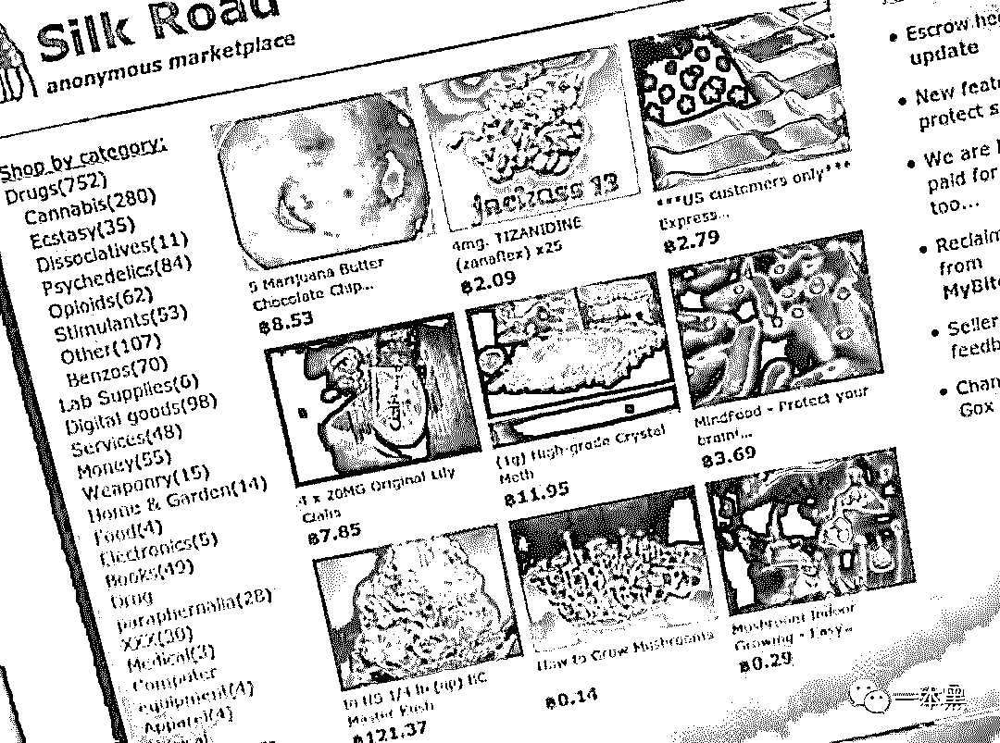
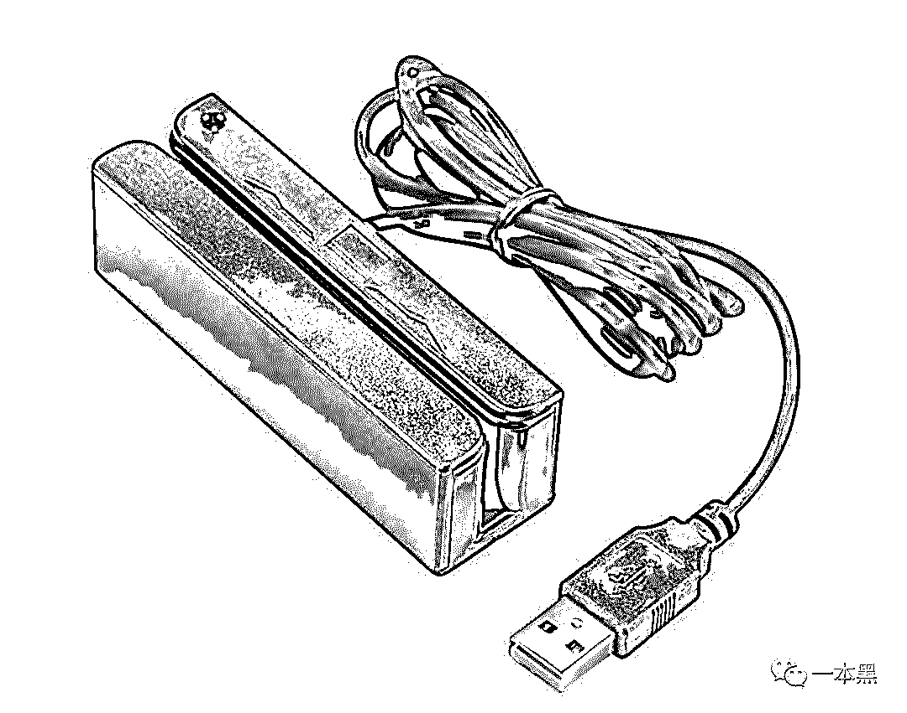
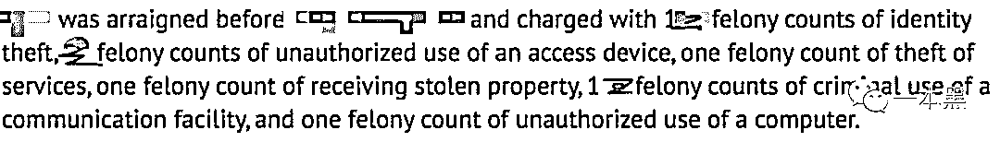
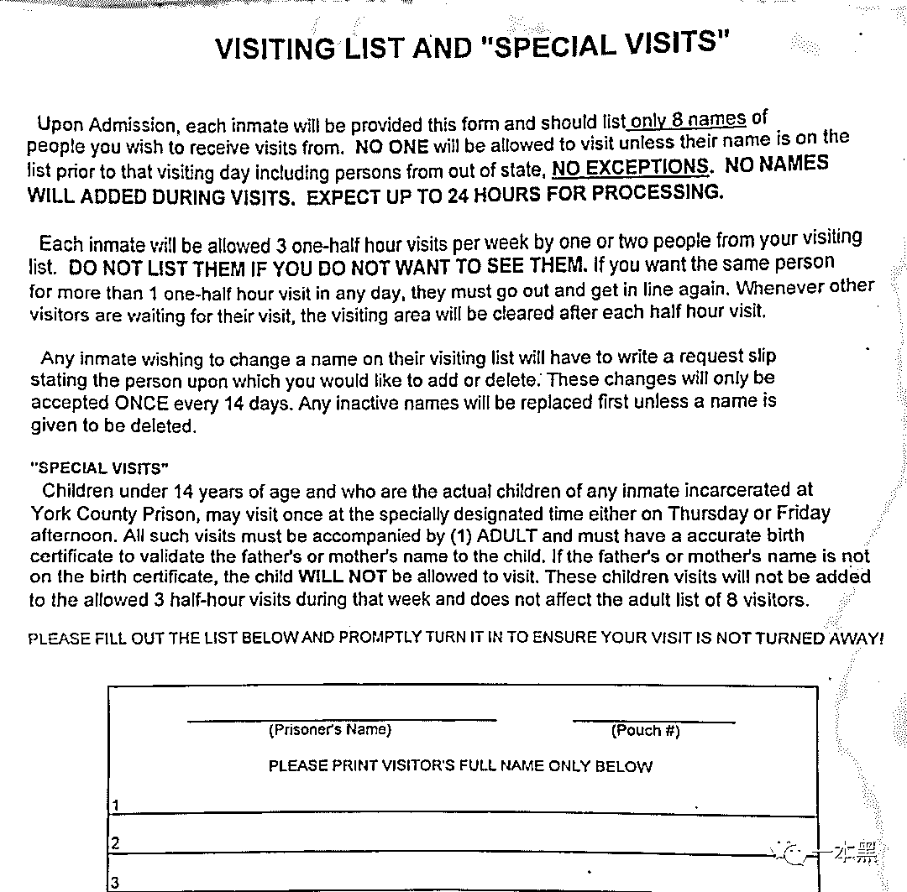
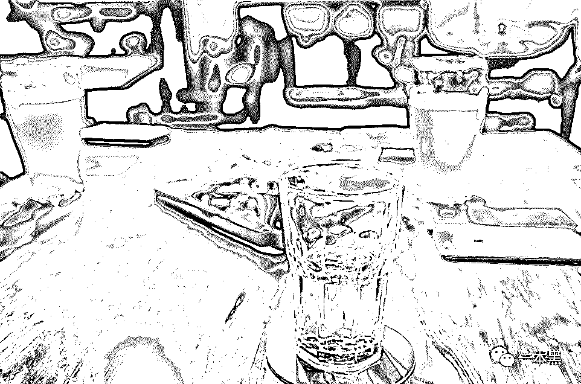

# 暗网卖大麻、国外搞盗刷，21 岁少年犯罪被捕入狱事件

> 原文：[`mp.weixin.qq.com/s?__biz=MzU4ODAwNzUwMQ==&mid=2247485564&idx=1&sn=f788fb5b65ac63fb0d1d67cce0035422&chksm=fde2195eca959048beba9c305b58be9bc1c1f9c5d792e0b5d55ed7c9f886551c7af615d17801&scene=27#wechat_redirect`](http://mp.weixin.qq.com/s?__biz=MzU4ODAwNzUwMQ==&mid=2247485564&idx=1&sn=f788fb5b65ac63fb0d1d67cce0035422&chksm=fde2195eca959048beba9c305b58be9bc1c1f9c5d792e0b5d55ed7c9f886551c7af615d17801&scene=27#wechat_redirect)

**【地下职业】**

该栏目主要讲述大众看不到的职业故事、人生经历，与黑暗有关、与欲望有关、与人性有关。

* * *

“黑灰产这一行不是看谁干得有多暴利，而是看谁能带着钱安全退出，这是最关键的。但其实这他妈都是扯淡，我见过太多人兜里几千万，还想着要上亿的。”

这段话出自一个曾经的犯罪少年之口，他叫谢成亮。

应受访者要求，此为化名。从在美国留学接触比特币起，谢成亮就开始在暗网上进行一些违禁品的交易，其中就包括毒品买卖。

在暗网上非法赚到一些钱后，谢成亮为寻找刺激，又开始研究银行卡盗刷和 iPhone 改串盗刷，这期间为学盗刷技术被不少人骗过，也让他从中体会到世间的常态孤独。

在赚到钱的一段时间里，他的欲望变得越来越大，也变得越来越焦虑。

他每天暴饮暴食、生活不规律，喝酒抽大麻，各种昏天黑地，几乎达到疯狂的状态。他甚至会在凌晨两三点抽完大麻在公路上飙车，把油门踩到底，那时候他就在想我他妈死了算了。

说起被捕入狱的原因很可笑，是因为一项很简单的罪名被美国联邦政府给盯上。被抓当天来了三辆警车，15 个警察全副武装持枪进入谢成亮所住的公寓。

他被告知有 300 多条指控，但当时他并没有觉得恐慌，反而很平静，因为他觉得终于可以不用再干这些偷鸡摸狗的事了，这是一种解脱。

出狱后，谢成亮联系上我，希望把自己从接触黑产到最后被捕的经历说出来，用自己的变化和感悟告诫大家：**这个社会真的有很多“摄像头”，干了坏事还想跑，肯定是跑不掉的。**

我们用电话聊了三个多小时，又线下约见了一面。以下，我会用谢成亮口述的视角去讲述他的经历。

*（这段录音是整个采访中谢成亮的一些感悟，希望能给你带来思考。）*

01

从时差上来说，中美时差，一般是指北京时间和美国东部或西部时间的时差，中国比美国快 12 个小时。

和大多数中国家庭不一样的是，我高中开始就到国外留学。也正是这段经历，让我接触了不一样的圈子。

那会有个同学给我说，你可以看看比特币，这可能是未来的发展动向，基于兴趣，我逛了很多网站，开始频繁了解。

当时还准备了一台 Mac 电脑尝试着去挖，还没挖够一个就扔掉了，可能是由于当时比特币的价值不是很大，我也就没再去管这事儿。

后来比特币慢慢发展起来，开始闹得沸沸扬扬，我又开始研究一些比特币相关的东西，当时最大的疑惑就是这东西到底能干嘛！

听说能进暗网买一些违禁品，枪支弹药、杀人卖淫什么的，反正乱七八糟的，传得也很妖魔，但却很吸引我。

因为英文比较好，这对我研究暗网有天然的优势，那时候经常混迹 dream market 和丝绸之路之类的网站。

*（多年前的暗网，图片来源于公开网络）*  

众所周知的是，在美国有很多人抽大麻，而且美国管得也不是特别严。当时接触暗网后，着实被深深地吸引住了，这他妈简直就是另一个世界。

**黑暗暴利的东西看多了，自然会被里面的利益牵着走**，所以后来就慢慢开始在暗网上进行大麻买卖，除了想从中赚些钱外，更多的是寻找刺激。

大麻这东西，如果只是做二道贩子的话，中间的利润并不高，我当时在暗网上差不多 200 美金一盎司买入，再以 400 美金的价格卖出，中间差不多能赚一半。

但有些人为了追求更高的利润，他们会选择自己种。一颗大麻种子在美国市场上大概是 30-100 人民币，种植周期大概在 XX 个月，成熟后卖出能赚 300-1000 美金。

在美国，某些地区已经将大麻种植合法化，但前提是能拿到种植许可证，并且种植的数量有一定限制，超过这个限制就会被判刑。

在暗网上做大麻交易的模式其实和国内的电商交易差不多，最大的区别就是他能做到匿名交易，也就是买卖双方都不知道对方的身份。

一般卖家会用真空包装袋包着，外面裹一层金属的锡纸，然后塞到一个杯子或者玩具之类的东西里进行全美邮寄。

除此之外，有些人为了更安全，从来不走快递，而是靠人工运输，比如约定一个地点，把货藏好，过段时间别人来取。

这是我接触比特币和暗网后的第一次正式违法，后来不做的原因是我觉得毒品这东西我已经玩过了，没什么新鲜感。

我这人，比较喜欢刺激的东西。

当时做大麻交易的我其实还是很有原则的，我不会去害别人。如果你是第一次尝试毒品，我是坚决不会卖给你的。而且我只做软性毒品，也就是前面所说的大麻，其他化学毒品比如可卡因、海洛因我是不会碰也不会进行买卖的。

总的来说，当时卖毒品主要是为了满足自己的好奇心和自己的日常生活需求，算下来赚得也不多，大概几万美金。

但也就是从这个阶段开始，**我踏上了黑灰产这条路，我的欲望开始膨胀**，接下来的生活也因此发生了天翻地覆的改变。

02

当时在暗网上进行毒品交易的谢成亮仅 20 岁不到。因为好奇心使他一步步接触这些黑暗暴利的东西，一方面他觉得来钱快刺激，另一方面也在他心底埋下了一颗想要一蹴而就的种子。

**正是这颗想要一蹴而就的种子，随着时间的改变，把他推到了风口浪尖。**

结束暗网上的毒品买卖后，我开始研究银行卡盗刷。新奇的东西让我疯狂，在国外的一些论坛里，我看了很多相关的帖子。

不过为学盗刷技术也被骗了很多钱，交了很多智商税，把我在暗网上卖大麻赚的钱都给骗走了。但我不在乎，我觉得这是入门的第一步。

虽然被骗了不少钱，可我依然没有停下来！这他妈就像赌博一样，牌桌上都输了那么多钱了，谁甘心就这样离场呢！这在心理学上叫沉没成本。

后来算是运气好，遇到一个俄罗斯的哥们，他在 ICQ 上问我是不是想学技术，我当时想又他妈想来骗我，这次我是不会再花钱交智商税了。

但不知道为什么，这哥们说可以先教我一部分，如果我愿意学且觉得还不错的话可以继续教我。当时犹豫了一下觉得反正不用先给钱，那就试试呗。

后来还真学到一些真东西，他给我对接了买刷卡机和白卡的渠道，教我一些理论知识，卡上有哪些信息，这些信息都是干什么的，还教我怎么识别什么样的卡里钱最多且容易破解等等。

我记得当时一个料需要 20 美金左右，贵一点的需要一百美金。但是这些料质量都不太好，制作好后经常刷不出来。

很多卖料的平台现在基本都倒闭了，要不就是做不下去，要不就是被抓。

另外需要说的是，在美国的餐馆消费，所有的结账基本都是三种方式，现金、信用卡、或者储蓄卡，就不像中国那么方便有二维码付款。

也正是这一点给盗刷行业提供了存在的可能性。

**有些餐馆里的人明面上做着正当的生意，其实背地里也干些偷鸡摸狗的事。**

他们在结账的时候会把客人的信用卡带走，拿到前台去刷，刷完你正常的消费金额后，再使用特殊的机器刷一遍，把你的磁条信息给记录下来。

磁条信息记录下来后，他们会把信息复制到事先准备好的白卡上，然后再把白卡印一些图案伪装成一张正常的卡。

之后随便找一个高端店去购买一个比较贵的东西，把东西买回家后再低价卖掉。在美国，一般情况下的盗刷都是以这种形式来运作的。

**这个行业有个规矩就是一张卡只刷一次，但也有些不怕死的，一张卡他妈的刷到爆，一点情面都不留，太他妈凶残了。**

现在国外基本都是磁条，当然还有一种就是芯片，芯片就是卡里面保存着你的个人信息，可以联网，里面有个算法破解之后你才能真正把钱给取出来。

当时我做的只是磁条，芯片想要破解也可以，但是破解芯片的技术至少要 XX 万欧元一套。XX 万欧元对有些专门做盗刷的团队来说其实并不多，他们把这个技术买回来可能几天就可以刷出这么多钱。

但对我来说就不一样了，首先我是单枪匹马一人作战，付不起这么高的成本，再者是风险实在是太高了，容易被抓。

盗刷也很有历史了，不是什么新鲜事，十年前就有人开始做这个东西了，现在来说已经被做烂了。

**不过说白了搞盗刷就相当于你在人家口袋里偷钱一样，是一种很无耻的行为。**

在美国监狱，很多人都是因为盗刷被抓进来，基本都是集中在广州福建等地的人。他们疯狂到假如手里有十张卡，就会租一辆面包车去商场疯狂购物，专挑贵的买。如果刷不出来了，不好意思，明天再来。

刷到的东西直接往车里带，随后带走销赃。

他们会用一个假身份信息去租一个房子，然后这个地方就专门用来存放盗刷得来的各种商品，会有人专门负责把这些货给送走低价卖掉。

前几年大家会看到很多奢侈品，大打折扣，其实都他妈是这帮孙子给刷出来的。

后来这帮人是因为被 FBI 盯得太久所以最后被抓了。出来后这帮人再也没做过盗刷，开始去搞赌场、嫖娼之类的东西。

03

后来，谢成亮又开始接触 iPhone 改串和优步盗刷，那时候第一单他就赚了 200 美金，巨大的收益让他越来越兴奋。

有时候甚至可能一天 12 个小时呆在房间用手机刷优步的钱，但当这种越发疯狂的状态达到某个点的时候，他开始对自身产生一些反馈，和情绪有关、更和焦虑有关。

这一行不是看谁有多暴利，而是要看谁能带着钱安全退出，但其实这他妈都是扯淡，我见过太多人兜里有几千万，还他妈想着上亿的。

**我就觉得这人心啊，太他妈可怕了，欲望这东西真的可以无休无止。**

我当时也很疯狂，银行账户里有二三十万能随时花掉的美金，而且还是在我有五辆车的情况下。

做优步盗刷也让我看到了一些不一样的东西，我可以和很多人去聊天，然后偷窥别人的生活。我就觉得其实大家的生活都挺正常的，快不快乐这事和有钱没钱没多大关系。

我兜里有 50 万美金的时候我还是觉得不快乐，很没有安全感很焦虑，但我看别人他妈的兜里一千块都没有，每天照样活得很潇洒。

我看着这些人活得很开心我自己反而越来越焦虑，我不知道什么时候是个头。我搞黑产来钱这么快，我不知道以后该怎么办，我很怀疑自己的能力，如果不干黑产怎么在这个充满竞争的社会中存活下来。

所以那时候我每天暴饮暴食、生活不规律，每天喝酒抽大麻，各种昏天黑地的娱乐，几乎达到疯狂的状态。

我有时候会在凌晨两三点钟抽完大麻在公路上飙车，把油门踩到底，那时候就在想我他妈死了算了。

后来因为某些事情我开始刷 XXX 就被抓了，具体原因就不多说了。

被抓当天来了三辆警车，15 个警察全副武装，持枪冲进我家公寓，当时我就觉得这次肯定是玩完了。

被抓后我被告知有 300 多条指控，虽然被抓的那一刻我很慌张，但事后想想我竟然有些开心，因为我终于不用再干这些事儿了，终于解脱了。

**

*（谢成亮的指控书）*

后来我花三万块联系了个比较好的律师，律师跟我说因为我这是第一次犯罪，而且之前也没有什么重大犯罪记录，这个罪可以帮我争取到最优处理。

**最后法院没收我全部非法收入，另外罚款 5 万，有期徒刑判了两年。**

04

在监狱的两年，我思考了很多东西。

我就在想如果我 40 岁了还在监狱呆着，这辈子不就废了吗。

**

*（谢成亮所在监狱的探监表）*  

美国监狱里什么人都有，偷渡的、吸毒的，有些犯人的脾气很暴躁，会因为各种小事打架，比如我踩你一脚这种破事，别人可能上来就会给你一拳。

在美国监狱里，每天早上和中午会放一部电影，吃的有牛奶和水果，每周有固定时间可以运动打篮球，还有健身房可以健身。

你可以在里面打工挣钱，可以在里面消费，像个小社会一样。

美国监狱里最让我不能接受的是，里面的狱警可以什么也不做，天天看电视，一年就可以拿 20 万美金的年薪。

那时候我觉得自己也没给社会添加任何价值，如果出去后继续犯罪那肯定是不行的，早晚有一天一定会再进来。**我得找一条新的出路，去合法地赚钱。**

出狱后我找了份工作，做资产管理，目前还是实习阶段。

**

*（谢成亮出狱时个人财产归还表）*  

**比起在美国做黑产，我有很大的落差感**，因为做非法的买卖每个月能赚个几万美金，到现在实习期可能也就几千块的工资，这种落差感我想对谁来说都是会有的，但我在尽力适应。

**黑色产业这东西一旦你踏进一只脚，你可能还收得回来，但如果你两条腿全部踏进去，你的欲望就会越来越大，根本就很难停下来。**

其实说实话，做违法勾当这些人都是些目光短浅的人，他们只看到眼前的利益，并没有考虑到后果会是怎么样的。

当时我身上有 50 万美金的时候，我觉得在物质生活上我是不缺了，但我变得越来越不知道自己以后要干什么，我的精神是空虚的，我体会不到任何乐趣。

总的来说，这段经历让我学到很多东西，也体会到了巨大的落差感。我从做灰黑产赚到一点钱，到因钱带来的满足感，再到最后非常痛恨它。我开始认清一点，就是这个社会其实很多行业都在投机，无论是黑产、金融还是比特币。

被捕入狱这个教训对我来说是非常深刻的，但这个世界永远还是会有灰色地带，如果让我再选一次，这次，我想做个好人，坚决不会再去碰这些东西。

因为我体会到了陷进去的感觉，还好吃亏得比较早，我也醒悟得比较早。

**我可不想像监狱里的其他人一样三四十岁还在监狱里呆着。**

从高中接触比特币，再到暗网进行毒品交易，谢成亮慢慢被赚大钱的快感所侵蚀，并越陷越深，直到最后被捕入狱。

文章发布前一天，我和老师傅约谢成亮线下见了一面。

寸头、双肩包、T 恤、帆布鞋，挺干净的一个大男孩，如果不是他主动说起自己的故事，谁也看不出这是个干过黑产坐过牢的人。

期间，我和老师傅对某些故事细节做了核实，谢成亮甚至还拿出当时美国警方给自己的指控书和当时自己买的五辆跑车图片，证明自己说的话都是真的。

看着桌前的这个背包，他说因为当时为了资金安全，曾经想过去瑞士开个账户，这个包就装满过现金，不多不少，整整十五万美金。

酒局结束后，已是凌晨三点，全无困意。我回到家点燃手中的烟开始产生一些思考，一个 17 岁、心智尚未成熟的少年和这个社会这个时代的关系。

他们并不是一个单一的个体，这背后可能是一个庞大的群体，未成年、过早接触社会阴暗面、过早接触人性、欲望和金钱。这类人的处境可能和家庭有关，可能和所处环境有关，也可能和当今这个金钱至上的社会有关。

我不想去评判他们在这个年纪的所作所为到底是好是坏，也不想把他们当作例子去告诫任何人在这个物欲横流的世界该如何与自己相处，**都是第一次做人，没有谁能教得了谁。**

同样，我更不想把一个简单的事情讲得宏观而庞大，这只能送给他们或者各位一句话：“但行好事，莫问前程”。

最后送谢成亮上车的时候，我问他在美国监狱待了两年，印象最深刻的是什么。

他说：**“我印象最深刻的是，美国监狱的狱服上印着 Made in China。****”**

还原事实｜专扒黑产

微信 ID：darkinsider

知乎 一本黑

微博 一本黑 007

投稿、爆料、招聘、转载

请联系微信：chenchen_19940612