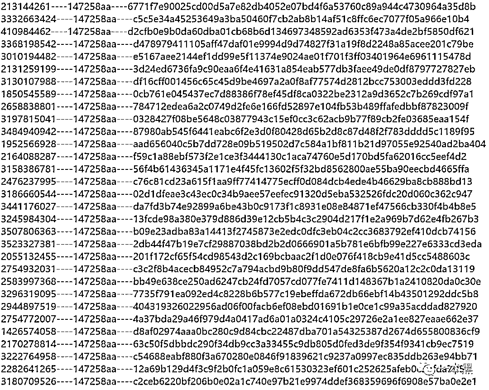

# 深度起底 QQ 买卖产业链：撞库盗号、中介欺诈、赌博洗钱来者不拒

> 原文：[`mp.weixin.qq.com/s?__biz=MzU4ODAwNzUwMQ==&mid=2247485449&idx=1&sn=0a69378c5229c441098d4e4a1937b4f5&chksm=fde2192bca95903de07ba035e63942640c4eb5975b06c1b3edafd86672ab0839c615bc0f6d19&scene=27#wechat_redirect`](http://mp.weixin.qq.com/s?__biz=MzU4ODAwNzUwMQ==&mid=2247485449&idx=1&sn=0a69378c5229c441098d4e4a1937b4f5&chksm=fde2192bca95903de07ba035e63942640c4eb5975b06c1b3edafd86672ab0839c615bc0f6d19&scene=27#wechat_redirect)

互联网的世界，能有多丧？

**突然收到好友出事急需用钱的消息，一句多余的话没说先抛出一个收款账号；**

**氪金刚入手的游戏装备一夜之间不翼而飞，看着桌角的三桶泡面忍不住泪水涟涟；**

**邮箱里莫名收到网银/支付宝找回密码的邮件，一时手贱就连妇联 4 的电影票都捉襟见肘；**

**一直以正人君子形象示人的好友接连发布多条招嫖广告，兴奋的搓搓手询问之下却收获否认三连。**

深究之下，这些怪事的源头，大多指向一串简单的数字：QQ 账号。

**具有强烈个人属性的账号如何被盗？被盗的 QQ 以何种价位、何种方式交易？神秘买家大量购买 QQ 账号意欲何为？**

为了弄清楚这些，我找到一位曾经的从业者，在他的讲述中，我看到众多为 5a 靓号而豪掷千金的博彩平台，也见到大量购买普通号后转化成微信“卖茶女”的人。

随着了解的愈加深入，互联网上零碎散落的 QQ 账号产业链渐渐清晰，让我得以近距离触摸到这个神秘的灰色产业。

**这是一个充斥着罪恶和迷信的黑暗地带，隐藏的利益，各色的目的，人性的真实在其中显露无疑。**

**利益和邪念的交织中，腾讯有原罪吗？**

**01** **盗号总是来得猝不及防**

昊哥接触 QQ 账号买卖，是在 2010 年左右，那时候，流行的游戏还是 DNF（地下城与勇士），每天拿着破木棍刷哥布林，玩的热血沸腾。

正是在游戏中，昊哥结识了一个人，相聊甚欢后，那位兄台怀着炫耀的心态，展示了一个盗号的软件，貌似自动登录账号密码就可以操作。

当时才刚 18 岁的昊哥，被这个“神奇”的软件所吸引，从此踏进了 QQ 账号买卖的圈子。

没过多久，那款叫不上名字的神奇软件，就被 QQ 晒米软件所替代，比如流量 V7、V8。

晒米即晒密，只要在服务器里登录就能使用，功能包括但不限于**批量挂 QQ、查询 Q 币数量、查询已开通的业务（红、绿、黄等各种钻）、添加/删除好友**等，其中，最重要的一个功能是**批量验证 QQ 密码**，无需验证码，就可以批量过滤几万、几十万的账号，速度大约是一小时 7、8 万个账号。

这种账号过滤方法类似于撞库，软件随机生成 QQ 账号，操作者只要提前设置好一些弱密码，如 123456、112233 等，软件就会使用提前设置好的密码批量去登录账号，从而过滤出能够登录成功的账号。

早年收来的 5-8 位数 QQ 号，大多都是这么来的，因为在那个时候，智能手机还未普及，绝大多数人还尚未认识到密码问题、密保工具等重要性。

而且，要买到这样的软件，其实并不算难，1000 块钱就可以买到全套。

虽说撞成功密码的几率并不高，10000 个 QQ 号撞出 2、3 个都是很正常的事，多的话也就是十几个，但放在价格市场中来看，一个五六位数的 QQ，价格都在一万多，所以说，虽然不走量，但是走价，稳赚。

除了撞库这种方式来盗取 QQ 外，还有一些号码来源于病毒。

有一些网吧老板，他们会特意在电脑中安装病毒，当有人来上网时，一旦登录 QQ，网吧老板立刻就能获取到账号和相对应的密码，鸡贼的是，网吧老板不会立即采取行动，而是先放置一两个月，等账号相对“安全”后再行出手。

我们每次看到 QQ 账号交易相关的文章时，绝对少不了的一个词，就是“信封”。

据说，一组 QQ 号码及其对应的密码，被称作一个“信”，一千或一万个“信”组成一个“信封”，拿到这些 QQ 及对应密码并保存成文本，叫做“取信”，用工具筛选有价值物品（Q 币、游戏装备等）的过程叫做“洗信”。

但昊哥表示，圈子里的人并不会这么表达。

**“外面所谓的洗信封，那都是 14 年以前的玩意了，况且也没有真正所谓的信封，我们都称之为早年数据。”**

**“早前通过晒米软件过滤出的号码，会进入市场产生交易，后面人盗的号也是从这些号码中来的，被称之为非自挂，这种东西在 15-16 年非常流行。”**

自挂的意思就是自己挂机升级得来的号，非自挂的意思就是这个号可能来源于别人售卖、非法盗取等。

**“现在的人基本都有密保手机，号码拿来是没用的，这种只能当临时小号去卖，我们叫做快餐号。”**

盗号这个事儿，防不胜防，睡一觉的功夫，你的 QQ 号可能就易主了。

**02** **专业收号也是大有文章**

昊哥做的就是专业收号，在整个 QQ 账号买卖链条中，扮演着承上启下的角色：从他人处购买“安全号码”，然后转手进行二次销售。

说白了，就是个赚差价的中间商。

收号一般是在 QQ 群里发布信息，关键词如“收 QQ 靓号”等，为了“工作”方便，昊哥当时加入了 1800 多个 QQ 群，这些群都是专门交易 QQ 号码的，一条信息群发后，就会有很多人主动联系。

2015 年的时候，收**5 位数的号码差不多在 1.5 万-2 万，现在已经 2 万起步**了；**6 位数的号码在 3500-4500**，高价的也有，主要取决于号码等级和开通的业务等综合情况，另外，好记的号码，价格自然会高一些。

虽然 5、6 位的号码有好价，但收到的概率比较小，还是以 7、8 位为主。

7 位数的价格大概是 350-500，一个月收 2000-3000 个属于正常，连号的号码价格会飙高，称作情侣号，寓意放在这里，不缺人买单，毕竟恋爱中的人，花钱都豪放一些。

在收号这个环节，没人会在意号码的来源，只要密码和密保资料齐全，可以正常更改，预测号码能有 20%以上的利润就可以收。

收来的号码在手上搁置几个月，这期间整理整理账号资料，刷刷等级，如果是非自挂且没有更改密码和密保的账号，突然间异地登录，是不能够修改密码的，还需要自己用软件挂常用后，再进行批量更改。

待准备工作就绪后，就可以标价出售， 能有 30%的利润就可以出，主要就赚这个差价。

买入和卖出的价格并不是固定的，它也遵循市场规律，随着市场需求的波动不断产生着变化，如同菜市场的菜价。

**但有时候，也能通过捡漏多捞一些。**

比如有些卖号的人，他们可能正好急需钱周转，原本能卖 400 的号，200 就愿意出；或者他们不懂某些号码的价值，便会低价卖出；还有一些人，他们懂得号码的价值，但苦于没有特别好的渠道去出，只好低价卖。

收来的号迟早要出手，昊哥说**卖号主要是通过 QQ 机器人来完成**的。

先将 QQ 机器人设置成可以自动发货的状态，再将买来并整理好的号码上架到机器人中，若有人咨询买号，会按照提示先添加机器人 QQ 号为好友，以支付宝的形式转账到提前设定好的账户中，转账时需要填写一些备注，如五个 1，等资金到账后，买家就能自行提号，完成交易。

机器人中通常会循环保持 2000-3000 个号码，价值百万甚至千万，鉴于屯号的成本比较高，很多小代理没有足够的经济实力去收取这么多号码自己卖，而作为专业收号的人来说，也希望可以尽快出货，所以就产生了合作共赢：招收代理。

边卖边收，才能让 QQ 机器人中始终保持一定的数量。

除 QQ 机器人外，也有一部分人是**通过自动发卡平台来卖号**的。

这类平台专注于虚拟商品在线交易，只需在后台添加 QQ 账号等商品信息后，后台会给每个商品分配一个购买链接，买家付款后平台自动发货，从而完成交易，依然是简单快捷的风格。

不论任何行业，都没有百分百的诚信经营。

**“我所接触的一个盗号平台，连盗带骗人，小金额正常交易，大金额拉黑好友，平时基本卖一些 9-10 位的号，总出货量 50 万个以上是有的。”**

****

2016 年后，腾讯封群的力度逐渐增大，QQ 账号的交易逐渐转移到富贵论坛中进行了。

该论坛主要做号码交易，注册会员应该已经超过四十万了，但这里交易的号码，大多数是已经转了很多手、隔了很多年的号码，论坛目前仍处于可正常交易状态。

这便是上有政策，下有对策。

**03** **神秘买家各怀心思**

昊哥说，在圈子里摸爬滚打的这几年，对于购买人群，算是比较了解了。

一般来说，购买五、六、七位 QQ 号或者情侣号的人，通常分为三种：

**第一种就是单纯喜欢短位靓号，第二种是网上做生意的人，他们需要比较好记的号码，第三种则是个别一些赌博平台。**

这些赌博平台会专门选择 4a、5a 这样简短的号码去做推广，例如像 4 个 1、4 个 2 开头或者结尾的 5a 号码，价值都是 50 万到 100 万的样子，很多玩家看到这样的 QQ 号，会觉得平台能用这么值钱的号码，肯定不会骗我，从而放心加入，殊不知，赌博平台根本不差这点儿钱。

购买八位 QQ 号的人，一部分是做微商的人，也有一部分人用来做诈骗，以及各类营销推广。

至于九、十位数 QQ 号的人，这种大多属于新注册的 QQ，有人专门去注册，我们叫做**处号**。

虽然这种号码靠个人也能注册，但毕竟数量受限，而专门注册号码的人都是跟卡商在合作，卡商手里有数万个电话号码都很正常，一个手机正常情况下可以注册 10 个 QQ 号，所以他们能够注册大量 QQ 号用于出售。

1、游戏。把号码用软件将 QQ 等级挂到太阳、双太阳、皇冠的时候，很多人就会买去做游戏，因为新号注册游戏，封号几率会比较高，但是带等级的号在游戏中被封号的几率，则会大大降低。

2、好友采集。QQ 加好友可以按条件查找，设定好性别、年龄、地区等信息后搜索，就会出现符合条件的账号，通过软件可以检测出这些账号中，能够直接添加为好友和需要验证后才能添加为好友，再将检测到的数据采集下来，用新号去批量添加。

因为新注册的号码大量添加好友，不会出现添加好友频繁的提示，这就给后续批量加好友、广告群发提供了非常便利的条件。

3、上榜号。按条件查找好友，最上面显示的就被称为上榜号，这种号码的精准引流效果非常好，只需在资料中挂上一些广告，如“加 QQ：XXXXXXX”等字样，主动添加好友的人会非常多，至于添加后的目的，就较为多样化了，有的是正儿八经做生意的，有的就是诈骗，比如之前卖茶叶的、卖冬虫夏草的。

4、炒股，赌博。QQ 行业为炒股和赌博推广提供了沃土，买一批号建群，例如一个炒股平台的交流群，群里 50 个人，可能有 30 个都是群主的小号，群主用专业的话术去推广平台，再配合小号以托儿的形式，在群里发布一些虚假的赢钱消息，目的就是引诱用户下注。

市面上会有专门卖处号（新注册号码）的人，他们大多跟卡商都有合作，有些甚至自己就是卡商，他们一面把手机号放在专门的解码平台，收取各种 App 注册的验证码，一面会大量注册 QQ 号码，一个手机号码正常情况下可以注册 10 个 QQ 号，然后用手机上活令牌。

**活令牌就是一串 64 位无规律的串码，可以方便的更改密码、密保，市场通用的活手机活令牌平台，主流的有两个，小果和非凡，几千万的 QQ 账号都绑定在这两个平台。**

微信账号的买卖，其实跟 QQ 都是一个路子，大多都跟卡商有合作。

对于号商来说，手里有十几万的小号都是很正常的，之前腾讯曾说 QQ 同时在线人数超过 2 亿，当时昊哥曾经和同行私下估算了一下，**号商手里持有待出售的号码，就有超过 1 个亿。**

数据最能说明问题，问题是要看什么样的数据。

QQ 就是一个江湖，各种角色各司其位，谁说 QQ 已经过时了？人家用途大着呢。

****04** ******虚伪的人，造就了虚伪的平台****

QQ 买卖这个行业，要赚到千万的级别，其实并不难，但能赚到这个数的、都是团队作业。

昊哥入行的时候还在上初中，前几年都是跟着别人瞎玩，被骗是常有的事儿，几千、上万都有过，但多少也学到了一些，6 年时间里，其实真正做的也就最后一年，赚了差不多有 50w+，接触形形色色的人多了，便萌生了收手的念头。

**“人们总是说这个网络太假了，其实你们有想过么，真正虚伪的是人。网络它不过是个平台，是这些人把它玩恶心了。”**

真正让昊哥下定决心收手，是因为腾讯封号。

那段时间，昊哥正挂着一批 20 多万买来的太阳号，大约 16、17 级，想刷刷等级再出手，谁知**一夜之间，电脑服务器上登录的账号全部被封**，按照账号一个四块多的交易价值来算，这次损失超过 80 万，一气之下，昊哥彻底离开了这个行业。

休息了一段时间后，昊哥应聘成功进了一家公司，一个月 5000+，虽然工资不算高，起初难免有较强的落差感，但胜在踏实，也不再有负罪感，整个人轻松了很多。

昊哥说，回想接触账号买卖的那几年，**圈子里其实不断有人被抓，很多人不甘于单纯买卖账号，还参与洗黑钱、诈骗**等，有时候遇到买号的人，交谈中已经能猜到对方的目的，比如赌博，比如诈骗，但为了赚钱，只能努力抑制内心的愧疚感。

能脱离开这个圈子，真的是件好事。

“一次表演，小丑不小心从舞台上摔下来，牙齿被摔掉了很多颗，满脸是血，很疼，表情很扭曲。全场观众大笑，因为他的表演真的很精彩，道具做的非常好。只有一个小女孩拉拉她妈妈的衣袖说：‘妈妈，小丑哭了。’但没人听见，一个也没有。”

“虚拟的网络给我们每个人戴上了一个面具，如果没办法做一个好人，也别做一个坏人。别越过最后的道德底线，否则有一天回头看看，会追悔莫及！”

这次采访的最后一个问题：**你所知道的黑产圈子里的人，会关注一本黑吗？**

**“做黑产的不一定会关注一本黑，他们只关注网警。”**

嘿，这哥们儿真是个实在人儿。

**THE END**

**若数据真的被关注，我希望是因为价值，而不是私欲。**

**没有安全的号，只有安全的人。**

**守护好自己的社交账号，里面承载的记忆，到了别人手里都是要被清除的垃圾。**

**在网络的世界里，我祝你平安。**

还原事实｜专扒黑产

微信 ID：darkinsider

知乎 一本黑

微博 一本黑 007

投稿、爆料、招聘、转载

请联系微信：chenchen_19940612