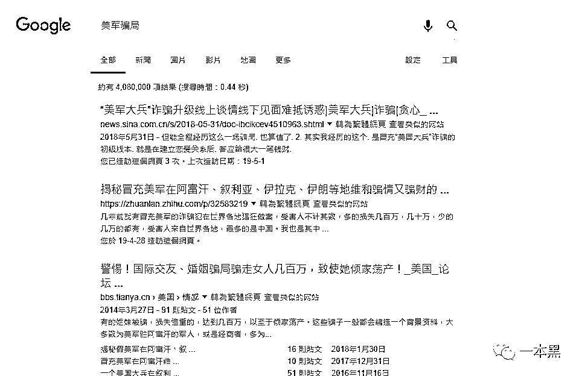
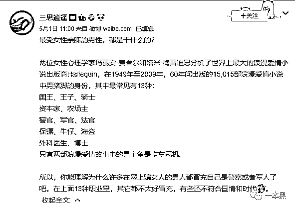
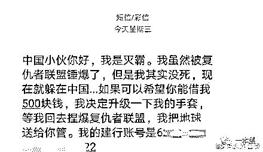

# 你是也门美军？我 TM 还来自军情 9 处呢！

> 原文：[`mp.weixin.qq.com/s?__biz=MzU4ODAwNzUwMQ==&mid=2247485415&idx=1&sn=af8be4c81245729d49a42be9368097f7&chksm=fde216c5ca959fd3eb92afff735d7e3c64913a4f7538a9f225bbe84ec8dc6fb9dc56a5d5ebea&scene=27#wechat_redirect`](http://mp.weixin.qq.com/s?__biz=MzU4ODAwNzUwMQ==&mid=2247485415&idx=1&sn=af8be4c81245729d49a42be9368097f7&chksm=fde216c5ca959fd3eb92afff735d7e3c64913a4f7538a9f225bbe84ec8dc6fb9dc56a5d5ebea&scene=27#wechat_redirect)

他，是驻阿富汗美军，现年五十岁，离婚有子，父母双亡，现欲觅一真诚女子结婚。

战争残酷，他不想死在前线，于是在中文互联网上寻求帮助，“希望你能以未婚妻的身份，向我的将军帮我申请调整军事任务，提前退役，平安回来。”

在 2019 年，还有这样的骗子，真的是，整条街的智商都被他拉低了。

下次遇到这样的骗子，真诚建议您这样回复：

我，FBI 情报局军情 6 处超级特工，刺探情报，保护政要，狙击 AN 杀，近身搏击样样精通， 堪称情报局三千特工中的第一人。30000 刀，帮你干掉将军，救你们万千兄弟于水火。支付宝账号:133……

01

在这位爆料人（以下简称 “许” ）讲述自己的经历之前，我还不知道微信读书还是个社交平台。果然，对腾讯而言，万物皆可社交。 

不知道是自己发的哪条评论吸引到这位叫做查理斯·路易斯的美国人，许在微信读书上收到了一条私信。

一开始的聊天还很真诚。他们彼此寒暄，用纯正的中文自我介绍。

接着，他说他是也门战区的一名美国军人，今年 50 岁。到这里为止，许停下敲打键盘的手，丰富的上网经验告诉她，终于遇到传说中的骗子了，心中踊跃着难言的兴奋。

终于有与骗子交手的机会了！

为了快速推进整个骗局进程，许按照套路主动介绍说自己中年、单身，一个孤独寂寞的中年大妈形象跃然屏上。接着，许就专心看着路易斯开始他一个人的表演。

按照路易斯的说法，他正在也门某营地（具体地址保密）执行任务，已经有 5000 多名士兵在这项任务中牺牲，战况惨烈程度直逼《血战钢锯岭》。

他是分队队长（50 岁还是个队长，连个军衔都懒得编）他不想死在前线，希望许能以未婚妻的身份向他的将军申请，帮他调整军事任务提前退役平安回来。

具体作战情况可以参考《红海行动》，骗子很可能就是从该片中吸取经验。在之前的案例中，这些“美国大兵”驻地还大都在阿富汗或者伊拉克。

不是？嘘寒问暖、彼此关怀的恋爱过程都要省略了吗？渲染战争恐怖氛围代替培养感情了？就这么简单的要求，本着国际人道主义精神，我可以挽救你们整个连。

许根据他给的联系方式联系到他所说的将军。将军回复说：需要一名新兵替换才能让他退役，许可以选择任意价位的一名士兵。

原来在这儿等着呢？速度比许想象中还是快了很多。

接着，将军发来了价位表：

加拿大士兵：5200 美元

英国士兵：3900 磅

土耳其士兵：2—300 美元

美国士兵：6000 美元

这情节，我都怀疑自己是在路上捡了本盗版《故事会》。以命换命，这要是真事儿，发在公众号上都得封。 

把钱打给他，就能成功解救“未婚夫”，还能获得 280 万的意外之财；不打钱，“未婚夫”就会被派往常年战火纷飞的叙利亚。

谁关心他会不会去战火纷飞的叙利亚，骗子最好原地自动爆炸。

02  

许仍然兴致勃勃地与骗子周旋。好不容易遇到骗子，许也不想这么快就结束对话。就像你天天听说电信诈骗，真的遇到，并不想马上放手。

当许提出视频通话的时候，路易斯找来一张外国人的照片挡在摄像头前。看到屏幕上，那张很明显摆在摄像头前的照片，许勉强自己不要笑出声。十几秒后，路易斯匆匆挂断视频。

既然不能视频，那方便语音吗？路易斯再次以“在营地不方便”为由拒绝。

你在什么营地，你真是个影帝。

“你中文怎么这么好？”

“我喜欢中国，一直想要到中国去，所以一直有在学习中文”

“你用的什么教材？我是语文教师，可以推荐哦”

“我平时就看看新闻”

“是看新闻联播吗？也门可以看 CCTV 吗？还是用的什么 App?”

……

当然，最大的 bug 是，他留下的银行卡账户，开户行在中国东莞。

“你不是在美国吗？为什么是中国账户？”

“因为要支付人民币，中国账户更快。如果是美国账户，需要花费三个国际工作日”

担心骗子退出，许没有继续追问。

不过，既然有了银行账户，许请在银行工作的朋友调查，这个卡号长期在郑州活动，极有可能根本不是本人真实信息申报的，可能是购买的假身份证和银行账号。

这个账号每月有上百笔金额几百到几万不等从异地汇款的记录。根据这种汇款频率，许的朋友估计他们很可能是团伙作案。

03 

回顾整个事件，骗局就像一个筛子，满是漏洞。

首先，出现在中文互联网上的美国军人，熟练的中文水平，如果你相信了，恭喜你，你通过了第一关。

接着，是金钱上的诱惑。路易斯一再强调自己会有 200 万美金的退休金，并且退役后打算到中国买房结婚并投资。而在那位将军的回复中，也提到许可以作为受益人，拿到 280 万美金。

有这么多钱，为什么需要向你借 300 美元？就像有 650 万美元买进斯坦福，你还会愿意参加 100 块钱每小时的补习班吗？

这些，300 美元就能买到，是不是很划算？如果许是骗局的目标受众——中年失婚女性，很可能已经上钩了。

雇佣兵的定价也很有讲究。美英加三国的佣兵价格相差不大。相比之下，土耳其籍的士兵的价格仅 2—300 美元，算是价格大跳水。

就像四款配置一样的手机，其中一款仅为其他价格的 1/10，你选哪个？（此处比喻略有不当，下不为例）会不会有一种便宜不占白不占的错觉？有些人很可能觉得不多，就真的打钱过去了。

而且，根据我国法律，不超过 3000 元人民币还不方便立案。

04

随手百度，这类骗局比比皆是，而且不断有人上当受骗，最远可以追溯到 2011 年，“美国大兵骗局”已经成为婚恋骗局中的一个重要分支。 

 

通过微添加的男友，自称是“美国大兵”，蒋女士满心期待收到他许诺寄来的黄金，结果，**一箱“美金”没等到，反被骗走 40 多万元。** 

这类骗局不断更新升级，从最初的以“战友受伤急需用钱钱”向女方借钱，到伙同他人以“申请退役津贴”需要手续费要女方帮忙支付，再到大额美金需要保管，让受害者和快递公司对接的理由来实施诈骗。

军人身份的选择事实上有科学证明。在心理学家从数万本爱情小说中分析统计的结果中，军官正是其中最常见的男主角身份之一。

 

而且，相比其他不合国情，或者需要专业知识的职业，军官们更方便用“保密”这个借口。

他们的共同特点就是 “丧偶、独自带孩、战斗负伤”，相对于 “霸道总裁爱上我” 的套路，对于在网络小说中吸收营养的一代人，这个骗局的真实性还是高了一点。

* * *

当然，整个骗局的荒谬程度，大概相当于灭霸来中国众筹资金，升级他的七龙珠。信了，你就输了。

还原事实｜专扒黑产

微信 ID：darkinsider

知乎 一本黑

微博 一本黑 007

投稿、爆料、招聘、转载

请联系微信：chenchen_19940612