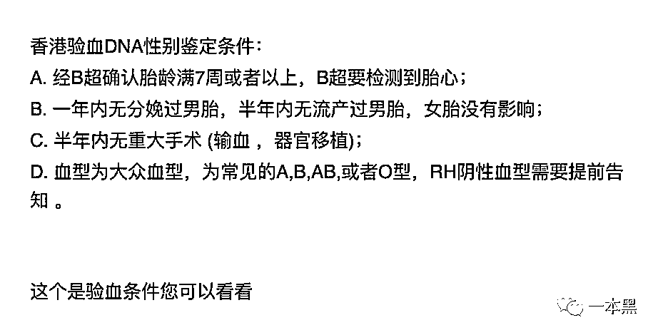
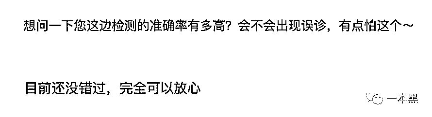
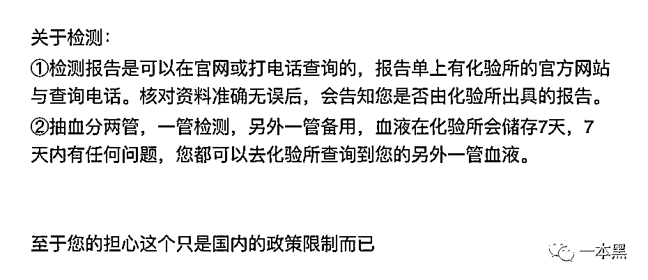
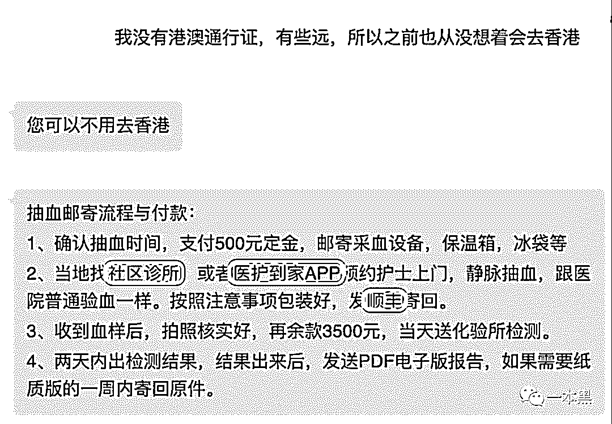
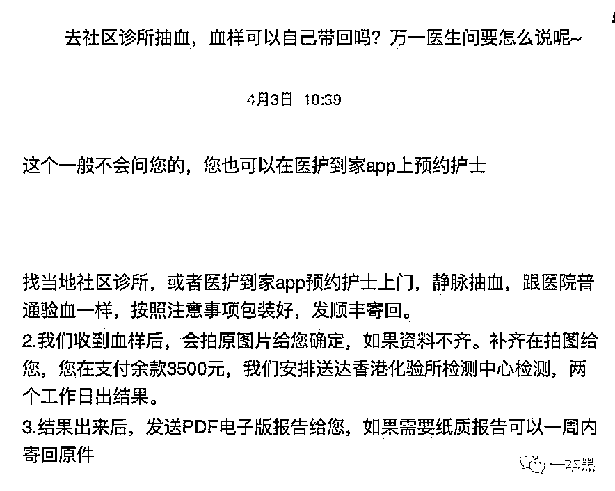
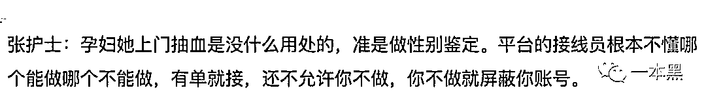

# 伪装的血样，“被消失”的女婴，我找胎儿鉴定机构聊了聊。

> 原文：[`mp.weixin.qq.com/s?__biz=MzU4ODAwNzUwMQ==&mid=2247485313&idx=1&sn=089ff813193f653341f12b8a285cd4ab&chksm=fde216a3ca959fb58d061a3fc7e902c8a8a9cd9500f1dd6bca053bec721b9c858c84a056a7c7&scene=27#wechat_redirect`](http://mp.weixin.qq.com/s?__biz=MzU4ODAwNzUwMQ==&mid=2247485313&idx=1&sn=089ff813193f653341f12b8a285cd4ab&chksm=fde216a3ca959fb58d061a3fc7e902c8a8a9cd9500f1dd6bca053bec721b9c858c84a056a7c7&scene=27#wechat_redirect)

12 岁女童，携带 142 支血液样本，均附有对应的“母血 Y 染色体基因检测申请表”，从深圳前往香港。

是否含有 Y 染色体，成为其中每一个生命能否降生的关键考量。

谁能想到，在生命萌芽的时候，就有一道鬼门关在等着他们，过不了这道关的生命，就会“被消失”，这其中，大概率是女婴。

**一个需求，将医疗、物流等不同行业串连，数千公里联动。**

**一场情感与利益交织的“寄血验子”接力赛，早已鸣枪开跑。**

文 | 木子梨

## 

**01** **我找胎儿性别鉴定机构聊了聊**

近几个月，“寄血验子”多次成为焦点，严打之下，操作“寄血验子”有多难呢？

没费太多力气，我就联系到了几家可接胎儿性别检测的机构，不得不说，互联网时代，只有想不到，没有找不到。

而这几家机构打破沉默的方式，竟出奇的一致：“请问，孕几周了？”

真是个令人尴尬的问题，我到底孕几周比较好呢？7 周好了，七上八下，吉利。

在得知我是个人傻、钱多、盼儿子的人后，其中一家鉴定机构很热心的开始为我讲解。

首先，我需要确认自己是否满足胎儿性别鉴定的条件，四项全部符合才可以。这还用说，再多几项我也肯定全部符合。

在我问到性别鉴定的准确性时，对方很自信的表示，他们服务过的客户不说一万也有八千，到目前为止还没有出过错。

继续闲聊中，我表示最近看新闻有点多，不知道做此选择是否妥当，对方开始劝说，表示胎儿性别检测是由香港方面的化验所完成，此检测在香港完全合法，让我无须担心，只需前往香港抽血即可。

香港我肯定是去不了的，毕竟我肚子里只有饭，没有孩子。

于是，我提出自己不方便去香港，对方秒回，表示不去香港完全没问题，抽血邮寄，就这么简单。

诶诶诶，社区诊所？医护到家 APP？顺丰？我方了。

诊所抽血可以带走血样，我还真是第一次听说，我情不自禁的脑补了一个场景。

“医生，我要抽血，抽完带走的那种。”

“血样带走干嘛使啊？”

“送去香港，查查怀的是男是女。”

空气中弥漫着尴尬的味道。然而对方告诉我，一般不会问的，好吧，请原谅我的浅薄无知。

这个医护到家 APP，我也是第一次听说，于是上网查了查，发现它可以在线下单，可以提供输液、打针、导尿、换药、静脉采血等多种项目，然而，也是缠满了负面新闻。

有平台护士称，尽管规定要求客户上传相关就医证明，但平台接线员知识受限，有单就接，丝毫不审核客户的需求是否合法。

至此，采血环节的疑问算是基本解开了。

接下来，就得聊聊物流了，我比较关心刚刚被牵扯进来的顺丰。

在我提出“如何通过顺丰寄送血样”时，对方抛来重点：伪装，并表示伪装方案网上有很多，等实操的时候我可以进一步咨询。

傻子也知道不能明目张胆的邮寄血样，我上网搜了一下才发现，网上有大把的教程，什么藏在生鲜食品底下，套在护肤品外包装里，超市买几包零食装进去再用胶带粘住等等，只要别让快递揽件员看见，只要走陆运就好，并着重强调，夏天最好使用冰袋。

夏天，冰袋，那岂不是藏在生鲜食品底下最靠谱？这是买一送一的意思啊，给鉴定机构邮寄血样，附送新鲜牛排一份？

这样看来，就算有明确的制度规定，依然有漏洞可钻，就算顺丰行不通，还有“三通一达”甚至其他物流途径。

这些机构给出的深圳收件地址，都不具体，基本是快递门店代收后，再安排人员前去取件。

成功收取血样后，他们会通过“水客”等偷偷送至香港进行化验，继而出具检测报告给到孕妈，在送港过程中，由于有海关的监管，运货难度大，便有了新闻中“跨境学童”这一特殊群体的参与。

整个血色链条战线长，环节多，人员分工明确，而这些鉴定机构的老板，个个都是神秘莫测的主儿，基本不露面，而是采取远程指挥的方式来管理。

此番探索，同时联系到的其他机构，陈述的流程都与此类似。

据说较为正规的机构，不接受血样邮寄，需要本人自行前往香港抽血检测，可惜，在调研的过程当中，我一个也没遇到。

我不知道这些机构所提供的医疗用品来自于哪里，是否安全可信，也不清楚如此炎热的天气，血样在邮寄过程中能否完好保存，我只知道屏幕背后的那些人，每个都忙的不可开交，同时与多人沟通着相关事宜，朋友圈里洋溢的全是成功验孕后的喜悦，丝毫没有受到近日相关新闻报道的影响。

此刻，我感受到深深的寒意。

## 

**02** **香港鉴定，内地堕胎的畸形链条**

近期，深圳一直以晴热为主，阳光明媚，春意盎然。

有阳光，自然就有阴影。

难以想象，由于地理位置，全国各地试图进行胎儿性别鉴定的血样，大多都被寄到这里，经中转后，运去香港检测，在收到检测报告后，若不满意胎儿性别，则会在内地选择堕胎。

这就是“寄血验子”。

其实，胎儿性别鉴定的技术并不复杂，由于母血中含有微量的胎儿 DNA，是可以通过技术手段检测出胎儿性别的，但它之所以在大陆能够形成一条灰色产业链，是因为内地和香港所适用的法律不同。

在内地，堕胎不属违法行为，但胎儿性别鉴定却被禁止；而在香港，则截然相反，这就形成了香港鉴定，内地堕胎的畸形链条。

早期，曾有塞钱给医生，医生便会在 B 超过程中透露胎儿性别的事件发生，但这种鉴定，一般都要等到怀孕四个月才能分辨，万一是女儿，已经不太好采取其他动作，而基因检测的优势，在于 7 周左右就可以检测，有很多便利。

故而成千上万的家庭，由于种种原因，而不惜走上一条“赴港杀女”的不归路。

但现实是，很多妇产科专家都表示，“寄血验子”的准确性并没有太多证据可以支撑，这一点，从一些新闻中就可以得到证实，一些孕妈的检测报告显示不含 Y 染色体，堕胎后才发现是个男孩，后悔莫及。

即便如此，需求依然旺盛。

一个需求，多方配合，这难道就是传说中的：坚持你想做的，全世界都会为你让路？

**03** **生女儿，你连摆满月酒的资格都没有**

都 9102 了，很多人还在拼命生儿子。

我的好友小同，给我讲述了一个关于他同乡萍姐所经历的，充满矛盾而又令人震惊不已的故事。

小同口中的萍姐，86 年生人，高中毕业后就没再继续读书了，而是选择在外打工，几年后，考虑到父母需要照顾，就回到了老家，就近找了份工作。

没过多久，经人介绍，萍姐认识了一个大自己两岁的同乡男子，随着一段时间的相处，两人确立了恋爱关系。

都说，男大当婚、女大当嫁，但很多时候，实现起来却没那么容易。

原来，在萍姐的家乡，按习俗，双方领证必须先生孩子。

几个月后，萍姐顺利怀上了，本以为等孩子出生就能领证，谁知偶然得知的一件事，却让她倍感压力。

萍姐在村里的一个姐妹，刚生产完回到家坐月子，她的婆婆就整天念叨说生了女儿不能领证，必须儿子才行，并且强硬的要求尽快再生一个。

想到自己的婆婆每日话里话外也都在提孙子，萍姐意识到如果自己也生了女儿，恐怕也会面对一样的处境。

忐忑不安中，萍姐开始上网寻求能够提前得知胎儿性别的办法。终于，在得知只需抽血就可以获知胎儿性别的时候，萍姐看到了希望。

怀孕 7 周的萍姐，按照对方的指导，去诊所抽了血，连同自己的希望，一并寄去了深圳，经过 5 天的等待，萍姐终于盼来了检测结果，没有 Y 染色体，是个女孩。

在这种以生儿子为荣的习俗里，女儿连摆满月酒的资格都没有。

在与家人沟通后，最终还是没有要这个孩子，萍姐准备养养身体再怀一个，毕竟没有结婚证就没有保障，而她需要这份保障。

一个男孩，会给她带来至少面子上幸福的婚姻，也会给她的父母带来人前聊天时藏不住的骄傲，而一个女孩，则会让她失去这一切，甚至失去在村里抬头做人的勇气。

现实面前，她别无选择。

回顾近些年来的新闻报道，除了风俗习惯外，在受访家庭被问到为何要进行胎儿性别鉴定时，原因也是多种多样，令人唏嘘。

出于好奇。部分人表示作为父母，有权利知道孩子的性别，在做产前准备时，也方便准备物品。

重男轻女。近些年来，随着理念的普及，重男轻女这个词，被提起的频率已经有所降低，然而它还是根深蒂固的活在很多人的灵魂里，只是稍微转变成：并不会对女孩子多么不好，只是没那么爱，以后一旦有机会，还得生个儿子。

儿女双全。二胎政策的开放，也让很多原本没有重男轻女的人产生需求，只为达到儿女双全，拼成一个“好”。

说好的生男生女都一样呢？

**THE END**

寄血验子，已经成为一个公开的秘密。

但它影响的不只是单个家庭，而是整个人口结构，性别的结构性失衡，与数量性失衡相比，后果严重的多。

它会人为的造就一个千万量级的光棍群体。

到时候估计会有人琢磨：千辛万苦生的儿子找不到对象，这可咋整？

还原事实｜专扒黑产

微信 ID：darkinsider

知乎 一本黑

微博 一本黑 007

投稿、爆料、招聘、转载

请联系微信：chenchen_19940612