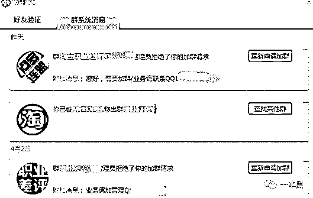

# 下架 630，封店 850：搞垮一家淘宝店有多轻松

> 原文：[`mp.weixin.qq.com/s?__biz=MzU4ODAwNzUwMQ==&mid=2247485308&idx=1&sn=8e0e0bcfd74c961949bd41662b81bb49&chksm=fde2165eca959f4819c17bd67c2e0f8297f49c15470a9deb726ce338504468b661f68ac37e0d&scene=27#wechat_redirect`](http://mp.weixin.qq.com/s?__biz=MzU4ODAwNzUwMQ==&mid=2247485308&idx=1&sn=8e0e0bcfd74c961949bd41662b81bb49&chksm=fde2165eca959f4819c17bd67c2e0f8297f49c15470a9deb726ce338504468b661f68ac37e0d&scene=27#wechat_redirect)

“差评 18 一条，20 条起做。下架 630，封店 850 ”。搞垮一家淘宝店的成本简直低到你无法想象。

不止有职业差评师，还有职业诈骗师、职业打假人，这类职业的存在已成为无数店家恐慌的根源。

文 | 喵叔

01 **下架 630，封店 850**

网上说差评师月入 8 万算混的惨的。我有点 心动 好奇，他们是怎么赚钱的。于是我决定混进几个 QQ 群，看他们是怎么操作的。

嗯？连头像都写着差评，准没错，点击申请入群，然后满怀期待等待群主通过。

“我应该姓什么好呢？做什么职业？是男是女呢？”

内心还没盘算完，就收到了一条消息【管理员拒绝了我的加群请求】。

怎么回事，难道只做熟人生意？于是接下来我又陆续加了好几个 QQ 群，结果，要么石沉大海，要么被拒绝。好不容易进了一个群，还没来得及 say hi，就被踢出了群。

幸好还剩下一个良心群主给了我回复，让我添加助理 QQ 私聊。

 

倍感欣慰的我迫不及待加了小助理的 QQ，但等到第二天早上，助理才通过我的好友申请。助理资料显示他 27 岁，男。

于是我很开心地和小哥道了早安，可是小哥并不理我，我想这或许是性格使然吧。

出于礼貌，我打算先和小哥寒暄一下。但小哥似乎真的性（格）冷淡，对于我的热情视而不见。

无奈之下我只能直奔主题，我问小哥差评多少钱一单，小哥还是没理我，直到很久很久很久以后，小哥回了一句：**“什么类型的商品？”**

我心中疑惑，难道差评是按照商品类型收费的吗？ 但是又不想让小哥觉得我外行，沉思一会后，我上淘宝找了一个爆品袜子的链接发了过去。

小哥回了我一句“你干嘛的？”我说开淘宝店的。

小哥：“”那你还发个天猫的链接给我？你 TM 逗我呢？天猫没有差评你不知道？搞事？？”

我觉得有些尴尬，一开口就显示了自己的无知。但鉴于其他的差评师都没有通过我的好友申请，我只得厚着脸皮继续从这个小哥这打探消息。

为了缓解这尴尬的气氛，我等了一个小时候才回复小哥，并用惊讶的语气说道：“哎呀，手太快，发错了，不好意思”。

这次我找了一个小店的一款搅拌杯，售价 30 块，月销十几单。小哥没有回复我的故作姿态的解释，只回答说：“差评 18 一条，20 条起做。下架 630，封店 850 ，5 天左右就完成。”

我问小哥价格上能不能优惠点，他说不能便宜，但绝对保证效果。

话说到这，我知道我和小哥没有再聊下去的可能了，毕竟性格不合的两个人是不可能长久的，于是我匆匆下了线。

02 **从淘宝店主到职业差评师**

隔天我才反应过来，自己还有很多问题没搞明白，但是小哥的 QQ 显示下线了。

于是我辗转联系上了一个开淘宝店的朋友，他给我介绍了一个职业差评师，他说这哥们**以前自己也是开淘宝店的，后来做了差评师，**我想了解的，他都清楚。

这哥们姓季，比我大好几岁，他说他朋友都叫他鸡哥，让我也跟着叫就行。但出于礼貌，我还是叫他季哥。

季哥说七八年前，自己也开过淘宝店，专卖袜子、内衣裤一类的贴身衣物。刚开始那会没生意，纯靠瞎摸索，但也慢慢琢磨出一些规律。大半年下来，生意也终于步上正轨。

因为选品能力不错，人又热情，加上店铺经常搞活动，所以回头客还蛮多。虽然店铺只有三钻，但利润和口碑都不错。

偶尔因为物流原因，顾客收到损坏的商品，一时生气也会给个差评，但联系之后，一般都会改掉。

可是有天季哥失误了，他把一款新产品的价格写错了，售价远不及成本。等季哥反应过来时，已经有七八个人同时下单了，而且事先也没一个人咨询过。

看着订单上的地址，季哥有些摸不着头脑，这都写的什么？XX 市 XX 区？XX 树林？XX 公园？

季哥觉得有些不对劲，就想先联系顾客再发货，可是旺旺没一个人回，电话还全 TM 是空号。

“那会我就知道栽人手里了。我立即下架了那款商品，但是已经晚了。”

没办法，订单已经下了，逾期不发货也不行，季哥只得硬着头皮上。

发货后四天左右，订单全部被签收。但是接下来两天里，他们都陆续给了差评，差评的原因各不相同，有的说线头多，有的说尺寸小，还有的说掉色。

季哥说他们拍下的是一款短袜，因为价格写错了，所以那款袜子 1 块钱三双还包邮。

季哥说虽然东西质量不是顶好，但绝对对得起那一块钱的售价，因为那款袜子他打算做成店里新的爆品。结果刚上架就被别人爆了。

我问季哥：“你给钱消差评了吗？”

：当然了，妈的，8 个差评啊，要是不消掉，我半年的心血都白费了。

：那你后来花了多少钱搞定的？

：2000。下单没多久他们就给我打电话了，说 2000 块改掉店铺所有的差评。

这波差评之后，季哥的店铺的经营又回归了正轨。因为被讹过一次，所以季哥对异常的订单都特别小心，接下来的大半年店里也没出过事。

次年五月，季哥准备了一款新的产品，为冲皇冠做准备。因为同行已经有不少店铺上新了，所以他打算以成本价促销冲量。

那款商品的确火爆，上新第一天，就卖了三分之二。那天晚上季哥加班处理订单，直到凌晨三四点才彻底搞定。

结果刚准备关电脑，后台突然有一大堆订单进来，差不多 5 分钟时间，剩余商品被拍走一半。

这个场景和半年前一模一样，季哥说他当时他就慌了。虽然半年前已经遇到过一次了，但这次似乎有些不寻常。

为了搞清楚状况，季哥当天晚上叫上自己几个哥们，通宵核对订单，发现那一时间拍下的订单十有八九是职业差评师搞的鬼，因为那些电话没几个打得通。

通过查验，季哥找到了一个相当眼熟的电话—去年那个讹过他的电话。“妈的一次不行还来两次。”

季哥根据电话打了过去，对方很坦诚地表示抱歉。他和季哥说，雇佣他们的人也是开淘宝店的，季哥好几次活动都和雇主冲突，而且季哥还是成本价，抢了他们不少生意。他们发了狠话说直接封店。

季哥还想追问对方具体的店铺，但他不肯透露。

接下来的一个月，季哥陆续收到了二十几个中差评。季哥向淘宝申诉，但并没有实际证据可以证明对方是有预谋的团体作案，而顾客评价却是真实的。

突如其来的差评让季哥的店铺权重直线下降，还多次因为顾客举报受到淘宝的处罚，季哥最终只得关掉淘宝店。

03  **月入 8 万的真相**

受到打击的季哥后来也成为了一名差评师，他说自己咽不下那口气，起初是为了报复那家店。但后来发现做差评师比他辛苦做淘宝来钱还快，就一直做着了。

：差评怎么搞？拍单-收件-差评-收钱吗？

：当然不是，有专人负责寻找这类店铺或是对接雇主（销售），我们负责拍单（执行），之后由专人代付（财务），拍单之后有人对接店铺协商价格，删除评论（售后）。

：如果对方察觉异常不发货呢？

：不发货也照样投诉啊。超时不发货，店铺照样被扣分。那么多单，够他们喝壶大的。

：生意好吗？

：“现在生意不好做，淘宝花了很多人力物力防范职业差评师，店铺也不再像以前一样重视差评了。所以你看现在一条差评的收费都便宜了很多。”

：网上说的差评师轻松月入 8 万是真的吗？

：**行情好的时候，可不止这个数。**不过现在不行了。

：网上那些曝光差评师的网站公布的信息是真的吗？

：呵呵！傻 X 才用真信息，**买四件套啊**。我们拍单用小号，收件地址有些是真的，有些是假的。

：那他们公布的是谁的信息啊？

：假的啊。但有些是真的顾客，他们给了差评，被店家报复。

：你被报复过吗？

：那还用说，无非是寄些恶心的玩意，不过那吓不到我。有的还对我用呼死你，关机就是了。我有好几个手机。

：每次都会成功吗？

：那不是，虱多不痒，有些店差评多了也无所谓。**现在店铺和买家对于差评的迷信度都在下降。**

：都是别人委托你们去差评的吗？

：有别人找，也有团队主动出击的。小店为主，大店也做，但是钱要够。

：以后还会继续做吗？

：当然做了，不过当份兼职吧。我得找个正经工作。

：季哥，能带我一起搞吗？我也想做个兼职

：搞毛哦，滚。

* * *

从淘宝衍生出来的赚钱方法远不止卖货一种，刷单、差评早已撑起了一条完整的产业链。类似的还有职业敲诈、职业打假、职业举报等，这其中或许仍有正义的发声，但大部分人只是用以恶制恶的方式实现经济目的。

我没有开过淘宝店，也没有被同行打击报复过，所以我无法评论这种行为是否有其合理之处。但作为一个普通消费者，我想，我们应当拥有给予任何评价的权利。

但实际上，差评和恶意差评怎样界定？打假和碰瓷应如何区分？

我不清楚，

对于真相我一无所知。

**参考资料：**

*   职业差评师 | 存活在网络中的差评师有多少收入？他们是如何生存的？

*   新法之下，“刷单师”还能继续操控电商好评吗？

*   买账号、游击战，职业差评师为何月入上万？

还原事实｜专扒黑产

微信 ID：darkinsider

知乎 一本黑

微博 一本黑 007

投稿、爆料、招聘、转载

请联系微信：chenchen_19940612