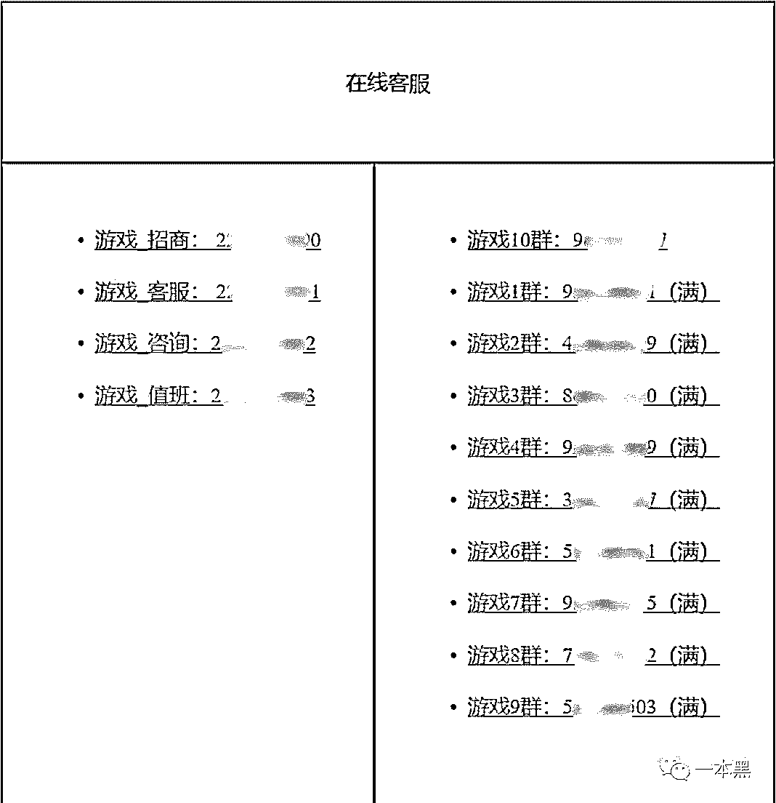
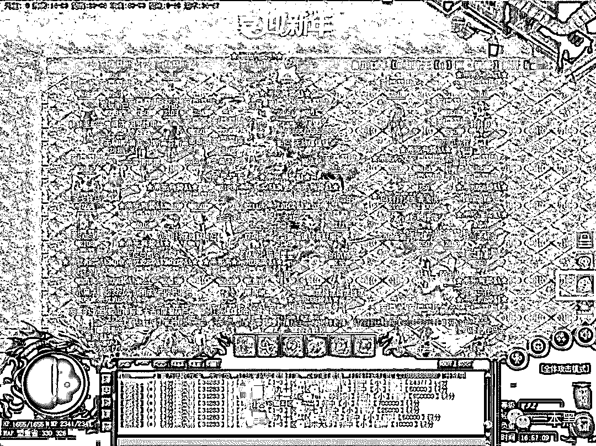
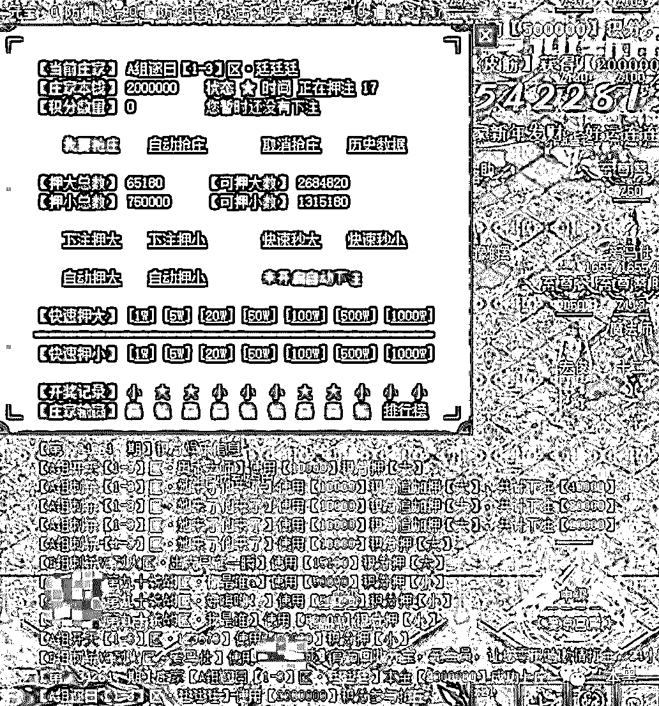
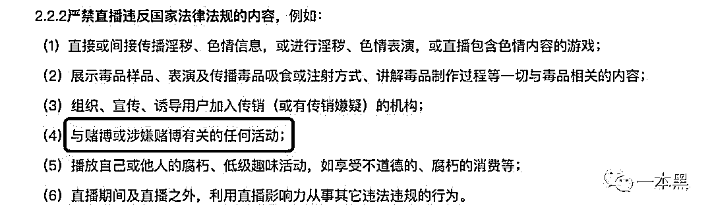

# 网游里藏赌场，竟靠直播平台做引流，“竞猜”外衣下的赌还是那么毒

> 原文：[`mp.weixin.qq.com/s?__biz=MzU4ODAwNzUwMQ==&mid=2247485296&idx=1&sn=ac5b6712a3501491e43e3bc28ac6b096&chksm=fde21652ca959f44321c5a775c89942291858f51d8e802f5f9e780cdbca07cb3e309ca582443&scene=27#wechat_redirect`](http://mp.weixin.qq.com/s?__biz=MzU4ODAwNzUwMQ==&mid=2247485296&idx=1&sn=ac5b6712a3501491e43e3bc28ac6b096&chksm=fde21652ca959f44321c5a775c89942291858f51d8e802f5f9e780cdbca07cb3e309ca582443&scene=27#wechat_redirect)

话说，现在赚钱的路子可真多。

什么发朋友圈赚钱（某霸屏），看视频赚钱（某火牛），看新闻赚钱（某头条），就连玩游戏好像都能赚钱，什么装备回收秒到账，回收上万随便浪，进来就赚钱。

“大扎好，我系轱天乐，我四渣渣辉，探挽懒月，介四里没有挽过的船新版本，挤需体验三番钟，里造会干我一样，爱象戒宽油系。”（咦，我居然发了一条语音消息~）

当然，这是一款情怀游戏，但有情怀的游戏，可不止这一款。

原以为可以重温一场热血沸腾的青春，谁知却毫无防备的参与到一个精心设计的赌博圈套之中。

文 | 木子梨

## 

**01** **私服游戏中竟暗藏赌场**

今天的故事，要从波哥的经历开始讲起，和很多人一样，传奇也是波哥接触最早的一款网络游戏。

02 年左右，传奇开始火了，据说最高 3000 万人同时在线，虽然那时网吧才刚开始兴起，但每 10 个在网吧上网的人中，就有 9 个在玩传奇，故而很多人看到商机，专门因为传奇而开了网吧，从某种程度上来说，是传奇推进了网吧业的发展。

而且，由于那时候都是靠点卡充值，很多人为了省钱玩传奇，把烟都戒了。

热血传奇，果然名副其实。

波哥也曾沉迷，但后来，由于种种因素的叠加，就没再玩了，直到前不久，暂时与生活压力达成和解的波哥，利用难得的个人时间，想要再重温一下青春，谁知这一次，却被青春撞瘪了钱袋。

在虎牙直播上，波哥看到有主播正在直播一款传奇私服，看着很不错，于是按照直播页面上给出的网址，下载了这款传奇私服后，进入了一个新区，开启了畅玩模式。

到目前为止，一切都如记忆那般美好，直到第二天合区的到来。

在新区时，波哥留意到在攻城之前，很多人都会去 YY，有不少人会说自己赢了多少，这把押什么能赢，当时的困惑，在合区之后，一下子就明白了。

合区后，赌博模块就出现了。很多玩家都在参与，波哥抱着玩玩的心态，充了 50，结果赢了 300，于是就想趁胜追击，谁知，短短半个月的时间里，就输进去 2 万多。

越想越后悔，于是，想要现身说法的波哥找到了我，坦言希望可以曝光此事，避免更多人入坑，鉴于这种出发点，必须双手双脚赞成，当然，双手是我举的，至于双脚嘛，当时是属于刚度假回来却依旧神龙见首不见尾的老师傅。

波哥的遭遇讲完了，但我还是想亲眼去看看涉赌的传奇，能有多黑。

顺着波哥的故事线，我确实在虎牙直播上找到了那位主播，当我进入房间的时候，直播间画面上正黑压压的一大波人在打装备，画面下方的显眼位置，赫然标着官方主站和备站两个网址，而弹幕跑的正欢。     

我按照网址，下载了这款叫做**之城的传奇私服，同时，我发现自己被页面调取 QQ，自动加入了 10 群，仔细一看，嗬，快 1000 人了。   

注册并登陆后，果然，这款游戏没有一丝异样，简直再正常不过了，我赶在第二天合区之前，不费吹灰之力，就把游戏等级提升到了 92 级，万事俱备，静待合区。

第二天，终于等到了合区，赶紧登陆上去，发现游戏右侧界面上，出现了一个骰子图标的按钮，鼠标移至上方时，出现“点击打开猜点娱乐，此为竞猜游戏，切勿用于违法活动”的提示，而在下方聊天栏，系统正不停播报着什么迷人的东西。     

点击按钮后，游戏界面左上角便出现了一个押大小的窗口，恍惚间，我还以为自己打开了那种能一夜暴富的神奇网站，这不就是赤裸裸的赌博？  

游戏，不是个纯粹的娱乐游戏；赌博，也没有美女荷官给你发牌。

如此不伦不类，却丝毫不影响参与人数，也丝毫不影响玩家付费的热情，投入十几万的人，大有人在，投入更多的“土豪”我们还不得而知，可惜，输赢早就写在了游戏脚本里。     

你以为这是一场靠运气的博弈，其实这是一场早就注定结局的偶遇。

幸好，这只是一场游戏。

可悲，这只是一场游戏。

**02** **如出一辙的涉赌游戏私服**

涉赌的游戏私服，其实并不少见。

去年 5 月，杭州西湖公安分局通报了一起案件，犯罪嫌疑人正是利用传奇私服，将一张叫做“土城”的地图，隐藏在了游戏当中，在这张特殊的地图上，有一个 NPC（非玩家角色），叫做“傲龙休闲城”，玩家点击 NPC 后，就进入了赌博界面，可以在此押大小，同时，界面还会显示之前的赌注信息。     

（图片来源于网络）

最终，警方共抓获涉嫌开设赌场的犯罪嫌疑人 52 名，短短几个月，涉案金额就高达数千万元。

同样是在去年，邗江警方也破获了一起私服赌博，游戏名叫做“王子合击”，犯罪嫌疑人通过在网上非法架设传奇私服的网络服务器，在游戏中，设置了一个叫做小胖妞的 NPC，通过小胖妞，可以进入一个叫做“王子娱乐城”的界面，依然在以押大小的方式进行赌博。     

（图片来源于网络）

最终，警方抓获犯罪嫌疑人 30 余人，涉及资金超过一亿元。

难道是游戏和赌博更配吗？

**03** **私服：不同阶层的热血江湖**

说起私服，比较流行的网络游戏，好像都逃脱不了，而私服的出现，正是源于传奇这款游戏。

传奇的背后，是盛大公司，2002 年，欧洲的某个传奇运营商不慎泄露了传奇的源代码，同年，私服诞生，并逐渐壮大直到今天，必须承认的是，私服的盛世，与玩家对传奇的感情，紧密相连。

“以前，我一直有个梦想，想有一天能自己开个网吧，有台属于自己的机子，砍一辈子传奇，哪怕一天三顿都是方便面，只要买得起点卡就行，这个梦想持续了很多年。”这是一次聚会中，我朋友的原话。

恐怕很多玩过传奇的人，都曾有过类似的想法。

想当年我在网吧，也曾看见一位少年左手输着液体，右手操控着鼠标，眼睛直勾勾的盯着屏幕，在传奇中尽情热血，而他伟大的妈妈，则站在一旁高举着输液瓶，这一场景直到今日还历历在目。

传奇，对于很多人来说，是承载着无数个通宵所积攒起来的青春记忆，意义非凡。一边是盛大公司愈发明显的盈利目的，一边是以娱乐为主要目的的私服，爆装备更轻松，提升了游戏的可玩性，正是借着天时地利人和，私服才一直流传下来，接纳了各个阶层不同收入的人群，并与越来越多的游戏相融合。

但说到底，私服毕竟是非法的，它本质上属于一种网络盗版，这就给了不法分子可乘之机，比如偷偷嵌入一个赌博模块，玩家以为是游戏，殊不知是陷阱，令人防不胜防。

**04** **游戏行业的灰色空间**

当然，在游戏行业中，处于灰色地带的可不是只有私服。

对于玩游戏的人来说，最痛恨的莫过于在游戏过程中，遇到外挂。比如之前大热的吃鸡，有些人刚从直升机上跳下来，降落伞还没撑开几秒，莫名其妙就挂了；有时候，当你开着一辆车奔驰在马路上时，一个持枪“开 11 路公交车”的人会迅速超过你，而你只能默默看着他越来越远的背影，心里祝福他无数次。

对于使用外挂的人来说，那可真是：使用外挂一时爽，一直外挂一直爽。

但是，外挂同样属于侵犯著作权的非法行为。在 QQ 全民种菜的年代，多少人沉迷于收菜和偷菜无法自拔，于是，就有人开发了一款“QQ 农牧餐厅三合一”外挂，并在软件中植入广告代码后，将软件公开供有需求者下载，不到一年时间，就赚取广告费用超过 200 万，故事的结局，此人被判处有期徒刑三年，并处罚金 150 万元。

再来说说盗号。上网冲浪这些年，没被盗过号都不好意思说自己是个网民。

你以为你被盗号，仅仅是因为你的号等级高，装备多？不不不，盗号这张网，捕捞目标可宽泛了，而且已经形成了流水线化的黑产链条。

号到底是怎么被盗的呢？可能性太多了，比如有些网站会接一些盗号广告，当然，也许有些人接广告不懂这些，也许有些人是懂却装不懂，总之一切向钱看。

这类盗号广告，举个最简单的例子：一个美女头像的 QQ 在网页侧边栏不停闪动，邀请你聊天，如果你想深入多了解一点信息，页面就会要求你输入 QQ 号和密码，只要你一输入，完蛋，就像上次老师傅丢手机那样，当然，老师傅是不会轻易中招的。

至于丢了的号么，甭管是社交软件账号，还是游戏账号，很大可能性就会被黑产所利用，轻则洗劫账号资产，重则诈骗亲友钱财，对于被盗号者来说，究竟会遇到哪一种状况，只能随缘了。

游戏嘛，娱乐放松一下就好，别整那么多有的没的，整不好就是赔了夫人又折兵。

**05** **无视规则、野蛮生长的直播平台**

大约从 15 年前后开始，大大小小的直播平台兴起，腾讯、新浪、淘宝等也竞相入局，资本家看到了行业潜力，随着投资的进驻，“人人都能做主播，时时都能做直播”的局面开始形成。

然而，快速扩张的直播平台，却常常因“黄赌毒”而占据各大新闻版面，平台规则形同虚设。

今日故事的主人公波哥，他接触到涉赌游戏，就是通过虎牙直播，而虎牙直播平台规则中，清楚明白的写着：严禁直播与赌博或涉嫌赌博有关的任何活动。

而在此之前，虎牙直播就已经多次被曝出有主播在引导观众参与赌博。     

去年，作为当时的快手红人，网络主播 MC 天佑，在直播过程中多次谈及色情，甚至以说唱的形式来对外传达自己吸毒后的感受，最终，被跨平台封禁。     

（图片来源于网络）

这些事件，对主播来说，可能只是吸引流量的一种方式；对社会大众来说，也只是映入眼帘的一则新闻；但对于直播间里的观众来说，却很可能会在他们的心里，埋下一颗只要环境允许便会萌芽的邪恶之种。

请别把直播平台的监管责任，推脱在社会公众的身上，事后的公关和道歉，远不如事前防范。

眼里都是钱，注定走不远。

**THE END**

话又说回来了，赚钱的途径那么多，为什么当我看到国家平均工资时，还是会扎心的疼。

尽管如此。

我才不想变成一个油腻的富人（真香）。

还原事实｜专扒黑产

微信 ID：darkinsider

知乎 一本黑

微博 一本黑 007

投稿、爆料、招聘、转载

请联系微信：chenchen_19940612