# 建楼盘、投电站，年回报率 840%，这个平台早凉透了，但还有人在做梦

> 原文：[`mp.weixin.qq.com/s?__biz=MzU4ODAwNzUwMQ==&mid=2247485271&idx=1&sn=3ec98c8ab95ab7015c55d68f54be2687&chksm=fde21675ca959f63b3ebc1947740002e4f7c26a6804653a8131c4abdcbd4bceba683710eebb3&scene=27#wechat_redirect`](http://mp.weixin.qq.com/s?__biz=MzU4ODAwNzUwMQ==&mid=2247485271&idx=1&sn=3ec98c8ab95ab7015c55d68f54be2687&chksm=fde21675ca959f63b3ebc1947740002e4f7c26a6804653a8131c4abdcbd4bceba683710eebb3&scene=27#wechat_redirect)

如果有人和你说，去下个 App，再花 1000 块在上面租个广告位，一年就能赚 700 块。而且你身边的亲朋好友都下了，还都赚了。这种好事，你会心动不？

中国人似乎特别相信“亲眼所见”这个词，以为看到的就是真的，殊不知你看到的可能只是别人想让你看到的。

文 | 喵叔

## 

**01** **用行聊，知前方**

大概在两三个月之前，我们多次收到一封读者来信。信里说 2018 年的 6 月份，他无意间了解了一款投资产品，回报率高达 70%，朋友投了一年也没出事，多方考量之后，他也陆续投了好几万。

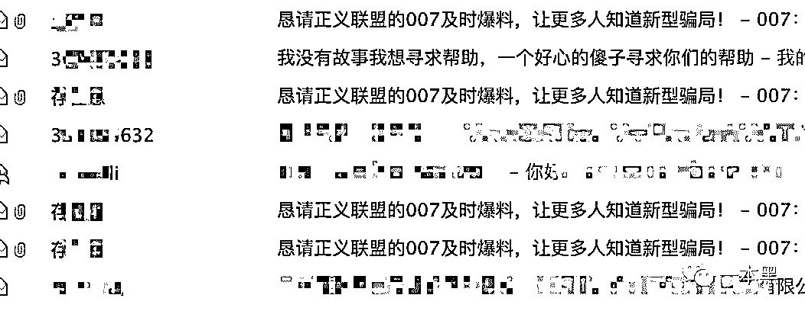

可没想才过了 3 个月时间，平台就暴雷了，投的钱全打了水漂。

出事前这个平台看起来一切正常，还有官方背书，他怎么也想不通会涉及传销。

**他希望我们将此事曝光出来，让更多的人知道。**

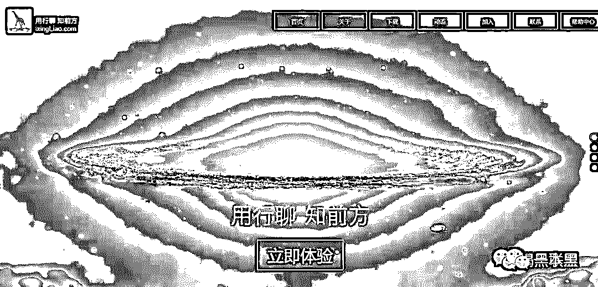

这款 App 的名字叫行聊，公司注册地址在广东省河源市。官方称行聊是一个 O2O 社交平台，功能类似微信+淘宝+支付宝，可以用来导航、购物、发红包以及承接广告位托管。而那个回报率高达 70%的产品是平台内一个叫做广告宝的投资项目，2016 年 11 月上线。

广告宝有两个玩法，第一个是用户通过投资 APP 内的广告位，收取租金和积分。每人每月最多可租 10 个行业广告位+10 个头条广告位（总价值 4 万），最少租一个行业广告位（1000 块）。

> 其实用户就相当于二房东，向行聊租赁广告位，之后再委托行聊进行转租，而用户收租金时也需要向行聊缴纳一定的手续费。

一个行业广告位的月租金是 1000，能收租 700 块；头条广告位 3000，可收租金 2100。租金按天返还到用户账上。

每日租金=（总租金-已到账租金）×.025%，（其中每月可提现的收益为租金的 60%，剩余的 40%自动转化为行聊积分。）

租金每周二可提现，扣除手续费之后就是实际到帐租金。积分不可提现，只能用于商城、加盟店消费。

本金可以在投资 30 天后的第一个星期二提现，当然了，你也可以选择用这笔钱继续买广告位。

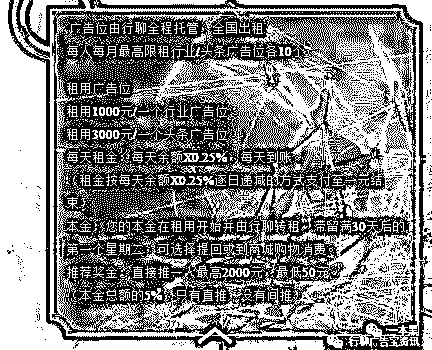

此外，用户拉新也能获得分成。

每成功推荐一人投资广告宝，就能拿到对方投资金额 5%的奖励，奖金上限为 2000，最低为 50。不过规则里明确规定只有推荐人和被推荐人的关系，也就是说最多只有两级，成功地避开了传销的三级限制。

你要是好奇广告位怎么赚钱，行聊会和你说，“你只要买了广告位，我们就能找到人投广告。70%的利润，一分也不会少你的”。

## 

**02** **线上线下两开花**

这么赚钱的平台，怎么能不广而告之呢。于是在河源本地，满大街都是行聊，公车、路牌、住宅楼、电视，各类广告铺天盖地，想不看见都难。

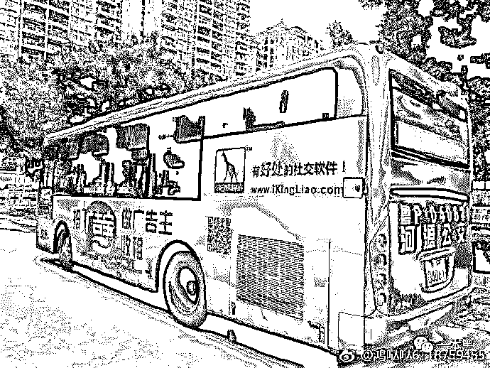

行聊不仅有 APP，还有实体店。从省内到省外，行聊一共开了 214 家直营店和上千家加盟店。至于店里卖的货嘛，emmmm，和你家楼下超市差不多。

行聊还曾推出过云仓，低价为加盟商提供货物批发。

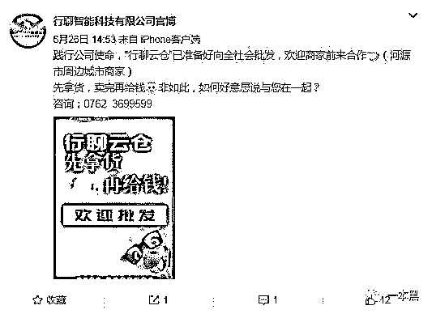

此外，行聊也曾在香港澳门等地注册商标，声称要进军港澳地区。

线上线下两开花的同时，行聊还得到了当地 ZF 的支持。但凡有剪彩、发布会这样的重大活动，相关部门领导都会出席。

有了这层背景，投资者对于行聊再也没有怀疑了。该入场的入场，该拉人的拉人。

从 2016 年到 2018 年的两年里，陆续有三十几万人投资了行聊广告宝，具体投资金额并没有确切的数字。因为等我们得到消息的时候，官网已经被封，APP 也处于废弃状态。

不过在贴吧和微博，**每天都有用户发帖称自己的资金被套牢，少则一两万，多则几十上百万。**

## 

**03** **美梦终结**

2018 年 8 月之前，行聊一直发展的顺风顺水，三十几万用户死心塌地，上千家店铺经营火爆。

然而在 2018 年 8 月 30 号这天，一切戛然而止。行聊的银行账户突然被湖北应城工商局冻结，但此前行聊却未曾收到任何通知。

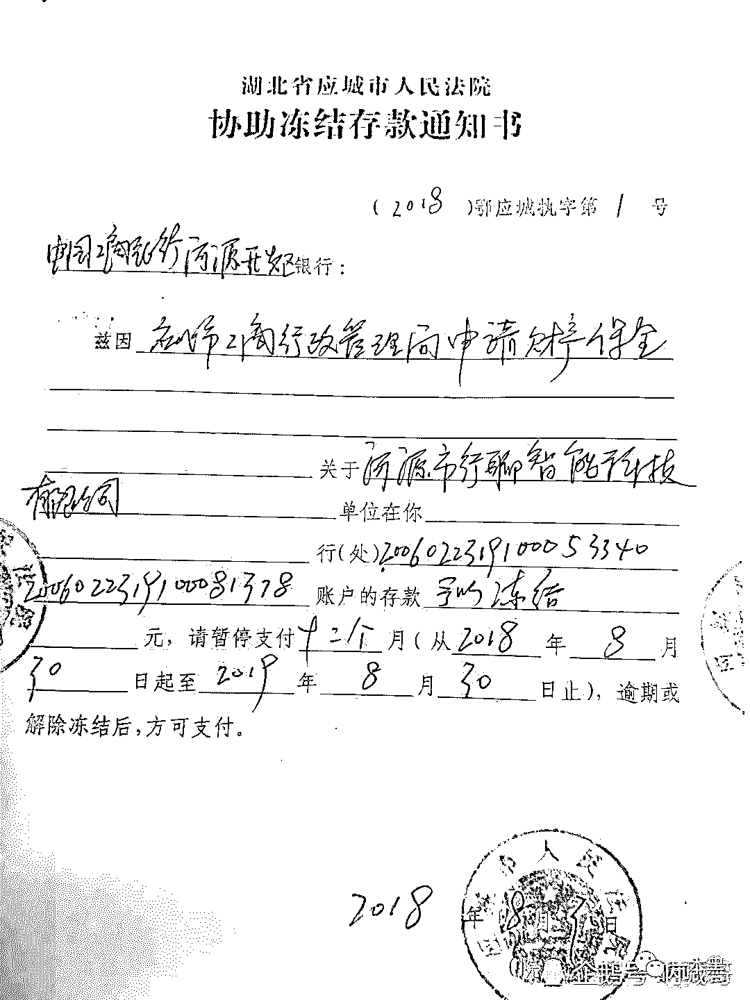

之后行聊的发展急转直下，资金链断裂，全国一千多家店的经营陷入僵局。

为了尽可能减少资金流失，行聊开始限制用户提现，于是急中生智的用户选择用租金和积分去实体店消费。但是此举遭到各大加盟商的强力抵抗，行聊只得再次修改规则，直接限制用户的消费金额。

余额无法提现，积分不能消费，用户开始对行聊的不满愈发高涨，但仍有很大部分用户选择继续与公司共进退。

2018 年 10 月 23 日，应城市工商局在对当地行聊加盟商下发了两张总价值 80 万的罚单后，解封了行聊的银行账户。

**原以为阴霾已散，曙光将至。谁料想这只是个开端。**

一周后，河源市当地公安局又将行聊的账户全部冻结，事先依旧未曾给出任何通知。

2018 年 11 月 30 号，河源市公安局发通告称行聊涉嫌传销，包括公司法人在内的 14 名高管已被刑事拘留。

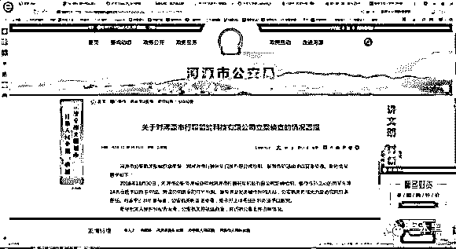

至此行聊的发展彻底停滞，高管被抓，网站被封，APP 停运。三十万用户投的钱再也没有消息，这时他们才明白行聊真的完了，钱再也拿不回来了。

但他们始终不能相信行聊涉及传销，他们不停在贴吧和微博发帖为行聊洗白，理由是行聊存在近三年，办公地点甚至设在当地 ZF 部门楼上，但凡行聊有活动，就会有官员出席。这样一个和官方联系密切的企业，如果是做传销的，为什么还能存在三年之久？

除此之外，行聊还开设了众多店铺，有实际经营活动和场所，并不是空手套白狼，而用户也是心甘情愿投资的，怎么能说是传销呢？

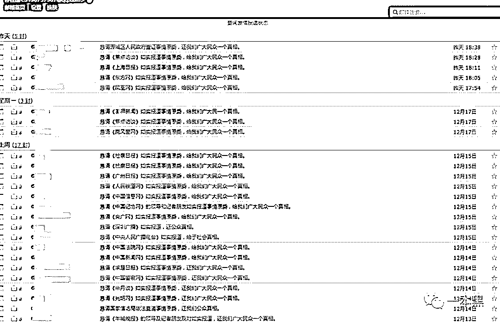

**在行聊的 QQ 群里，至今还有人在问何时解封，准备续投。**

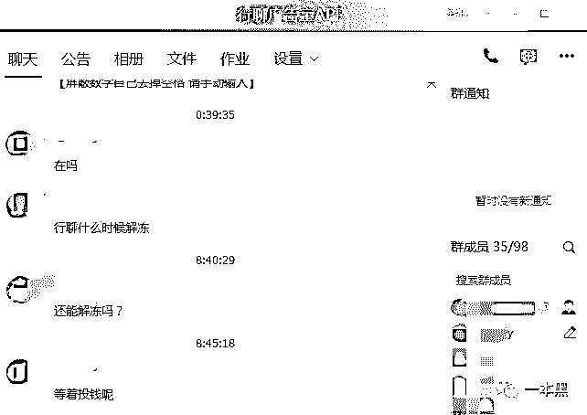

## 

**04 ****解不开的谜？**

行聊已经被警方定性为传销了，用户却始终不愿相信。原因不外乎以下几个：

*   有店铺、有商品

*   有进项

*   用户自愿加入

行聊真的如用户所说的合法合规，没有任何问题吗？我看不见得

**1、840%的年回报率**

按照 70%的回报率，假如我投入 10000，可以获得 7000 的租金，一个月后我拿到本金再继续投资，一年下来光租金就能获得 84000。这已经不是天上掉馅饼来形容了，掉金币也不过如此吧。

**2、到死都返不完的租金**

上面说到匪夷所思的回报率，接下来看看更加不可思议的收益返还时间。每天到账租金=剩余租金*0.25%。随着剩余租金的减少，每天到账的钱会越来越少，返还的周期也会越来越长。

下图是云联惠的的返还时间，万分之五的返还速率，想要拿到 10000 块大概需要 100 年。广告宝的返还速率为 0.25%，具体时间，自己算算吧。

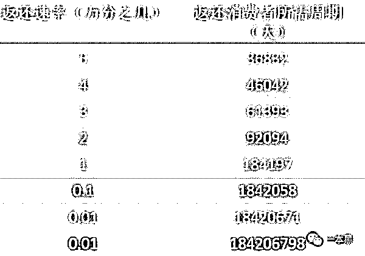

**3、迷糊的造血能力**

广告宝靠什么赚钱（造血能力）呢？根据行聊内部的这张图来看，盈利主要来自两部分：

> 内部：用户的代理费+商户缴纳的平台入驻费、排名优化费
> 
> 外部：投资（银行理财、地产、能源）

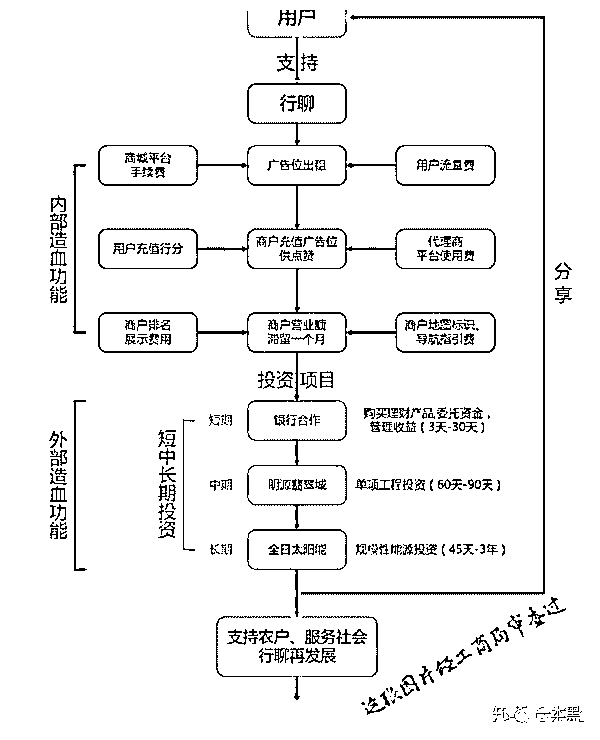

不论是内部盈利还是外部投资，行聊没有任何属于自己的资产，一旦用户投资中止就会跨盘，而所谓的外部投资项目，**不论是房产还是能源，其回本速度远赶不上跨盘速度。更别说支撑 70%的回报率了**。

这些造血功能无非是行聊为了稳定用户建造的空中楼阁罢了。

**4、以慈善稳形象**

或许是起步较早，行聊并没有像霸屏天下这类盘一样打造全产业链生态圈，更没有进军娱乐圈。

但行聊似乎和王子清有着一些共同点，都喜欢去乡村送米送油送温暖。

行聊 2017 年发布的一条微博中曾写道，团队历时两个月在江西地区送出了价值三万块的物质。**一手招商，一手慈善。好得很。**

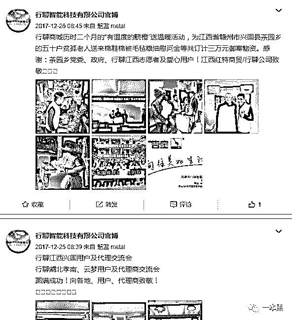

低调的行聊一点点地撒网，本想着等鱼儿肥了再收网，没想到被打了个措手不及。

类似的资金盘还有很多，譬如打着各种名号的广告宝产品、霸屏天下这类发圈躺赚的项目。**这些项目，哪一个是无辜的呢？**

* * *

在微博上不停地有人@崔永元和各大媒体，他们希望这件事能够引起媒体的关注，甚至还有些阴谋论者发布言论称，行聊是不同地区之间的利益争夺的牺牲品，并非是公司本身出了问题。

他们想要去上诉，将行聊的罪名由传销改成诈骗。因为，传销缴获的资产归国家；诈骗的钱，或许有可能返还给受害者。

对于这种行为，我不知道该说他们天真还是较真。

不论是资金盘还是其他形式的传销，**说到底都是少数胆大的骗子玩弄一大群贪财的傻子。**

只要进了传销，就不可能全身而退。因为你想要的是利息，可别人要的是本金，甚至是你的全部。

参考资料：

*   行聊骗局收场！河源行聊公司涉嫌组织、领导传销活动的黄某先等 14 名高管被刑事拘留！ 最河源

*   你花多少，云联惠返多少？醒醒，你可能要等 100 年， 腾讯较真平台（Fact_Check）、腾讯大金融安全

*   这个盘活不过国庆，无路可套

还原事实｜专扒黑产

微信 ID：darkinsider

知乎 一本黑

微博 一本黑 007

投稿、爆料、招聘、转载

请联系微信：chenchen_19940612