# 司机吞了我的手机，我查到对方是个惯犯，顺便黑了一个 iPhone 钓鱼网站

> 原文：[`mp.weixin.qq.com/s?__biz=MzU4ODAwNzUwMQ==&mid=2247485214&idx=1&sn=d0a165205aa3e98590d2345f464ee630&chksm=fde2163cca959f2ae2712cd9fa72e4769b8e7a39dfb91206826655ecde29b9a7b1cafa701aed&scene=27#wechat_redirect`](http://mp.weixin.qq.com/s?__biz=MzU4ODAwNzUwMQ==&mid=2247485214&idx=1&sn=d0a165205aa3e98590d2345f464ee630&chksm=fde2163cca959f2ae2712cd9fa72e4769b8e7a39dfb91206826655ecde29b9a7b1cafa701aed&scene=27#wechat_redirect)

最近，很多人在后台问我，好久没在文章中看到老师傅的身影了，也很久没看到老师傅抽着烟搞些骚操作了。

还有读者说，有段时间自己生病住院，躺在病床上把一本黑所有的文章看了个遍，很佩服老师傅的技术，**线上可“社工”，线下能“追凶”**。通过仅有的细节和线索，找到事件背后的始作俑者。

其实，我自年后就没见到过老师傅，后来他给我打电话说，想休息一段时间，于是跑去某个小岛国家度假去了，直到前段时间才回来。

真他妈的浪啊~

文 |老黑

回来见面那天，我给老师傅递上一根烟，笑着问他那边的姑娘怎么样。不对，是问他度假玩得怎么样，他给我巴拉巴拉说了一堆，说那边的姑娘，妹子，风景不错，挺适合放松的。

其中有个有意思的事情值得说一说。

老师傅在度假结束回来的时候，飞机刚落地，打了个出租车准备回家，出租车是正规出租车，在车上也和司机吹吹牛什么的，气氛还算愉快。

到家以后，老师傅一摸口袋，卧槽，**TM 的手机不见了**，这手机才用了三个月，几乎是全新的。

老师傅把自己全身上下摸了个遍，就像度假的时候......可还是没找到。

你说其实丢个手机也没什么的，大不了再买一个，主要是老师傅的手机里有很多工作资料，电话什么的。

老师傅当时的心立马咯噔了一下，心想，应该是落在刚才的出租车上了。

老师傅慢慢冷静下来，首先得想想该怎么联系司机。

因为下车的时候司机给了发票，老师傅掏出票看了看，上面有车牌号，粤 Bxxxx，既然有了车牌号，老师傅赶紧联系了当地的出租车运营公司。

想通过车牌号找到司机的联系方式，打了几个电话后，老师傅拿到了司机的手机号码。

此时，距离手机丢失至少过去了三十分钟，老师傅按照号码拨了过去，并说明了来由，然而转折性的事情发生了，司机一口咬定没有看到任何东西，然后就把电话给挂了。

挂了......

老师傅心想卧槽，就 TM 这么一句话就把我给打发了？这不是翻脸不认人吗？

随后，老师傅又换了个私人号码给丢失的手机打了过去，电话接通后，被挂掉，再打，又被挂掉，再打，关机了。

老师傅再次联系出租车司机说：“师傅，如果你真的看到了我的手机，麻烦你给我，如果你想要钱，我给你就是了，因为手机里的资料对我来说很重要，你就是拿到了没有密码也不能解锁啊，你也用不了，何必呢？”

司机那边气定神闲地说：“找到了我会通知你的。”

这时候老师傅知道，想找到手机估计没戏了。

**01****干他娘的一炮**

第二天下午，老师傅的私人号码收到一条短信，一看，瞬间明白了。

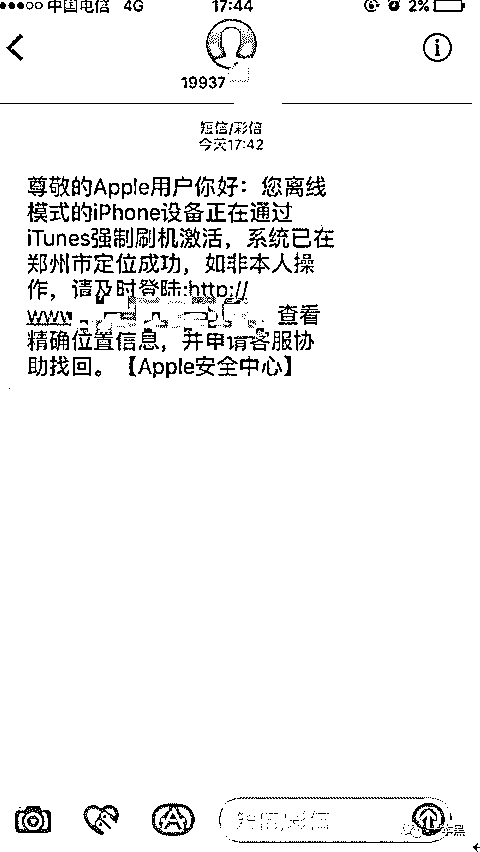

敢肯定，**这百分之百是一条钓鱼短信。**

肯定是司机拿老师傅的手机去找人强制刷机，因为老师傅给司机打过电话，不然老师傅的私人号码对方是不会知道的。

估计他刷机后进不去系统，所以想到了用钓鱼短信的方式获得老师傅的 ID 和密码。

可能有人就要问了，为什么能一眼看出来这是钓鱼短信。

首先，刚才说了，钓鱼短信是发到老师傅的私人号码上的，老师傅给对方打过电话，不然对方绝不会知道，这很蹊跷。

其次，钓鱼短信中的域名一眼看上去就是假的，这是职业敏感度。

所以，老师傅很确定，自己丢失的手机一定是被司机给独吞了。

当时的老师傅很气愤，又很委屈。心想，**从业这么久，没被人搞过，今天居然栽在一个出租车司机的手里。**

到家后，老师傅丢下行李箱，饭都没吃，掏出笔记本就开搞，打开钓鱼网站之后，网页是这样的。

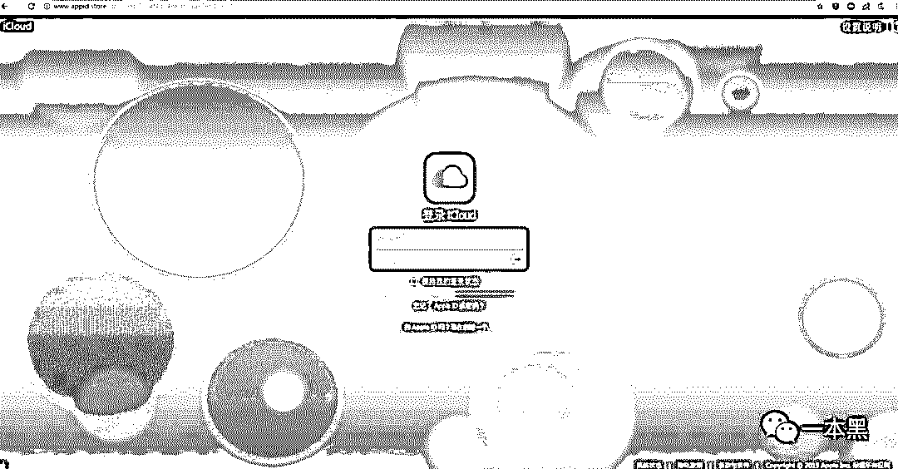

你还别说，肉眼看着还挺像那么回事，要是没点网络安全知识，绝对不会怀疑这是一个假网页，屁颠屁颠就中招了。

其实，对没有网络安全知识的人来说，你点一下下面的超链接，你会发现都是不能点击的，它只有一个表单提交功能。

随后老师傅随便输入了一个账号和密码，提交之后立马弹窗，显示账号密码错误。

老师傅心想：“真 TM 不要脸啊，还留了这么一手，怕你自己输入的密码不对，给你显示错误，你看到后肯定会很着急，所以会一个字母一个字母地敲进去，这时候，后台已经收到并记录下了这个账号和密码。”

**其实到这一步，对方已经完全掌握了你的账号和密码，也就是说，你的手机已经不是你的了**，他可以成功激活进入系统，把数据清理干净，然后以一个很低的价格在市场上出售。

**如果还是进不去，对方会拆零件。**

老师傅越想越生气，吸完最后一口烟，用力地往烟灰缸里摁灭，就敲下了问候对方的几个字母给发送了过去。

这是人与人之间互相“关怀”的方式。

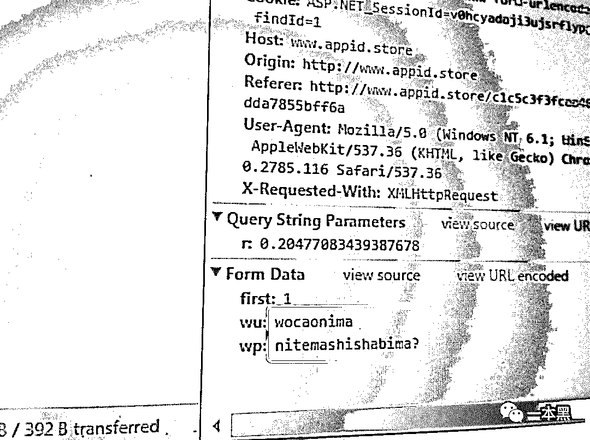

老师傅一边整理思路一边看抓包请求，发现网页是 aspx 程序，当时主要是太气了，什么操作都没搞，先 ping 了一下对方的域名，发现没有用到 cdn，解析出来的是真实的 IP，老师傅登上自己的服务器，打开脚本先来个十分钟的【**底剁死**】。（谐音）

**老师傅说，这是“计算机基础知识”的 pro 版。**

（什么是底剁死：1、比如一家只能容纳十人的餐厅，突然冲进去 100 个人，严重影响店家的正常营业。2、比如老师傅去度假，本来只能泡一个妹子，结果来了 100 个妹子，老师傅束手无策。）

当然这个服务器只有 100M，老师傅心想，对这种小服务器应该足够了，一边打一边看 cmd ping -t ip，就看要多久能把他打死。（目的就是让对方 XXX 不能正常工作）

对方是一个香港的服务器，流量不是很大，只是他们的服务器太渣了，所以不到十秒钟就挂了。（**技术性的东西可以略过，总之老师傅通过技术让对方没办法再钓别人的账号密码了**）

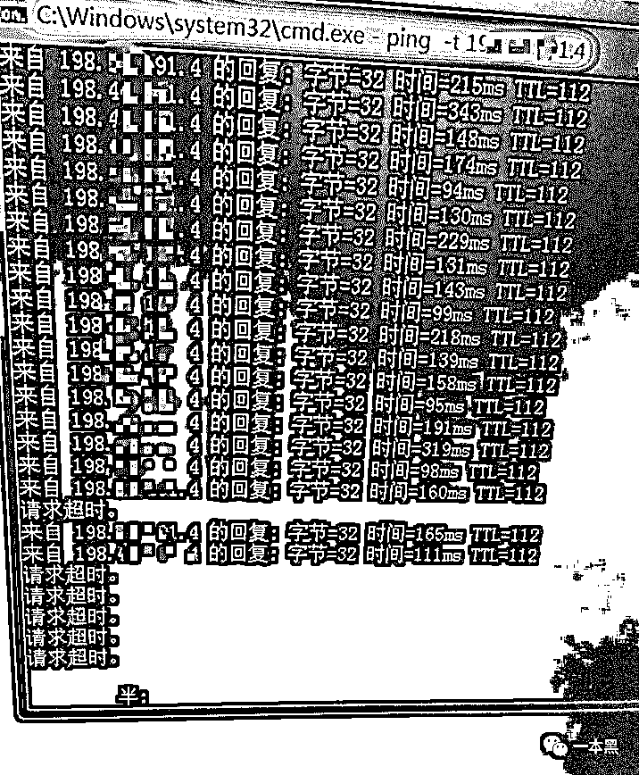

此时，对方的 XXX 已经挂掉，网站也打不开了。

**老师傅心想：“我以后见你一次打你一次，直到你换域名换 IP 为止”。**

不过，当我在写这篇文章的时候，这个网站还能打开，但钓鱼程序是没有了，显示 404，应该是转移到其他地方去了，毕竟老师傅连续打了好几天。

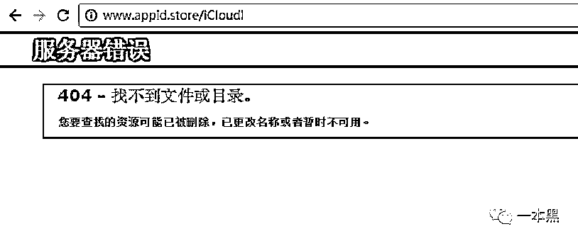

又过了几天，老师傅还是不解气，心想只是 D 了一下对方 XXX，拿到的线索也不是很多，这和平常比起来，似乎还差点东西。

**02****捅老窝，拿数据**

后来，**老师傅通过一个很简单的漏洞，找到了对方的老****巢**，因为对方账号密码是弱密码，老师傅很轻易地就进入了后台。

进入后台后，老师傅这才发现，原来对方是有目，并且比较专业的，通过钓鱼短信钓 Apple  ID 账号的一伙人。

老师傅从后台里导出了一份表格，表格里清晰的记录了几百个通过钓鱼网站提交上去的 Apple  ID 账号和密码。

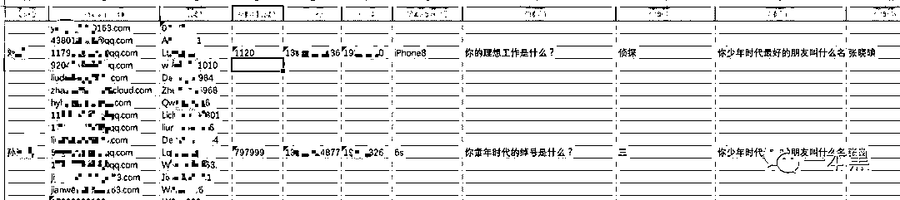

也就是说，**对方通过钓鱼短信的方式，拿到了这几百个手机的账号密码**。

至于对方是如何拿到这么多苹果手机的，老师傅猜想，要么就是主人丢失，要么就是专业扒手。

于是，我回想起曾经看到的一个新闻。

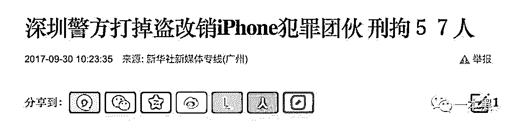

这种 iPhone 钓鱼链接的出现，是从一起普通的扒窃案入手的。

扒手团伙通过扒窃手机，然后集中进行销赃，方式主要有：查码估价、ID 解锁、换机、流入市场、重新销售。

而老师傅遇到的这种主要是 ID 解锁，就是通过发送钓鱼链接的方式，让那些没有网络安全意识的人主动输入自己的账号和密码，从而进行解锁。

**03 ****“追凶”，请你喝茶**

最后，老师傅还是不甘心，总想再干点什么，整理了收集到的各种琐碎信息，再加上 IP 位置，老师傅确定，自己的手机就是被出租车司机拿到的。

通过司机的电话，老师傅在微信上进行搜索，居然还真搜出来一个人，从对方的微信号来看，前面 zyq 三个字母应该是对方的姓名缩写，后面的一串数字暂且猜测为 QQ 号码。

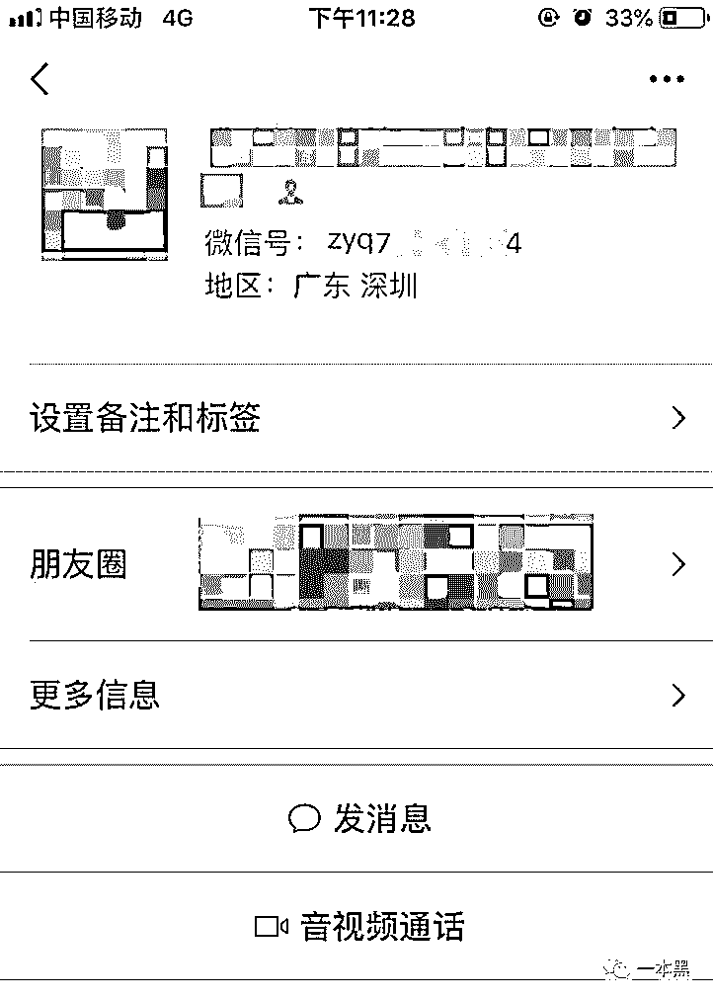

添加并通过后，老师傅翻看了对方的朋友圈，从朋友圈内容可以确定，此微信号就是出租车司机本人的微信号。（朋友圈内容基本都是与出租车业务相关）

另外，通过观察对方的朋友圈，老师傅发现对方和深圳某会所有合作关系，通过介绍客源、拉客等方式赚取提成。

看来这哥们也是个“性”情中人啊！

老师傅顺藤摸瓜，通过微信号后缀的数字在 QQ 上进行了搜索，在对方的主页以及空间内也看到了相关符合对方身份的内容。

于是，在掌握了对方的 QQ 邮箱后，**老师傅想以牙还牙，给对方发送一个钓鱼邮件，可等了好几天对方也没有上钩。**

后来老师傅一想，一来对方年龄得有个四十来岁，应该不会玩邮箱，所以**又以手机短信的方式给对方发了一条钓鱼短信。**

这期间，老师傅用手机号在支付宝进行了搜索，找到了对方实名后的账号信息，资料显示，该司机名为 X*清，再结合之前微信号的前缀 zyq，**对方应该叫张*清，湖北人。**

对比头像，老师傅更加可以确认，**此人就是当时出租车上的司机。**

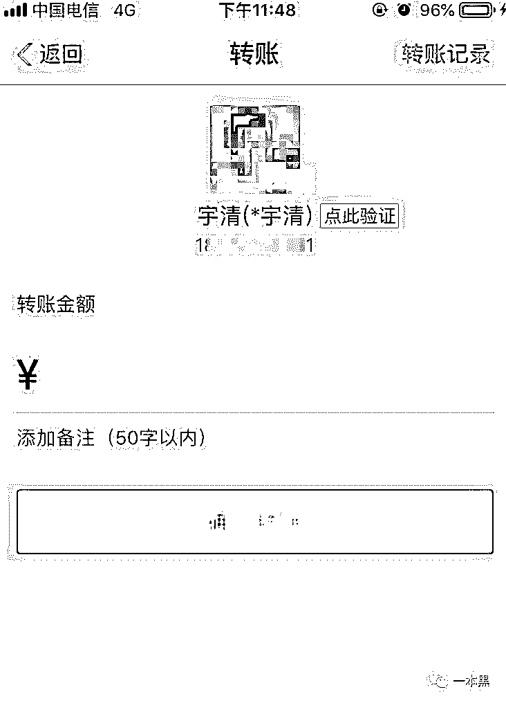

第二天，老师傅发现鱼儿上钩了，对方在凌晨三点钟点击了链接并提交了自己的信息。

**通过 IP 地址查询，老师傅确定了对方所属深圳某区**。

想要查到对方的具体位置并不难，考虑到此人开出租，位置可能会随时变化，所以**老师傅想直接查他的家庭住址。**

不过这次老师傅并没有通过“射工”手段，而是通过打电话的方式。

**老师傅找来一个新号码，****假装成某快递公司的快递员**，给对方打过去，告知对方有一个快件因为地址不清晰，需要其提供一下具体地址，这边方便快递人员送货。

就这样，**老师傅轻松“骗”到对方的详细居住地。**

**这种手段，美其名曰“物理渗透”。**

到这里，老师傅没在继续下去，只是把查到的信息进行了汇总，编辑了一条短信给对方发了过去。

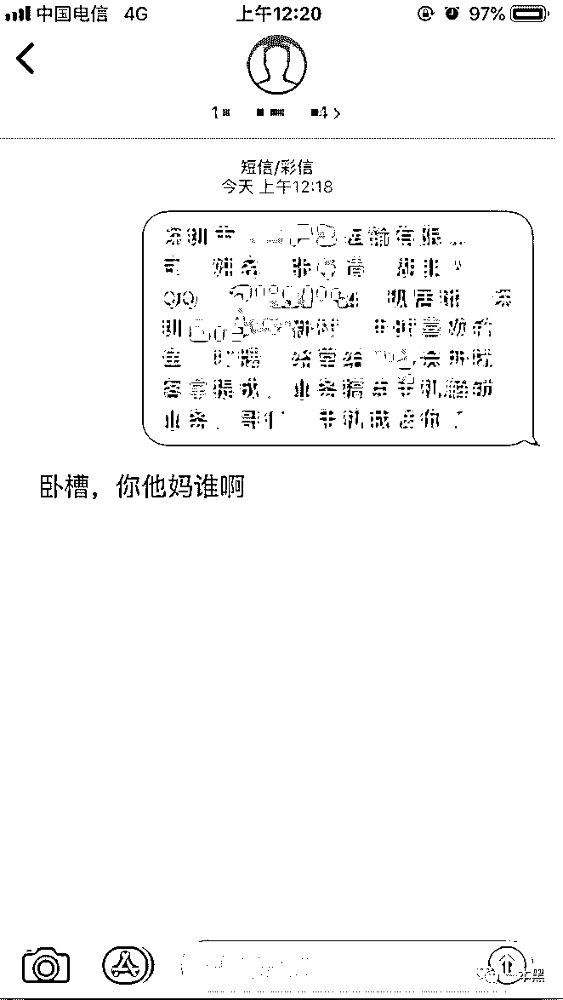

随后，**老师傅把这些信息同步给了做刑侦的朋友。**希望他们能打掉这一团伙，让社会上少一些作恶的人。

至于老师傅的手机，是不可能再找回来了，因为即便对方无法获取 Apple ID 的账号和密码，他们也会把手机拆了卖零件。

这篇文章是老师傅的亲身经历，写出来只是想让大家知道有这种事情的存在，丢手机后存在着这样一个黑色产业链。

**老师傅提醒，手机丢失后，一定不要点击任何短信或邮件链接，直接上 iCloud 官网追踪点位设备。**

接到 400 电话要求回答 AppleID 验证问题答案的话直接挂掉，苹果客服不会这么干。

其实说了这么多，对一件事情不了解，主要还是处于行外的状态，要是人人都有点网络安全知识，这种小伎俩是完全可以识破的。

最起码，看到这种钓鱼链接应该立马怀疑他的真实性。

* * *

文章写完，我和老师傅坐在一起抽烟，继续聊他度假期间约过的妹子，看过的风景。

还原事实｜专扒黑产

微信 ID：darkinsider

知乎 一本黑

微博 一本黑 007

投稿、爆料、招聘、转载

请联系微信：chenchen_19940612

# 

> 原文：[`mp.weixin.qq.com/s?__biz=MzU4ODAwNzUwMQ==&mid=2247485209&idx=1&sn=a35571dedc7e73c32c16b36a55e51939&chksm=fde2163bca959f2d3cf681b68d0fad1abb8cdcecf74502eafc8ef9de1862cde9390aaea8b400&scene=27#wechat_redirect`](http://mp.weixin.qq.com/s?__biz=MzU4ODAwNzUwMQ==&mid=2247485209&idx=1&sn=a35571dedc7e73c32c16b36a55e51939&chksm=fde2163bca959f2d3cf681b68d0fad1abb8cdcecf74502eafc8ef9de1862cde9390aaea8b400&scene=27#wechat_redirect)

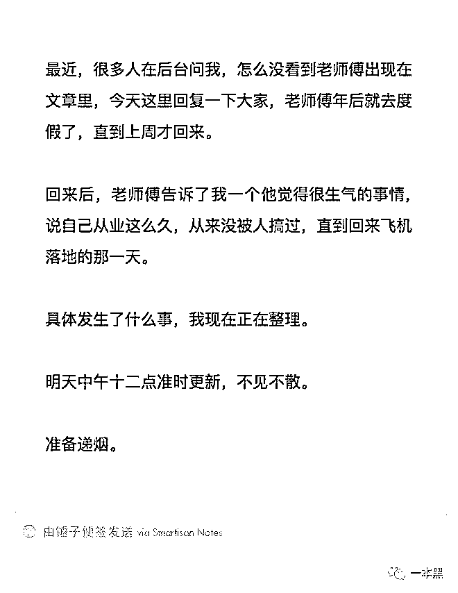