# 我有一个 PPT，能让 10 万变 100 万，最高回报率 6466%，你信吗？

> 原文：[`mp.weixin.qq.com/s?__biz=MzU4ODAwNzUwMQ==&mid=2247485198&idx=1&sn=df20c22de2791d5d642ea4b8c4e5f4aa&chksm=fde2162cca959f3ae94b81a7edada7bb236eab9c1f056d806c0ae5863880ed192145e879bdf1&scene=27#wechat_redirect`](http://mp.weixin.qq.com/s?__biz=MzU4ODAwNzUwMQ==&mid=2247485198&idx=1&sn=df20c22de2791d5d642ea4b8c4e5f4aa&chksm=fde2162cca959f3ae94b81a7edada7bb236eab9c1f056d806c0ae5863880ed192145e879bdf1&scene=27#wechat_redirect)

近期有读者在后台爆料，称有陌生人在添加其微信好友后，向他推荐一种名叫电影版权认购的投资项目，起投价在 10 万以上。

至于投资回报率嘛，参考下图：

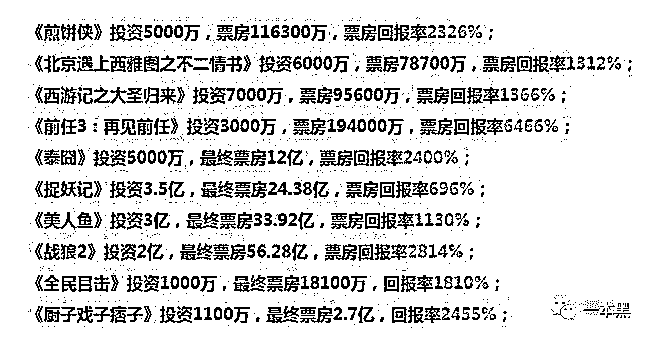       

噢哟，最低回报 10 倍起，这么赚钱的项目自己不做到处找人。一般来说呢，这种不是有病就是有鬼。

so，我又去问价了。这次没有被任何人拉黑！但是被一个小姐姐强行说成是同行。

文 | 喵叔

**01 ****PPT 圈钱**

根据爆料人的线索，我添加了对方的微信。为了更好地了解行情，我又通过其他的渠道同时加了其它 4 个人的微信、1 个 QQ 群以及 1 个微博用户。

4 个微信好友里，有 3 个向我推荐《拳皇 2019》这部电影，他们给我发的资料有一个 23 页 PPT、4 张海报以及有 1 个不知所云的预告片。

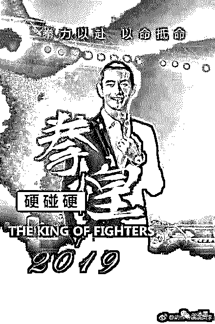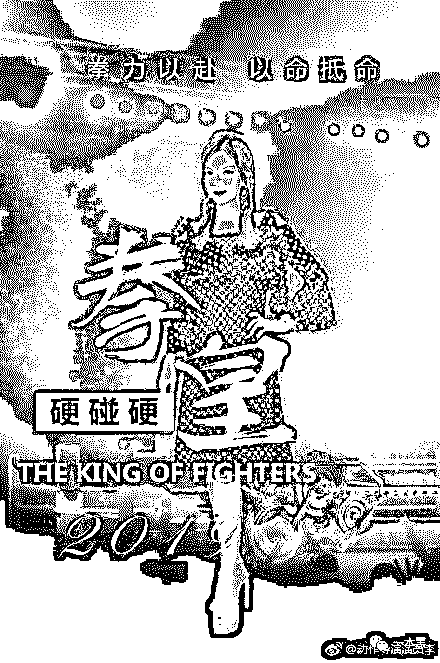      

来源：见水印

当我看到海报的第一眼，心中有一万头草泥马奔驰而过。这 TM 什么海报，坐在马桶上扣的图吗？赵薇见了会流泪，黄晓明看了要打人。

至于电影剧情，他们称是硬汉电影，和敢死队、速度与激情类似，具体情况不能和我透露。因为，**剧情属于公司机密（）**。

剧情不清楚也没关系，起码黄晓明和赵薇在，演员方面有保障。结果他们和我说，这俩只是友情出演。那不就是客串？只是客串几个镜头就把他俩名字放在演员表第一位了？

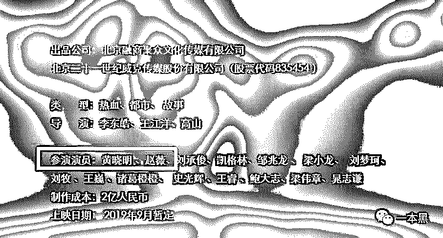       

演员表里，除了赵薇、黄晓明，其余都是不认识的十八线小明星。就这么个破电影的**制****作成本居然还要两亿。**

虽然内心极其不屑，但还是要假装感兴趣继续问。对于电影本身，他们都会刻意避开不谈，只一个劲地说这个项目有多么的赚钱。

我问起投价是多少，结果他们 1 个说 5 万，1 个说 10 万，还有一个叫梦的小姐姐报价 20 万。我问小姐姐，起投价是怎么划定的，她建议我多去了解一下电影知识。

 

我就问个价，怎么还质疑我的文化水平了？我只好不耻下问，于是她给我发了一个 PPT。

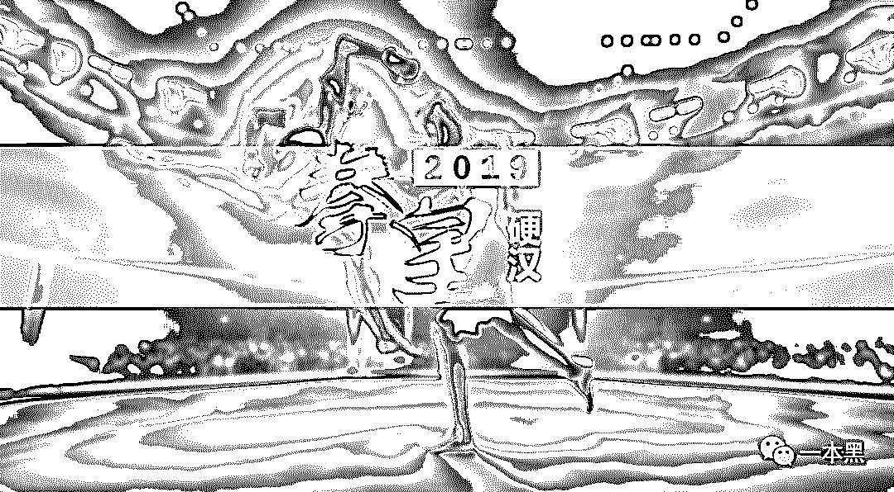

得知我是个投资小白时，她的吹嘘就开始了。

：怎么认购版权？

：打款到片方，签版权认购合同，然后等电影上映分票房分红。

：为什么片方自己不赚钱要让我们参与投资？

：因为拍一部电影可能需要两个亿，但是出品方的资金不够就需要通过这种方式转让一些收益权（实际上就是融资的一种手段，但是他们不承认）来换取投资。这样说你能明白吗？

：怎么参与呢？

：把钱打到对公账户，之后我们会给你寄合同，一式两份，你保留一份，片方保存一份。合同就是证明，到时候靠这个分钱。

：分红怎么算的，是固定比例吗？

：这个不一定，每部电影都不同，一般在 35%——45%。

投资者分红＝［票房总收入－票房总收入×（5％国家电影基金＋3.3％国家税收）×40％］  ×90％×投资比例。这是票房分红，另外还有网络版权分红 50%。票房分红在电影下映后一次性结清，网络收益每三个月结一次。

：你们是哪个公司的？有融资资质吗？

：江苏*派文化，我们是这部电影的联合出品方。资质当然有，你可以来公司看。

：那怎么投资，网上签合同还是？

：达成合作有两种方式：

1.去影视公司实地考察，然后当面签订合同，然后打全款到影视公司对公账户即可。

2.预付 10%的投资款到影视公司对公账户，然后影视公司安排给您以邮寄的形式把合同一式两份发给您，收到合同后，两份都签字，回寄一份给影视公司，自己留一份，然后三个工作日内打尾款到影视公司对公账户即可。

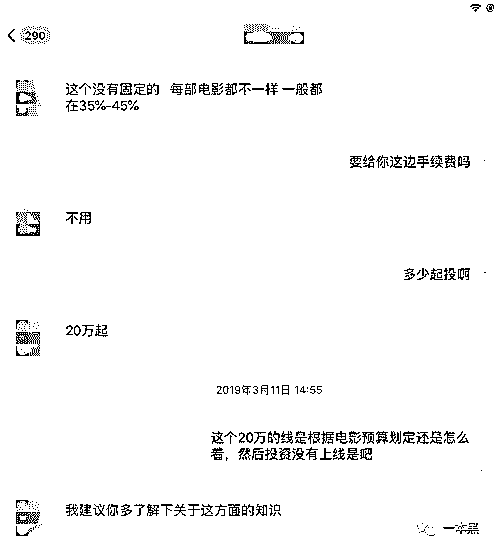 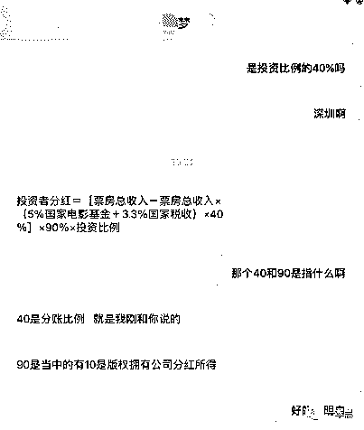 

问完这些之后小姐姐就开始问我是去他们公司签合同还是先打预订款。吓得我赶紧下了线，毕竟 20 万我是没有的。

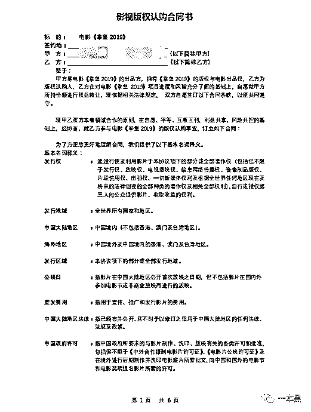 

**02 ****傍大款宣传**

由于拳皇 2019 这部电影看起来太不靠谱，我又咨询了另一个自称是 90 后的小哥，虽然看照片他像 80 年的。

小哥给我推荐一部名叫《守护神》的电影，并且慷慨地告知了我这部电影的剧情大纲：

> 柬埔寨暹粒市，隐居在此的中国拳手高然为逃避往事的创伤，也为躲避岳父争夺女儿的抚养权，放弃了拳击事业，以陪富二代练拳的方式赚钱养家。高然没能逃过有钱有势的岳父的眼线，女儿却意外被第三方的神秘人抢走。高然救女心切，循着蛛丝马迹，独自寻找神秘人。在卧底警察朗森和岳父管家桑哲的帮助下，高然找到了神秘人的老巢，解救了众多被拐卖用于药物研究的儿童，唯独不见女儿的踪影。当他历经令人窒息的磨难后，终于来到了神秘人的面前，豁然发现女儿被绑架的缘由，竟然和自大的岳父多年前安排的拳击比赛有关，这一刻他新仇旧恨一起算，要成为女儿真正的守护神。

小哥说他们是流浪地球的出品方北京文化的合作伙伴，叫北京万*影业，这部电影就是他们一起投资的。怕我不信，小哥还一连发了好几个视频给我。

小哥强行向我安利这部电影，因为他说这部电影有很多香港明星参与，譬如：曾志伟、李子雄、安志杰。我说除了曾志伟其他都不认识，小哥表示很惊讶。然后给我来了一波回忆杀。

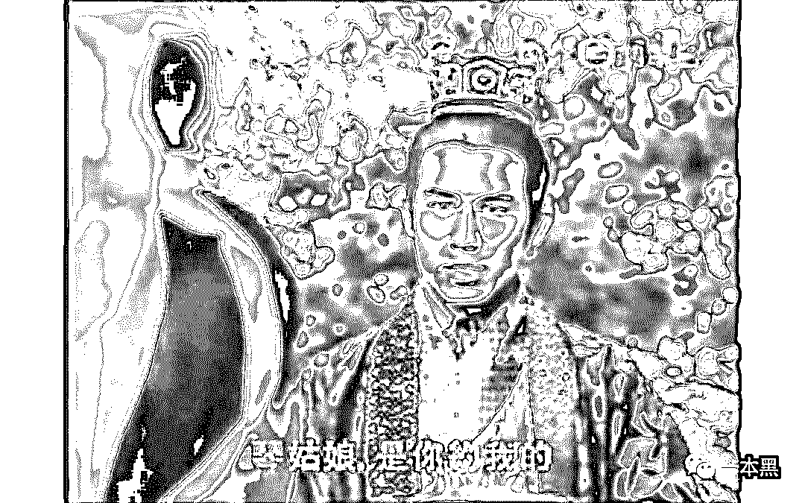  寻秦记剧照

鉴于我对这部电影实在不感兴趣，小哥紧接着又推荐了一部名叫《十三猎杀》的电影，这部电影和其他的有些不同，看起来似乎正规很多。

微博上有片方的官方微博，百度上有宣传通稿，爱奇艺上还有剪彩视频。

据说这部电影的投资约为 7000 万，预估票房可达五六亿。这部电影目前已全部拍摄完成，正在后期制作阶段，预计今年下半年上映。

小哥说如果我投这部电影，按照比例，投 10 万差不多可以分到 30 万。半年时间，10 万变 30 万，我有点慌。

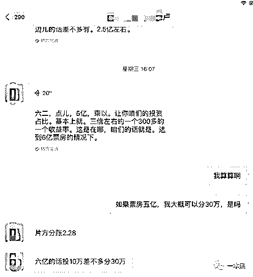 

我问小哥如果票房达不到预期是不是会血本无归，他说不会，还是有分红的。

“那如果票房低于成本，即使有分红，我还是亏的。”小哥没有回答我这个问题。反而向我推荐了他朋友公司的一部电影——3 月 29 号上映的《人间喜剧》，他说猫眼上几十万表示想看，票房不会差，而且马上就要上映了，风险特别小。

结果六分钟以后，他就说 10 万投不了人间喜剧，起码得 13 万。而且这个还是他特地帮我争取的，一般人投都要 26 万起。

我说只有 10 万，凑不出那么多钱。小哥让我先打定金，剩下的找朋友借。

什么都还没谈就让我打钱，这速度有点太快。于是我在网上搜了搜，看到人间喜剧剧组发布的声明，声明里称片方从未以任何形式进行该部电影的众筹或是融资。

       

当我向小哥对质时，他却说**“想投资肯定是有渠道的，你不是圈里人，不知道罢了。”**紧接着小哥又向我保证说不靠谱的肯定不会让我参与。

聊到这，小哥终于开始自我介绍了。他说自己姓陈，90 年的，让我叫他陈老师。陈老师还大方地公布了他的电话号码。

对此，我深表感动，然后下了线。

**03** **投资的奥秘**

以上仅仅是电影投资市场的冰山一角，在我加入的一个 QQ 群里，每天都会冒出无数的新电影等着你投资。

不论是导演、演员、制片方没有一个是你认识的，他们就像是从石头缝里蹦出来的，在中国电影普遍不景气的时候以天神之姿降临在你面前。

而这些所谓的电影投资项目推广人没有一个可以拿出证明自身的资料和融资证明，通用的资料是 PPT（当然这只是销售这个环节）。

一般在电影正式开拍前，片方会在各大媒体发通告，并入驻各大社交平台，作为影片宣传的渠道。

但是以上的电影，除了《十三猎杀》以外都没有官方微博，而《拳皇 2019》的宣传海报竟一个名叫“动作导演演员李”的人发布。

更诡异的是，这个演员李是销售们认可的官方渠道。因为他们给我的资料都带着演员李微博的水印。

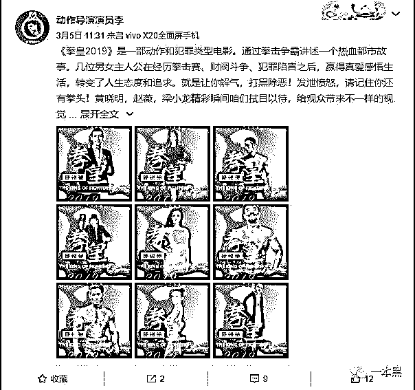

图片：来自演员李微博

演员李的资料显示他出生于 1995 年，2016 年毕业于江西科技职业学院，现就职于中国武术协会，从事武术教练一职。

或许是机缘巧合他进入了娱乐圈出演了电视剧《飞龙攻守道》中的一个角色。从此以后他的标签多了演员这一项。此外他还承接一些明星商演等活动。

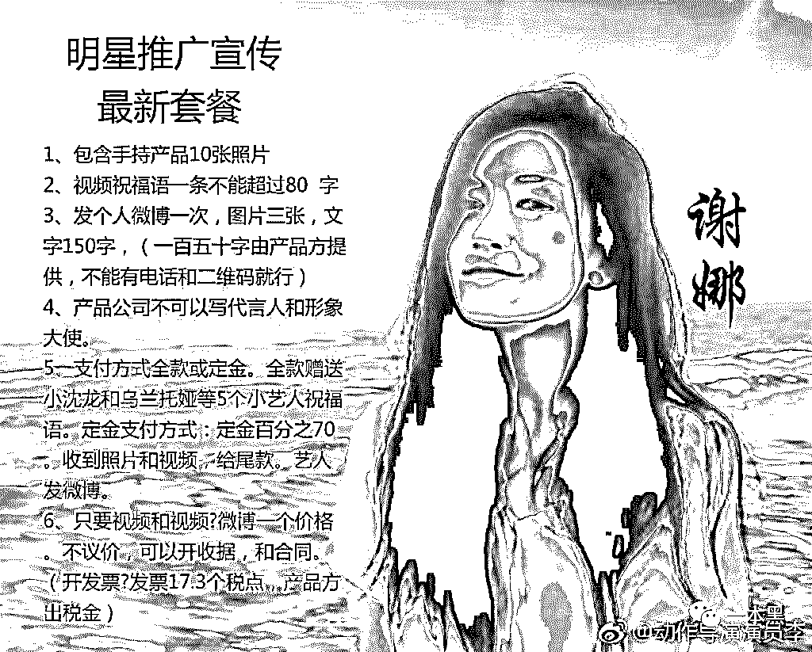

     图片：来自演员李微博

从 2019 年 3 月开始，他开始进入电影投资领域，3 月 4 号他发布了《拳皇 2019》的宣传剧照，此后他发布的每一张关于这部电影的照片，都会在上述销售们的朋友圈中。

尽管演员李从未表明自己与拳皇这部影片之间的关系，但我们不难猜测他和这部电影（骗局）之间的关系。

不管是演员李还是《十三猎杀》的官方微博，他们除了发布与该片有关的讯息（一般不会超过 20 条）就是和各大媒体或是演员攀关系，借此提高自身的可信度。演员李就多次转发甄子丹的微博，并称他为师兄。

销售们则会套用某些上市公司的背景，比如《十三猎杀》的销售多次和我提起北京文化，甚至在他们发布的通稿以及官方网站中，也将北京文化定为主角。

而在演员方面，销售们提供的每一部电影，似乎总有一两个你听过的名字，但实际上那些演员要么是去客串的，要么根本就不会去参演。

如果你好奇这些筹来的钱去哪了，我会告诉你——还是拍电影。

我咨询了一位业内人士，他告诉我说，真正好的电影不会缺钱，更不会靠你的十几二十万，因为这些钱连剧组一天的开销都不够，即使缺钱也不会以这种方式筹钱。所谓的电影版权认购 99%都是骗局，是一些上市公司洗钱的工具。如今股市不景气，却特别适合割散户的韭菜。

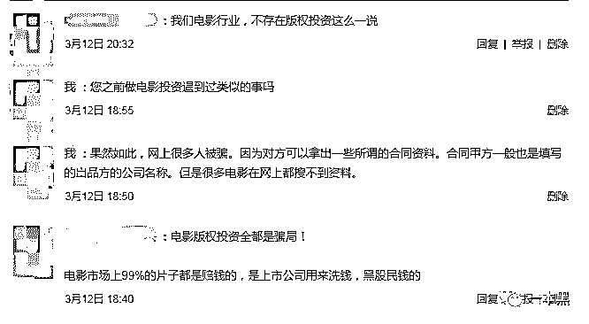

剩下的 1%是《大鱼海棠》这种通过正规渠道众筹的电影。而这种情况少之又少的。

我们所见到的电影版权投资筹来的钱的确是用来拍电影，但最终拍出来的东西（姑且称之为电影）最终能否上映还不一定，能上映的基本都是血亏。而你投进去的钱，会亏到内裤都不剩。

电影版权认购筹来的钱，一小部分拿去拍垃圾电影，另外的大头，相信你也知道去哪了。

**04** **我是卧底**

在百度上搜索电影版权投资，有几十万条问答，其中绝大部分是托，来洗白的。剩余的自然都是讲述被骗经历，想要拿回本金的。

不止是百度，知乎、贴吧、豆瓣，只要有问答的地方，就会有水军。不止在网络世界，现实世界也是如此。有网友爆料自己父亲差点被亲戚拉进电影版权投资的坑，而罪魁祸首竟只是两页纸。

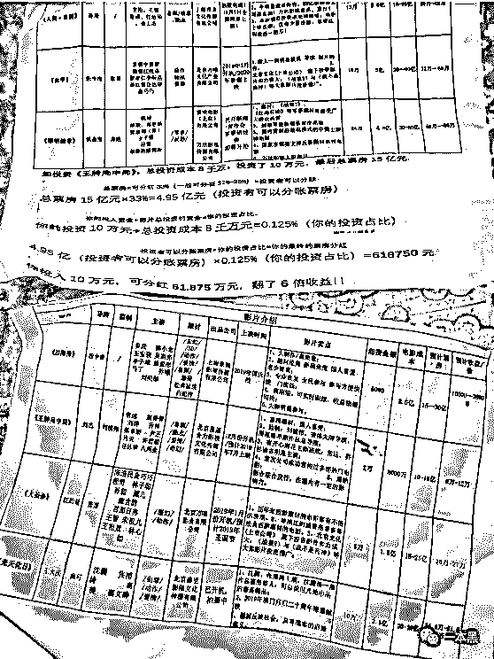 

来自豆瓣网友爆料

**在中国电影普遍不景气地情况下，80%的电影都处于亏损状态**，更遑论这些粗制滥造的影片。

而那些销售的话，一个字都不要信。在他们给出的分红公式里，除了税和开支就是可分的利益。

但实际上根据现如今的电影分账模式，一部电影的票房在扣除 3.3%的营业税和 5%的电影事业专项资金后，剩余的钱是由电影院、发行方和制片方三方按比例共享，其中影院占大头 55%，制片方拿 33%，剩下的 12%才归发行方所有。

但一部电影的发行方通常有很多家公司，每家公司的分账比例又不一样。

所以这些销售的话不要信。他们靠提成吃饭，所以他们会把一切都往好了吹，反正亏的不是自个钱。做这行的销售，他们的底薪一般在 3000-5000，提成大多是 4-5 个点，根据公司规定上下浮动，但不会超过 10%。

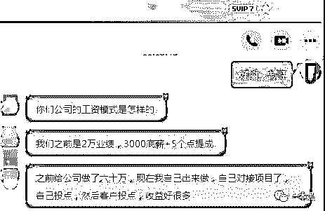 

销售筹来的钱给公司做投资，至于是投了电影还是什么其他的，就不得而知了。

对于他们的这些套路，我已了然于心，但陈老师们似乎完全没意识到自己已经暴露。依然每天不厌其烦地给我发信息。

这不，微信又提醒我有四条未读消息。

打开一看：

> 六类坚决不能投的电影，请擦亮眼睛！
> 
> 流浪地球火爆的背后是敢于人先。
> 
> ......

此时此刻，我很想和他们说一句：“别再白费功夫了，合作是不可能的，这辈子都不可能的。

最后，我想对那位冤枉是她同行的小姐姐说一句：“我 TM 真不是你的同行，但我的确是来套你话的。

**对不起，我是卧底。**”

**参考资料：**

*   市场｜回报率 411%？ “电影版票”能让普通人成为电影投资奇才？ ，影视观察家，跑题姐

*   电影众筹发售宣称回报率 411％？到底是合法融资还是非法集资，法制网

*   《流浪地球》的投资方能赚多少钱？，虎嗅网

还原事实｜专扒黑产

微信 ID：darkinsider

知乎 一本黑

微博 一本黑 007

投稿、爆料、招聘、转载

请联系微信：chenchen_19940612