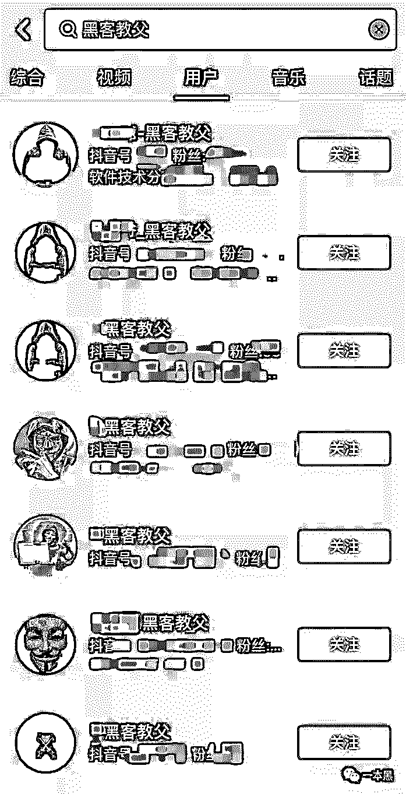
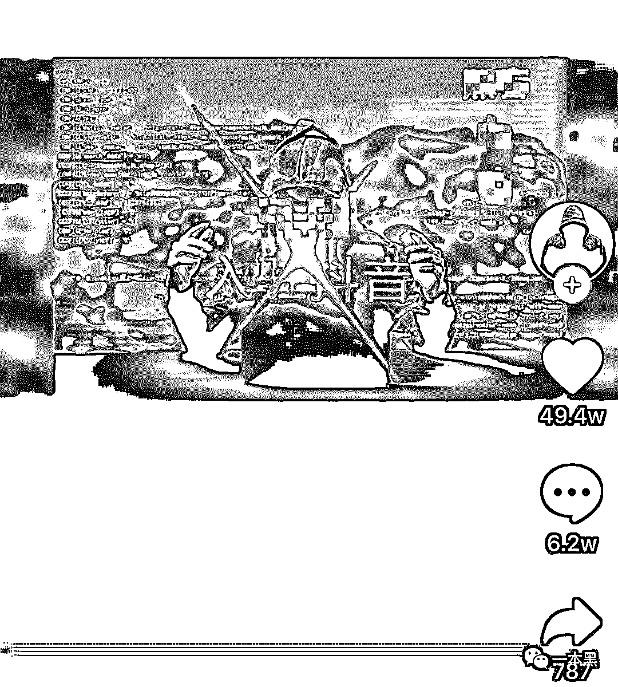
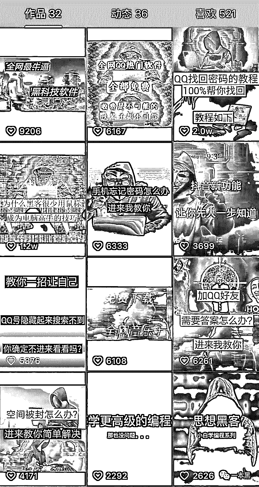
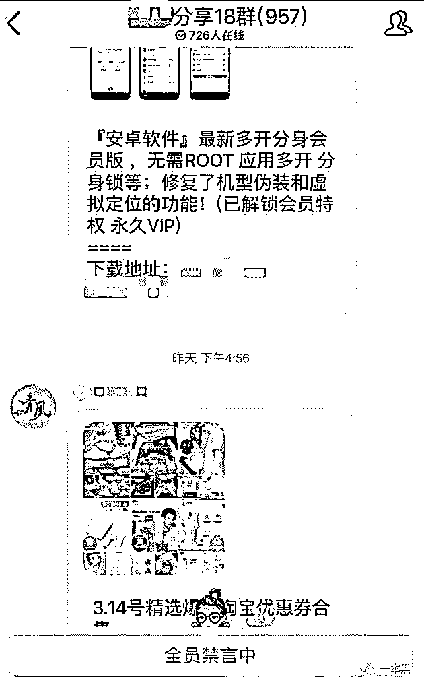
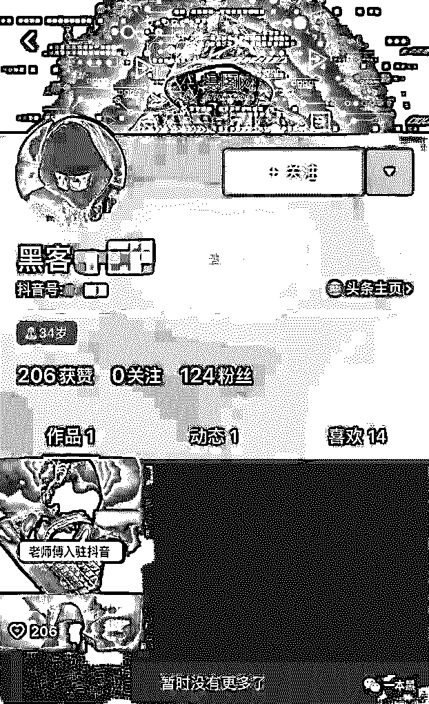

# 一天吸粉数十万，“黑客教父”的速成游戏

> 原文：[`mp.weixin.qq.com/s?__biz=MzU4ODAwNzUwMQ==&mid=2247485192&idx=1&sn=498f15bccad08d1aa087f7606240a5ba&chksm=fde2162aca959f3c9d6411b10ceb464a22f1c387319a81dc564b78ee7beee6396406509f462f&scene=27#wechat_redirect`](http://mp.weixin.qq.com/s?__biz=MzU4ODAwNzUwMQ==&mid=2247485192&idx=1&sn=498f15bccad08d1aa087f7606240a5ba&chksm=fde2162aca959f3c9d6411b10ceb464a22f1c387319a81dc564b78ee7beee6396406509f462f&scene=27#wechat_redirect)

中国人在表达感情方面，总是很含蓄。

比如，在相亲时，越来越多的人不会直接了当的问：**“月薪多少？”“有车吗？”“有房吗？”**

而是这样问：**“你小区的物业费和停车费多少钱？”**

你瞧，多精辟的问法，一举多得。

同样的，当你成为别人眼里的韭菜时，他也不会直接了当的拿把刀站在你面前。

而且采用一种很先进的手法：包装。

文 | 木子梨

**01 ****你和“黑客教父”之间，也许只差一个“入驻”。**

有一群人，他们隐匿在互联网中，神秘莫测，破译、入侵，每一个关键词都能引来普通人无限的遐想，一个个生涩难懂的字符乱码似的堆砌在一起，却上天入地，无所不能。

他们、就是黑客。

你想成为黑客吗？不是技术至上，而是粉丝成群的那种。

想的话，接着往下看。

**首先，万丈高楼平地起，最基础也是最关键的一步，你需要给自己创建一个黑客形象。**以下几个方面可供参考:

名字，要有侠义内涵，不能常规，要一眼看上去就不一般的那种；

头像，一定要黑的深沉，渗透出神秘莫测的气息；

签名，务必要跟上节奏，既要表明自己的身份，还要接地气，语气要平易近人。

有了初步形象，**接下来，你需要一群崇拜到想把你亲亲抱抱举高高的粉丝。**

如何才能集中获得一群粉丝呢？首选人流量大的娱乐平台。

只需将第一步中精心打造的黑客形象，运用到平台中即可，不过，为了快速吸粉，还需要一个很关键的步骤。

最近，抖音上有几个很火的黑客教父，大家搜关键字“黑客教父”就能找到。

为什么说这几个账号火呢？因为它们的第一个作品，就成功吸引了数万名粉丝，而让人难以置信的是，成功吸粉的视频，不但不精致，反而是粗制滥造，完全就是用几张图片拼凑出来的。

但它之所以能够成功吸粉，正是因为造势。

“xx 入驻抖音，我是一名网络爱好者、黑客，以后我会更新很多技术教学，你，愿意做我的第一批粉丝吗？想学什么评论出来，我会尽力满足你们！”

你瞧这文案，“入驻”一词，拔高了自己的地位，“愿意吗”，迅速拉近与粉丝的距离，“尽力满足”，达成与粉丝的互动，造势成功。

随后，他们会陆陆续续发一些简短的教程，比如：

*   如何用一张照片查出女神地址？问她要一张照片，然后将 GPS 信息通过经纬度查询便知。

*   如何 WiFi 出门不断网？进入 WiFi 设置-打开静态 IP，更改 DNS1 和 DNS2 即可。

       

楼下有人评论：“从你们外行人角度看，也许觉得很牛逼，但是从我内行人的角度看，也是一脸懵逼。”

对大部分人来说，看不懂、学不会都是因为自己太菜，跟不上黑客大佬的节奏，崇拜之情更盛。

**当然，光在平台上有粉丝捧场还不够，你的目标是成为一名知名黑客，必须突出知名。**具体操作包括但不限于：

*   王婆卖瓜，自卖自夸。

花点小钱，整几个小号，在百度贴吧等人流量较大的位置，自问自答。

比如：你知道 XXX 吗？听说他很厉害。

当然，他技术很牛的。

又或者，写篇关于自己的专访，越牛逼、越传奇越好，然后把它发布到各个新闻平台，这样，只要有人通过搜索引擎输入相关名字，就能看到你的事迹了。

*   营造技术氛围

固定经营几个社交平台，某空间、某博都行，平日里无事，多发一些能够彰显自己技术的动态，自己不懂没关系，随便找谷哥度娘一下，但一定要深奥，一般人看不懂的那种。

重点是，只要营造氛围就好，千万别发自拍，一定要保持神秘。

另外，花几十块钱弄个 html 黑页，又能迷惑一群小白，你只要手叉腰摆出高级姿态就行。

按以上流程走下来，只要在搜索引擎上输入你的名字，你精心打造的过往、专访、动态，就可以毫无保留地呈现在他人眼中。

如此这般，你已经是一名“知名黑客教父”了，拥有一群心怀崇拜的粉丝以后，集中拉个群圈养起来，留待日后享用。

****02 ********有钱的捧个钱场，没钱的捧个人场。****

在某个黑客教父的视频后，我通过给出的引流 QQ 号，加入了几个不同分享群，发现入群的人可谓是源源不断，说明这几位“黑客教父”在抖音上的拉新，效果还是非常显著。

在群里潜水了几天，发现虽然是不同的群，但在留存、促活和简单变现这几个环节，还是非常类似的。

**先说留存。**如何让已经进群的人愿意长期停留，最重要的一点，就是你分享的内容，对群里的人来说是否有价值。

那么，如何找到群成员的兴趣点呢？很简单，粉丝的喜好和需求大多都表露在抖音的评论中。

**再说促活。**让群气氛活跃起来，才能顺利进行后一步的变现，一个僵尸群，就没有太大的价值。

鉴于是黑客性质的群，所以群成员中男性比例占据绝对地位，这时候，一些简单的分享，就能很好的起到促活作用，比如**美女壁纸、低段位薅羊毛活动，还包括一些低端的软件，像红包外挂、强制聊天程序及破解程序等**，常分享常活跃。

**气氛活了，就可以顺理成章的实施变现。**我所在的几个群，都是非常简单的变现，就是那种看起来互惠互利、双赢的变现方法。

像是淘宝优惠券合集、软件推荐下载之类的，群主都可以从中抽水。

积少成多，蚊子再小也是肉。

******03 ************隔行，你就是韭菜。******

看了抖音上这些“黑客教父”们发布的作品，以及聚集的热情粉丝，老师傅点燃一支烟，露出了少见的诧异表情，大概是惊异这些“黑客”火的毫无道理。

于是，为了验证单纯崇拜黑客的小白，到底能有多白，我和老师傅试了一试。

注册了一个抖音账号，名字中专门漏出“黑客”字眼，挑选了一个神秘莫测看不清脸的头像，简单的图片和文字拼接后，新鲜出炉了一个作品，配上文案：你们有什么需求，评论告诉我，我来满足你们。

简简单单一个作品，意外收获了 200 多个赞，要知道我有一个朋友，活跃抖音半年了，每个作品的赞还不超过 10 个。

翻了翻评论，按目的可以划分如下：

*   **单纯崇拜型。**这类人对黑客的印象，还停留在美剧中，但凡看见黑客，就忍不住要大声呼喊：牛逼（破音）；

*   **嗷嗷待哺型。**这类人对黑客可能有点误会，认为黑客就像计算机基础课的老师一样，能给你解答各种疑难小问题；

*   **没法形容型。**举几个例子：双色球下期开什么号码？如何能够侵入银行内部进行转账？我只能说，走好了您呐~

隔行如隔山，隔了这座山，你就是别人眼里的韭菜，割你没商量。

**THE END**

超级英雄还是超级狗熊，你真能分得清吗？

 

还原事实｜专扒黑产

微信 ID：darkinsider

知乎 一本黑

微博 一本黑 007

投稿、爆料、招聘、转载

请联系微信：chenchen_19940612