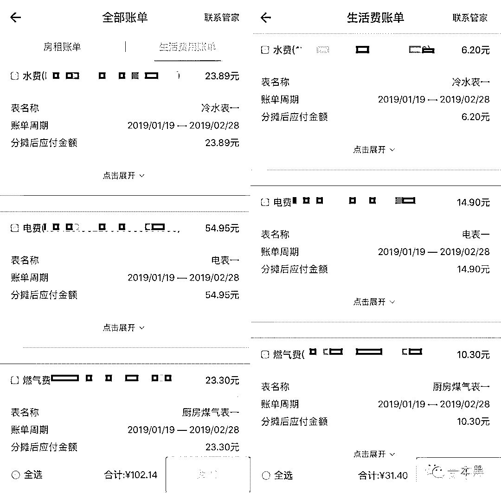
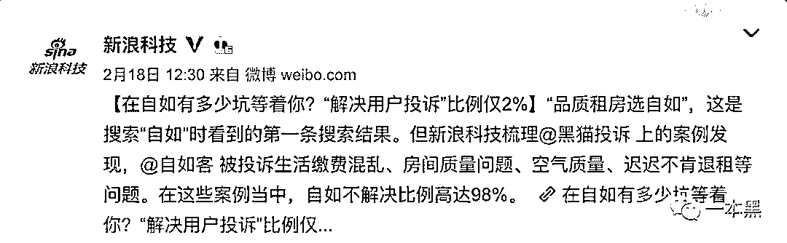
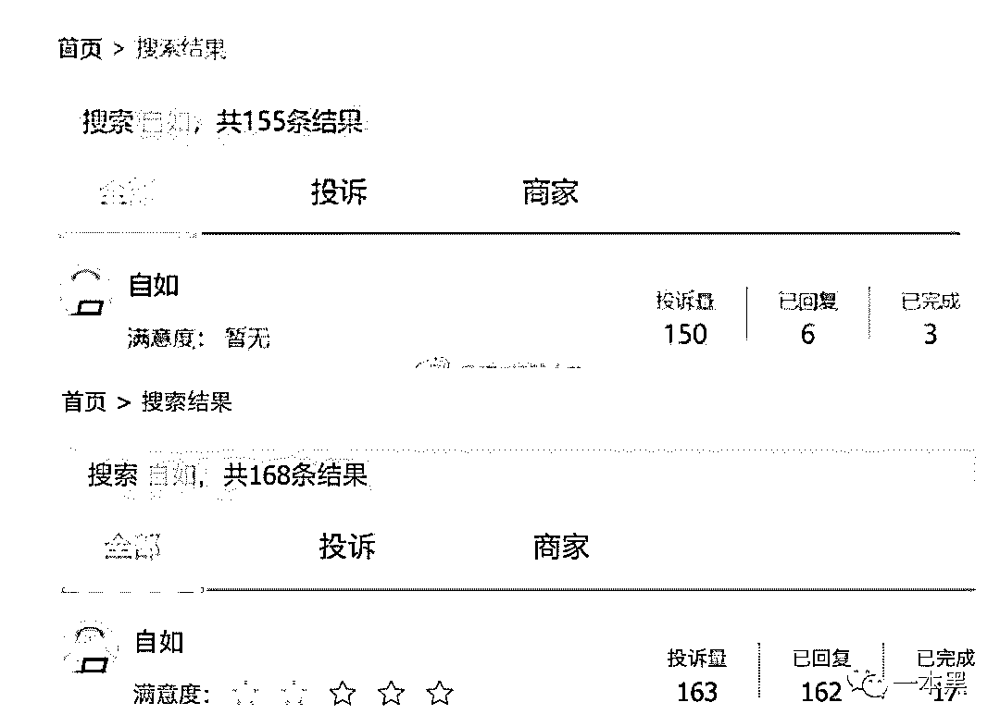
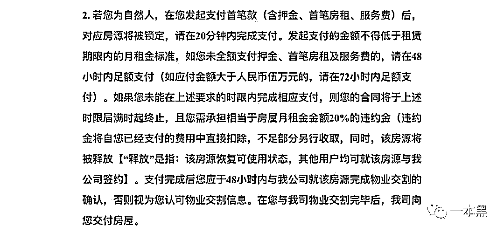
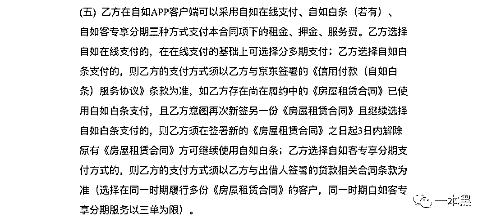
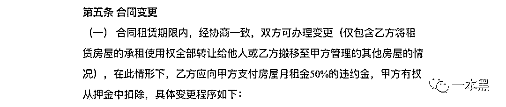

# 砍人、偷拍、下毒，租房不止要钱，还要命。

> 原文：[`mp.weixin.qq.com/s?__biz=MzU4ODAwNzUwMQ==&mid=2247485181&idx=1&sn=b7d9c76c1b1b0718b9da431feffc5817&chksm=fde217dfca959ec90723285ff833f23ce4c8db47bda09cdb0bdfc60e38644680ba0761b06c6d&scene=27#wechat_redirect`](http://mp.weixin.qq.com/s?__biz=MzU4ODAwNzUwMQ==&mid=2247485181&idx=1&sn=b7d9c76c1b1b0718b9da431feffc5817&chksm=fde217dfca959ec90723285ff833f23ce4c8db47bda09cdb0bdfc60e38644680ba0761b06c6d&scene=27#wechat_redirect)

说起租房，很多人脑海里可能会出现港片中包租婆的形象，嘴角叼着烟，一脸嘲讽，但现实生活中屡见不鲜的黑房东，更是让人防不胜防。 

据某机构预测，到 2020 年，中国的租房人数将达到 1.9 亿，巨大的市场需求，加上资本市场的追捧，众多长租公寓出现，并大力抢夺市场。

尽管品牌响亮，但这些长租公寓并不单纯，有人视它们为二房东，有人视它们为房产中介，也许都是，也许、更复杂。

从被资本追捧，到走上舆论的风口浪尖，如何走出当下的困局，是每一个品牌该思考的问题。

等待戈多。

作者 | 木子梨

**01 ****租房不只要钱，弄不好还要搭上命**

白鲸在仰望，夜莺在歌唱，而月亮在杀人。

**甲醛事件：**2018 年 7 月 13 日，一位花名“安时”的阿里员工，在北京因急性髓系白血病离世，而在 1 月初，“安时”在接受入职体检时，身体指标还一切正常。“安时”的去世原因指向他入职时曾租住的自如房间，在他过世后，“安时”的家人检测了他曾在杭州租住的自如房，结果显示，甲醛超标。（详见文章：阿里 P7 员工得白血病身故，生前租了自如甲醛房）

**链家董事长对此回应：“****所有的批评我们都会收下，所有的责任我们都会承担。”**

**偷拍事件：**2018 年 9 月 11 日，呦呦鹿鸣的朋友，一对夫妻，在居住的位于北京朝阳区的一间自如房内，发现床边插座有一个小孔，疑似偷拍设备，于是暂时拿贴纸遮挡，次日，在报警后，警察拆开插座，发现了隐藏在其中的偷拍设备。（详见文章：自如房里的偷拍摄像头）

事发后，呦呦鹿鸣的朋友找到自如公司的一位总监沟通，**总监回应：此事与自如无关。**

**砍人事件：**2018 年 10 月 16 日，一位微博网友爆料称，一位有案底的逃犯在北京海淀自如房内生活半年后，明目张胆在房内持刀砍人，地上墙上都是血，血腥味不散。（详见微博主： “我的自如邻居是逃犯”）

该网友称，自如区域经理孔某面对此次砍人事件表示：“自如没有任何管理上的疏忽和漏洞，帮你们擦擦血渍，换租已经是仁至义尽，别谈补偿，别人砍人和你们有关系吗，你们又没被砍，顶多给你们买个空气清新剂去血腥味，让你们选空气清新剂我们已经做得很到位了。”

随后，**自如客服回应称砍人者不是逃犯，此事属感情纠纷，并表示自如保留追究造谣者法律责任的权利。**

**下毒事件：**2018 年 11 月 23 日，一位自如客爆料，称自己所居住的四居室中，05 号房同时居住着三位女生，由于人数超过自如规定、且生活习惯等原因，该自如客向自如反馈 05 卧违规情况，三人同意搬离。

而就在三人搬离的那天，其余自如客发现公用冰箱中出现强烈的刺鼻性气味，随后出现视力模糊、恶心头晕等症状，后在冰箱食物中发现不明粉红色液体。

**其他事件：**除上述已经人尽皆知的事件外，在几百万人居住自如的过程中，集中爆发出了很多问题。

*   **生活费用乱。**

一位租客爆料称，自如 APP 上给出的生活费账单，一眼就觉得有问题，在与管家进行交涉后，管家说可能是因为系统错误，愿意帮忙修改账单金额。

交涉前后，同样的费用所属期，金额却相差 70 元之多。

*   **管家不作为。**

多位自如客反映，在微信上向管家询问的问题，不催就不会回复，致电自如客服时，客服回复问题的避重就轻、不痛不痒，也反复试探着自如客的耐心。

租客在提出诉求等待回复的过程中，内心都燃着一座火焰山，渴望自如方能用一把芭蕉扇，来熄灭不断升温的怒火，而很多时候，自如方的回复，简直隔靴搔痒，他们就是拥有一种神奇的能力，让内心火山瞬间喷发的能力。

*   **入住宽审核。**

有租客反应，在自己所居住的四居室中，三个房间均只居住一名单身女性，但优化间内却住着两位年龄差距较大的男士，其中一名男士年龄明显大于自如所限定的 40 岁。

居住过程中，优化间租客存在深夜严重扰民、公共区域抽烟、大小便不冲、小便无法入圈等恶劣问题，但自如方却一味逃避，不愿对该租客做出清退的处理。

*   **无责退租难。**

某位入住自如的租客，入住不足 3 月，就发现所居住房间的墙壁出现渗水发霉迹象，第一时间报修，师傅上门却找不出漏水原因，此后半年，该租客多次报修，但面对大面积的墙皮脱落、黑色霉斑，师傅上门都只是单一的铲墙皮、刷腻子，没有其他维修方案，自如管家也毫无作为。

在渗水房间居住长达半年之久后，该租客连续不断的出现湿疹，反复无法痊愈，在与管家沟通无责退租的过程中，管家明确表示：无责换租已经是仁至义尽，想无责退租？不可能。

就在阿里员工事件过去一个多月后，自如启动了“自如深呼吸”项目，称从 9 月 1 日起，下架全国九城全部首次出租房源，待 CMA 认证检验合格后再上架，且未来所有新增房源，都会在 100%检测合格后上架，空气检测报告会在自如 APP 上展示，检测中的房源，会强制空置 30 天后才可签约。

据一位曾在自如工作的员工匿名透露称：自如收回来的房子，不管是装修阶段，还是待租阶段，多一天都是成本，所以唯有让租客尽快入住。在推出空气治理之前，精装房只需 7 天，毛坯房也仅仅需要 28 天，保洁过后，就可以上架出租。

合乎标准的板材、家具、家电，串连在一起而打造出的房源，加上 30 天的空置，是否真的能解决甲醛问题，不得而知，但当我走进那些已经空置超过 30 天的房子时，大多还是能明显闻到刺鼻的气味。

换个角度，每个为自家装修的人，也都会尽可能去挑选最环保健康无甲醛的材料，就算如此，又有多少人，能在装修完仅空置 30 天的房子里，安心入住？与万事相比，健康当然最重要。

**太多的自如客，都经历了从最初满心欢喜的入住，到最后谈自如色变。**

所有的转身离开，都是因为攒够了失望，但也有一些人，已经永远没有办法转身离开。

**02** **房子是租来的，生活可能也是**

2 月 18 日，新浪科技发文称：从 2018 年 2 月 7 日到 2019 年 2 月 17 日，在这 1 年又 10 天当中，消费者投诉自如的案例多达 150 起。在这些投诉自如的案例当中，**自如的不回复比例为 96%，不解决比例更是高达 98%。**

该数据令人震惊，这就是所谓的**“品质生活选自如”？**

然而，仅仅过去了半个月（数据截图日期为 2019.3.4  16：00），数据就发生了巨大的变化。

在这短短半个月内，关于自如的投诉就新增 13 例，而自如的不回复比例却从原先的 96%，暴跌到了几乎为零，不解决比例较之前也略有降低，从 98%降到了 90%，满意度也点亮了两颗小星星。

浏览了一下页面上显示已回复的投诉记录，发现所有的自如回复，内容完全一样：**亲爱的自如客，您好，建议您通过自如 App 或微信自如客公众号反馈您的问题，工作人员会积极为您处理，感谢您的支持！**

在自如客服如此不痛不痒的回复后，很多投诉者选择了补充投诉，但在接下来毫无希望的等待后，只得借一颗星的评价，来宣泄无处安放的愤怒。

这就是租来的生活，你的感受大都攥在别人手里。

**03 ****住自如，不自如**

关于自如的霸王合同，一直以来被很多人所诟病，店大欺客，大抵就是这样，简单举几个例子。

*   租客在发起支付首笔款项后，如若不能在规定时限内足额支付剩余金额，就必须承担月租金的 20%，作为违约金。

也就是说，如果你看中了一个房源，激动兴奋的先交了一部分，随后因为忙碌，或出于其他考虑，没能按时缴纳剩余金额，那抱歉，虽然你没住，我也得扣你 6 天（月租金 20%）的房租。

*   租客在自如 APP 客户端可采用自如在线支付、自如白条、自如客专享分期三种方式，支付租金、押金、服务费。

自如白条，自如客专享分期，二者好看的外表下，实则是“租金贷”，自如有胆量让租客因为租房而背上贷款，为什么不敢在合同里标识的明明白白呢？

*   合同租赁期内，经协商一致后，双方可办理变更。

虽然是双方友好协商的结果，但我舍不得你，非要走，你得赔我半个月”精神损失费“。

**你看，一旦选择了自如，想走，只能拿钱换自由。**

**04 ****屠龙者最终却变成了龙**

熊林曾说：“要让生活在城市中 25 岁到 35 岁的年轻人对居住不再感到绝望”，但现在，因为自如，这些年轻人正被彻骨的寒意所包裹。

2010 年，自如品牌诞生，六年后，自如从链家剥离，开始独立运营，并顺利完成 40 亿人民币的 A 轮融资，渐渐成长为连锁长租公寓的领头羊。

自如发展之初，对服务的注重度远超现在，管家都很负责，有问题也会第一时间出面解决，很少出现推诿的情况。

**说不清从何时起，自如变了。**

2018 年 8 月，前我爱我家副总裁胡景辉在媒体前称：“他们以超过市场租金 20%-40%的价格拼命收房，完全破坏了正常房屋租赁市场”，随后，北京市住建委联合相关部门，对自如、相寓、蛋壳等连锁长租公寓进行了集中约谈，**明确要求住房租赁企业不得利用银行贷款等融资渠道获取的资金恶性竞争抢占房源；不得以高于市场水平的租金或哄抬租金抢占房源；不得通过提高租金诱导房东提前解除租赁合同等方式抢占房源。**

这就是 8·18 事件。

然而，在 8·18 事件中，自如不涨租的承诺刚过 3 个月，转头就发布了《续约涨幅规定》，称从 12 月 1 日起，将取消不涨价及续约涨幅不超过 5%限制，令人大跌眼镜，而自如的“租金贷”，直到现在还写在合同中。

**“三不承诺”名存实亡。**

近日，一则新闻引起了我的注意：长租公寓运营商蛋壳公寓，完成了 5 亿美元的 C 轮融资，此轮融资结束后，蛋壳公寓的估值可超过 20 亿美元。

这固然是一件值得高兴的事情，但公司的估值、品牌的发展、行业的前景，是公司领头者和投资者所关注的，都与租客无关，租客在意的是房租是否合理，居住是否安全，他们只希望在异乡独自拼搏时，能在疲惫之余，有一个属于自己的疗愈角落，仅此而已。

何况，**这些长租公寓缺的是钱吗？不，是对生命的敬畏之心。**

**THE END**

中消协公布 2019 年消费维权年主题：信用让消费更放心。

**我倒很想看看自如的公关、是否足够优秀。**

还原事实｜专扒黑产

微信 ID：darkinsider

知乎 一本黑

微博 一本黑 007

投稿、爆料、招聘、转载

请联系微信：chenchen_19940612