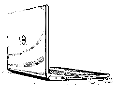
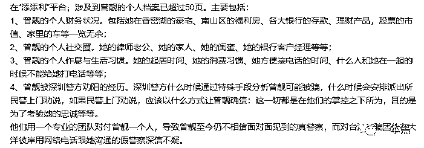

# 黑客缴获诈骗录音：“诈骗剧本这样写，有人卖房给你打钱”

> 原文：[`mp.weixin.qq.com/s?__biz=MzU4ODAwNzUwMQ==&mid=2247485163&idx=1&sn=5b7034e7b2a0811d0d6761c7c1581378&chksm=fde217c9ca959edf13abaac4f32b76eb5387e42098d51b8cb00ac8a698dee0836e2a3b5ddf64&scene=27#wechat_redirect`](http://mp.weixin.qq.com/s?__biz=MzU4ODAwNzUwMQ==&mid=2247485163&idx=1&sn=5b7034e7b2a0811d0d6761c7c1581378&chksm=fde217c9ca959edf13abaac4f32b76eb5387e42098d51b8cb00ac8a698dee0836e2a3b5ddf64&scene=27#wechat_redirect)

六旬老人，为何坚持卖房？200 万巨款，一朝转账，片刻倾家荡产。

警方来电，无端惹上官司？连环陷阱，量身定做，骗子与时俱进。

本期《走近科学之老师傅课堂》，一本黑带你走进科学电信诈骗。

遥想我大学的时候，网络支付还不普遍，伪基站之类的技术还不普及，骗子的剧本还不完善但已然够用。

我们院的一个男生以优惠价 1334 元的低价买了一台当时最流行的戴尔，意识到自己被骗后，向骗子讨要钱款未果，反被骗子以“凑个整数，方便打钱”为由，再次转账 666，一时成为校园傻逼传说。

 

**骗术看似低级，但骗子却有着超强的执行力和专业度。**

购买“客户”信息、编写剧本（话术）、建点的 IT 解决方案、人员招幕与培训、转款等都有专门的分工，骗子们早已形成一套行之有效的“套路”，并且不断优化，甚至根据用户信息进行“量身定做”。

在执行套路之前，骗子所做“用户画像”的详细程度也超出你的想象。**骗子就好似大数据，比你更了解你自己。**

在首都网警发布的一份材料中，我们可以看到其中的一个用户画像样本，内容包括：个人的财产登记和分布情况；个人社交圈；个人的生活习惯；遇到警察介入时如何应对……）

我们也就能够理解为什么电信诈骗能够屡屡得手。

在办公室聊到这个话题的时候，老师傅说：“我有个朋友，以前是黑客，现在主要做反诈骗。前几天他给我发来骗子的诈骗剧本，不是自己不坚定，实在是骗子太努力。“公检法”诈骗电话，每年中国人接到的大概是一亿通，防不胜防啊。”

不是推理小说似的逻辑严密，更像是利用叙述诡计制造的一个平行宇宙，尽管漏洞百出，但只要你不出去，你就对骗子有着充分的信任与忠诚。

作者| may

素材来源：无糖信息

# 

**01** **开场白**

诈骗就像狼人杀游戏，一个狼人，非要让你相信他是神职。你一开始就不信，他就换个房间，重启游戏，降低难度，提升效率。毕竟，骗子也是有绩效的考核的。

**诈骗方**：你好，我们这边是通信管理局。今天打电话给你是因为你的手机号在发送一些广告短信，你是因为工作才发送的吗？

**受害人**：我没有发送任何广告短信。

**诈骗方**：那你在 5 月份办理的 1701****679 的号码是办下来给谁使用的？

** 解 读 **：以违法事由入手，自称管理部门，掌握主动，为接下来的骗局做好铺垫。骗子确认没有经验的受害人是否适合成为目标。受害人莫名其妙，一口否定。

# 

**02 ****身份确认**

**诈骗方**：不是你办的？你是 1984 年 7 月 31 日出生的 XXX 对不对？身份证尾号 XXXX 是吧？

**受害人**：对！

**诈骗方**：那没有错啊，你在 5 月 15 号到上海虹口营业厅办理的 170 的手机号有在发送……

**受害人**：我没有去过虹口。

**诈骗方**：不是，可是 X 女士，现在 170 的手机登记在你名下，在 5 月份发送 800 多条卖假药短信，目前已经有群众在公安单位投诉。

** 解 读 **：骗子一直强调受害人办卡，受害人表现出激动、生气的情绪。骗子能够说出受害者和办卡的详细信息，给受害人制造我是有关部门所以才知道你的信息的印象。

**受害人**：我根本就没有到过虹口区，我自己是嘉定区的怎么可能到虹口区去办理呢？

**诈骗方**：X 女士，你说你没有到过虹口区对吧，证件照在你身上，它不可能凭空出现在虹口营业厅，去申请这个号码下来吧，我希望你要知道一点，X 女士，现在 170 的号码登记在你身份证名下，在进行一些违规的操作，这个已经违法了，所有相关的法律责任是要你来承担，懂吗？

** 解 读** ：申明可能后果，威胁受害人要承担法律责任，引起受害人初步恐慌。受害人一开始并不相信骗子所说，但不能无视骗子提供的细节。

**受害人**：那你告诉我现在这边是什么机构，是公安局还是派出所还是什么？

**诈骗方**：不是，X 女士我这边不是调查单位，我这里是通知单位，通信管理局，你把它记下来吧!

**受害人**：通信管理局？

**诈骗方**：我们主要是掌控国内三大通信业务，懂吗。那 X 女士我相信你自个儿应该清楚，咱们人民群众身份证号一人一组，是不可以有重复相同的身份证号，身份证号我刚才也跟你本人进行核实了，确实是你的，手机号登记在你名下，你怎么会说不是你办的呢？

** 解 读 **：从一开始的完全抵触，受害人开始动摇，并主动向骗子询问其所属机构，想要了解具体情况。骗子申明自己所属机构，向受害人确认细节，并暗示权威，确定在对话中的主导地位。

**受害人**：（打断）那叫公安单位跟我发送，好吗，我是属于嘉定区的，虹口区跟我有什么关系？现在人的身份信息到处都在透露，拿我身份证办理一个号码，随便拿去，我又没办法，又不是我真人去办的，对，身份证号码是我的，他改的头像好了，你知道我长什么样子的，是吧，我好莫名其妙啊，这种事情，你们是诈骗还是干嘛呢，搞死了。

**诈骗方**：X 女士我看这样子吧，你自个儿带着身份证来我们通信管理局，我会将这些材料整理下来，你自个儿再核实清楚是不是你本人的。

** 解 读** ：因为一直解释不清，受害人开始焦躁，发火，并开始质疑对方是不是骗子，想要结束对话。此时，骗子主动要求受害人前往通信管理局进行办理，以退为进，在接下来的流程中，骗子也多次主动要求受害人联系公安部门，但一直用话头避免受害人挂断电话。

# 

**03** **异议处理**

**诈骗方**：好，那问一下你有没有在哪些单位，或者哪些小单位去办理过业务的时候提供过你的身份证信息或者是提供复印件？

**受害人**：好像提供过的，有一个介绍工作的地方，她好像是个中介。

**诈骗方**：你说是在去年 8 月是不是，稍等一下……好，那问一下你平时有没有在网络上填写你自己的个人材料呢，有没有？

**受害人**：网络上填写……都是办一些会员卡，都是正规公司啊

**诈骗方**：我这么跟你讲吧，因为你有提供过的地方都有可能将自己个人信息给外泄出去，懂吗，那 X 女士，你前头也是很激动的反应这个号码不是你办的，对吧？

**受害人**：对啊。

** 解 读** ：因为骗子说中受害人的情况，受害人对骗子的态度产生动摇，同时情绪开始稳定。骗子引导受害人往身份信息泄露方向想，让受害人相信真的是由于个人身份信息泄露，被犯罪分子利用办理了手机号。这是整个故事合理化的重要节点，经历过被质疑违法之后，受害人开始放松，因为骗子相信自己是好人，对骗子开始产生信任。

**诈骗方**：X 女士，我现在是不是在跟你讲呢，你为什么要一直打断我说话，你在说话我也没打断呢，懂吗？

** 解 读** ：故作严肃，藉此引导整个话题走向。

**受害人**：你说来说去就是说这些，你没有把最后的结果告诉我，告诉我最后结果能发生什么就行。

**诈骗方**：我们会将你名下所有在使用的手机号，只要是用你身份证申请的号码，我们都会立即强制关停，还有会将你的身份证拉黑，列为黑卡用户，往后你在咱们中国是不能办理任何通信业务的。一旦说我们将你的身份证拉黑之后呢，公安单位会直接起诉，因为这个是有在进行一些违规操作的。

如果说你确定手机号不是你办的，我只能建议你 X 女士赶紧的跟开卡处的公安单位取得联系，请公安局同志帮你调查清楚，是谁用你的名义帮你申请这个号码的，这些信息是谁发的，懂吗？

**解 读** ：骗子再次强调要求受害人联系公安机关，为接下来做铺垫。

**受害人**：你的意思就是说之后的一个小时，我名下的所有手机号会关掉，身份证会拉黑，身份证拉黑我觉得应该是公安局可以做的是吧

**诈骗方**：我前头跟你讲过的，今天就是公安单位发送这个停机公文给我们通信管理局，我们今天才会向你进行最后一次通知，那……

**受害人**：（打断）那为什么公安不直接联系我？

**诈骗方**：我看这样子吧 X 女士，我这边直接先线上询问我的……

**受害人**：（打断）那这样我要问你，我有什么解决办法，怎么解决？

** 解 读 **：事实上，受害人一直保持着冷静和警惕，但因为问题无法解决时，受害人再次陷入急躁，掉进骗子预设的骗局。

**诈骗方**：是这样的，因为我们领导刚才回复我一个信息，我们是可以协助你把电话联系到上海港的公安局，让你第一时间能做个报案处理，你看这样有帮助到你吗？

**受害人**：你直接联系到公安局吧。

**诈骗方**：好，那待会儿我会帮你联系过去，待会你知不知道怎么跟公安同志做报案处理？知道该怎么报案吗？

**受害人**：没报过。

**诈骗方**：没报过是不是，我跟你讲，你待会电话联系过去之后，接通之后就是上海港的公安同志，你就跟他们说明今天的情况，说你没有办过这个手机号。

** 解 读** ：主动服务，提出转接给公安机关，一旦接通公安电话，整个骗局开始进入正题。受害人开始相信对方确实是执法部门，那对方让你转移账户内资金，你当然会跟着做。

# 

**04 ****转接**

【录音：检察官办公室，您好，你的来电将全程录音，请稍后，为你转接中……】

** 解 读** ：转接录音的细节，受害人开始自动强化对骗子的信任，并怀疑自己可能真的因为信息泄露而受到警方调查。此时的受害人已经完全掉入骗子布置好的情境，并跟随骗子的套路行动。

**受害人**：喂你好，警官你好，请问这里是上海港公安局吗？

**诈骗方**：对，你好，有什么事情吗？

**受害人**：因为我刚才接到通信管理局的电话，说我今年的 5 月 15 号在虹口的电信营业厅，用我身份证办理了一个 170 的手机号码，这个手机号码发送了 800 多条卖假药的信息，已经违规，我想核实一下，因为我本人 15 号肯定是没有去过虹口区的。麻烦帮我核查一下是谁办理的这张卡。

**诈骗方**：那是什么样的情况，是什么单位给你讲的呢？

**受害人**：是通信管理局通知我的，就刚才。

**诈骗方**：就是说通信管理局打电话跟你说，你才知道名下多了一部手机号是不是。

**受害人**：对的。

**诈骗方**：那他有没有告诉你手机号码多少？

**受害人**：170*****3679

**诈骗方**：那警官这里上公安部联网，我帮你查有没有关于这部号码的相关材料，具体情况呢就比较清楚了，你电话不挂，等我一下……好，有了，我看一下，我听你身边是家人在说话是不是？

**受害人**：对，他们在问我情况。

**诈骗方**：那我明白，你是叫做 XXX 是不是

**受害人**：对！

**诈骗方**：那没有错了，警官我这边调阅到你的公文，这个是我们发给通信管理局的，最主要是因为近期有许多市民向我们公安局报案，说你名下这部 170 的号码都有在发送大量的卖假药短信，已经有人上当受骗了，所以我们公安局避免有这样的情况再度发生，我们才要把你的手机号给停掉，你明白警官的意思吗？

** 解 读** **：**对话琐碎，反复确认案件事由，也是消耗受害人耐心，降低防备心理的一个流程。在了解到对方身边有其他人的时候，骗子一直重复内容，受害人一直在骗子画的圈子里活动，根本无法思考真实情况。

**诈骗方**：嗯，我看这样吧，这边我有看到公文上头说了，半个小时之后，这公文就会递交到人民法院，在那之前你赶紧过来公安局做一份笔录，笔录完成查证属实，真的不是你办的，那我会帮你开具报案证明文件，这样你就不用去承担相关的责任了，清楚吗？

**受害人**：就是说我要到你们上海港公安局去报案？还是去做笔录？然后你帮我撤销是吗

**诈骗方**：你要带上你的身份证，然后你记得 4 点钟之前一定要到，不然这个公文递交到人民法院我也帮不了你了

**受害人**：4 点钟到不了，不可能的，现在已经 3 点半了，我从嘉定镇到虹口区，半个小时你告诉我能到吗？

** 解 读 **：骗子提前了解你的个人信息，已经确定你无法按时到达公安局。要求受害人到案发当地公安局报案，受害人无法去（时间来不及或不在同个城市），以退为进，让受害人配合做线上笔录。

**诈骗方**：那我可以看在你是主动报案的份上，我让你行个方便，待会透过线上录音的方式，我先给你做个笔录，笔录完成之后，我会帮你回传一份报案文件给通信管理局，了解吗？

**受害人**：好！

**诈骗方**：但是你要记好了，公安部现在都有规定，你们要做笔录，你们身边是不能有人的，否则这个笔录……

**诈骗方**：哦这样子是不是，要不我看这样子好了，避免说待会笔录进行到一半，收录到你妈妈说话的声音导致笔录作废，你先移动进去你的房间，并且暂时先把门锁上。

** 解 读** **：**将受害人跟周围的人隔离，降低骗局被拆穿的可能性。此时，受害人基本上已经完全相信对方的陷阱，而且没有其他噪音提醒他，骗局成功的可能性已有 100% 。

* * *

在案件的最后，受害人被公安机关告知牵涉进一起特大金融诈骗案，有可能会被刑事拘留。在这一过程中，骗子再次强调需要保密，否则会牵连他人。

此时，已经相信对方是真实的警察身份之后，就完全听从对方的指引，接受对方调查。

骗子称受害人的招商银行账户中有多名受害人的转账记录，涉及金额 20 多万，国家要对该账户进行控管，并清查资产！受害人听从指示，陆续将存款转给对方，共损失约 80 多万元。

每一次，我都在想，这么简单的套路为什么还是有人受骗？**这当然不是我们无能，而是每一步都直指我们的心理 bug ,根本无处可逃。**

就像沉溺玩手机，是你没有自制力吗？当然是的。

但更主要的还是各大 App 就是在努力吸引你的注意力，**不是自己不努力，而是对手太强大。**

**（音频部分**剪辑了三段不同时刻受害人的情绪变化和反应**）**

> 首先，骗子向受害者说明情况，引发受害人恐慌，整个骗局由此开始。
> 
> 随后，骗子解释整个事件的严重性，受害人的反应超出骗子预期，但很快调整套路，再次引导受害人进入圈套。
> 
> 最终，受害人进入圈套，骗子确认受害人独自一人，为保证骗局顺利进行，骗子要求受害人进入封闭空间。

还原事实｜专扒黑产

微信 ID：darkinsider

知乎 一本黑

微博 一本黑 007

投稿、爆料、招聘、转载

请联系微信：chenchen_19940612