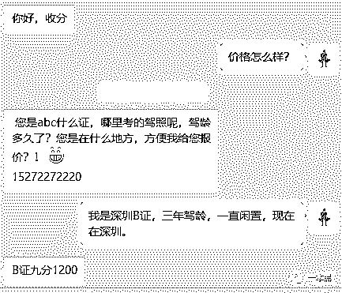
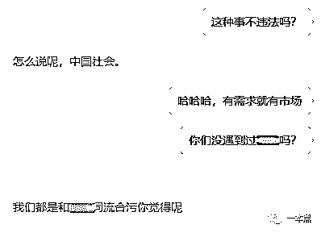
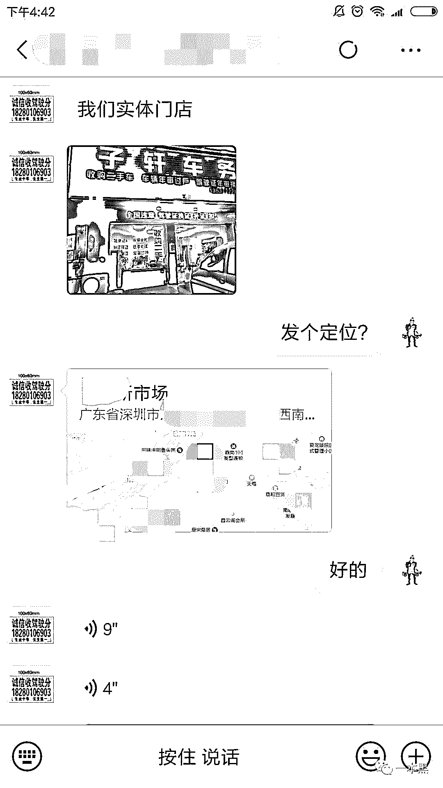

# 驾照 12 分，“共享”之后，我被请去“喝茶”了

> 原文：[`mp.weixin.qq.com/s?__biz=MzU4ODAwNzUwMQ==&mid=2247485117&idx=1&sn=5839ff498e63c6100250af32e5c827ba&chksm=fde2179fca959e8967cc3487a5f64bbea7898826a050ba760e931084ad8c8aca730a8c88675d&scene=27#wechat_redirect`](http://mp.weixin.qq.com/s?__biz=MzU4ODAwNzUwMQ==&mid=2247485117&idx=1&sn=5839ff498e63c6100250af32e5c827ba&chksm=fde2179fca959e8967cc3487a5f64bbea7898826a050ba760e931084ad8c8aca730a8c88675d&scene=27#wechat_redirect)

三年前就过了科目一的舍友，前些天发了条朋友圈，庆贺自己拿到驾照，买了三年的奔驰终于有机会驶出车库。

今天，他的朋友圈再次更新，发出天问：我舅妈要拿我的驾照去消分，我该怎么拒绝？

：新手驾照难道不是全家共享的吗？（狗头护体）

：难道不是全村共享的吗？（哭）

：想要保住你驾照的贞洁，让你舅妈去找黄牛啊，一分 100，满意为止。

：这他妈也有黄牛，有车人的生活真的是为所欲为。

作为一个新时代青年，只要有地方散发出金钱的气息，我都要上前去嗅嗅。

作者 | may

**01**

顺着网线，我找到了一个微信名为 AA 深圳收分的黄牛。老师傅说过，微信名前面加 A 的没有一个好人。

通过之后，黄牛就发来一串问题，ABC 什么证，哪里考的驾照，驾龄多久， 在什么地方？

深圳 B 照、驾龄 3 年，现在深圳，何时交货？ 我把提前编好的内容发过去。

B 证 9 分 1200，黄牛很快给出回复。

     

“驾照分没有统一定价，不同代码，不同地点，不同车牌类型，不同省份，价格都不一样，没有固定的多少钱一分。所以要问价格，把行驶证拍照后发给我，我才能给准确报价。”

按黄牛所说，广东驾照的话有三种扣分方式，方式不一样，价格也不一样。

第一种是用手机微信扣分，只不过价格也相对便宜，9 分 700、11 分 800 。第二种是好易的终端机器，9 分 800，11 分 950 。第三种就是到店里带去惠州现场扣钱，1 分 100。

前两种门槛很低，操作方便，不需要到现场查验，只要有发动机号和车牌号，就可以通过银行的自助缴费机或执法站的自助服务终端来处理违法。

说好的 9 分 4500 呢？想到贴吧里黄牛的广告文案，觉得自己损失了一个亿。

尽管价格不高，但苍蝇也是肉。

“人家老板开奔驰的，到期清分不一样卖给我么，怎么不觉得人家开奔驰丢人了”

翻了一圈黄牛的朋友圈，交易对象从开奔驰的到网站主编，谁都不会跟钱有仇。我接着问了一句：“这不违法吗？”

黄牛的自信听得我瑟瑟发抖。咪蒙都封了，他咋还能这么浪呢？

他是真的跟相关部门合作还是为了显得自己权威让我放心卖分编造的话术？我无从判断。不少黄牛打包票说能搞定处理违章的警察，但大多只是在车管所混个脸熟，能不能成功全看运气。

看我问过之后没有继续说话，黄牛发来消息说，我们有线下门店，你要是不放心的话可以来看看。

**02**

我决定跟老师傅一起去看看，发来的地址在地铁站附近，他说到了派人去接我。 

等了有几根烟的功夫，一个穿着红色卫衣的小伙子朝我们走过来，20 岁左右，很年轻，像是跑腿的。

看到我们有两个人先是有点吃惊，我连忙介绍说我朋友在附近办事就陪我过来。

小伙子东北口音，天生豪爽，马上要求跟老师傅互加微信。

路上他接了个电话，大概是跟接洽的黄牛说接到我们了，说了几句就挂了。店很难找，不过有黄牛带着，绕过几个街道，很快就到了黄牛所说的门店。

门店不大，从门口的招牌上可以看到，这家店对外声称的业务主要是车辆年审过户，补证、扣分、违章处理，消分业务自然没有明目张胆地展示出来。

到店的时候是晚上，陆续有人出入，黄牛也没跟人介绍我俩，我们仨就站在门口聊天。

“我俩帮公司办事，路过来看看，平时也不开车，驾照也没随身带着，想先看看情况。”

黄牛脸上没有一点失望的样子，见面就是朋友的姿态，跟他的东北口音很搭。

可能我跟老师傅长得就像穷人，黄牛丝毫没有怀疑我们的身份，聊起自己的生意，不禁带上炫耀的口气。

“店里就我们几个人，我们一个月生意好的时候能有几千单吧，有找上门的，有介绍的，还有别的收分的处理不了的就给我处理”

“驾照分有富余的，也有不够罚的，收分、卖分，有需求就有市场，我们的生意也不是独一份儿。你们要是有朋友也给我介绍介绍。深圳驾照消分很方便的，在微信上就能扣。”

这种黑产没有太大的技术含量，也没有太高的门槛，有时候只要你抹得开脸你就能干下去，但需求量大而暴利。

我在心里默默地算了一笔账，100 块 1 分收购，200 块出手，每个单平均 6 分，黄牛每单能赚 600 元，每个月最少 60 万的收入。

这是往少的计算，扣分严重的情况，几十分打包出售，就是几万的收入。

**03**

这么大的业务量当然不是一个人就能完成的，黄牛组织与公司部门结构类似。 

产品部门负责找到卖分客户，实习生琪琪告诉我，他们院的学生拿到驾照又没车，驾照分换点零花钱，反正不用白不用，不少黄牛专门盯着大学生。

营销部门负责开拓客户，找到市场需求，扩大品牌知名度；有售后，做好客户安抚，制造回购，毕竟驾照不是一次性产品。

行政管理部门负责分配资源，协调业务。

联系我的这位黄牛经验丰富，不但负责收分，还要负责提前联系消分预约，协调双方时间。暗访中的这家店人数不超过 5 个，业务却如火如荼。

开展业务的方式也分线上线下两种，线下的如路边的牛皮癣广告、车管所门口拉客……这些方式传统但目标精准，成交率高。

线上的如各大论坛、贴吧、QQ 群，有人发帖提出需求，马上就有黄牛凑上去，说“高价收分，私聊”，或者 “有需要的联系我”，并留下自己的联系方式。

一旦交易成功，客户也可以帮你发展新客户。发展一个 30 到 50 不等，算是粉丝裂变方式，黄牛轻松掌握更多资源。

同所有的行业竞争一样，黄牛之间的竞争也十分激烈。

聊天的时候，黄牛也提到，之前哪有什么门店，都是路边接头，一手交钱、一手交货。我们辛辛苦苦在街边贴小广告拉人。

搜下新闻就能看到，卖完分不给钱的太多了，开个店主要是让大家能放心卖分。

说起这个，黄牛脸上有一种参与行业变革的豪情。

**04**

别人开车撞人后逃逸，10 分钟后一个超速违章，替他消分你就有可能替他代过，这也正是初拿驾照的你卖分可能带来的威胁。

泄露个人信息也是其中的一大隐患。不少人为了方便，直接把自己不用的驾照放到黄牛那随时扣分，还有的黄牛直接要求把证件信息拍照查验。由于驾驶证号就是身份证号，买分卖分不仅泄露了个人车辆信息，还泄露了身份证信息。

“驾照信息泄露惹麻烦，济宁男子足不出户违章却遍及全国”  李斌驾驶证被冒用，并在全国范围内出现多次违章。

“当时也进行核实了，姓名、身份证号码还有电话号码，我们都进行了核实，都没错，只是数据库里没驾驶员照片。”

交管部门的审核远没有想象中严谨，这可能也是此类事件不断发生的原因。

信息泄露给自己带来的麻烦数不胜数，人在家中坐，锅从天上来。

在买分卖分产业中，滴滴或出租车司机更是其中的主要客户。熟知内幕的黄牛告诉我，出租车要拉人，违停之类的情况就扣分多点，但又要做生意，可不得买分。

出租车或网约车一旦脱离监管，出现事故或发生违法犯罪行为时，无法第一时间锁定真正的嫌疑人，只会让真正的嫌疑人逍遥法外。

在之前的滴滴黑产揭露中，“黑产人员”查询到相关车牌或者驾驶员的信息，将这些信息 PS 成虚假牌证的照片，交给注册者就能完成注册。

* * *

回来的路上，我跟老师傅蹲在路边抽烟，感慨别人赚钱怎么就这么容易。

老师傅再次祭出他的名言：发财的手段都写在刑法里。

 

还原事实｜专扒黑产

微信 ID：darkinsider

知乎 一本黑

微博 一本黑 007

投稿、爆料、招聘、转载

请联系微信：chenchen_19940612