# “跟我干微商吧，年入百亿加坐牢那种。”

> 原文：[`mp.weixin.qq.com/s?__biz=MzU4ODAwNzUwMQ==&mid=2247485102&idx=1&sn=3376f4ffbea0195074e9edb5fba10c9d&chksm=fde2178cca959e9ab713cc1c70671ab729397d75ea7ebbeaf390e802a5bac50bcb73e22a1815&scene=27#wechat_redirect`](http://mp.weixin.qq.com/s?__biz=MzU4ODAwNzUwMQ==&mid=2247485102&idx=1&sn=3376f4ffbea0195074e9edb5fba10c9d&chksm=fde2178cca959e9ab713cc1c70671ab729397d75ea7ebbeaf390e802a5bac50bcb73e22a1815&scene=27#wechat_redirect)

闺蜜，可以甜如蜜，也可以苦如毒。

都说，当两位女性愿意互相交换各自心水的产品时，才算完成了“真”友情的盖戳认证。

往小看，这是友情程度的考验；往大看，这展现出了一种基于女性这个特定人群的特征。

以分享为内核，这便是闺蜜。

然而，当“闺蜜经济”成为下一个百万亿级别的风口产业时，眼见着传销的藤蔓正悄悄延。

作者 | 木子梨

（数据支撑：无糖信息）

****01 **************想购物？先开店！**********

在应用商店，可以轻松找到一款叫做“闺蜜 Mall”的软件，下载后打开，会看到这是一款购物商城类 APP，商品分为生物科技、美妆护肤、珠宝首饰、美容仪器等九大模块，界面简约美观，颇为精致。

在进行软件注册的时候，奇怪的事情出现了：要注册，需要先绑定推荐人。

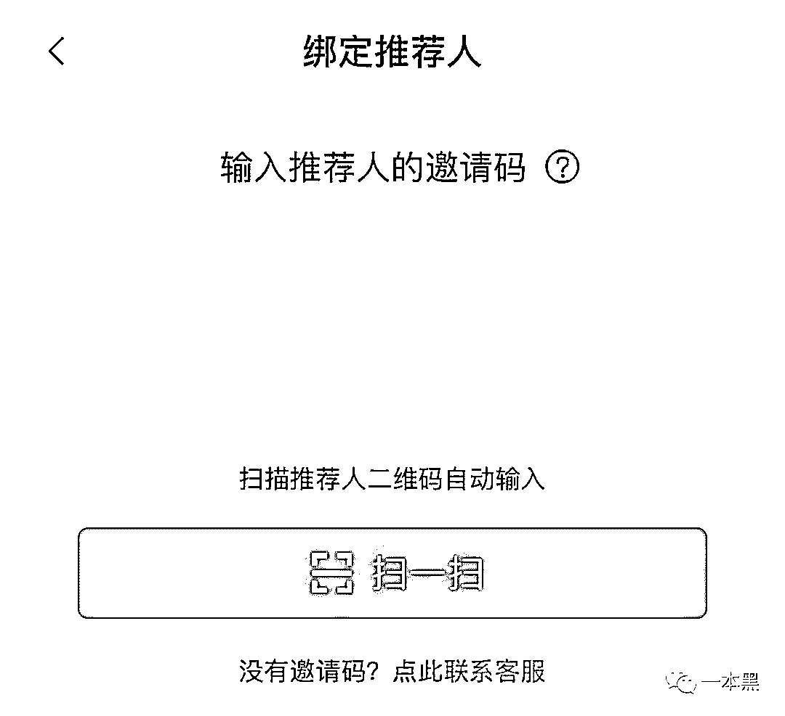

费大劲注册成功并登陆后，奇怪的事情再次出现了：当你选中心仪的商品，想要下单时，却总是显示无货。

在界面的醒目位置，能看到累计店主近 80 万，共赚取近 1.5 亿的提示，而在“如何赚钱”一栏中，则详细宣传了成为店主后分享赚钱、自买省钱的内容。

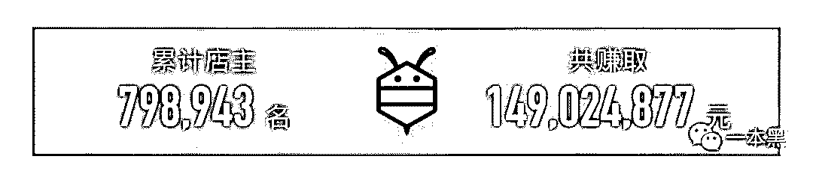

有网友尝试开店后再购物，再也没有遇到无货的提示，也就是说，想购物，你得先开店。

这种逻辑令人费解，好比我想喝牛奶，必须先养一头奶牛。

从成为店主的宣传内容来看，闺蜜 Mall 体现出了四大区别于传统微商的优势：

**一次开店，终身盈利。**开店交 399 元，就可以成为 VIP 店主，还可以获得等价的商品，等于免费开店，此后，在商城购物，累计消费满额即可升级钻石店主，邀请朋友开店，朋友卖货，自己还可以拿到提成；

**无需囤货。**客户通过商城即可下单，无需大量囤货，省去了自己寻找物流和囤积货品占地的麻烦；

**快速回本。**前期只需投入 399 元，有朋友在你的商城中购物即可提成，或者招几个代理，即可快速回本，后期就属于无本纯收入了；

**低投入，高成交。**团队提供免费的公开课，只需邀请有意向的客户加入微信群，课后的成交率高达 50%，收益都由你享受。

开店送商品、送流量，满足日常购物的同时，也在轻创业，听起来是百分百的赢面。

懊悔自己又没赶上早班车？不慌，先看看那些已经上车的人怎么样了。

****02**  ****风光宣传背后是代理难以言喻的苦******

闺蜜 Mall 背后的代理商，相当数量是宝妈，和家庭主妇。

他们要么疲于照顾孩子，缺少收入，要么全身心投入家庭，缺少社会经验，这时，天上掉下一个能轻松赚钱的闺蜜 Mall，左看右看，好像都不是个亏本的买卖，捡回家试试，说不定这就是月入万金的起点。

然而，事与愿违。

据知情人士透露，闺蜜 Mall 依旧沿用旧套路，举办传销式的培训会和公开课，会上是洗脑和自嗨式的经验分享，并承诺为代理提供人脉、流量等帮助，以保证销售额，在结束之时，提前安排好的托儿，会做出争抢加入的姿态，吸引参会人员效仿。

但在成为代理后会发现，所有的承诺并没有兑现，而且，商城中所出售的商品，有价格欺诈的情况存在，与淘宝中同样产品相比，价格差距甚大。

原以为是一本万利的买卖，结果，商城零售卖不动，没有代理，也没有客户。

一夜致富梦碎。

****03 ****微商界的“教科书”****

闺蜜 Mall 并不单纯，它的身后站着摩能国际，同时，闺蜜 Mall 也并不孤单，因为摩能国际旗下的品牌和项目，远不止这一个。

去年，自称年回款高达 100 亿的“第一大微商”摩能国际跑路，坑了全国 10 万代理，被戏称为“跑路微商”，讽刺的是，摩能国际曾被称为“微商的希望”。

2016 年开始，摩能国际相继起了多个系列盘，主打女性市场，有棒女郎、卡瘦、速简等，闺蜜 Mall 正是其中之一。

流量明星+痛点直击，每一款产品，都精准的打向女性市场。

棒女郎系列找来了朱茵代言，其中一款私护凝胶产品，宣称不但能治疗妇科疾病，还能够有效保养卵巢、驻颜抗衰，时隔一年，代理模式就遭质疑，棒女郎也被认定为虚假宣传，产品存在质量问题；

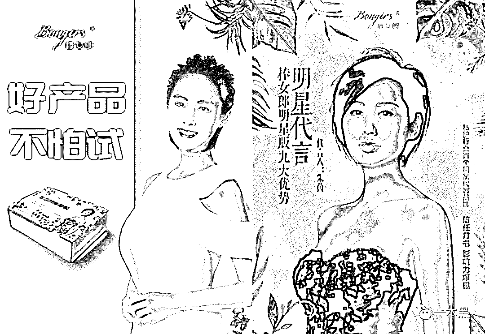

卡瘦找来了胡杏儿做代言，宣称产品可以减脂，甚至能调理高血压、肾结石，而后被投诉夸大宣传，代理模式再遭质疑，北京市工商局介入调查；

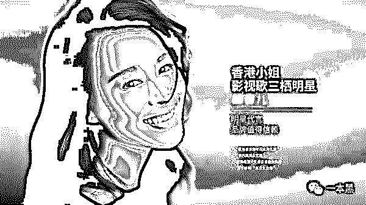

束简方便粥则找来了湖南卫视著名主持人张丹丹出任“明星 CEO”，宣称能够满足人体营养需求，排除毒素，净化身体，激发细胞活力，代理模式同样遭到质疑。

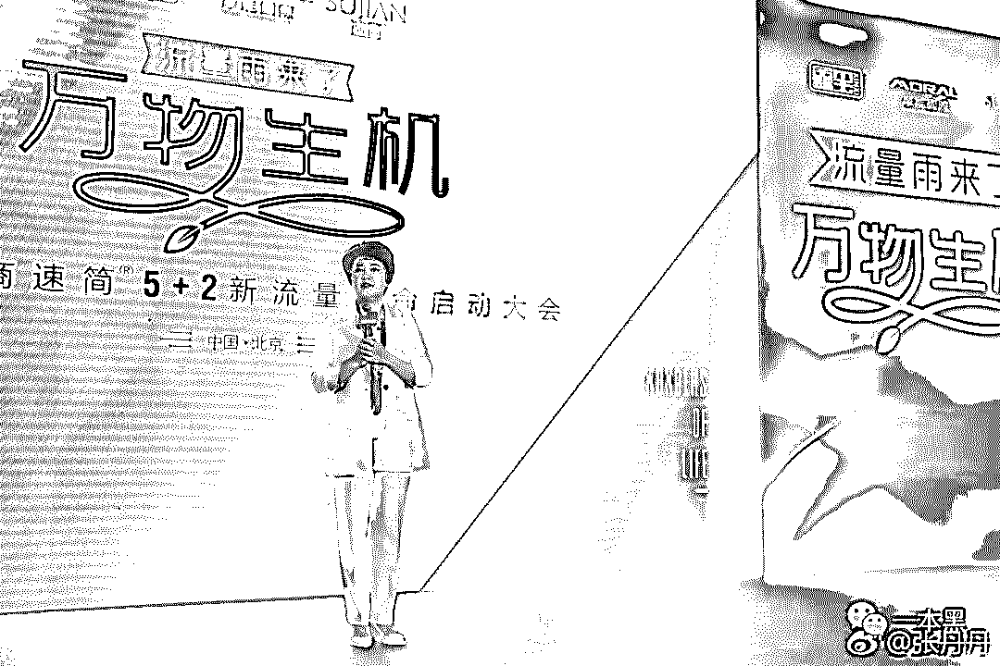

摩能国际多遭质疑的代理模式，为七级代理，越靠近金字塔顶端，级别越高，可享受的进货单价就越低，然而，等级的爬升，需要大额的进货量作为支撑。

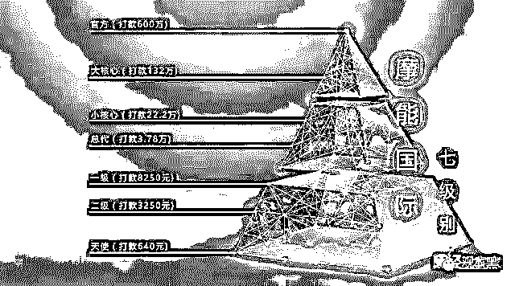

实际情况是，盘里的代理，多因为产品质量、压货等原因，承担着巨大的经济损失，一旦入局，想退货，难如登天。

人民日报曾发微博，附一张长图，含涉嫌传销超全名单，其中，摩能国际赫然其中。

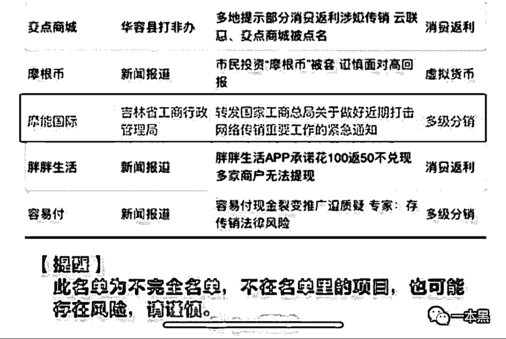

近期，有消息称摩能国际高层被异地执法，但截止发稿，闺蜜 Mall 商城依旧处于运营状态，昨日，还换上了庆祝元宵佳节的应景皮肤。

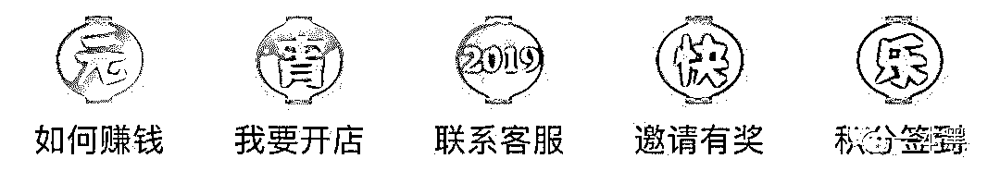

摩能国际的传销盘，暂不论结局，真可谓是起一个成一个，堪称微商界的“教科书”。

**0**4 摩能国际的 C 位“诈骗天团”****

闺蜜 Mall 的创始人 —— 万兵，称自己“已帮助中国上百万女性创业成功”，自诩是“一百万闺蜜背后的男人”。

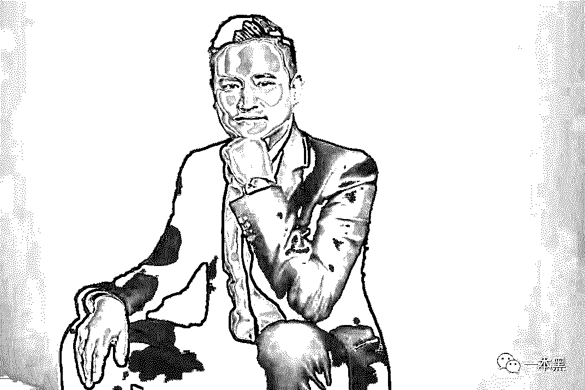

作为闺蜜 Mall 的总裁，万兵在各个公开的场合中，向外界卖力的推广着闺蜜 Mall 这一“新移动零售电商平台”，但绝大多数人不知道的是，闺蜜 Mall 其实是摩能国际旗下的产品，而这个“一百万闺蜜后面的男人”，实则是跑路微商“摩能国际 F4”中的一员。

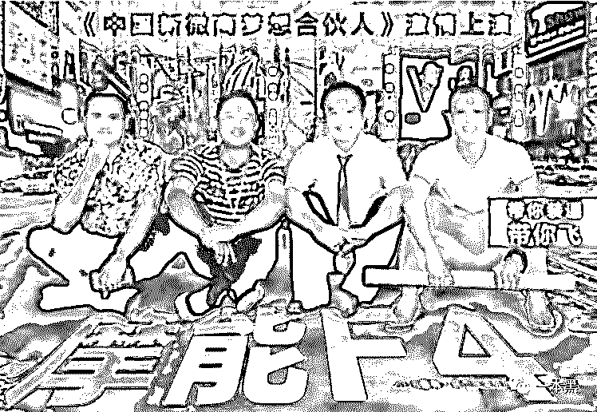

摩能 F4 中， **蒋德才**任摩能国际董事长，凭着过往在电视购物及通信行业的经验，2015 年开始进军微商；有着多年市场销售和运作经验的**万兵**，任摩能国际总裁；号称北大社会经济学博士的**姜汝祥**，任摩能国际首席战略官；**党德胜**任摩能国际副总裁，负责全国的营销策划，被称为“流量之王”。

2016 年，号称年回款 100 亿的摩能国际，以传销式的洗脑培训，只顾招收代理和收取代理费，最终让 10 万全国代理血本无归，哀鸿遍野。

公安部曾立案调查摩能国际旗下的传销盘，但幕后黑手早已不知所踪，留下的公司员工对公司的状况一无所知，跑路微商，一度成为引爆微商圈的敏感热词，不少人悲观的认为：微商已死。

谁能料到，人间蒸发一年多的跑路微商摩能国际，披着“闺蜜 Mall”的外壳，正大光明的出现在大众的视野中。

在外界眼里，打理闺蜜 Mall 所有业务的人，是总裁万兵，众多代理对闺蜜 Mall 和摩能国际之间的关联，也是全然不知。

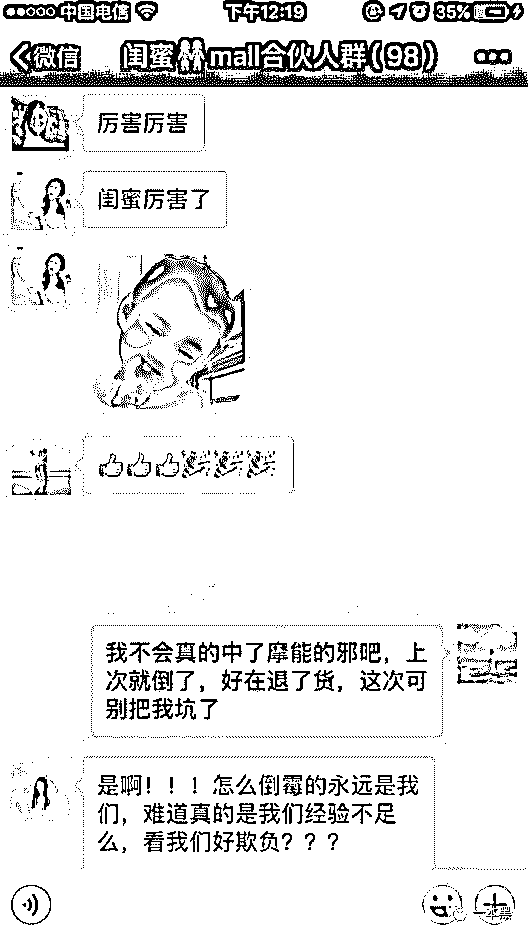

据知情人士透露，闺蜜 Mall 在工商信息更新中，将原有企业法人代表等信息，变成为一个叫做王浩权的人，表面上看，此人并无异常，但实际上，王浩权是摩能国际董事长蒋德才的小叔子，一起注册的合作伙伴王飞，是他的儿子。

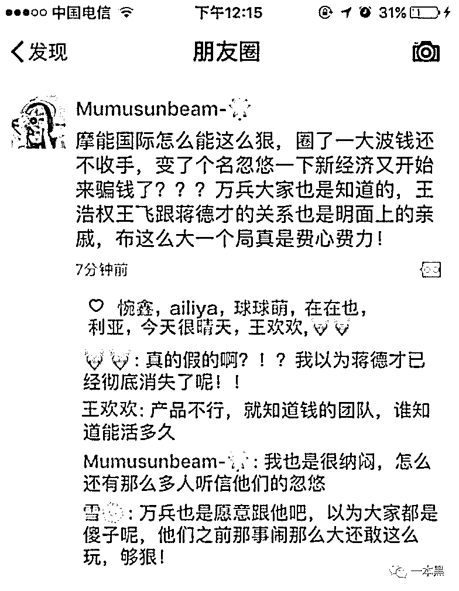

就这样，在新局中，摩能国际把自己择的一干二净，而闺蜜 Mall，自然而然就有了清白的出身，吸引了一众微商代理。

老蒋又一次成功了。

**05** 深谙“蒙派营销”之道的蒋德才****

蒋德才的成功，离不开独特的营销手段。

如果你留意，也许就会发现，国内规模最大的医药保健招商会地点，在深处内陆的呼和浩特；各大城市中，从事医药保健品销售行业的人，也多来自内蒙。

这些人组成的内蒙古军团，在中国保健品行业中，创下了独特的营销推广模式，被称为“蒙派营销”，手法大多是在选定的区域内，集中进行洗脑式宣传，疯狂销售，打一枪换一个地方，只看当下利益。

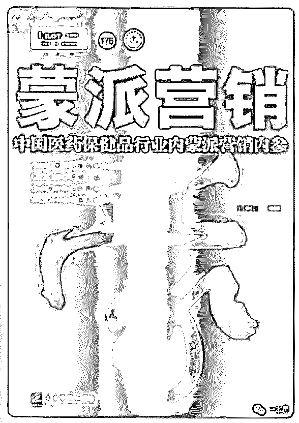

质量过硬，纯属胡扯；三包售后，都是扯淡。

从一定程度上来说，蒙派营销大大推动了虚假广告的繁荣发展。

正是模拟着“蒙派营销”的手法，从电视购物获得第一桶金的蒋德才，在手机行业，也曾创下响当当的两个品牌，即“尼采手机”和“大可乐”，成为山寨手机中的王者。

“尼采手机，每部只赚 10 元钱”，相信很多人还记得这句广告语，在苹果手机刚刚进入中国市场的时候，虽然外形美观，功能强大，但价格也同样高昂，蒋德才抓住这一时机，创建了尼采手机，外形完全仿照苹果手机，以强大功能和低廉价格为卖点，并首创“手机工厂店”模式，一度形成了销售火爆的局面。

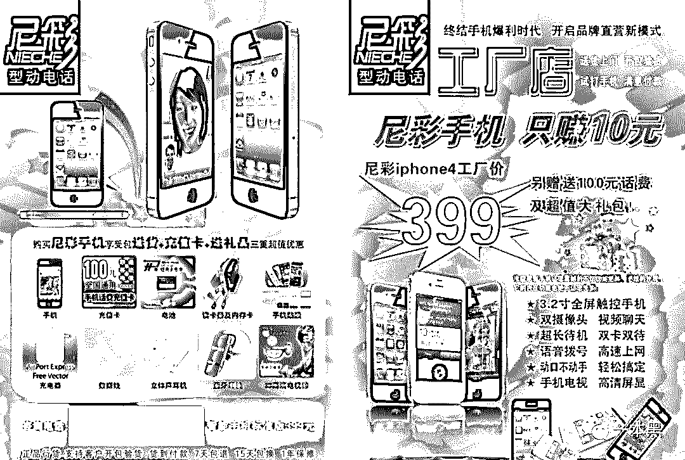

除了铺天盖地的广告宣传之外，尼采手机还试图实行“千城万店”战略，以极快的速度，在全国进行线下门店的扩张，战略施行仅半年，开店数量就已经突破 1000 家。

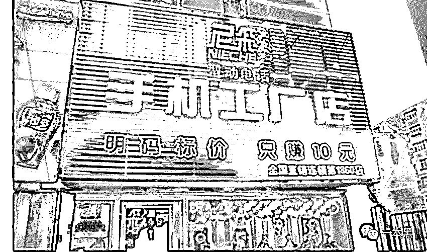

此外，尼采手机还请来国内多位一线明星合作，有香港明星张智霖、亚太影后张蓉蓉、相声艺术家大兵、影视明星王宝强。

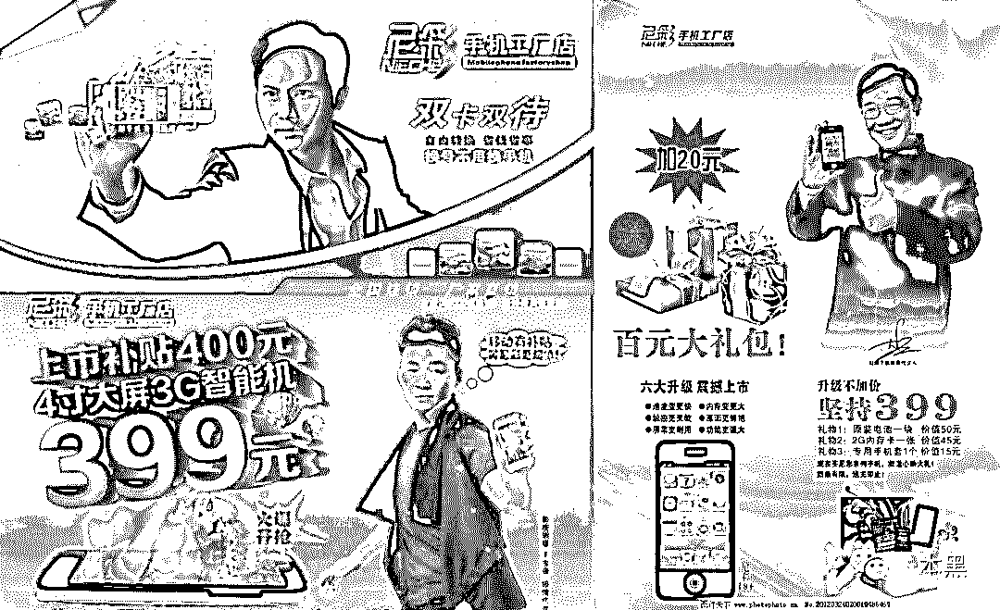

可惜，没有过硬的产品质量和售后，再朗朗上口的广告，也无法阻止其走向衰落。

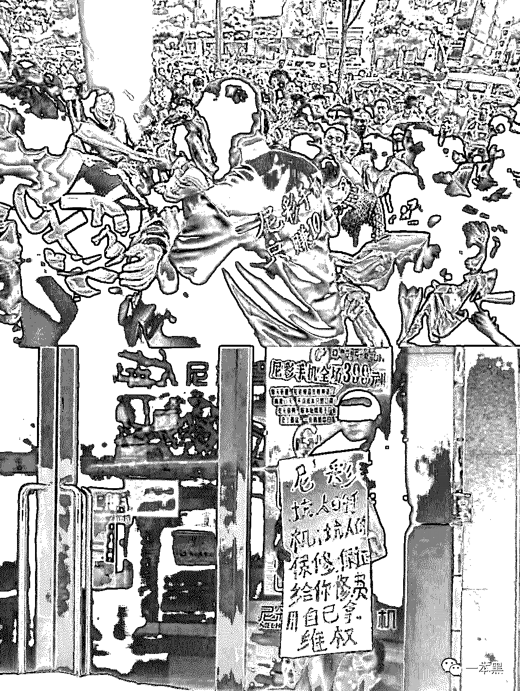

尼采手机失败后，蒋德才又与丁秀洪合作，创办了“大可乐”手机，又多次与各大电视台合作，甚至深入高校进行宣传，“大可乐”再次受到消费者追捧。

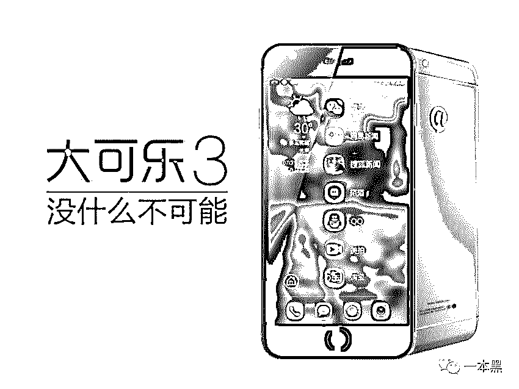

可惜好景不长，仅仅两年多时间，大可乐同样宣告失败。

对于消费者市场来说，无论是尼采还是大可乐，都是失败的，但对于蒋德才来说，这是两次宝贵的经历，因为它们都验证了一点：只靠广告营销和明星站台，就已经成功了一大半。

而这一点，在之后摩能国际旗下的所有传销盘里，都得到了运用，效果也得到了验证。

站在风口上，猪都能飞起来。

你瞧，还成功了好几次。

**THE END**

传销都披着华丽的外衣，不管与多么高大上的名词相连，本质都未曾改变。

不动、则不痛。

********

还原事实｜专扒黑产

微信 ID：darkinsider

知乎 一本黑

微博 一本黑 007

投稿、爆料、招聘、转载

请联系微信：chenchen_19940612