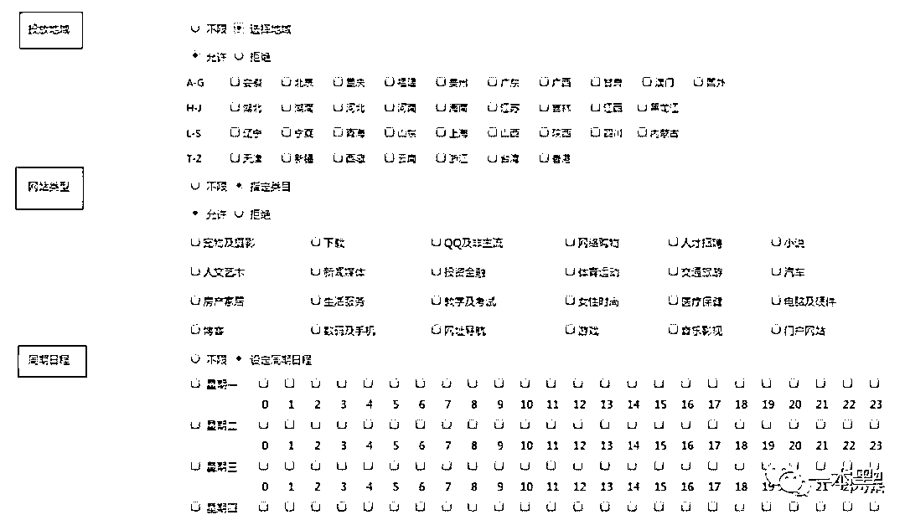
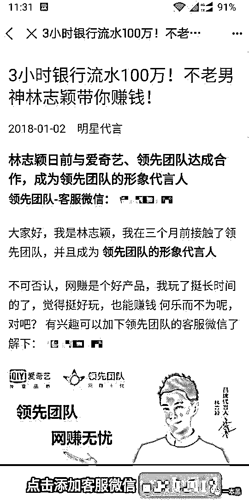
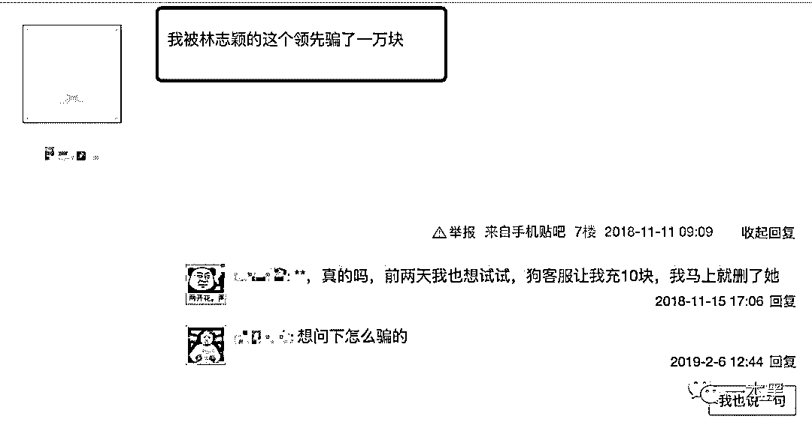
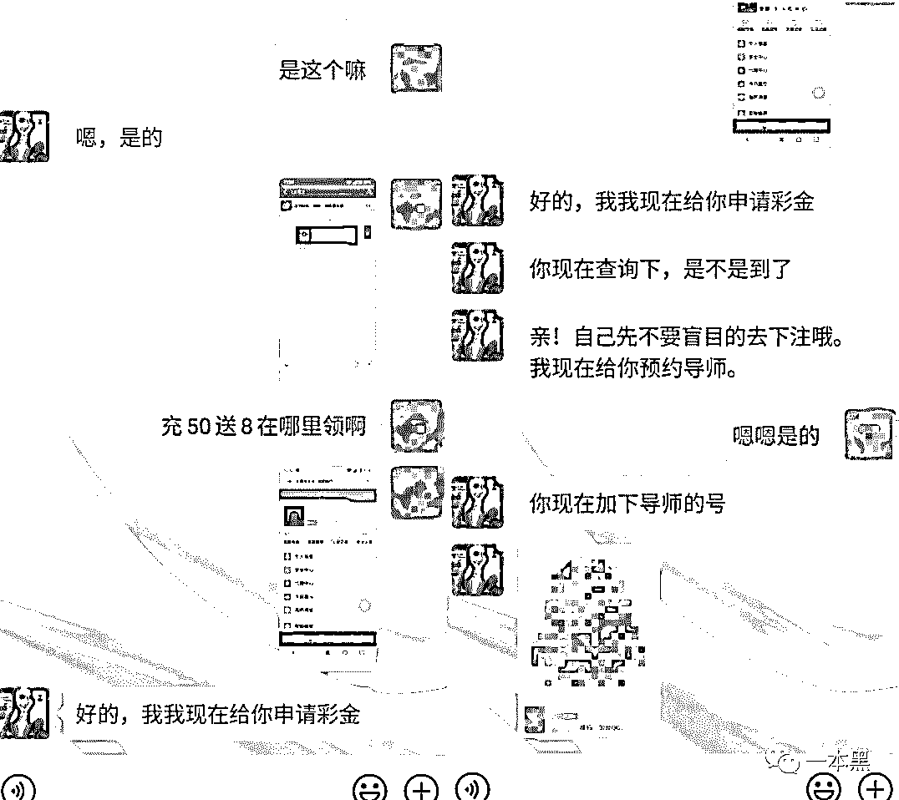
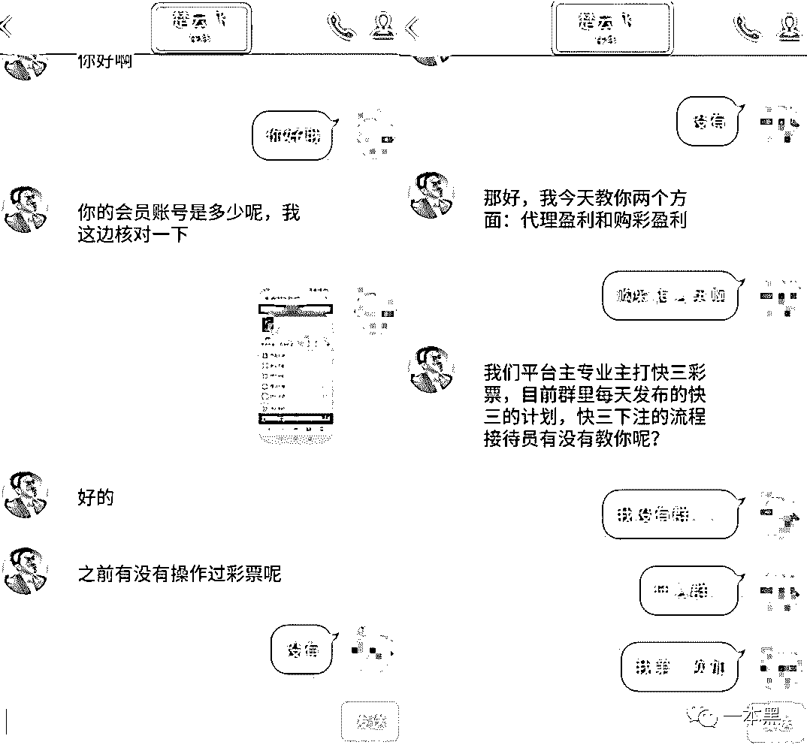
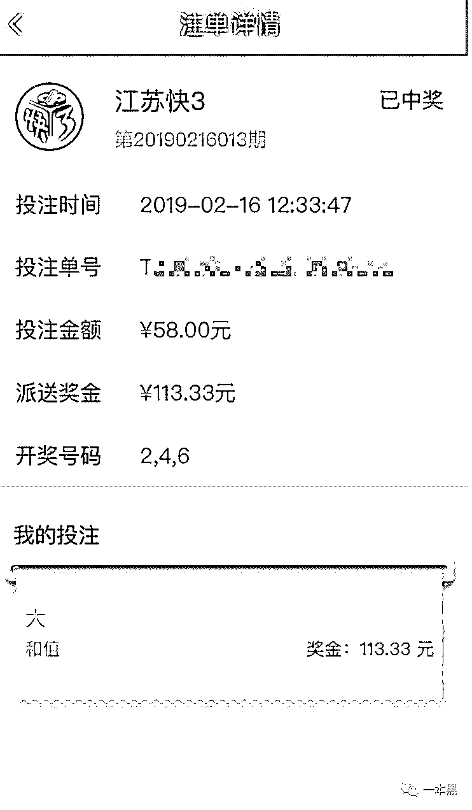
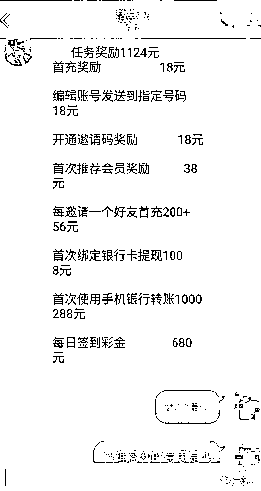
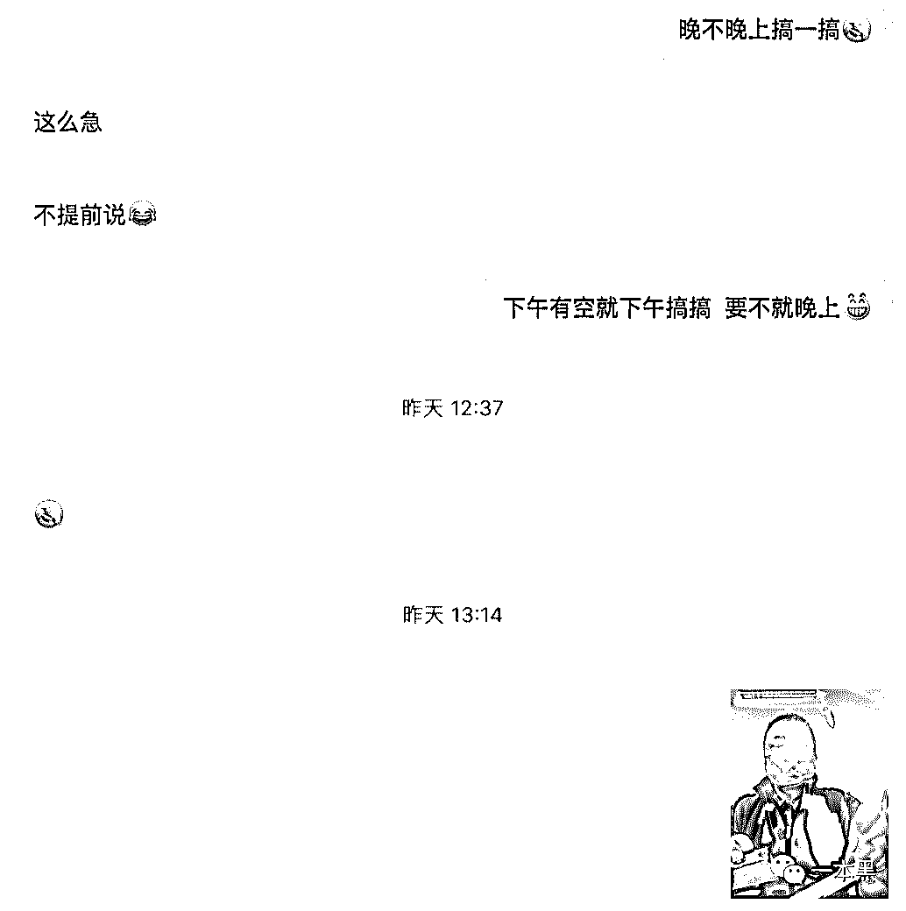
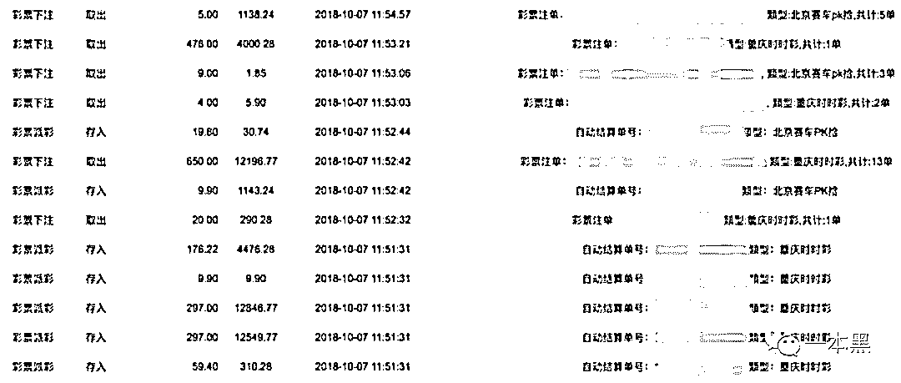

# 帮我@网易丁磊：告诉他别飘了，菲律宾在线赌博广告都敢接

> 原文：[`mp.weixin.qq.com/s?__biz=MzU4ODAwNzUwMQ==&mid=2247485077&idx=1&sn=e02db8e404564a98dd8aae995736261a&chksm=fde217b7ca959ea16620bddbde7276973e30003b33f55fc5f5a9620bfc41ffadccdc784d9793&scene=27#wechat_redirect`](http://mp.weixin.qq.com/s?__biz=MzU4ODAwNzUwMQ==&mid=2247485077&idx=1&sn=e02db8e404564a98dd8aae995736261a&chksm=fde217b7ca959ea16620bddbde7276973e30003b33f55fc5f5a9620bfc41ffadccdc784d9793&scene=27#wechat_redirect)

**我常常因为自己不够沙雕，而感觉与你们格格不入。**

**这是我春节期间最想说的一句话。**

去年开始，互联网流行一个说法，叫用户下沉，大概意思是说企业为了给自己的产品带来更多的新增用户，把从最开始服务一二线城市的用户扩展到三四线城市，乃至农村用户。

说人话就是，你所看到的刷新闻赚钱、快手上的种种江湖等都算得上是用户下沉的产物。

说到用户下沉，就让我想到了今年下半年，中美合拍的......两开花......哦不，其实我想说的是赌博。

在春节这个节点上，**赌博可以说是一项传统的、益智的娱乐活动，说不定几百年后还能申请个非物质文化遗产呢！**

之所以说这些，是因为春节期间听闻一件事，有人因为刷新闻，误入赌博平台，输了七八十万。

可能七八十万对有些人来说不算什么，但对于一个三四线、乃至四五线城市的人来说可以算得上巨款了。

作者 | 老黑

**01**

按理说，线上博彩这个行当我已经讲了无数次，但奈何自己读者有限，各位又不积极转发，才让我一次次听到这种可笑又无奈的小道新闻。

回到主题，前面说到有人因为刷新闻，误入赌博平台，一番打听后才知道，原来此人是因为在某新闻平台上看了一条兼职广告，被软文带动加上客服引导，这才一步步掉入陷阱。

而这里所说的**某新闻平台正是当今互联网鼎鼎有名的 XX 新闻。**

我发誓这是我和老师傅最后一次真刀真枪的讲赌博，再有的话这次就算倒数第二次。

其实这种线上博彩太常见不过，之所以会有人连续不断地上当，就是前面提到的用户下沉，这种玩法在一定范围内都人尽皆知了，线上博彩公司自然捞不到钱，所以他们就想法设法的扩展自己的用户。

这样一来，**那些三四线，四五线城市的人也就成了瓮中之鳖。**

首先，博彩公司要推广自己的产品就得全网打广告，投在什么地方呢？当然是流量大的地方，各种色情网站、短信群发的手段就不说了，为了更具公信力，他们还会青睐投放在巨头的产品上。

百度、新浪、头条、网易等都有自己的门户网站或 APP，这些地方流量大得可怕，特别是头条，可以说是用户下沉的代表性产品。

某些巨头可以说是一点底线都没有，对各种赌博广告、P2P 广告，都是睁一只眼闭一只眼的态度。

今天就拿网易新闻做例子来讲讲，看那些刷个新闻都能被骗去玩博彩的沙雕们，到底是怎么一步步入坑的。（**并不是针对谁，我是想说，****那些无底线的巨头都是垃圾**）

**02**

下载网易新闻，并对它进行轮番“扒衣解带”，我在它的头条列表发现，**基本每隔 5 条左右的新闻就会出现一个广告。**

有譬如植发的、奶茶加盟的、租房的。

其中一个熟悉的面孔多次出现，那就是成龙大哥，看着成龙大哥在网易新闻上沉迷传奇游戏，我也想像大家一样劝劝成龙大哥，不要再沉迷游戏了，我知道你一开始是拒绝的。

（图片来源于网络）

不知道是不是因为我的手机是 iPhone 的原因，怎么都刷不到目标广告，于是索性换了一台安卓机，刚刷没多久就看到了一条标题诱人的博彩广告。

iPhone 不太容易刷得出，安卓没翻几页就刷到了，我想这和博彩公司投放时候的后台设置有关。

> **以前的文章提到过，根据具体投放的产品，也为了能更加精准的投放，广告主可以在后台设置广告投放的区域、网站类型、以及时间周期。**

对这种博彩广告来说，他们一般会选择投放在三四线地区、投放类型一般是安卓端，最主要的时间大多数是晚上。

也就是说，**别人想让你在什么地区、什么时候、什么手机看见他的广告，他说了算。**

跟随广告点进去一看，不得了不得了，这广告居然还是找的不老男神林志颖代的言。

难道玩这种所谓的网赚就是林志颖成为不老男神的秘诀吗，于是我麻溜地添加了软文中留下的客服微信，生怕过了这个村就没有这个店了。

**既能赚钱又能永葆颜值，人生巅峰恐怕是指日可待了。**

如我所想，添加对方客服后，对方号称此兼职网赚主要是辅助某彩票平台做流水，从而获得盈利，**半小时最多能赚 200 块**，时间自由，方法简单，童嫂无欺。

要是没接触过的人看到这里估计已经开始蠢蠢欲动了，心里开始盘算半小时赚 200，八小时可不就是 3200 吗，这他妈可比搬砖强多了。

再插一句无关紧要的信息，上面林志颖穿着橙色衣服的头像，我在网上翻了翻，发现其实是几年前给某集成灶拍广告的图片，结果直接就被博彩公司给抠图了。

打上领先团队，网赚无忧的口号，不少网友确实被这种明星“代言”效应给骗得够呛。

其实这种拿明星图片或视频偷梁换柱的例子实在太多了，不知道林志颖团队会不会注意到这种侵权事件给公众带来的误导。

接着，对方客服发来一个链接，打开一看里面有接近 30 种彩票玩法，

我知道有人看到这里依然不信邪，所以**我用给老师傅买烟的钱充了五十块，打算帮各位探探路。**

充值五十块以后，我一边心疼老师傅明天可能没烟抽了，一边在想我看你怎么把我这五十块套走。

果然，对方分工还是很明确的，客服第一层专门做接待，诱导用户下载注册充值，等到了要下注的时候，对方假装提醒用户不要盲目下注，会预约导师指导，于是开始对接二线导师。

加上所谓的导师以后，我一看对方名字，哦呵，楚云飞，我心想：“二营长，我他娘的意大利炮呢。”

**等会一定想办法干你他娘的一炮。**

**套路还是老套路**，先用所谓的代理盈利和购彩盈利进一步稳住用户。

教客户购彩，先让你赢点小钱，尝点甜头。让你相信只要跟着他的方案下注，日赚上千不是什么问题。

照着对方的方案下注后，果然获得了翻倍的收益。

接着对方开始抛出另一个盈利技巧——代理盈利，也就是通过做任务的方式进行拥金提成，绑银行卡、绑手机号、邀请好友，**一方面泄露了自己的信息，另一方面还帮他们做了推广。**

**大部分上钩的人只要跟着导师购彩赢钱看到了甜头，便会进一步陷入更深的陷阱**，随后导师会以方便管理为由把你拉入一个群中。

刚进群你会发现，很多人总是发一些自己跟着导师的方案购彩赢钱的截图，此刻的你会更加深信不疑这其中的赚钱之道，**殊不知里面大部分都是托，****比刘谦变魔术时候的托还要多。**

**03**

我曾经听一个在菲律宾从事菠菜行业的爆料者说，以往传统的获客之后，必须一对一服务，这种效率太低，如果客户太多绝对是忙不过来的。

后来他们为了把这些上钩的客户圈起来，就不再满足于用群的方式。

而是开发了一个类似聊天室的网页，聊天室的功能除了公布购彩方案外，还会每天发购彩红包，客户聚集在一起，可以互相交流，聊天室等于变成了一个巨大的、多功能的群。

不过这里面的套路也是骚得很，为了稳定真实客户，他们会在聊天室里放置一半以上的机器人，并且每天发的购彩红包是必须充钱以后才能使用的。

高手，果然是高手。

这样一来，这种稳固彩民的方式就比单纯的群要强大多了。

从那以后，他们不再花大量时间去留住客户。甚至有输了很多钱的客户主动要求充钱的，爆料者告诉我：**“看着这人已经输了十几万了，再充钱无疑是打水漂，我当时都有点不忍心给他充钱。”**

**04**

前面提到，教下注的二线导师叫“楚云飞”，我已经说过了一定想办法干他娘的一炮。

所以我赶紧拿出火机并掏了一根烟，正准备给老师傅点上，才发现，卧槽，今天是周末呀。

老师傅指不定又带着妹子去哪潇洒了。

不过我还是给老师傅发去了信息，并用表情包礼貌地递上了一根久违的烟。

第二天中午，老师傅发消息过来说搞定了。

通过抓包分析，我们拿到了对方基本全部的管理员账号，对其中的几个账号进行爆破后，数据一览无余。

我们分析了几个账号在同一个月的流水记录，发现收入基本在六七百万左右。

老师傅说他废了很大的劲，几经周转才拿到了他们的真实 IP，发现**他们用的是亚马逊的服务器，部署在菲律宾的马尼拉。**

而且老师傅还拿到了一些对方用于收纳赌徒资金的支付宝、银行卡账户（当然这些账户都是通过各种渠道收来的），最主要的，老师傅通过手机号、QQ 号、邮箱等蛛丝马迹，还射工出了此博彩公司法人的真实信息。

**从各种信息显示，该 W 姓法人七八年前主要做域名交易，后来专业做过洗钱，一直到如今做博彩。**

是条汉子。

最后，我和老师傅当然是把拿到的信息同步给了警方，至于是否会有后续，我们也只能期待了。

毕竟，本文的主要目的是想让那些沉迷赌博、幻想一夜暴富的人认清这个世界的不友好。

至此，从一条新闻网站上看到的兼职广告，到背后月入几百万的博彩生意已经逐渐清晰。

互联网巨头掌握着大部分流量，博彩公司乘虚而入，摇着尾巴等你往里钻。

此时的**互联网巨头哪管你广告是真是假，只要钱给够，甩手就把自己的用户给卖了**，这种情况似乎成了互联网的通病。

依我看他们掌握着大部分流量，着实是有点飘了，所以各位看到这篇文章的时候，麻烦帮我@网易的丁总，告诉他别像成龙大哥玩传奇一样沉迷的接这种害人博彩广告了。

另外，如果下次还有人在后台私信我自己在某某赌博平台输了几十万，能不能帮忙把钱拿回来的时候，可就别怪我把你拉入黑名单了。

哎，每当看到这种私信，我都会因为自己不够沙雕，而感觉与你们格格不入。

********

还原事实｜专扒黑产

微信 ID：darkinsider

知乎 一本黑

微博 一本黑 007

投稿、爆料、招聘、转载

请联系微信：chenchen_19940612