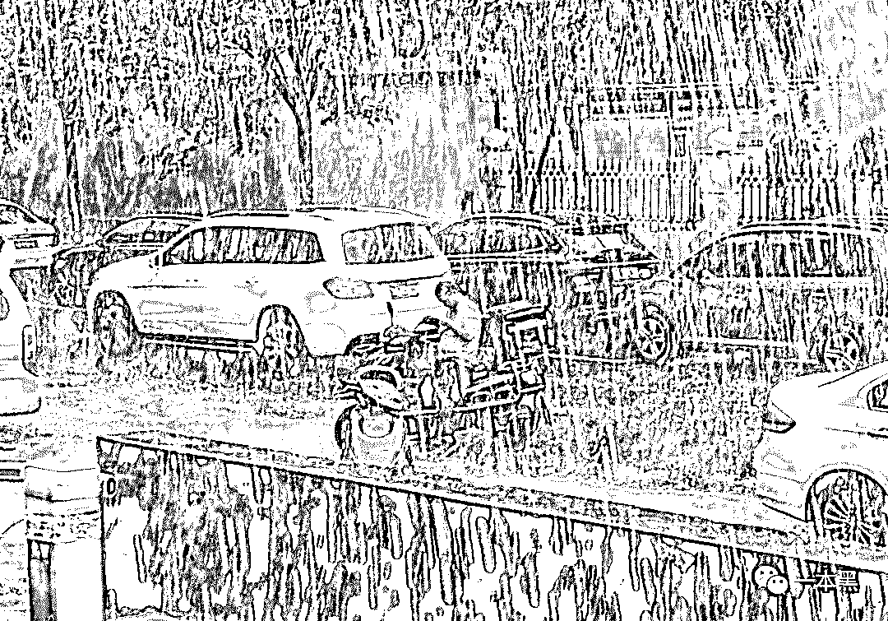

# 诈骗月入数十万，我靠骗钱来还债

> 原文：[`mp.weixin.qq.com/s?__biz=MzU4ODAwNzUwMQ==&mid=2247485055&idx=1&sn=1b36ef56fef6cb52b96ffe62a4a405e3&chksm=fde2175dca959e4b06c4d51dd131dd74cf171925aad098ffe9767f996bb6c0218ba7d70939e7&scene=27#wechat_redirect`](http://mp.weixin.qq.com/s?__biz=MzU4ODAwNzUwMQ==&mid=2247485055&idx=1&sn=1b36ef56fef6cb52b96ffe62a4a405e3&chksm=fde2175dca959e4b06c4d51dd131dd74cf171925aad098ffe9767f996bb6c0218ba7d70939e7&scene=27#wechat_redirect)

对于社会底层的人来说，贫穷是一切不公的源头。

有些人忙碌一生，到头来还是一贫如洗；有些人偷奸耍滑，却赚的万贯家财。

他也曾数次在欲望与良心之间挣扎，最终却心甘情愿堕入罪恶的深渊。

文 | 喵叔

几个月前的一天，我和老师傅正在酒吧喝酒，突然老师傅看见一人，非要拉着我去打招呼。一番交谈之下，才晓得他是老师傅之前的同事，现在在做反欺诈。 

他的计算机基础知识的造诣或在老师傅之上，所以老师傅给他起了个绰号，叫博士。

酒喝得正酣，博士突然问我，最近还写灰黑产吗？我说写，博士说他一会回家给发我个东西。

刚到家不久，就收到了博士发的邮件，里面是几段音频和一个文档。博士说这是前阵子帮助公安打掉的一个诈骗团伙，截取的一段录音，一本黑或许用得上。（以下由音频整理而成）

**01 ****乡村少年初入世**

李博今年 21 岁，来自四川省大凉山，那个有名的贫困山区。但凡在网上看过一些资料的人都知道，大凉山的经济极其落后。很多孩子初中都没毕业就辍学出去打工。李博也是如此。

作为家中长子，李博 16 岁就出去打工赚钱。做过洗碗工，进过工厂，原以为往后的日子也会像这样平凡地度过，不料想因为一笔贷款而卷入诈骗集团。

> “我知道自己在骗钱，我也会觉得内疚，可是我根本没有回头路可走。骗局一旦开始，就再没有停止的那天了。”

李博在家中排行老二，大姐今年 22 岁，已经是两个孩子的母亲，家里还有一个弟弟，一个妹妹。弟弟今年上初一，妹妹刚上五年级。

和大部分农村家庭一样，李博父母也是在家务农为生。但早年一场事故中，李爸爸不慎摔伤了腰。那场意外让李家的境况一落千丈，原本在村里算得上顶好的家庭，一夜之间变成欠债最多的那家。

日子虽苦，但李博一家却始终和睦如初。受伤后的李爸爸做不了重活，所有的农活都由李妈妈和几个孩子承担。为了减轻家里的负担，李博读完初二就主动提出要辍学出去打工。

父母虽不愿意，但家里也的确供不起这么多孩子。无奈之下只得同意。于是李博便和人一起南下去广东打工。

李博说，在 16 岁到 19 岁的那三年里，他每天都要上十几个小时的班，经常日夜颠倒。有时候忙到饭都吃不上，可赚到钱也不够一家人的开销，弟弟都上初中了却还和小学生一样瘦小，也因此总是被同学嘲笑。

这些事情家人从不和他说起，可是别人的指点总是会不经意传到李博的耳里。李博发誓一定要出人头地，让家人都过上好日子。

所以当杨勇出现时，李博毫不犹豫地走上了他精心安排的道路。

**02**  **误入网贷陷阱**

彼时李博刚满 19 岁，在广州的一家厂里打工。因为玩游戏，偶然结识了同为老乡的杨勇。

杨勇说自己在成都送外卖，工作虽累，但每个月也能赚到七八千块钱，而且工作自由。李博经常和杨勇吐槽工厂的活又累钱又少，于是杨勇便建议他回成都一起送外卖。

杨勇比李博大 5 岁，平常在各个方面对李博这个小弟多有照顾。加之李博自己对这份工作也很向往，便听了杨勇的建议，辞掉工作去了成都。

刚到成都的李博无处可去，便住在杨勇的宿舍，通过多日观察，李博发现杨勇说的的确可信。便由杨勇介绍去了当地一家外卖公司面试。

面试通过后，公司要求李博办理健康证，自备电动车，并缴纳 1000 元的押金。此外还需要租房、买手机。总共加起来近一块，东拼西凑后还差了 2700。

初到成都的李博并没有准备这么多钱，便在杨勇的联络下，向一家网贷公司借了 2700 块的贷款，约定 2 分息，分 3 个月还清。

原以为一切都准备妥当了，可事情开展却并不顺利。由于经验不足，对成都的街道不熟悉，李博多次因为配送超时被投诉，好几次还因为闯红灯被交警罚款。

还有一次因为赶时间，电动车忘了上锁，等送完餐回来一看，连车带外卖都被偷了。虽然后来车找回了，但因为丢单，李博被公司罚了 2000 块。

前两个月到手的钱连基本开支都不够，更别说还贷款了。

随着业务日渐熟练，到了第三个月，李博终于攒下 1500 块还款。剩余的 1200 块，李博和贷款公司说下个月一次性还清，却遭到对方的拒绝。

贷款公司说剩下的贷款已经逾期，要罚款，本金+利息翻五倍，一共要还 8000。李博不同意，结果遭到对方的殴打，还被强行加签了一张 10 万的欠条。

李博找到杨勇，希望他能出面帮忙协商，可杨勇此时却翻脸不认人。

直到这时候，李博才发现自己被杨勇套路。想逃离，却为时已晚。

**03 ****不甘的沉沦路**

正当李博为还款发愁时，一条招聘信息引起了他的注意。云南一家保健品公司正在招聘电话销售，每个月底薪 8000，外加销售提成，而且还包吃住。

这对李博来说可是个好消息。用他自己的话来说，这叫天降福星 。只要自己工作努力些，每个月赚上万把块肯定不成问题。于是李博按照招聘上的地址去面试，最终顺利通过。

通过面试之后，李博便卖了电动车，辞掉送餐员的工作，开始全心投入新工作。为期两个月的培训考核结束后，李博正式成为该公司的一员。

李博主要的工作职责就是打电话，每天必须要打完两页纸的电话。每天打近百个电话，能说上两句的屈指可数。大部分人在听完李博的自我介绍之后，就挂了电话，有的人不仅不听李博说话，还会骂脏话。

当打到近千个电话的时候，终于有个老人接了电话。他在听了李博的介绍之后，对产品疗效表示怀疑，为了成交，李博主动说去帮老人申请折扣和礼品。

多番沟通之后，老人终于决定以 2000 块的价格购买一套疗程，希望能借此缓解多年的风湿疼痛。

一来二去之间，李博也了解到了老人的具体情况，老人今年 70 岁，姓吴，退休前是个中学老师。老伴在五年前去世了，子女也都在外地工作，如今自己一个人住。靠着每个月四千块的退休工资，老人在当地过得还算不错。

由于李博年纪小，说话又有礼貌，老人很是喜欢他，当得知他的家庭情况后，老人更是将他当成亲孙子一般对待，还说要给他家打点钱。

在李博很小的时候，自己的爷爷便生病去世了。所以对这个关心自己的老人很是感激，便叫他吴爷爷。

在和李博确定好订单之后，老人决定第二天去银行给他汇款。

就在这时，李博入职时的指导老师出现了，他说公司的银行账户正在维护，目前只能通过网上银行转账。让李博帮助老人完成付款，并许诺给老人八折优惠。

李博觉得疑惑，但还是照做了。听到李博的说法，老人当时警觉这可能是个骗局，但李博一再保证不会欺骗他。出于对李博的信任，老人便将账户和密码告知了李博，让他帮助自己完成线上付款。

可当李博拿到这些资料后，公司就不让他再跟这笔单了，后续的接洽事宜一应交由其它同事负责。

此时李博终于察觉到不对劲，正准备给老人打电话让他赶紧去银行修改密码，指导老师恰好出现并阻止了他，并和他进行了一场长达一小时的交谈。

李博说正是这次交谈，让他真正踏入了诈骗这条路。

指导老师问李博：“你是打算去报警把我们都抓起来吗？你可别忘了这些资料都是你提供的，论起来你才是主谋，谁都逃不掉。”

李博说：“我不怕，不过就是坐几年牢，我不想变成一个诈骗犯，我不想赚不干净的钱。”

指导老师听完李博的话，反而笑了，“坐牢我也不怕，你去报警就是了，反正我一个人没什么担心的。你就不一样了，你去坐牢了，你那一家人怎么过呢？不管了？

你那生病的老爸不要吃药吗？弟弟妹妹不上学了？要是警察来了，你到时候最少判个七八年吧，到时候你出来再看看，你家人还在不在。”

“哦，对了，你欠的那四十万还没还清吧？要不要我把你家的地址告诉他们。”

在听完这一段话后，李博又气又急，他不能接受自己是诈骗犯的事实，也不敢拿家人冒险。

见李博不说话，指导老师又说，“你在这继续干吧。我觉得你能力不错，这样吧，这次的钱分你三万，另外你的工资翻倍。

你不用担心那个老人，死不了的，他家里有子女，又有退休金，不过是少点钱而已。人家照样过得比你好。

你一会给他打个电话，说密码错了转不了钱，让他换张卡来。”

在这一番逼迫之下，李博答应不告诉老人实情，也不报警。但也不再想参与其中。

一周之后，李博的卡里果真多了 3 万块。公司说是这次的奖励，李博没有多说，把钱如数转给了爸妈。为了不让爸妈起疑，李博在电话里骗他们说这是自己做销售的工资和提成，以后还会更多。让他们不要省钱，家里缺什么就去买。

既然逃不掉，那就干吧，从来都是富贵险中求。有了钱可以给家里重新盖个房子，可以给爸买更好的药，可以让弟弟不再被人嘲笑。

一次次地自我劝慰之后，李博不再挣扎，开始接受公司对他的所有安排。

随着到手的钱越来越多，李博最初的不安和愧疚也一点点消逝。

李博口才不错，人也灵泛，单做的越来越大，也越来越得领导重视，到手的钱自然也越来越多。

最多的一次，李博一次性给家里打了 10 万，说是上个月的工资和分红。

这和此前说的 15 万相差甚远。在家人眼里，李博一向是个懂事的孩子，从不对家里隐瞒什么。可如今不仅这钱对不上，还老有人打电话来催债说李博欠了他钱，有 40 万之多。

李博解释说是因为此前生意起步，借了别人几万块钱再加上人情往来，另外给姐姐也打了 5000，所以这才少了 5 万。

听完李博的解释，母亲并未觉得释然，反倒认为这是他掩饰的借口。都工作这么久了，借的钱早该还清了。人情往来每月都是固定的支出，不可能有这么大的缺口。便让李博尽早把剩余的钱拿回来，不要在外乱用。

母亲和李博说，“你年纪也不小了，过两年结婚生子要钱，你在外要节约点。以后每个月留着自己用的钱，其余都给我帮你存起来。你在外要努力工作，听见了没有？”

李博说“我有打算，欠下的 2700 块钱早已还清，不仅如此，还多给了一万。那些事情我会处理你不用担心，我会努力工作的，妈妈你放心。”

              截取自录音片段

可李博一边说着让母亲放心的话，一边却在诈骗集团越陷越深。那些好听的话只不过是李博安抚家人的谎言。

两个月后这个诈骗团伙被警方一窝端掉，对于自己犯罪的事实，李博供认不讳。由于李博认罪态度良好，最后被判处五年有期徒刑，并没收违规所得。

**THE END**

或许每个人原本都是善恶兼备，只是善的那一面留给了最在意的人。

还原事实｜专扒黑产

微信 ID：darkinsider

知乎 一本黑

微博 一本黑 007

投稿、爆料、招聘、转载

请联系微信：chenchen_19940612

拒绝白嫖，请点好看