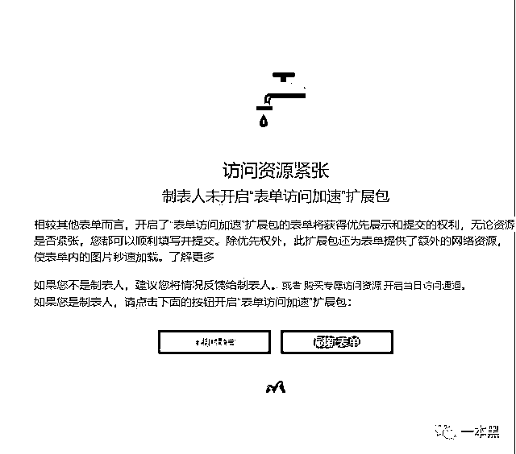
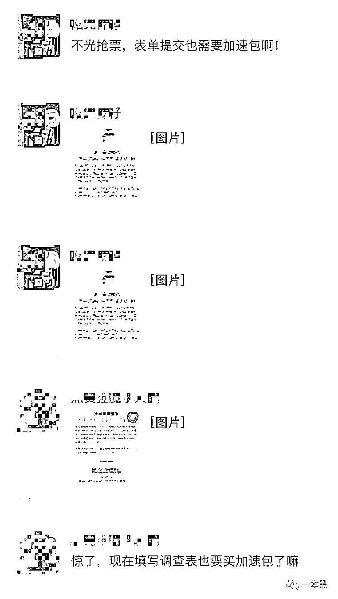

# 互联网企业：“你是我的爷，我是你的儿”

> 原文：[`mp.weixin.qq.com/s?__biz=MzU4ODAwNzUwMQ==&mid=2247484976&idx=1&sn=4ecd1090e3655c13e54f8d6bbe2f9960&chksm=fde21712ca959e049dab7a9e3a6c0943c6b55580eb6d664fc5c9b5fd1a52bdd4e2775541c2c3&scene=27#wechat_redirect`](http://mp.weixin.qq.com/s?__biz=MzU4ODAwNzUwMQ==&mid=2247484976&idx=1&sn=4ecd1090e3655c13e54f8d6bbe2f9960&chksm=fde21712ca959e049dab7a9e3a6c0943c6b55580eb6d664fc5c9b5fd1a52bdd4e2775541c2c3&scene=27#wechat_redirect)

“大哥大嫂过年好，你是我的爷，我是你的儿。”这句出自《鬼子来了》里的台词可以说是经典。用它来形容互联网企业和用户之间的关系，我觉得再好不过。

时不时给你来点大数据杀熟，要不就是隐藏捆绑消费，真是改革春风吹满地，中国企业真争气。

**一个不注意就给你下套，套路骚得让人猝不及防。**

就拿买火车票开加速包这事来说吧，明白人都知道是智商税，你还以为这些设计是造福人类呢，人家产品经理的思路可比你精多了，不赶在年三十前在用户身上薅点，这年终奖怕是不好拿。（开个玩笑不要当真）

前几天，我们推送了一条【**抢票过程中有什么值得吐槽的地方？**】的问卷，向大家征集各自的经历，收到近两千条反馈，有奇葩的、有无奈的、有说大实话爆料内幕的，由于篇幅有限，我选了部分公布出来。

文末有彩蛋，可能是本次征集最骚的一个，骚得就像一个段子......

**【以下来自读者口述】**

*   我岳父就是所谓的黄牛，他工作室三四台电脑，用专门的抢票软件 24 小时不停的抢票。。。所以，一般线路放出来票被抢光后即使有退票改签的，也绝大多数是被像我岳父这样的黄牛给抢走了。当然，他们是帮普通消费者抢，从中赚点差价。

*   我花了 60 块钱在淘宝找人抢票，结果等了几天后，他啥忙都没帮上，是我自己在 12306 买的票！60 元也不给我。

*   上次去杭州旅游，买了黄牛的票，貌似比票价贵一点点，但是令我特别难忘的是，途中转车的时候，旁边的一位老大爷买的票原价一百多，黄牛要了他 400。

*   大学生比较穷，买了火车票之后发现机票便宜二十块，时间也是下午，不是夜机，果断退票买机票一顿操作，发现，还要加机建 50 块，凌乱了一下。然后去买原来的那张火车票，没了……知道我最后怎么回家的吗，我买的提前四天的票，现在**学校还没放假，我已经到家了，真好！**

*   去年 12306、携程，飞猪买加速包都花了四五白块都抢不到，黄牛半个小时给抢到收 100 手续费。感觉他们有“黑科技”，这生意现在又忙起来了。

*   我们以前高中的群，每天发一大堆帮加速的信息。我把你们那篇文章分享到群里后，每天发的帮抢票的信息更多了😨

*   自己没有用过所谓的加速包，但是有一次，准小舅子在朋友圈分享小程序，就是让朋友助力那种，我看到了，没点，也没在意。晚一点女朋友说让我点一下，我也没点。过年去女朋友家，小舅子全程摔脸，让我发个红包，看在老人家的面子上，发了 2 千，心疼。他那张火车票 56 块。

*   用闲置的 windows 笔记本抢票，抢了两天没抢到，朋友说笔记本靠窗口风水不好，然后转了个方向，下午就抢到了，如果一直抢不到票可能姿势不对，朋友们换个姿势试试。

*   没什么特别的事，只是觉得相比现在的互联网抢票加速什么的乱象，发现黄牛党真是明码标价诚信经营童叟无欺😂。

*   我家在新疆，回趟家要么两三天要么两三千，尤其今年大学生放假赶上春运，真的酸爽，从南京到新疆也就两趟车，我抢票没抢到，找了黄牛，黄牛也没抢到...

*   我一同事，花 100 找黄牛买了张腊月二十八深圳到武汉的火车票。觉得有点晚，就自己接着抢前几天的票。今天自己在 12306 官网买了张 26 的票，一高兴就先把 28 的那张票退了。回头来付款的时候发现方向反了，买的是武汉到深圳的。嗯，现在又在联系那个黄牛，150 一张了。

*   **我朋友圈的黄牛在招学徒，1 万块学费**，就教你怎么用他们的内部抢票软件😭 😭 😭

*   我程序猿一只，买票对我来说很简单， 没啥奇葩的经历！ 但是可以分享一些方法给那些买票困难的人们。大家记住，什么加速包，加油包一点卵用都没有，他们只是通过你们免费推广产品而已！

    分享几个技能给不会抢票的人们：

    **第一个可以使用 12306 的候补买票**，这个是把退票那些先放在候补买票池，满足这些人以后 剩余的票才会流入大家平时看到的买票页面。第三方买票软件是不能买候补池的票。

    **第二个可以使用 12306 分流买票**，这个真心好用！只需要配置一些信息就能挂着！最后祝大家都能平平安安到家，开开心心过年！

*   我是搞程序开发的。我领导参与了 12306 的开发。上面拨款 5 亿。外包实际到手 1000 万。然后需求里说明了外部接口的规范。软件抢票花钱是因为，VIP 接口需要单独收费。

    12306，携程等网络公司的普通购票，网上那个抢票软件，走的都是单纯的普通接口。就是 20 节车厢，有且只有 3-4 节车厢的票放出。其余大部分在 VIP 接口放出。个别车厢在代售点放出（你猜黄牛在哪买的），而且普通接口提前 30 天放票。VIP 提前 45 天。

    就是你携程 VIP 花钱买票的话，提前 15 天订，多半可以买到，临时抱佛脚，想多了，凉快的等黄牛。

    黄牛票源是不公开出售的。所以大部分买得到，除非，黄牛卖完了。但是往往，会有加车的情况出现。这部分票，就是你故事里说的，各种钻石会员买不到，12306 买到了。不是奇葩不是幸运，因为那叫加车票。运气好而已。24 小时之后你再看，买到了算我输。

    因为加车是站点行为，总服务台未收录信息。各个接口是访问不到的。但是毕竟有审批流程，加车审批完，周期最多 24 小时。等你 24 时过了，重复上述操作。（一吐为快，不求任何礼品，能不能放出去也不在乎了，看着办吧，就算放出去，这也就是造谣，小老百姓整不过政府，溜了溜了）

*   不是我，是我找过的一个抢票黄牛，他那边是先把个人信息发过去车次要求告诉他，抢到了之后黄牛狂轰滥炸你的电话联系你，然后给你一个 12306 的账号，自己上去付钱，然后再把手续费转给黄牛。

    有一个女的在订单待付款期间一直没理黄牛，然后黄牛就好心的把钱先垫上了，付完跟那个女的说完，然后那女的就出现了，然后发现那女的就是想不想给钱白拿票，一听说已经付钱了，赶紧跑去火车站取票。

    结果到那儿发现黄牛把票退了，那女的就开始骂黄牛。。。这操作我也服

**彩 蛋**

当时为了征集大家在抢票过程中遇到的奇葩经历，我用了第三方的表单进行收集，可能是短时间访问量过大的原因，不少读者在提交回答的时候出现了下面这种情况。

       

什么？

**我他妈填个表单都要开加速包**，你们这些互联网公司真的是大爷。

哈哈，没想到吧！本来是个吐槽购票软件加速包的征集，没想到在提交的时候还遇到了开通表单加速包的要求。

开个玩笑，这里解释一下。

因为采用的是第三方表单，也就是说是别人公司的产品，之所以会出现这种情况是因为我没有开通对方的**【表单访问加速】**，所以导致不少读者在提交的时候出现这种情况。

但是咱也不能嫖完就翻脸不认人吧，所以我决定有机会一定付费使用。

还原事实｜专扒黑产

微信 ID：darkinsider

知乎 一本黑

微博 一本黑 007

投稿、爆料、招聘、转载

请联系微信：chenchen_19940612

拒绝白嫖，请点好看