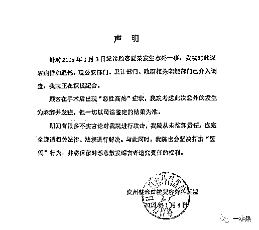

# 暴利医美，“毁人不倦”

> 原文：[`mp.weixin.qq.com/s?__biz=MzU4ODAwNzUwMQ==&mid=2247484971&idx=1&sn=a10b76f0ce8ba8f2714cef3d593f5ee0&chksm=fde21709ca959e1f09746eb96639b81537232a0dd14b0fcba5c8030fc8bd3614d1defefe56ca&scene=27#wechat_redirect`](http://mp.weixin.qq.com/s?__biz=MzU4ODAwNzUwMQ==&mid=2247484971&idx=1&sn=a10b76f0ce8ba8f2714cef3d593f5ee0&chksm=fde21709ca959e1f09746eb96639b81537232a0dd14b0fcba5c8030fc8bd3614d1defefe56ca&scene=27#wechat_redirect)

从古至今，人们对于美的追求从未停止。当女明星们顶着一张张整容模板出现在大众视野时，人们才发现人工塑造的美也可以如此鲜活明媚。

高挺的鼻梁、微弯的眼睛以及饱满的脸庞激起了无数女性对于整形的向往。

于是，美不仅是一种追求，也成为了一门生意，一门极其暴利的生意。而隐藏在暴利的背后是无数个因整形毁掉的人生。

文 | 喵叔

2019 年 1 月 3 日，贵阳市一 19 岁的大二女学生小夏在母亲的陪同下前往贵州利美康外科医院（六广门店）接受隆鼻手术，不料手术后突发意外，后转至贵州医科大学附属医院，经抢救无效死亡。

家属认为小夏的死与院方的抢救流程有关。院方称，小夏是由于在术后出现麻醉并发症引发的恶性高热而去世，但具体要以司法鉴定结果为准。

根据最新消息，双方已达成和解，小夏家属已经与医院签署了协调书，双方认可小夏是由于麻醉并发症去世。

# 

**01**** 隆鼻致死的真相**

在接受采访时，小夏母亲表示为了尽可能降低手术风险，他们多加了几千块钱请张智毅院长亲自操刀，不料还是发生了意外。

在手术结束后，小夏出现持续高热，两个小时后由利美康转至贵州医科大学附属医院。当她赶到贵州医科大学的急救室时，才发现女儿已经离世。

当时小夏母亲质疑女儿的离世可能是利美康的抢救不当导致。而利美康并未给出正面回应，只表示小夏可能是由麻醉并发症引发恶性高热去世，一切以司法鉴定结果为准。但这一解释并未能取的小夏家人的认同。

**不过如今尸检结果尚未公布，小夏父母已经与医院签署和解一些书。**

真相究竟是怎样，似乎也已经无关紧要。

**

*图片来自微博*

根据利美康的说法，小夏是因为恶性高热去世。根据查阅相关资料发现，这是一种麻醉并发症，发病率约五万分之一。可发生在麻醉诱导期，术中或麻醉复苏恢复期的几小时内。

一旦发生暴发型恶性高热，没有丹曲林死亡率高达 80%，且发病迅速。

据业内一资深麻醉科医师分析，恶性高热是一种正常的麻醉并发症，在没有其它外部因素影响下，**由恶性高热导致的事故，医院和医生无需承担责任。**

此次涉事医院为贵州省知名医美机构，在全国约有 20 家门店。他们曾扬言到 2023 年，要在全国发展 300 家门店。

其母公司贵州利美康外科医院股份有限公司早已在新三板上市，被称为新三板“隆胸第一股”。2018 年公司前三季的净利润高达 2.96 亿，毛利率超过 50% 。

然而在事发后，公司已于 1 月 7 日申请紧急停牌。

*       **利美康停牌公告*

这并非利美康第一次出事。2005 年，陈女士在利美康接受隆胸手术，术后发生外泄事故。于是陈女生向医院要求索赔，但遭到医院的拒绝。

一气之下陈女士将利美康告到法院，然**利美康称该医生并非医院职员，陈女士遇到的是医托**，最终陈女士败诉。

此外利美康旗下子公司还曾多次因为虚假宣传受到监管部门的处罚。

经查证，利美康部分门店还存在医师执照不规范的问题，有医师的资格证显示行业地点在杭州，但实际上这位医师的资格证却出现在深圳利美康的宣传资料上。

# 

**02****  鸡腿练手，5 天上岗**

目前我国每百万人保有的整形外科医生数量为 2.88 位，远低于韩国、美国的标准。甚至连市场的基本需求都无法满足。

整形人数激增，医师数量急缺，于是各种速成班迅速出炉。只要几千块的培训费，上一天的理论课，零基础的学员也可以立马持证上岗。

2017 年，央视曝光了一批无资质的整形培训班，他们号称四天便可以让学员取的执业资格。尤其是割双眼皮和注射两个项目，随来随学，包学包会。

**

*图片来自央视新闻*

这四天时间里，白天学理论，晚上学实际操作。所谓的理论，更多是教学员如何忽悠顾客做更多的项目，如何让自己看起来更专业。而真正的操作守则及医学知识却甚少谈及。

实操课更是让人心惊胆战，实验模特是讲师带来的朋友。大家聚在手术室现场观摩讲师操作，现场既没有进行严格的消毒处理，学员们也无需佩戴手套、口罩、手术服等必需装备。

操作过程中，讲师将染血的纱布随意丢弃，一根碘伏棒反复使用。讲师还扬言，**只要不出大问题都能用钱解决。**

在微整界大受欢迎的玻尿酸填充和肉毒素注射培训则更加简单，在简单讲解注意事项之后，学员们便拿上注射器相互注射药剂，一次的注射剂量为 200。

毫无经验的学生一旦操作不当，极有可能导致面瘫、抽搐、失明甚至死亡。

**

*图片来自央视新闻*

经时候检测，发现这批肉毒素均无法查询到批次。这些产品要么为假药，要么是违法进口产品。

最让人啼笑皆非的是，他们居然用鸡腿练习双眼皮缝合。人体肌肉组织与鸡腿的肌肉走向相去甚远 ，但培训机构丝毫不在乎。要是出事了就跑路。

      

参加培训班的学员很多是兼职做整形，其中有糕点师、美发师等。当他们拿到所谓的结业证后，就可前往各个非法的美容院为顾客操刀整形。

菲菲今年 27 岁，此前曾花费 2700 元在一家美容院进行注射隆鼻。给她注射的医师并非专业医师，也没有相应的资格证，但菲菲听信了他们的说辞，便同意进行手术。

可谁知刚注射完，鼻梁就变肿了。当时医师和她说这是正常反应，过两天就回自行消退。结果第二天醒来，整张脸都歪了，并不断渗出白色的液体。

**最终，菲菲的右眼彻底失明，整张右脸也被毁容，需要植皮。**

*注射后的菲菲*

经检测该批药品为假药，当注射到血管之后，发生严重阻塞。而给菲菲注射的医师就是上面所说的速成班学员。

**当初和菲菲联系的店主，在听说后续修复费用高达 15 万之后，也失联了。**

或许医疗技术不断进步，可以将菲菲的脸恢复成正常状态。但失明的眼睛却再也无法重见光明。

# 

**03 ****南瓜马车里的暴利生意**

X 氧、G 美这类医美平台让整形变得更加触手可及，它们就像是整形界的大众点评。

团购、比价、看评论，虽然让消费者的可选项变多，但是互联网平台的准入门槛低，也带来很多潜在的风险。 

2018 年，中国整个医美市场的规模达到了 2000 亿以上，全国正规医美诊所不到 10000 家，而**黑医美诊约有 60000 家，非法执业者是合规执业者的 9 倍**，有 15 万人之多。它们往往隐身于生活美容店、住宅区与酒店中。

互联网医疗的兴起，将这些隐身于市井的黑诊所明目张胆地推向台前，让整形变得更加廉价和危险。

在 X 氧网站查询脱毛项目，系统推荐的前五家医院，4 家存在虚假广告行为，1 家查不到资料。

网站上各种低价的整形项目被都描述地极其吸引人，就像是灰姑娘的南瓜马车，只要购买这个项目，就可以开启人生的另一种可能，完成从灰姑娘到公主的蜕变。

**依靠互联网广告成长起来的医美机构，或多或少存在虚假广告或者夸大效果的问题。**

在高达 50%的毛利率之下，其中一半以上的支出用于营销。各种不知名的美容院和私人诊所经过美化之后被搬上网络，一切看起来都极其真实可信。

然而当消费者到达医院接受手术时，要么被医生私自加了项目多收钱，要么医院实际地址与网上的不符，更有甚者出现脸部变形或是伤残。

假资质、假医师、假产品让整个整形市场鱼龙混杂，不知情的消费者根本无从判断医院的真实性，便寄希望于各大互联网平台。

可一家大平台上聚集的医院多达上万家，平台根本做不到一一筛查审核，所以事故也就无从避免。**想要找到一家靠谱的整形机构，除了朋友介绍只能靠运气。**

互联网平台不仅仅只是一个工具，它还承担这价值判断的职责。平台有义务对系统内的机构进行审核和考察，但实际上是只有出事的时候，平台才会发声，帮助用户解决问题。

极低的进入门槛、宽松的审查制度，让医疗这个原本极其严谨的行业逐渐变得儿戏。

为了尽可能拉来更多的客源，各大整形医院想出各种促销手段。像分期付款、满减、多人同行一人免费、买几送几这样的活动多不胜数，不知情的还以为是超市促销。

源源不断的客流带来巨大的流水，超低价的药物让医院暴利增收。国内知名厂商生产的某系列玻尿酸，成本价仅 45 元，但在美容院，这款玻尿酸的售价却高达三四千。

由于这类药品是国家严格管控的医疗用品，只有取的相应资质的医院或者诊所才能持有。为了赚钱，这些美容院四处找关系买药或者直接买非法进口的药品，甚至是假药，成本比正规药品低好几倍。

有美容院的朋友透露，做双眼皮手术，日常的开支只需要用来买缝合线和针。而这些成本极低，一次花费几百元够一家店全年使用。但这家店的双眼皮手术一次收费在 1000 左右，说是一本万利也不为过。

那些街头巷尾的美容院，他们既不加入互联网平台也无需铺天盖地做广告，**只要忽悠到几个人就能够赚回本，一旦出事就卷铺盖跑人。**

****04 ******悦人乎？悦己乎？**

中国有 2000 万医美消费群体，其中三十岁以下的占绝大多数，**整形群体呈现日渐低龄化的趋势。**

黑哥有个表妹今年才刚上高一，便成天嚷嚷着要去割双眼皮。表妹其实长得很标致，但如今电视上的明星各个都是大眼睛双眼皮，小女孩又喜欢赶潮流，便也想着去整一整。

架不住孩子成天闹腾，父母也只得同意，等着表妹满 18 岁了便带她去割双眼皮。

电梯里、公车上，各家整形医院和平台的广告铺天盖地。尽管国家有明文规定限制医院的广告行径，但**金钱面前，有几个人愿意循规蹈矩。**于是整形这件事不断渗入年轻人的生活。

当整容从私密事件被推向台前。情感大 V 告诉你“你的牙齿、着装暴露了你的教养”。“女生就是要舍得为自己花钱。”

在一篇篇看似良言的宣传下，女孩们轻易承受各种代价，开刀动骨整容貌，裸贷陪睡买名牌。

古人说女为悦己者容，大 V 们说女性要独立，要成为更好的自己，即使是整形也是为了增加自己的资本。在这套说辞之下，无数的女孩前仆后继进入整形的大潮。

大 V 们只教人要美要瘦，但从来不讲变美需要承受何等代价。在中国裁判文书网上检索到 44 起由整形引起的诉讼案件，其中有 5 人因整容致残，3 人八级伤残，2 人十级伤残，1 人试图服药自杀；此外还有人因整容失败而抑郁、自卑，最终导致失业、离婚。

整形失败的大有人在，但在颜值即正义的潮流下，**人们选择性忽略整形的风险，宁肯以身试险去换取短暂的美丽。**

千篇一律的欧式双眼皮和韩式小翘鼻真的好看吗？黑哥以为和年龄、气质相当的美才更加有韵味。

**参考资料：**

*19 岁女孩隆鼻手术中死亡 主诊医师竟为新三板上市公司董事，毛淑杰，南方都市报*

*央视曝光！这些“整容师”用鸡腿练手，3 天速成割双眼皮*

*千亿医美行业背后：乱象频发 秩序混乱，小渔，TechWeb*

*不堪忍受医美行业潜规则，百万年薪院长想辞职，第一财经*

*《新氧 2018 年医美行业白皮书》*

*《2018 医美行业白皮书》*

*图：央视新闻、摄图网、微博*

还原事实｜专扒黑产

微信 ID：darkinsider

知乎 一本黑

微博 一本黑 007

投稿、爆料、招聘、转载

请联系微信：chenchen_19940612

拒绝白嫖，请点好看