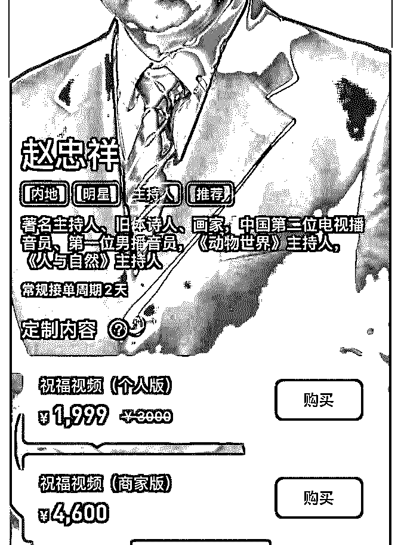
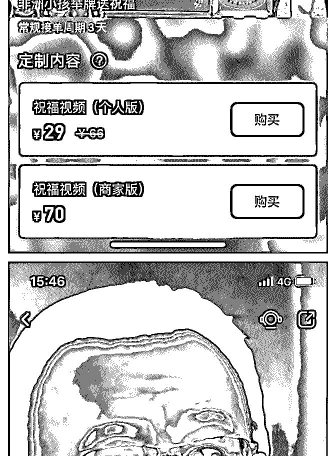
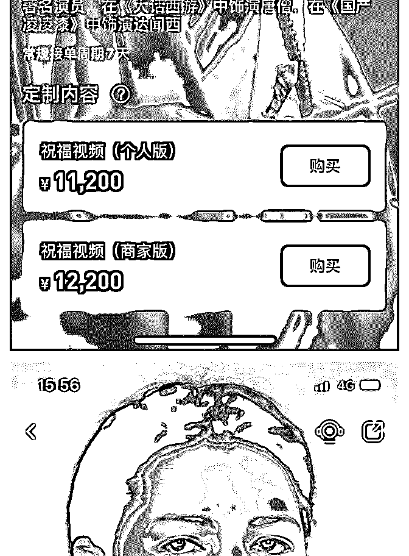

# 还记得之前赵忠祥收

花爷梦呓换酒钱 : 还记得之前赵忠祥收费录祝福视频的新闻 吗？有人专门做了个 app，叫 wishR，卖全球各种祝福视频。

花爷看了下，不光有国内名人，连港台、欧美的明星都被摆 上课货架。这就有点奇怪，管理这么多全球名人渠道是件非 常复杂的工作。

结果去查了下，国外有个叫 cameo 的平台，也在做这事儿。国 内很可能是接了单再去国外平台下单，还是信息差套利…… 2019-11-23(17 赞)

评论区：

(^～^) : [这篇文章有提到](https://mp.weixin.qq.com/s/mVGf9_WcFDonzIk-cfjBIA)[谁能靠过气明星的祝福大发横财？](https://mp.weixin.qq.com/s/mVGf9_WcFDonzIk-cfjBIA)

旁观者 : 到底是什么人群为此买单呢?

花爷梦呓换酒钱 : 企业、微商居多，撑场面用的

关注公众号"懒人找资源"，星球资源一站式服务