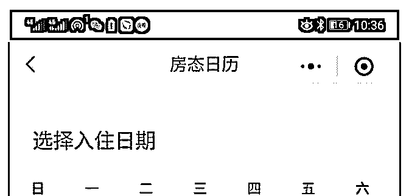
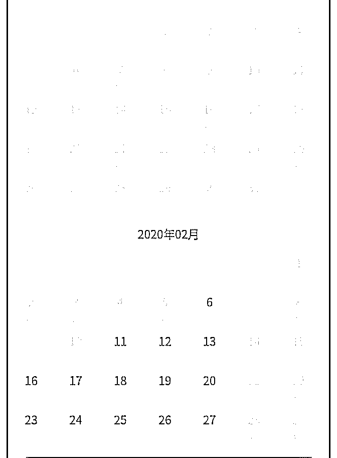
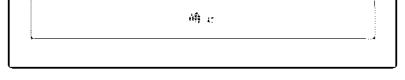

# 那天群里聊到如程酒

花爷梦呓换酒钱 : 那天群里聊到如程酒店这个平台，在几个大 号做软文投放，如下文：

核心机制就是：你交 688 元，买如程的会员，一年内你可以免 费住如程平台的所有酒店。

有的花友惊呆了，酒店住一晚少则一两百，大城市和热门景 点 688 只够住一晚的，如程这么做，还怎么挣钱？

花爷之前说过，所有的生意，都逃不过算账，把账算清楚， 大部分的商业模式就清楚了。

营收大于成本，生意才有利润，那么如程的成本是多少呢？ 只要你一算，你就会发现，酒店民宿这个产品，和普通产品

有个最大的不同。普通产品，买的人越多，销量就越大，只

要你有库存，可以卖无限多，但酒店不一样。

酒店一间房，一年只能卖 365 晚，多一晚都卖不出去（闰年除 外…..）。

如程平台有 200 多家酒店民宿，每间酒店对平台用户开放多少 间房呢？它没有说，也就是说，如程可以通过控制放出的房 间数，非常精确的控制自己的成本。

这个策略让如程几乎立于不败之地，如果交钱的会员多，如 程可以多放一点房间，如果交钱的会员少，如程可以少放一 点房间，无论放多少房间，如程都可以通过计算，通过控制 房间数让自己盈利。

有花友上网查了查，果然，随便点一家广州的酒店，要提前 三个月才能订到房。

另外，如果你幸运的抢到了房间，在如程每次住宿还要交一 笔押金，押金至少扣留一到两周。这一到两周你不能再预订 酒店（控制你的预订周期），而且每天的押金也给如程提供 了一大笔充裕的现金流，让他可以去投放获客，招募更多的 付费会员。

一方面，控制房间数保证盈利，另一方面，用押金去做投放 获客，再用新会员交的钱偿还押金，不断扩大规模。

这是一个标准的数学游戏和财务游戏，账算得精的人，做生 意不会太差。[688](https://mp.weixin.qq.com/s/gHB1d7XyeKp6SIXsgXzAyw)[住一整年酒店，这笔账怎么算？](https://mp.weixin.qq.com/s/gHB1d7XyeKp6SIXsgXzAyw)

2019-11-10(18 赞)

评论区：

Neal : 会员发现住房不方便的话不续会员哪来的后期发展

啊，喂 : 先缴纳会费，知道会员人数，好控制房间数量，让会员排队抢，平台通过这个方法可以控制现金流。 会员抢到了

房间还要交押金，且不能继续预定，平台进一步加强控制，继续产生现金流。 年费、押金产生现金流，排队和控制继续预

定周期，产生时间差，平台就拥有时间和现金流继续获客，成本控制到很低了。 小白尝试分析的，大佬们手下留情[捂脸]

Aaron 暖尘 : 本质上跟联联周边游一样——靠超高性价比套餐预售来获取现金流，然后控制每日预约量来控制与商家侧的结

算支出。 最后，完全可以靠“超售超卖、用户预约不到或者要提前很久预约”来赚取用户的沉没资金。

花爷梦呓换酒钱 : 专业[强]

大黑 : 会影响用户体验吧 不过这么诱人的营销策略，也不需要吃回头客了

