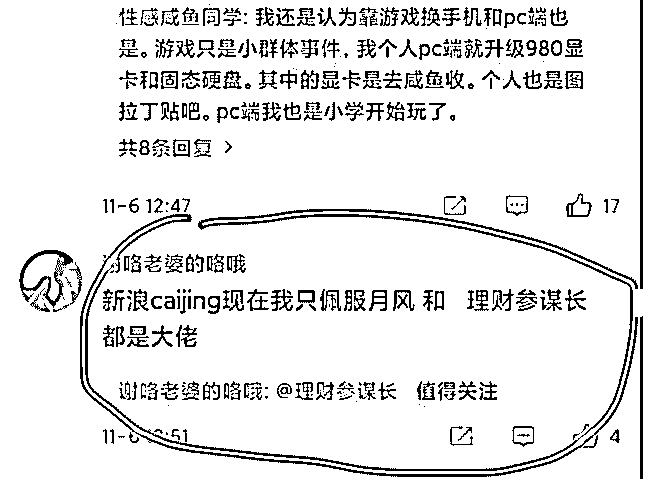

# 最近兴起的一个引流

花爷梦呓换酒钱 : 最近兴起的一个引流小手段。在某个垂直领 域（比如财经）的知名大 V 的微博下方留言：“论财经，我只 服 A 和@B。”

其中 A 是这条微博的主人，知名大 V，B 是引流的对象。 普通人看到这样的评价，会把 B 当成和 A 类似的大牛，点到 B

的主页浏览，如果主页信息够诱人，就有可能关注。

这是典型的公域流量截流的策略，也就是在公共的流量平台

（比如上文的微博），找到精准的流量（比如财经大 V 的微博

评论，看到的都是财经粉），用第三方的口吻（显得中立可 信），巧妙的引出真正想到导流的账号地址。

这样的操作简单有效，可以写成机器人程序，批量在公共流 量平台去发类似的评论，完成公域流量截流。

举一反三，类似的手法在知乎、微信读书、豆瓣等所有公共 流量平台都可能有效。在知乎，问题的类型可以帮我们定位 流量的精准性，在豆瓣，小组/图书/电影的类型可以帮我们定 位流量的精准性，在微信读书，书的类型可以帮我们定位流 量的精准性。

想到之前的另一个成功案例，某游记平台刚上线，想找大家 来写游记，但旅游的人太分散了，你哪怕出钱，也很难找到 刚刚旅游结束的人来写游记。

怎么办呢？

产品经理想了一个办法，他研究了某种算法，通过微博内 容，筛选出最近刚旅游的人，然后写了一个机器人程序，去 用户的微博下面评论。

机器人评论：在吗？ 对方：xxx（不管对方回什么，都触发下一条评论） 机器人评论：我们是一个年轻的创业团队，有一个不情之 请。

对方：xxxxx（不管回答什么，都触发下一条评论） 机器人评论：邀请你来写游记，有 xxx 奖励….（省去具体内 容，并且这里故意把一大段话拆成 2 条评论发，更接近真人对 话风格）

对方：xxxxx（不管回答什么，机器人再无回复）

就是这个简单的机制，这个游记平台向 30 万用户发出了写游 记的邀请。

这是个八九年前的案例，和今天花爷看到的评论引流有异曲 同工之妙。世上其实少有大的创新，在不同场景下巧妙运用 前人的经验，就算是一次微创新了。

2019-11-07(33 赞)

关注公众号"懒人找资源"，星球资源一站式服务