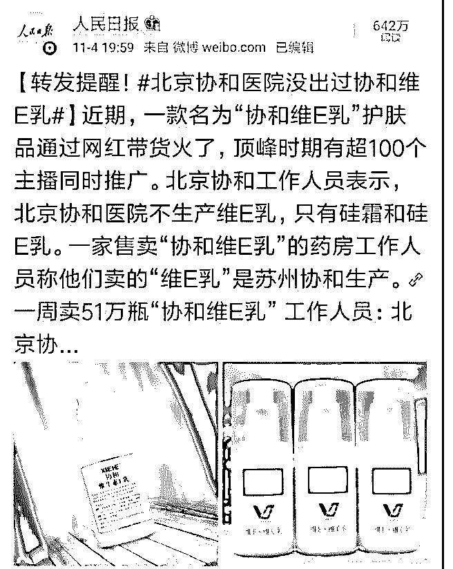

# 最近爆火的协和维 E

花爷梦呓换酒钱 : 最近爆火的协和维 E 乳，被几百个淘宝直播 的主播同时安利，7 天卖了 51 万支。买的观众都以为是北京协 和医院出的，结果实际厂家是苏州协和工厂，这家厂 1990 年 代就有了，当时就是蹭名牌的厂，30 年后又靠着蹭名牌火了 一把。

这事儿其实有很多商业里的规律可言，你看：

1.淘宝直播、种草博主，永远不是推最好的，而是推利润最高 的。

2.怎么样才能利润最高？推荐观众老爷们觉得好的。

3.但真正好的东西，利润往往最低，怎么办？推观众觉得好， 但其实没那么好的。

4.那普通老百姓觉得什么好？便宜、大牌、生活刚需。

5.便宜和刚需都好解决，但不是每个人都能做大牌，怎么办 呢？蹭大牌。

6.其实蹭大牌，是医院自己先发明的。医院的自制药，很多都 没有经过严格的医药审查，医院也大多没能力自己研发生 产，大多是代工厂产品，贴了医院的牌子，立马就变成名牌 产品，专门给医院创收的。

7.现在协和工厂蹭协和医院的牌子，本质上和协和医院自己贴 牌生产维 E 乳，性质上差别不大。

8.冒牌的都能这么火，各大医院该醒醒了，正品如果也有主播 安利带货，你猜效果会怎么样？

记住花爷这句话： 用户觉得好，但其实没那么好的东西，保健养生产品是一个

特别大的品类。它们成本足够低、又能卖出高客单价、还非

常容易获得各大医院、各大名医的背书光环。

接下来的直播、短视频带货，一定会爆出更多的保健养生产 品。

2019-11-05(21 赞)

关注公众号"懒人找资源"，星球资源一站式服务