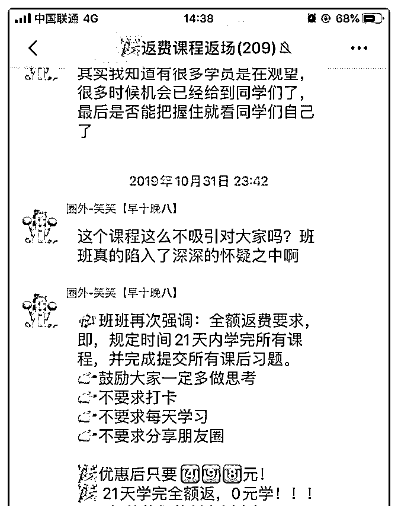
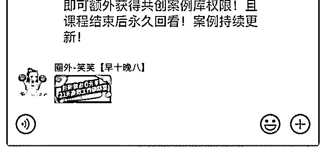

# 花爷，下午好。圈外

(提问)William : 花爷，下午好。圈外有推 21 天挑战 0 元学费的 课（即学完达标全额返学费）。这个和懂你英语的部分返学 费有点像。这也是广告方式的一种？然后引导你付费高阶课 程？我感觉我是他的受众之一。但是不是很理解这个运行逻 辑。请花爷分析分析

2019-11-02

回答：返学费的策略，有两个变种。 第一种，是有任务的返

学费，比如要求你每天学习完成后，发朋友圈打开。 这种玩

法一般价格不会太高，几十块钱，最高百元左右，主要目的

是吸引你完成发朋友圈的任务，带来更多的用户，本质上是

裂变的玩法，把人数裂变到一个更高的数量级，再出高价课

转化。 但后来微信不允许朋友圈打卡了，这个玩法就废掉

了。 第二种，就是你现在看到的，一定程度上是在赌概率。

假设原本课程 200 元，那现在我把课程价格提到 400 元，有

50%的人打卡成功，我的盈利和之前 1000 元时不变，而且因

为打卡返学费的噱头，降低了很多人购买的心理障碍，可能

吸引更多人报名。 当使用这种玩法的时候，其实是一种庄家

稳赚的策略，如果你没有打卡，庄家赚了 400 元，如果你打卡

完成，你充分接收了庄家的理论体系，有很大概率积蓄购买

后面的高价课程。 最差的情况是什么？100%所有人都打卡成

功，且所有人都不再购买其他课程，这种情况下，庄家的损

失是什么？其实非常小，无非是一点人力，课程本身是音

频，一个人学和一万个人学，庄家制作音频的成本是相同

的。 这就是知识付费搞这个玩法的优越性，边际成本非常

低，哪怕最差的结果，也只是稍微浪费一点人力。 更何况，

最差的这种情况，在现实中根本就不会出现。(24 赞)

评论区：

William : 谢谢花爷，有隐约的猜测。但是花爷说的更透彻。谢谢花爷[抱拳][抱拳]

李荣禄 : 兄弟推荐下，体验熟悉下流程。

William : 班班的微信发你了

李荣禄 : 谢谢。

beliber : 哈哈哈，我司其实这个模式是内测，为了升级课程，后续都是付费班

naokey : 这种课程的盈利模式能不能理解为前期投入很大，后期投入就非常少了？但是这些课程也养了好多班长和助教来维

持。比如说吸引班长购买课程，然后给予分销的权利，比如卖课成功给予百分比的奖金，然后让这些班长免费去管理学

员，继续在学员里推销课程，一举多得，省了管理费和营销费用。这样是不是也像您之前分析过的长投学堂的套路？

关注公众号"懒人找资源"，星球资源一站式服务