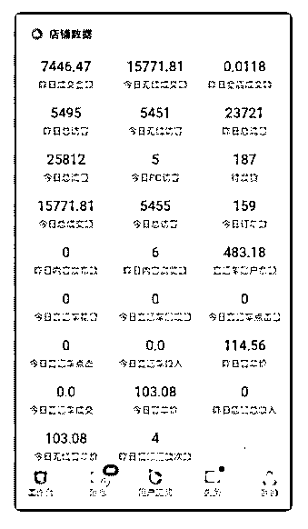
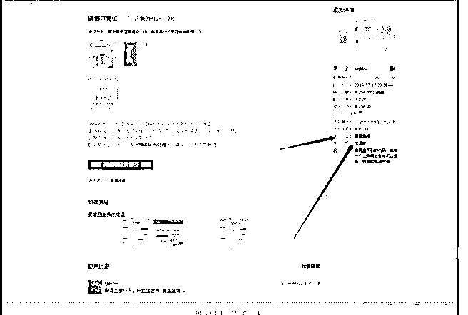
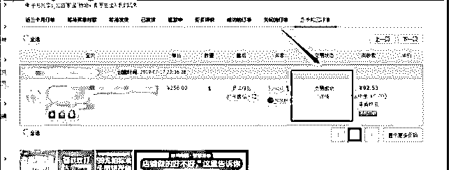
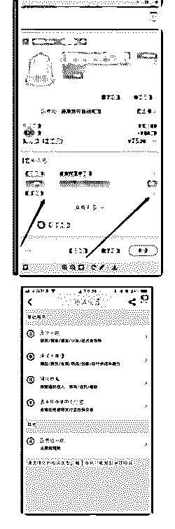
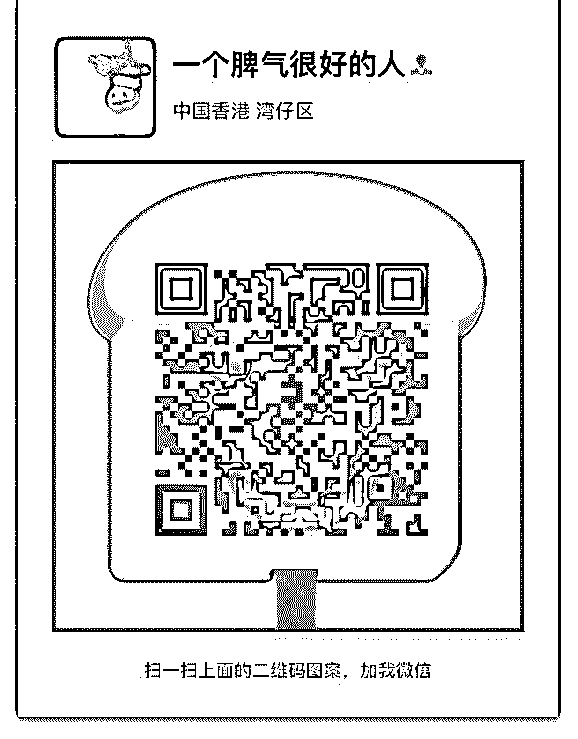
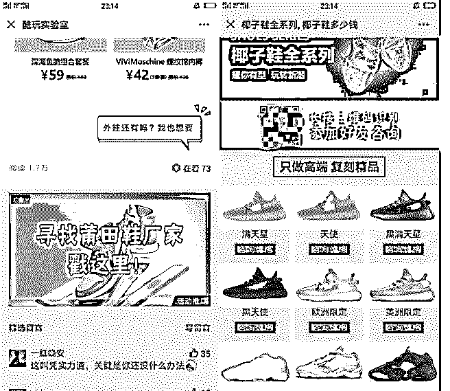
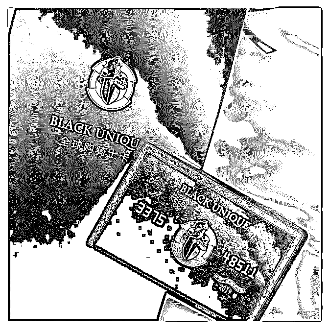

# 周三的电商快闪内容

花爷梦呓换酒钱 : 周三的电商快闪内容整理出来了，以 下，enjoy。

分享主题：进入新公司后，从 0 到 1 的淘宝电商实战讨论 分享嘉宾：花友周骁，入淘七年，14 年至今打造月销量过千

的商品 15 款，单款总销量最高 10 万件，全店总销量破 100 万。

分享正文： 一、从 0 到 1 打造爆款竞品 1、打造竞品

大家好！我叫周骁。

今年 7 月份在现在的公司入职，公司主要业务是母婴类双肩包 的生产和销售。老板天天和我说，让我给他一个计划，怎么 把品牌影响力做起来，怎么吸引粉丝，说我做好计划就给我 升职加薪，迎娶白富美，走向人生巅峰…。

公司原本没有线上销售平台，一切都要从 0 开始。 我想一个消费者，面对一个没有任何名气的产品，首先能够

吸引他的，肯定是价格，然后收到货，他会对你的产品进行

一个价格和质量的匹配。他要是觉得一般，那可能就没有下

次了，如果他觉得物超所值，那可能彼此间的故事就会继

续。。。

我觉得可以从这个方面下手，于是我和老板说，开发两款极

致性价比的产品，价格定位在 100，从面料，做工，细节处 理，包装，审美，服务，售后，每一个配套环节，都做到极 致。这两款产品，可以不盈利，甚至小亏，用来打造店铺和 品牌形象。提升影响力和市场占比。吸引一部分顾客，成为 我们的忠实粉丝。

这段时间，我每天跑生产车间，和车间的裁缝师傅建立了深 厚的革命友谊，终于生产出了两款个人觉得比较有市场竞争 力的产品。然后花心思拍图，做文案，挑模特，等等一系列 工作，接着投入店铺进行了一系列推广，算是小有所成，虽 然比不上行业大佬，但是好歹有所成绩，饭碗算是保住了。

。。

（图 1） 这中间还有一件事情让我印象很深，我有个同事，在湖南老

家的商场，看到了我们生产的包，问了一下价格，标价 498

元，同事反复确认细节，确实是我们公司生产的。后来我们

还根据地址，找到了这个商场老板的淘宝号。抛去其他不

谈，我们公司的产品，能让这个老板有底气卖到这个价格，

还是可以说明一些问题的。

由此可见，各种卖货平台，都只是一种销售渠道，而产品， 则是商业的根本，不管市场如何变化，市场对于好产品的需 求几千年都没有改变。想要在淘宝立足，首先要死磕产品， 一款好的产品，才能让你越走越顺。

如何选择核心竞品，如果身边有大数据资源，可以根据搜索 热度，需求度，商品属性这些来进行综合分析，选品，如果 没有，则需要请专门的设计师或者买手来做这个事情。

2、推广宣传

我采用的商品推广手段比较简单粗暴，刷单+直通车迅速拉 爆，这其中有一个刷单资源安全性和直通车水平的问题，刷 单资源不安全，会直接给你的链接带来毁灭性的打击。

多年以来的刷单经验告诉我，贵的，就是好的。千万不要贪 便宜，刷手和平台没有足够的利润支撑，刷单的安全性是得 不到保障的，每次虚假交易大地震，被查的往往都是便宜的 资源，或者是自己鱼塘放单的，而在大家都不敢轻举妄动的 时候，如果你有稳定的优质的资源，就可以实现弯道超车。 建议多储备一些优质资源。

直通车最近两年更新频率特别频繁，要不断尝试和学习，直 通车水平的高低，直接影响商品的 ROI。

二、电商团队建设——解决客服离职率高的问题 这样持续到了 9 月份，每天都维持在 100 多单左右的样子，但

是有一个很不正常的现象，就是客服的离职率很高，2 个月不

到的时间，换了三个客服。因为之前没有管理经验，于是向

花爷请教了一下办法。。

我之前只是想到用钱激励，比较直接，但是花爷说，就算把 客服的工资，从 3000 提升到 4000，用不了几个月，还是会不 满意，不知足。花爷给我讲了几个概念。身份，奖惩，竞 争，出口。（花爷牛 b）

1、身份 想象一下，职场如果是一款游戏，那客服的段位，最多只是 这个游戏的新手村，如何让客服愿意更久的在新手村历练？

设置不同的段位，让他们一直有一个看得到的目标去努力。 将客服分组，每组 5 人左右，设置小组长，如果总人数很多，

每 3 个小组再建立一个小团长，所有小组长、小团长从客服内 部选拔，阶级分工明确。

制度上一定要把楼梯一样的阶层搭建起来，人才有意识往上 爬。

2、奖惩 先说奖。电商客服的绩效一般与业绩直接挂钩，哪怕是售后 客服，也有对应的数据标准。但奖励绩效，不在于多，而在 于设置巧妙，至少需要有三种类型的奖励：

第一，普惠奖，即大家努努力好好干，就能拿到的绩效。 第二，头等奖，即做得最好的人才能拿的奖，一般得是个比 较诱人的奖。多说一点，头等奖是实物的时候，往往效果更 好，因为实物隔段时间换一次，新鲜感会带来额外动力，当 然也允许折现。

第三，竞争奖，这个在后面第三点再细说。

特别强调，有奖，就一定要有惩。 一定要给所有人设置底线指标，一次达不成指标，扣绩效，

多次达不成指标，考虑劝退。在客服这个工种里，一定会出

现不在乎奖励只想混日子的人，这种人要坚决清退，否则会

严重影响团队氛围。你甚至可以直白的跟大家说，哪怕有一

天离开，公司也希望你以一个优秀员工的身份离开，混日子

磨洋工的，绝不姑息。

3、竞争 竞争才能磨练出最好的团队。

设置团队奖励，以团队为单位比拼业绩。同时你作为主管， 要帮小团长、小组长们做好对客服的动员、培训，让大家在

实战中去总结，拼出团队感来。

团队间的竞争，靠的是一种仪式感、使命感。奖励是一部 分，另一部分，一定要让大家明白，拼搏不仅是为公司，也 是为了他们自己提升能力，以后有更好的发展。在竞争中表 现优异的，成为后面小组长、小团长的备选人。

如果你身边有做过市场销售工作的朋友，建议去取取经，销 售们的动员经验都很丰富。

4、出口 前面 3 招，都是让员工在新手村更努力的攀爬，但我们必须承 认一点，没有人想做一辈子客服，新手村也是有终点的，这 类需求是挡不住的。

所以，也要给所有人准备一个终极出口： 小组长、小团长中表现最好的，有机会直接转岗到公司最有

发展潜力的部门，薪水和职业前景再上一个台阶。

5、具体实施 根据花爷的这个大纲，我根据我们公司现有的情况，制订了 如下制度。

（1） 售前售后客服每月轮岗，从轮换过程中，发现问题。从 工作表现和数据中，挑选出优秀的人担任小组长。

（2）售前客服最重要的指标是询单转化率，售后客服最重要 的指标是问题的解决率和满意度，根据这两个指标，设立奖 惩制度，第一名直接奖励巨额奖金（我都很羡慕…），指标 低于行业平均的，进行相应的惩罚。

在工作中，态度积极，工作能力强的，达到一定绩效，公司 出钱进行培训，可以自由选择，运营岗，管理岗…

8 月底开始实行的制度，到现在，客服的离职率为 0，商品的 询单转化率稳定高于行业平均 10%，好评率和 DSR 服务分直线 上涨，纠纷退款率为 0.（花爷牛 b）

这几个月让我对电商团队的建设，有了一些不一样的看法， 在一个岗位，工作时间太久，人的激情被消磨殆尽，就像追 女神要不断的制造惊喜，一个原理，用不同的工作内容，不 同的挑战，丰富的奖励。去激发员工的工作热情。达到一定 成绩，绩效，可以申请转岗，一岗多职，等等。

三、店铺投诉的处理经验

7 月中旬的某一天，我提着早餐开开心心的走到公司，正准备 吃。客服突然对我说，“哥，完了，我们惹上事了。”我心里 一惊，赶紧跑到他电脑前面去看。

（图 2） 这个顾客申请仅退款，退款原因是假冒品牌。然后在留言和

旺旺里，发了一堆东西，说什么要向法院起诉我，向工商局

申请赔偿，等等一系列东西，甚是吓人，老板都被吸引过来

了。客服说，我觉得有点麻烦，我打断他说，我不要你觉

得，我要我觉得。。。 我觉得一点事情都没有 。

（图 3） 这是最后的处理结果。

相信很多朋友都会遇到这样的情况，店铺遭遇投诉，售后，

恶意敲诈。这些人往往会把后果说的很严重，动不动就是法 院，工商局，传票等等，大家千万不要慌，一慌就中了这些 人的圈套。

1、一般申诉的处理 大家首先要明白，随着生意越来越好，销量越来越高，遭遇 的售后问题，只会越来越多。对于正常顾客的售后需求，我 是以打不还手，骂不还口，有求必应为处理原则。在这个上 面，与顾客斤斤计较，会耗费大量的精力。而提供优质的售 后服务，能为店铺带来正面的影响。

刚开始，售后客服总是每天问我同样的问题... 客服：“哥，这个人包有线头，要赔 10 元。”

我：“给”

客服：“哥这个人有一个地方脏了，要 15 元清洗费“

我：“给“

客服：“哥，这个人包用了几天了，扣子掉了，想换个新的，

行不行。”

我；“好“

哥，这个人分手了，要 20 块钱买糖安慰，不然就给差评。

我：“给….，你等会？，别人分手了，给钱有什么用，你不是

单身吗，正好“

“哦，他也是男的啊，要不知男而上…，”

咳咳 ，反正只要是我们的责任和问题，我一般会无条件的答 应顾客的要求，这样能保证店铺良好的评分和纠纷率，对店 铺有更加深远的意义。换言之，如果售后客服，每天都纠结 于和顾客讨价还价那几块钱的赔偿，对于其心态，也会带来 很大的影响。当然这是面对正常的顾客来说的。

2、如何处理恶意差评

而对于上面提到的职业打假师，差评师。我的做法就是，不 妥协，不给钱，不理会。

许多刚开店的小白，可能不会判别职业打假师和普通顾客， 当你多遇到几次，你就会发现打假师一般会有如下几个共 性。

（1）拒绝电话沟通，打过去要不挂掉，要不就说一些恐吓的 话，要不就说没时间。

（2）总是提起投诉，赔偿，这些关键词。

（3）不具体讨论商品问题，纠结于问你想怎么解决，态度嚣 张。

很多卖家因为怕出事，都是直接给钱，让投诉方撤诉，据我 所知，职业打假师，一般都有讨论群，只要给了一次钱，后 面的售假投诉会层出不穷。一定不能给钱。

这些人会通过旺旺联系卖家，说一些后果很严重的惩罚，说 要起诉，报工商局之类的，不要被吓到，没有那么严重，如 果不知道怎么回复，一般就不要回。说多错多。

这些人一般会申请仅退款，你就只需要回复一句“您好，您在 本店购买的商品，如果不满意，可以申请退货退款哦，本店 支持七天无理由退换货，请您将退款申请修改为退货退款”。 然后就不用管，晾在那里，这些打假师比你更急，他精力有 限，又压了货款在里面。

在这个期间，他会疯狂在旺旺上恐吓你，不要理会。等到系 统默认退款的前几个小时，拒绝退款，拒绝理由写“商品不满 意麻烦您申请退货退款，我给您同意，谢谢。”然后打假师一

般会申请淘宝小二介入，之后淘宝小二会判定退货退款，或 者直接交易完成，投诉关闭。这种投诉按我的经验来说，只 要按我的做法操作，99%都不会成立。

3、如何防范职业差评师 各位卖家应该还有遇到过职业差评师。该人群一般以正处于 快速增长期的商品链接为目标，收到货后，可能找你说商品 有问题，一言不和先给你来一个 500 字带图差评。用词专业， 基本上面面俱到的把你的商品说的一无是处。

（1）面对这种情况，先在旺旺上与其直接联系，尽量诱导其 直接说出想要钱财的目的，以便后面申诉不合理评价。

（2）找差评处理机构处理，市面上有盗号删评价 ，屏蔽评 价，折叠评价，一些处理方式，与其多花一些钱处理，都不 能妥协给差评师一分钱。

一些客单价比较高的卖家朋友，可能会遇到这样的情况，顾 客向当地法院或者工商局起诉商品虚假宣传，要求十倍赔 偿。我的处理经验是，不要怂，就是干。身边的朋友有直接 认栽的，5 倍、10 倍的赔偿给这些人，让他们撤诉。导致钓鱼 执法的更多。后面我让朋友直接请律师，去该消费者所在 地，直接打官司，加反诉，费用其实没有想象得那么高，对 店铺也基本没有影响。

淘宝现在也开通了打假师，差评师的投诉入口，虽然意义不 是很大，不过随着淘宝制度的完善，该类人群应该会越来越 少。

4、顾客如何申诉维护自身权益 对于我们顾客来说，如果真的遇到了比较黑的店铺，除了差 评，还有以下几种方法维权，事实上淘宝对于消费者权益的

保障比卖家的用心很多。

（1）拨打淘宝热线 0571-88158198），选择具体的维权类 型，和小二沟通即可。

（2）用手机淘宝，点开订单详情，在页面的中间会有一个订 单信息，可以点击投诉商家，提交成功后，，卖家的系统后 台会出现这个投诉，逾期未解决，会对淘宝卖家有相应的处 罚。

（图 4，图 5） 谢谢大家！我是周骁，有问题欢迎大家联系我一起交流讨论~

（图 6）

————————————

Q&A：

1、能具体介绍下直通车+刷爆的冷启动么？ 周骁：一般新品上架第一天破零 ，就是直接刷单破零，然后 单量螺旋上升，第一天 1 单，第二天 2 单，然后 3、5、7、10， 这样递增，同时配合做一些优质卖家秀。等刷手收到货 让他 们给你评价上去，等有了基础的销量和评价了 就通过直通车 推广引流。

2、你们怎么考量站外渠道的效果，目前对站外渠道推广看重 的是什么点、直接带销量、还是品牌影响力？ 周骁：站外推广一般转化率和 ROI 比较低 不用来带销量，更 多的是用来做品牌影响力和市场占有率。

3、这样前期刷的单量不多，可以直接找身边亲戚同学朋友什

么的帮忙吗，需要注意什么？ 周骁：大数据可以查询到你和朋友们的账户关联，所以最好 不要。

4、如果我开一个淘宝店铺。一般情况下，如何根据店铺的销 量来配比我的工作人员比较合理 周骁：根据日销量和询单人数来配比，我店铺是以 100 单为临 界点，多一百单，就多配一个客服，多 2-300 单，多配备一个 运营助理。

5、店铺自然排名的权重你认为哪些因素影响最大？ 周骁：客单价，销量，店铺精准标签，店铺风格，顾客评价 和真实复购率。

6、店铺到底：直通车+钻展 更好？还是用淘客推更好？ 周骁：前期用直通车拉精准人群和标签，后期稳定了搭配钻 展和淘宝客提升销量。

7、新品一般没有权重，刷单的时候给刷手的搜索词是全标 题？（关键词找不到店铺） 周骁：尽量不要使用全标题，可以搜半标题，或者卡地区， 价格，提前进行浏览，收藏，加购，等形成了比较深的购物 轨迹，再去用关键词搜索，排名就会比较靠前。

8、不同推广方式的投资回报率怎么样？ 周骁：直通车、钻展、超级推荐、淘宝客，是现在四大主流 推广方式，其中直通车对于店铺的人群和标签正面影响最 大，我比较推荐。淘客会导致店铺标签混乱，可以适当开直 通车拉正人群。

9、推广费用占营业额多少比较合理（不同品类估计有一定差 异，你店铺目前是如何）

周骁：推广费用一般占到利润的 20-30% 比价合理，我店铺是 20%，前期推广费用占比会比较高，后期稳定了会减少一 些。

10、坑产怎么刷？或者说店铺层级，刷的量和同行平均转化 率有关系吧，对于小类目，比如某些蓝海类目全网成交只有 百几十单，怎么刷合适？关于刷单资源是否方便？ 周骁：坑产只能补，不能刷，例如一天卖 50 单，可以补 40 单 以下，店铺层级决定你的流量天花板。补大单没有意义，没 有权重。

11、目前做母婴类产品，除了上淘宝还有上其他销售平台 吗？ 周骁：有很多线上母婴类的 app，都有自带商城，可以入驻。

12、用淘客推，这个佣金怎么设置比较合适，还是直接参考 头部同行？ 周骁：佣金根据利润来设置，你要想明白自己的目的是什 么，如果是为了赚钱，卖一个赚一个，那佣金比肯定不要设 置太高，如果是为了冲销量，带动非淘客交易，那么只要不 亏，甚至小亏，都可以接受，就当免费刷单冲销量。

13、引流款火了之后，还会留着引流款吗？ 周骁：如果引流款带来的访客和流量，和后面上架的款式， 以及店铺规划没有冲突，可以留下。

14、请教大佬，你们店铺引流款给店铺其它产品的销量带来 多大影响？ 周骁：现在淘宝算法是千人千面的推荐算法，有精准的店铺 风格和标签，就越容易被淘宝推荐给有这个需求的顾客，所 以我店铺后续的款式，都是往引流款上靠的，尽量保证整个 店铺的受众是同类型的，关联转化很高。

2019-11-01(22 赞)

关注公众号"懒人找资源"，星球资源一站式服务

# #金花奖挑战# 花

(提问)匿名用户 : #金花奖挑战# 花爷好，今天在微信看文章， 末尾发现了最近挺火的鞋子广告，点进去看了一下，是做莆 田球鞋的，上面让扫码加微信，我大概拆解下这个流程 1、先是找到微信的渠道投放，做精准投放的广告，吸引用户 点击进去 2、通过一个宣传页，让用户产生好奇心和购买欲，然后倒流 到自己的私人微信 3、最后通过微信的朋友圈展示自己的鞋子，或者聊天的方式 带货，也可以发展代理拓宽销量

2019-11-01

回答：没错，其实就是以前微商单页广告引流的路子。最早

这种广告最喜欢买百度搜索的关键词广告，精准，后来广告

价格被越炒越高，一个点击上百块，微商也吃不消了，开始

转战其他平台。 目前莆田鞋的引流广告，最火的投放平台就

是微博，微信现在也开始有了，但我估计微信审核机制比较

严，过阵子会被打压，还是微博这类广告最多（底线低

啊……）。 前阵子我在微博看到莆田鞋的广告之后，研究了

一下，加了至少 20 个在微博做莆田鞋的人。当时准备写篇文

章发公众号的，后来没空写，今天在星球大概讲一讲好了。

我加的这帮做莆田鞋广告的，一般为两类： 1.一手档口货源

市场一大，就需要多个销售层级，一层一层的把市场打穿。

这类工作室，属于在莆田有一手货源的，一方面拿价比较

低，另一方面，他们不光要卖货，还要发展代理把大量的档

口货卖出去，所以愿意负担高昂的微博广告费做引流。 2.工

作室、自带工厂流水线 这种属于少数里的少数，自带工厂流

水线，不走量，就是看准什么款火，然后买正品打样，一般

除了鞋还有各种大牌潮牌，要磨一个月以上才能上架销售。

等上架了，基本都是秒杀，500-1000 的单价（这还是仿

货），几百上千件十分钟内售罄。 这种不仅需要有工厂支

持，对运营要求也特别高，需要不断的晒工厂、打样、发货 的过程，用户量和信任度积累到一定程度了，才能出现这种 卖一款爆一款的情况。不能光看吃肉，不看人家吃苦。 而平 常我们大多数接触的莆田鞋，其实属于第三类，也就是一手 货源下面的代理，其实自己没货，就是负责发圈宣传，有订 单了找上级发货。 其实这波莆田鞋热潮，得感谢之前炒鞋的 那帮人。炒鞋炒了半天，要压资金，要控市场量，还不一定 能赚钱，结果莆田鞋顺带着销量大好，原来市场价 1000 的 鞋，被炒鞋的炒到 3000，高仿的莆田鞋顺势涨价到六七百也 有人愿意买了，坐收渔翁之利。(11 赞)

评论区：

蓝鸢尾༅ : 求莆田鞋子货源

花爷梦呓换酒钱 : 阿里巴巴搜，一堆。我们社群里应该也有莆田人。

蓝鸢尾༅ : 嗯嗯，有货源的都可以联系我，我做闲鱼，刚开始缺货源……

王巍 : 好像我这也有个人做的[奸笑]

蓝鸢尾༅ : 呀，巍哥 蓝鸢尾༅ : 私聊………

花爷梦呓换酒钱 : 金花奖挑战成功！加我微信：huayebenren，发送星球内容截图领取红包奖励。大家如果觉得这条内容不

错，记得点赞，本周点赞最多的金花奖内容，会有额外的红包翻倍奖励。

老朋友 : 我有做莆田鞋的朋友，花爷上面说的第 2 种工作室、自带工厂流水线的那种，我昨天刚从莆田回来，目前也正在研

究怎么跟他们合作。多交流

关注公众号"懒人找资源"，星球资源一站式服务

# #金花奖挑战# 一

(提问)匿名用户 : #金花奖挑战# 一直在潜水，试着挑战一下， 哈哈~花爷，我最近总是在微博看到有一种全球购骑士卡，原 价 299，现在活动免费送只要 12 块邮费，说是“汇聚 24 国大牌 优惠，超 100 项尊享特权”，这个卡是真的么，花爷拆解下它 的盈利模式呗，谢谢！

2019-10-30

回答：这个骑士卡是前段时间微博最火的代理广告了，很多

热门微博评论里都有，给花友们看个骚套路，见下图。 这个

骑士卡的策略组合确实非常棒，说几个重要的点： 1.黑金骑

士卡，本身应该是模仿美国运通的百夫长卡（人称卡中之

王），总之就是外表各种高大上，极度满足人的虚荣心。 2.

卡不要钱，只要 12 元邮费，其实邮费+制卡费应该低于 12 元，

也就是说光卖卡也是赚的，这是第一吃。 3.一般领卡之后，

会让你下一个 App，里面有很多购物优惠。花友们，你们知道

一个电商类的 App 的获客成本有多高吗？ 淘宝京东的 App 新用

户获客成本都是几百元，而这个骑士卡，用户自己掏钱买

卡，顺带下载 App，App 获客成本几乎为 0，这是第二吃。

4.App 里确实有些优惠产品，这些产品怎么来的？ 一方面有些

产品渠道，本身就有优惠，只是大多数用户不知道而已，骑

士卡把这些优惠资源整合在一起，赚取一波信息差。 另一方

面，有些商品走的是淘客的佣金模式，也就是说商家和骑士

卡合作，不仅给价格优惠，骑士卡官方还要拿一部分佣金，

这是淘客的商业逻辑（不懂淘客的回去复习：） 这是第三

吃。 一边用骑士卡的虚荣积攒用户，一边拿着用户量和商家

谈合作、佣金推广，最后一鱼三吃，把整个模式跑通。 一个

好的商业策略，只要找到线头在哪，就能牵着线头把每个环

节跑通，形成一个闭环。这是花爷之前提过的、典型的滚雪

球的模式。(35 赞)

评论区：

花爷梦呓换酒钱 : 金花奖挑战成功！加我微信：huayebenren，发送星球内容截图领取红包奖励。大家如果觉得这条内容不 错，记得点赞，本周点赞最多的金花奖内容，会有额外的红包翻倍奖励。

关注公众号"懒人找资源"，星球资源一站式服务