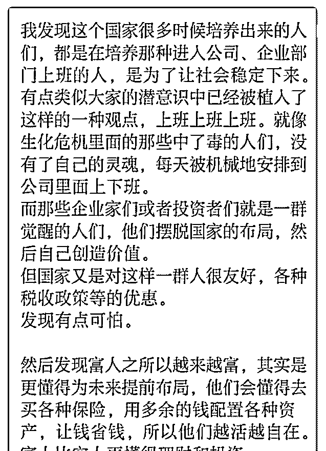
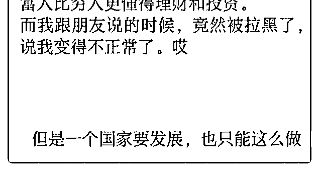

# 问题字数限制。直接

(提问)匿名用户 : 问题字数限制。直接上图，花爷帮我看看， 我是看错了吗？但我真的看到了，这也是让我想要换工作换 行业的原因，想做有积累性的工作的原因。

踢我出去的那些朋友有外企上班的，有当老师的，有银行当 贷款经理的，他们说不如我去考个教师证当个老师。。。可 是我不想了…

2019-10-29

回答：你的想法其实没什么错，之前有个花友提问，新团队

的客服离职率特别高，应该怎么办？花爷回：建立阶层的过

程中，四件东西最重要，分别是身份、奖惩、竞争、出口。

感兴趣的可以回去再仔细看看这个回答：，顺便说一句，这

位花友根据我的回答建立客服团队阶层之后，八月至今的客

服离职率为 0，他也是我们明天十月电商快闪分享群的嘉宾。

如果你再想深一层，整个社会的阶层建立，不也依赖这四样

东西吗？ 身份、奖惩、竞争、出口……任何一个组织想要通

过管理有条不紊的运转，都需要这四件神器，社会这个大组

织更不例外。 那么，谁建立了这些规则？谁在用这四件神器

做管理？ 不多说了，再说又要被星球删帖。 现实就是如此，

你不过是看到了灰色的一角，不用过于忧虑，换个角度想，

了解游戏规则的人往往更容易通关，有时间悲天悯人，不如

把精力放在下一个关卡上。 你整个过程中，最蠢的事情，就

是试图和朋友亲戚说这些规则，你这不是好心，你这是情商

低。 只要有阶层，就一定有底层。你跑到底层认知的人群

里，大喊大叫让他们醒醒，你不是傻是什么？如果所有底层

都觉醒了，那么谁去当新的底层呢？ 最终，你只能跟同一认

知的人走到一起，哪怕你们萍水相蓬、素昧蒙面、但你们能

听懂对方在说什么。 这就是付费小圈子的意义，告诉你，有

世俗理解不了的想法的人，其实并不孤独。(15 赞)

评论区：

Neal : 赞同

关注公众号"懒人找资源"，星球资源一站式服务