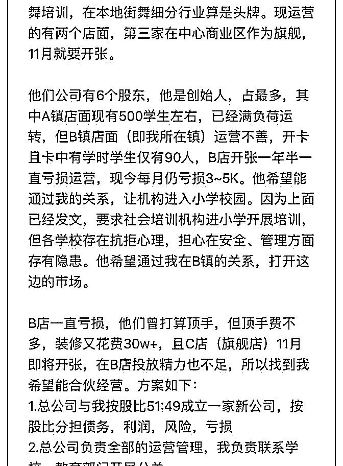
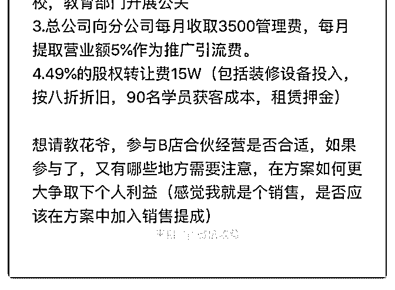

# 花爷好，因内容超字

(提问)匿名用户 : 花爷好，因内容超字数了，所以把问题放在 图片中，期待您帮我分析下，谢谢

2019-10-22

回答：理论上来说，你能打通本市关系，应能凭这个能力占

一部分干股。举个例子，我有个亲戚在上海办幼儿园，合伙

人里有一位不出任何资金，凭人脉关系直接占股。 但是你这

个呢，情况也有点特殊，一方面培训学校已经开起来了，你

的疏通能力主要是推广销售，不是绝对的硬通货，另一方

面，这个培训学校的作价不是特别高。所以整体看下

来，15W 出资占 49%的方案也不是不能接受。 你需要算一笔

账，目前 90 学员，每月亏损 3-5k，那么你需要每年通过渠道新

增多少学员，可以实现盈利，这是底线，每年新增多少学

员，可以 1-2 年内回本，这是目标。这些需要你代入客单价去

算，你提问里没写，只能自己去算一下了。 如果算下来，觉

得合适，还要注意以下几个问题： 1.分润的计算方法、账期

一定要确定清楚。 2.确认权责划分，比如总公司负责全部运

营，你有没有权限可以在必要的时候影响分部的运营方案。

3.一定一定要在合同里确认退出机制，非常重要。如果分部做

不下去了，怎么退出清算，如果生意很好你想股份套现，怎

么退出，一定要确认清楚。 早期大部分互联网创业者，都是

因为把结局想得太美好、太信任口头承诺，股权较少的合伙

人才总是吃大亏。(9 赞)

关注公众号"懒人找资源"，星球资源一站式服务