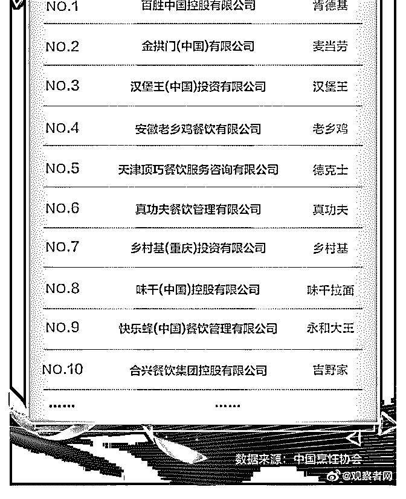

# 想问下花爷对在线教

(提问)远方有诗吗 : 想问下花爷对在线教育行业怎么看？这个 问题可能有点大不好回答，更确切的是说，去在线教育公司 做运营（比较多的就是社群运营，用户增长，课程运营，策 略运营，还有新媒体）前景怎么样？可发挥吗？我是怕毕竟 教育公司传统基因浓厚，可能去做互联网运营发展空间不 大！

还有一个问题想问问这里做在线教育的人，可能很多人是带 着情怀来做教育的，但现在在线教育往往有悖教育本质，行 业风气不太正，是这样的情况吗？有没有不错的在线教育公 司推荐？base 深圳！在线教育公司普遍加班很严重吗？

2019-10-21

回答：在线教育运营这个前天刚回答，可以看一看，整体来

说，比较适合想做互联网、但是目前实力又进不了互联网公

司的人进去职业起步，如果是互联网运营的老手，去在线教

育公司一定要确定做得是运营、管理的工作。 具体建议戳这

个链接： 后面的问题花爷倒想聊两句，在线教育应该带着情

怀去做吗？不，不应该，甚至任何一个行业，都不应该掺杂

不必要的情怀。 想一想，掺杂情怀的行业，老师、医护、清

洁工…..等等等等，一方面被歌颂，一方面却被所谓的师德、

医德绑架，很多从业者钱没挣多少，倒是被家长、病人骂个

狗血淋头。 但什么是道德？什么是情怀？ 道德和情怀，是用

来约束自己的，不是用来约束别人的，更不是约束整个行业

的。 其实这些职业，和所有的职业一样，把份内的工作、职

责做好，就可以了。做得好，受益高，做得不好，像职场白

领一样被领导骂。 至于情怀，你个人有，当然很好，但保证

一个行业健康发展的，不是情怀，而是职责划分和市场制

度。 孔子曾经有个徒弟叫子贡，是孔子徒弟里最有钱的。有

一次子贡做了件好事，而且还拒绝了国家的奖励，孔子教育

他说： 子贡，你不能这样做。以后如果有人做了好事，并且 拿了国家的奖励，就会被称为不道德，到时候做好事的人只 会越来越好。 说回在线教育行业，什么样的公司是一家好公 司？ 通过兑现宣传中的教育服务赚钱生存下去的公司，就是 好公司。不过分夸大宣传，把该做的服务做好，就可以了。 新东方号称让更多中国人学好英语，你觉得新东方能做这么 大，靠的是他的服务呢，还是他的口号？情怀这东西，你自 己可以有，公司老板也可以有，谁都可以有，但唯独不能要 求整个行业都有。 就像普通人爱国的最好方式不是喊口号， 而是多赚钱为国家经济做贡献一样，教育公司对行业最好的 贡献，就是提供价值，再扩大规模，为更多人提供价值，仅 此而已。(17 赞)

评论区：

远方有诗吗 : 整体来说，比较适合想做互联网、但是目前实力又进不了互联网公司的人进去职业起步？？？———-我不太

认同哎，想做互联网的新手应该先进互联网公司，那才是真正培养互联网思维和方法手段的地方，而等成为了老手，倒是

可以去这种由传统做互联网+的企业，因为用互联网思维做传统企业，确实会碰壁很多，要根据传统企业业务性质做出策略

调整，让没有经验的人去做意志力不坚决的

花爷梦呓换酒钱 : 说的是想进互联网但是目前实力进不了的人，先从低门槛的在线教育社群运营开始做，你让新手都进互

联网公司，谁都能进？老手基本不会去传统公司，你看看哪个互联网牛人转去传统公司了。

远方有诗吗 : 嗯嗯，如果是刚毕业想做互联网的建议进互联网公司从底层做起，我毕业 2 年，刚开始就想做互联网运营，一

年在互联网家装，一年在跨境电商物流行业，还都是做的新媒体运营，对于一个新人来说会很苦恼的

关注公众号"懒人找资源"，星球资源一站式服务

# 2018 中国快餐排

花爷梦呓换酒钱 : 2018 中国快餐排行榜，第一肯德基，第二麦 当劳，第三汉堡王，全是国外连锁。

第四是谁？中国的老乡鸡——中国快餐第一品牌。 我相信很多人都没听过这个土的掉渣的牌子，但老乡鸡目前

全国 800 多家直营店了，而且现在只是在华东华中开店，还有

京津冀、珠三角等大片市场等着它去抢占。

我们今天回看老乡鸡的发展历史，有两点值得所有生意人学 习：

1.好的生意只取一瓢饮 老乡鸡出自安徽合肥，原先叫肥西老母鸡，2012 年改名老乡

鸡，升级成快餐连锁。

其实老乡鸡就是一个中式食堂，一叠一叠的小菜，用户自选 几个菜，跟浏阳蒸菜其实有点像，估计很多人都吃过类似的 中式食堂。

相当于中式的肯德基：极致的标准化、流水线点餐就餐、翻 台率高、长时间营业。

我看过身边很多人，都想要开个餐饮店，其中有一批人，有 一些本钱，真的去开店了。

他们开店对标的是谁呢？网红店。

你在任何一个城市都能看到这种餐饮店，装潢搞的特别小清 新，稍微懂点运营的还会花钱写软文推广、找人假排队。

结果呢？大多撑不了几个月。 餐饮是门复杂的综合生意，每个环节看上去都不难，但所有

的利润，几乎都是从各个环节里抠出来的，这几天要求做餐

饮的预算一定要花在刀刃上。

老乡鸡对传统的中式食堂的升级在哪？ 装修，干净明亮，但不会太高大上；菜品，有几道招牌菜主

打，但不追求极致的美味，快餐不需要。

围绕着“快、干净、好吃”做文章，但又不过分追求品质。 好的生意最做适合的，不用做最好的。 2.抢市场要集中火力

老乡鸡目前的扩张，只在华中华东，其中合肥武汉南京几个 重点城市，每个城市超过 100 家店。

不在他的势力范围，你可能听都没听过，但在他的势力范 围，一定要刷爆市场。

在广告界，有个亘古不变的规则，就是做广告一定要短时间 轰炸，二十年前做保健品广告，电视报纸广告牌一起轰炸， 现在世界杯的电视广告，仍然是广告高频重复，一遍遍轰 炸。

老乡鸡集中火力在华中华东扩张，也是一样的道理。

一方面，进一个市场就把要这个市场站稳，另一方面，这种 快餐对供应链要求很高，集中开店有利于给分店供货保证品 质。

老乡鸡说自己 2023 年要开 1500 家直营店，我觉得按这个趋势 稳定发展下去，完全有可能（看看排行榜的后几名，对老乡 鸡没有太大的威胁）。

2019-10-20(18 赞)

评论区：

孙凌云（小云） : 今天乘高铁看到老乡鸡的报道了。

Brian : 在南京体验过老乡鸡的威力，基本上遍布全市

高涛杰 : 平时在广东 没吃过。 前两个月去武汉,发现那里势力很大

一叶知秋 : 吃过几次老乡鸡 味道中等偏上 菜的种类不多 很干净 说明他们知道自己的定位

syneal : 本来合肥有句顺口溜：从肥东到肥西，买了一只老母鸡，放到水里洗一洗，除了骨头就是皮。 一开始合肥有两家

店“肥西老母鸡”和“肥东老母鸡”，前者 2003 年开的，后者 2008 年开的，中间两家还因为名字的原因起过纠纷。然后 2012 年肥

西老母鸡就改名老乡鸡。再后来肥东老母鸡也改名了，现在叫蒸小皖。

潘天明 : 安徽省六安市本地人 六安市一个 18 线的小城市 十几家老乡鸡的店

斑马 sir : 这波排名一出，现在老乡鸡名声大噪，就连我最不屑吃老乡鸡的老婆，都说要去再尝试一下。

花爷梦呓换酒钱 : 老乡鸡确实安排了公关宣传，线下还有宴请全国免费吃的活动配合

关注公众号"懒人找资源"，星球资源一站式服务