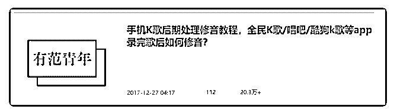

# 《一个永不过时的百

苏笙爱摸鱼 : 《一个永不过时的百度 SEO 霸屏捡钱玩法复 盘》

之前没做介绍，先简单做个自我介绍，我叫苏笙，94 年大 叔，现居深圳，目前自由职业。嗯，够简单吧。

干货开始：

SEO，简单理解就是搜索引擎优化， 霸屏，准确的说是百度霸屏， 顾名思义，就是霸占屏幕，简

单的说就是你在百度搜索某个关键词，出来的结果除了竞价

广告，全是你的信息。

看完这篇文章，你去实操后如果没有效果随时来打我，这个 绝对是任何普通人也能操作的一件事。

01

大家都知道全民 K 歌吧，这是我的一个小爱好，平时喜欢唱唱 歌，搞搞后期，我是 2016 年开始做的，做百度流量是 2017 年 了，当时是在知乎发了一篇软文，然后分发到了搜狐号。

图 1 这篇软文阅读量目前是 20W+，已经很久没涨过阅读了，总共

就是发了这两个平台，我当时真没想过什么霸屏，全是意

外。

因为之前全民 K 歌非常火，我的软文正好是一篇干货，然后被 很多网站转载了，搞笑的是什么呢？这些平台转载我的文章 并没有把我的广告去掉。

比如那个西西软件园，这个网站权重可谓是相当高了，他甚 至排名比我自己发的知乎和搜狐的还要高。当然还有很多其 它平台转载。

图 2 所以就莫名其妙的霸屏了，真的是意外，正好那两年全民 K 歌

也是火的不要不要的，每天公众号涨粉几百+。

接下来就是玩套路了：“裂变”。 我并没有打算先用一些免费资料把引流来的粉丝留住，而是

直接玩裂变，这个好处就是直接帮我过滤掉一些伸手党，留

下来的都是一些付费用户和愿意去做裂变的。

裂变玩法很简单，就是转发文章到朋友圈积攒免费获取资 料，要么就是付费 59.9 元购买。

图 3 当时这种文章我发了最少 10 多篇，因为公众号留言只能精选

200 条，放一些优质的留言出来效果会更好嘛。然后那时候公

众号的粉丝真的是每天猛增的情况，然后我每天都要手动审

核他们的截图给他们发资料。

至于付费转化率，看下图： 图 4

这只是其中一个平台的数据，我为了数据好看，做了 5 个平台 来收款（荔枝微课/千聊/略知/小鹅通/小程序商城还有直接微 信付款的），哈哈。所以到后期，微信裂变+百度流量，我一 直都没缺过新用户，这个效果一直到今天还没有停止，裂变 我现在没做了，但是百度还是会有流量来，现在时不时还是 会有几个人来付费，不过现在付费的方式没走平台了~

除了这个资料，从图 4 可以看出，还有一个 128 元的，这个说 来话长，我简单说下，这个是我当时研究的一个全民 K 歌自动 群发私信的一个软件，因为大部分人想要涨粉嘛，而私信涨 粉是真粉，不是僵尸粉，当时我没做公众号之前是在淘宝卖 的，后来各种原因（你懂的）才转移到公众号。

后来因为有模拟器的出现，正好模拟器带了这个功能，所 以，最后我只是录了一个小教程教他们利用模拟器来实现自 动私信功能，就是这样一个信息差让我小赚了一笔。

后面我还做过一套课程，转化率也还 OK，有那么几百人购 买。

除了上面这些，我还做过视频引流，不过这个视频主要是引 流到我的网站，视频当时是发在 B 站，转化率也很高，当时我 这个网站的文章平均阅读量都是几万，内容全是一些软件效 果器插件之类的。后来这个站关了我就不细说了~

接来说说怎么做： 其实你可能说我是运气，但也不是，因为我的文案本身就是

一篇干货内容，所以才会被其他平台转载，比如我前几个月

写过一篇文章，然后也被“爱运营”这个网站转载了。

真正的运气其实是算当时正好全民 K 歌是很火的时候，百度相 关的内容也很少，所以我去做这个词很容易就霸了屏，但是 对于现在很多词想要霸屏还是要做一些优化的，SEO 我是基 础，下面就简单说一下个人方法。

1、引流 我的文案是一篇教程，跟其他的引流不同的是我的这个教程

是没有写完的，只写了一半，或者说我标题中提到的“修

音”，在文案中我是没有教的。

所以这样的引流效果非常好，大家可以去尝试一下。很多人 喜欢用资料去引流，但其实用你的文章去引流效果会更佳。

比如你写一篇干货教程，在文章中留下了两个问题没解决， 这样，看文章的用户就会想要去获取这两个问题的答案，这 样的引流相对精准。

比如我上个月的一篇文章目前知乎阅读 10W+，我原本没打算 用这篇文章去引流，但也正好是文章中提到了一些关键词， 比如 XX 群。然后底下评论全部都是求进群的~，又是一个意 外~

2、霸屏 其实百度霸屏我最常用的方法就是用已经存在的平台，比如

百家号/搜狐号/时间号/豆瓣/知乎/360 图书馆/简书/新浪博

客……

原因很简单，这些平台权重本身就很高。 经过测试，以上这些平台搜索结果会在前 3 页，百度自己家的

就更不用说了，一般都是首页。但也看是什么词把~

还有就是视频平台，B 站/腾讯这两个。 把文章往这些平台一分发，几乎就能实现一个小霸屏，还会

有意外收获，就是有些其他平台会转载。

额，还有新闻源也阔以尝试尝试。 但是霸屏也并不是一个词，而是多个相关词，我这纯属意

外，我就不展开讲了。

3、裂变 这个相信大家都比我玩的溜，我的套路刚刚说过了，其实用

户一来我就直接裂变，大概 100 个人，会有 20-30 人会取

关，30-40 人会做任务，10 人左右会付费。

裂变玩法也很简单，刚开始我是手动，后来也换过一阵全自 动的，但是效果不如手动的，所以后面全是自己手动审核发 资料的，也试过群裂变，但效果都是很不好。

玩法： 首先就是要在公众号里重新准备一篇文案啦~

然后后台回复关键词→收到玩法步骤→转发朋友圈积赞或付 费→裂变用户我手动审核发资料→付费用户直接付费自动获 取

还没完。

18 年的时候我又加深了套路，因为资料只是资料，我收到很 多反馈都是看不懂学不会，或者坚持不下去等各种问题，然 后我就做了一个付费群，专门解答他们学习过程中遇到的一 些问题。最后是一共做了两个群，900 人左右。

这个群里赚的小钱我就不说了。 主要是我把这些付费用户聚集到微信群和我的朋友圈了。然

后去年我做了一个小程序商城，专门卖麦克风，声卡等设

备，所有的客户全部来自于我的这两个微信群。

嗯，还是没完。 除了做过那个商城，我的公众号同时还在做着课程分销，因

为那一年正好是知识付费兴起的时候，因为我的付费流量是

直接从千聊/荔枝微课等平台去付费的。所以在这些平台上我

还有很多其它的分销的课程，广告都省了，不过去年我几乎

天天都在公众号推课程，很伤粉，所以今年除了接广告很少

推了。

今年主要在做知乎流量，平时摸鱼比较多，很佛系，以后有 机会在跟大家分享。

2019-10-18(13 赞)

评论区：

花爷梦呓换酒钱 : 霸屏那里，同关键词应该有不少文章，为啥你的霸屏了？

苏笙爱摸鱼 : 这个问题我在文中提到了，因为当时全民 K 歌是刚火不久，所以百度相关的词很少。[捂脸]，然后被一些

大平台转载，这些平台的权重又很高，所以意外的霸屏了。

孤独的狼 : 关键词排名机制，SEO

关注公众号"懒人找资源"，星球资源一站式服务