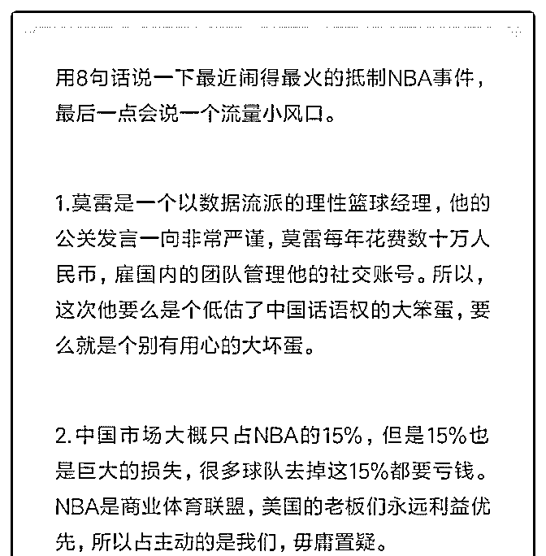
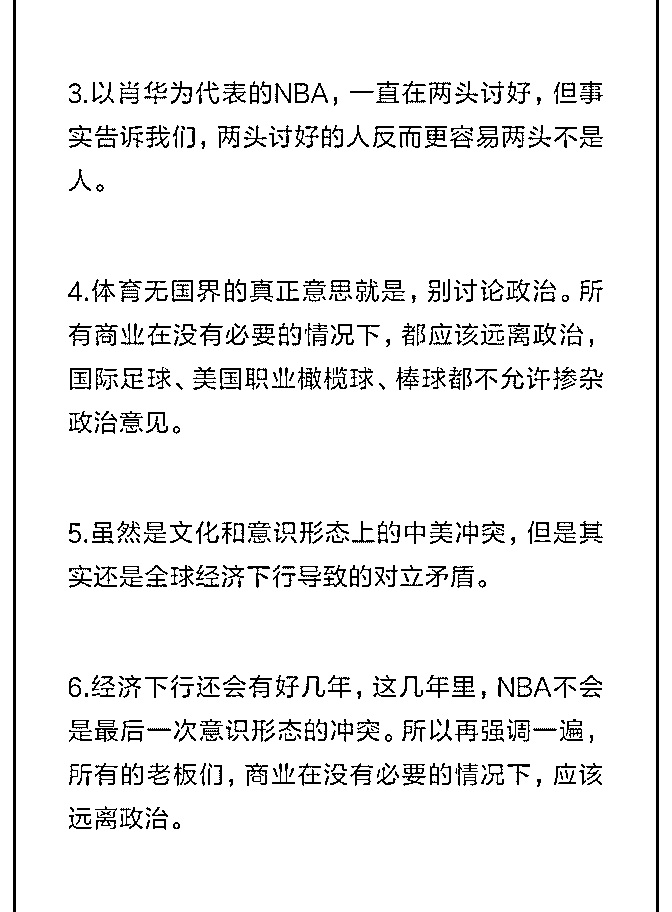
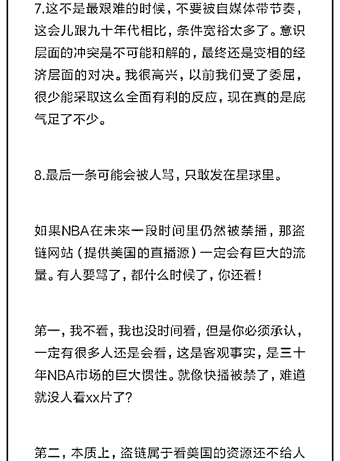
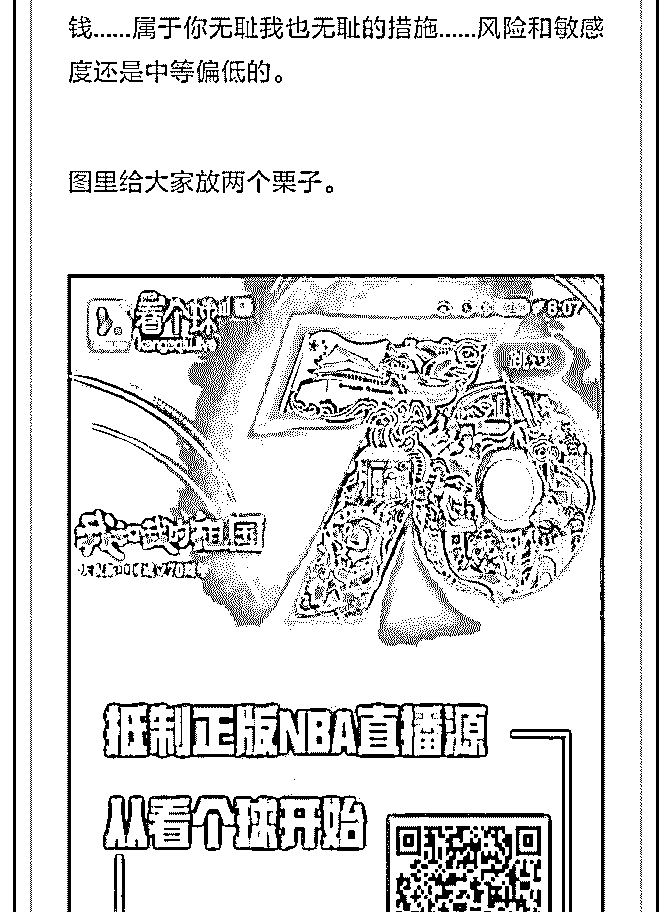
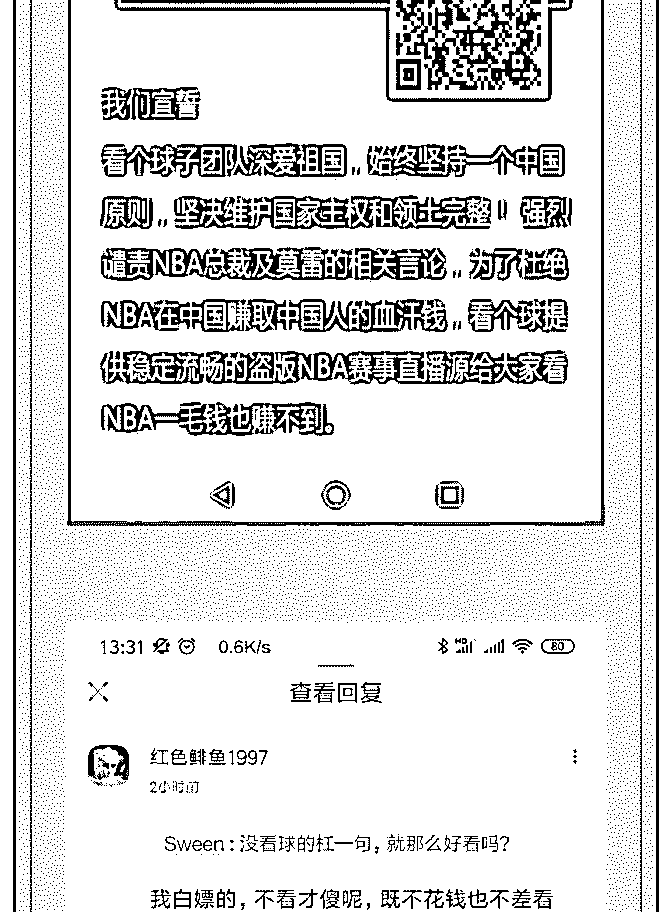
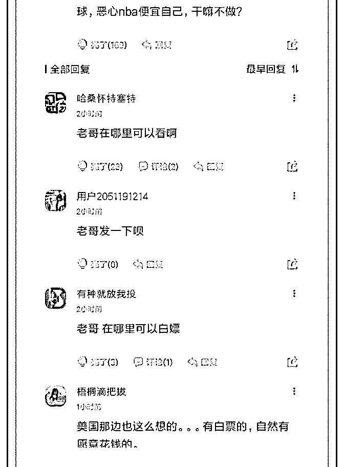

# 花爷好：

我想请教关于产品升级后刚开始做线上如何去推广的问题。

基本情况：公司有一支从 2012 年开始做的婴幼儿洗护产品，

线下铺了大约 1500 家实体门店，销量每年都在稳定上涨。今

年公司与一个有机原料基地签订了独家供应的协议，产品包

装也进行了升级，定位中高端。但公司一直无意做电商，我

觉得产品升级后是一个好机会，所以主动跟公司申请了来负

责电商运营，有美工、仓储配合。但确实小白，对于一个新

店（目前是淘宝）、线上新品牌、新系列的推广，该做什么

还是迷茫。望花爷指点，谢谢！

2019-10-11

回答：你可能觉得这是个淘宝店铺运营问题，但我觉得不

是。 一个有 1500 家实体店的公司，做了产品升级，第一次上

电商渠道，最重要的是什么？ 是开门红，一定得一锤子下去

有水花，不然这个新业务就不好做，特别是你这个负责人还

是小白的情况下。 这是个典型的职场问题。 你的需求是什

么？是把产品大卖吗？ 不是的，产品大卖固然好，但并没有

把握，你的需求，是把电商渠道的盘子也铺下来，有一个基

础的量，只要这个基础的盘子在，你这个电商的老大，以后

就有发展的空间。 而淘宝新店推广，无非是开车、kol 带货、

上活动这些方式，说起来简单，但做起来，不一定能出效

果，特别是新手，很可能钱花了根本没效果，这种结局是你

最怕的，显然不是最稳妥的方案。 最稳妥的做法是： 1.所有

的产品定位、线上包装、宣传，都跟着你们产品升级之后，

老板定下的产品基调走，一点都不改。 这一步，是顺心意。

老板和公司想推这个新系列，那你就顺水推舟，给产品多一

个出货渠道，最为稳妥。 只要你这样做，哪怕最后效果不是

特别好，但摊子已经铺开了，好歹有一些量，后面可以跟着

公司的策略，徐徐图之。 但如果你擅自改了产品定位，上了

电商渠道但是效果不好，那这就是你全责了。 2.在保证产品 定位和公司一致的情况下，保证电商有一个基础的销量，哪 怕不太高，及格就行，好歹拓宽了销售渠道呢对不对。 怎么 保证电商销量呢？新手最稳妥的方法，不是砸淘宝运营，而 是线上搞活动，给线下的老客户推荐，直接转化老客户，效 果最直接。 不知道你们除了线下实体店，有没有公众号、顾 客手机号之类的信息，有的话，直接把淘宝店铺新产品活动 推给用户。 也可以直接和线下店合作推淘宝店铺，这种方式 可能会和线下店有利益冲突，需要一边说服老板，一边巧妙 的设置活动规则，给线下店也尝到甜头。 通过老客户转化， 淘宝店有基础销量了，排名权重也有一点了，再去做开车、 上官方活动之类的运营。 —————————————— 新 手做新项目，总想在老板面前一鸣惊人，其实新项目就像新 生儿，降低风险比长的快更重要。(21 赞)

评论区：

Neal : 请问网店和门店怎么保持平衡，线下客户知道网店更便宜岂不是减少了门店的收入

花爷梦呓换酒钱 : 两边都做限时活动，线上搞活动线下宣传，等线下搞活动了线上宣传，互相导。

Neal : 嗯，换句话说，平时网上价和门店价保持一致。仅活动搞差异促销，感觉不容易操作。 尤其是客户群体习惯线上价

更便宜，

花爷梦呓换酒钱 : 活动搞差价，不同的款线上线下搞差价，很常规的操作，优衣库丝芙兰都这么做。

66 : 谢谢花爷[抱拳]可能我没表述清楚，是供货了约 1500 家门店，我们属于纯上游公司，没有自己的门店。

Neal : 好的，待会我去查看一下他们的旗舰店。谢谢！ 我想到了另外一个方法，线下和线下卖的款式不一，或者线上起购

量高点。

花爷梦呓换酒钱 : 只要是线下渠道都有办法，比如新的一批货里加上线上的折扣活动宣传

花爷梦呓换酒钱 : 同样的道理，设置差异化

关注公众号"懒人找资源"，星球资源一站式服务

# 8 句话聊聊最近的 N

花爷梦呓换酒钱 : 8 句话聊聊最近的 NBA，最后一点会是一个 流量小风口。又被星球吞了，看图吧。

2019-10-10(34 赞)

评论区：

欧欧 : 可这种其实是赚了腾讯等转播渠道本该赚的钱，做大了会不会收到这些转播渠道的打击？

花爷梦呓换酒钱 : 做不大

关注公众号"懒人找资源"，星球资源一站式服务