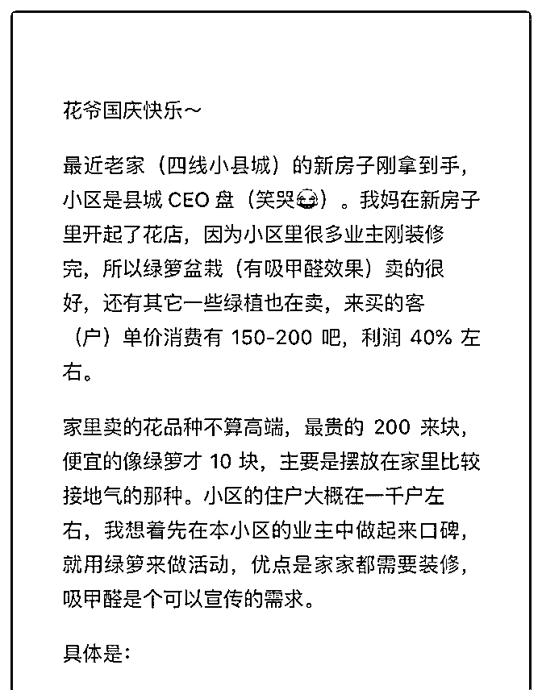

# 花爷国庆快乐，提问

(提问)饭 : 花爷国庆快乐，提问有点长，放在图片里了 2019-10-07

回答：思路没什么问题，细节上可以改进。 1.给每户都送绿

萝，也不是不行，但一定要控制好成本，不然可能被薅羊毛

薅死。 比如，怎么识别对方是小区用户？怎么避免同一住户

重复领取？提前做好登记发放的准备，保证现场不乱才能保

证后续销售跟进，也提前算好账，多少盆免费绿萝在可接受

的补贴范围之内，需要后续销售多少钱的产品可以保持盈亏

平衡。 2.有一点你没说，就是免费送绿萝之后，怎么提高后

续转化。 我的建议，小区装修去甲醛是一波引流红利，后续

的生意还是靠鲜花绿植这种装饰性产品为主，所以你搞这个

活动，只要盈亏平衡，可以尽量都引流到微信上。 那么首

先，所有人必须加微信，领绿萝必须加微信、购买其他产品

加微信打折，把小区用户全部加到微信上。 其次，设置好当

场转化的套餐，把价格不高、最好卖的产品拎出来打包做活

动（比如免费领绿萝再加 20 块钱可以拿一个 xx 绿植），有一

个爆款促进转化。 另外其他的产品一定要摆出来，你说的几

种套餐是可行的，把价格标的大大的，跟市场价做对比，住

户不买也没事，让他们知道小区里有一个高性价比的花店，

以后不用出门也能买到，这点非常重要。 最后，加到微信的

住户，以后好好运营吧，定期在朋友圈晒产品，如果可以的

话，推出本小区免费送上门的服务，反正一个小区的范围配

送压力也很小。 3.朋友圈集赞就算了吧，没什么意义。 你的

用户群固定在一个小区里，除非是那种单位、拆迁房，小区

里大家都认识，不然朋友圈集赞意义不大，点赞的都不是你

的目标用户，还营造了社交压力。 重点可以放在拉新客上门

的奖励上，比如拉本小区的用户免费来领，拉两个可以再拿

一盆绿萝，争取把小区内的目标用户打穿。 综合下来： 补贴

可以，一定要用在刀刃上，后续转化一整套流程要跟上，大

部分实体店老板东施效颦，都是瞎补贴把自己给补死的。(23 赞)

关注公众号"懒人找资源"，星球资源一站式服务