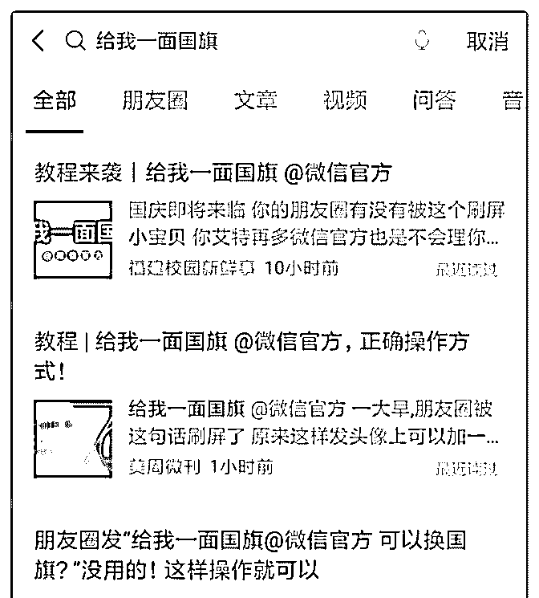
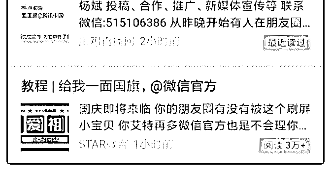

# 昨天“给我一面国旗

花爷梦呓换酒钱 : 昨天“给我一面国旗@微信官方”刷屏了，腾 讯新闻的活动页面参与用户 3 亿，顺带着产生好几篇十万+文 章。

可能有人要拍大腿，哎呀！这事儿又没轮着我！其实有 5 件 事，花爷觉得你更应该知道：

1.微信搜索的流量一直被低估了。 因为朋友圈许愿是无效的，很多人在微信搜索“给我一面国

旗”。从热点爆发开始，一大批公众号马上开始做领国旗的教

程，并通过微信搜索获得超大流量，最高的一个号一天涨粉

十万。

微信搜索的流量一直被低估，我早期写了一篇长投的文章， 你在微信里搜长投学堂，第一屏就能看到我的文章，现在还 每天有人通过搜索关注我。

2.热点是循环往复、可以预测的。 从前年圣诞帽换头像，到去年军装照换脸，到今年的头像加

国旗，热点的性质是相似的，所以也是可以预先准备的。

3.热点面前，快比好更重要。 圈子里其实有人预料到国庆这个热点，在做换头像的工具，

但大家都没想到腾讯新闻突然做活动，热点面前，一定要及

时应对，快比好更重要。

同样是写教程引流，早发文的号和晚发文的号，效果天差地 别。

4.如果你不是最快的，就做最不一样的。 如果没有及时赶上热点，那就稍微转变思路，换个角度蹭流

量。比如有一个写公关的公众号，叫万能的大叔， 他没有写

领国旗的教程，反而及时写了一篇这次热点的复盘文章，同

样是十万+。

5.不是所有人都适合追热点。 有人问了，花爷你既然知道，你怎么不追热点呢？ 其实你观察一下，不仅我没追，很多知道这个热点的公众

号，也放弃了追热点，为什么？

第一，虽然看上去有人涨粉十万，很牛逼，但其实也是极少 数，并不是看到有人成功了，就激动的要死，捶胸顿足懊恼 自己没赶上。

最终还是个概率问题，极少数公众号成为幸运儿。大多数追 热点的号，涨粉量也有限，我预计涨粉 200-1000 的公众号数 量最大。

第二，追这类热点容易降低公众号的逼格，再结合第一条， 即使追热点也不一定大火，收益和付出不成正比，所以不适 合有很强 IP 性质的号去追。

反倒是小号、普适性强的号，值得去追热点，搏一搏，单车 变摩托。

不过这事儿有一点也赖我，当时我看到这个热点，想着我不 会追，就算了，没有在星球发出来，下次还是要给花友共 享，咱们星球里做自媒体的花友挺多的。

2019-09-25(17 赞)

评论区：

xiaoda : 我发觉的时候已经到中午了，当时朋友圈已经刷屏，不过我中午没睡午觉还是发了文，就涨了几个粉丝

花爷梦呓换酒钱 : 过了十一点的都没啥流量

关注公众号"懒人找资源"，星球资源一站式服务