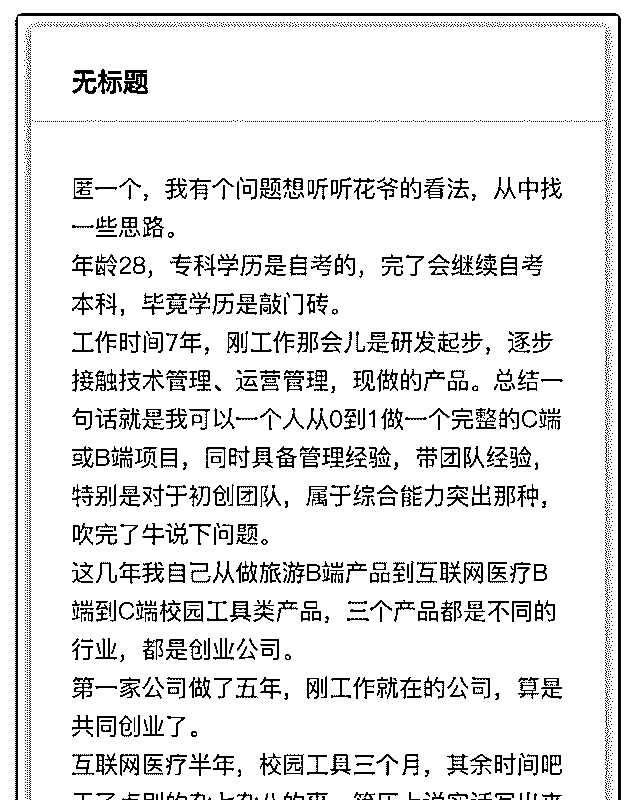
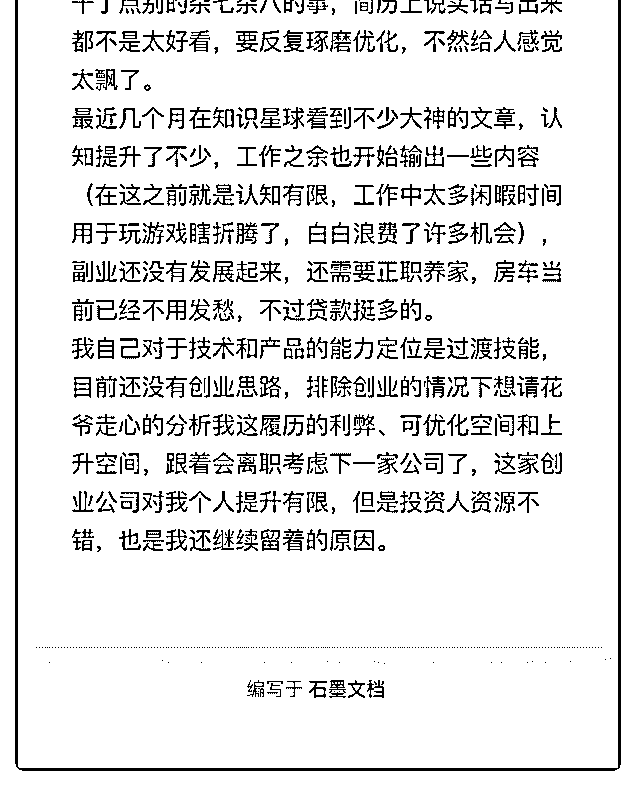

# 文字超限了，发图片

(提问)匿名用户 : 文字超限了，发图片吧

2019-09-25

回答：你简历的最大问题：没有核心技能。 我帮身边至少 20

位朋友优化过简历，每个人都有这个问题。 普通人写简历的

思路：我得过这个奖，我做的这个项目成绩不错，ok，我全

给你写上去，这样可以表明我是个优秀的人了吧？ 错，错的

离谱。 你得知道，公司的管理层和 HR 在招人的时候，和你根

本不是一个思路，屁股不在一个位置上，脑子就很难想到一

块去。 公司招人的时候，想的是我有一个业务缺人，这个人

必须要会技能 A，这样他一来就能把项目的空给补上。 带着

这个想法，管理层和 HR 在看简历（特别是 3 年以上工作经验

的简历）的时候，脑子的想法只有一个： 这个人会不会技能

A？他怎么证明他的技能 A 很厉害？ 其他内容，都是一眼带过

的，一份简历，初筛不会超过 30 秒，二轮候审不会超过 5 分

钟。 再看你的履历，做过 3 个项目，每个项目都在不同的领

域，做过研发、运营管理和产品，相当于转职三次。这样的

履历，如果简历写不好，那就是做事没有耐心、啥都会点但

没有一个精通的形象。很难过中大型公司的简历筛选。 公司

不是不喜欢多面手，但多面手也必须要有一个专精项，不然

不就成打杂的了？哪里缺人你去哪？ 所以建议你，先给自己

定一个核心能力，然后从自己的履历里，挑一些能够佐证这

个核心能力的内容，放到简历里，从多个方面证明自己的核

心能力。 比如如果你把自己定位成业务增长型的产品经理

（打个比方）那业务增长型的产品需要哪些辅助技能？产品

搭建的能力、运营增长的能力、管理团队的能力、控制成本

提高 ROI 的能力…… 辅助技能会有很多备选项，看看哪些是

你具备的，挑出来，然后排一个优先级，重要的花大篇幅介

绍，不重要的几句话带过。 这么写下来，简历才有重点，既

然公司感觉你有能力，也让 HR 感觉你有清晰的职业规划，一

直在朝一个目标努力。 给所有花友提个建议，如果你在写简 历，建议你先去网上看至少 20 个别人的简历。因为网上流出 的简历基本都是垃圾，你开动脑筋想一想，我要怎么样才能 从一堆垃圾简历中脱颖而出呢？(29 赞)

关注公众号"懒人找资源"，星球资源一站式服务

# #金花奖挑战众帮平

(提问)鑫 : #金花奖挑战 众帮平台，比如众人帮，里面是发任务和接任务的。关注一 个微信公众号，几毛钱。得扫二维码，关注公众号，截图审 核，比较费时，收益很低。

问题： 发任务的人，接任务的人，做平台的人，都是因为什么才做 这个？

思考： 发任务的人，可以引流，做数据，但费时费力，要审核呀； 接任务的人，时间不值钱，或者积少成多，几块钱对一些群 体不算少（看过中学生的发单群，很勤快的做任务，一天十 来块钱，都很开心）；

做平台的人，会员收益，资金沉淀？

请教下花爷，怎样分析，怎样延伸呢？

2019-09-23

回答：你看到的三方，其实有四方，典型的四方获利局。 接

任务的人：你分析的很多，就是没钱有闲的，折腾半天挣 10

块钱也很开心。 做平台的人：一边接金主的任务，一边聚集

屌丝接任务，平台在中间赚差价，相当于没有一个屌丝做任

务，平台就能抽一次成。对了，审核任务截图的一般也是平

台，这点你估算错了。 发任务的方：一般是做号的，跟公众

号刷阅读同理，花钱把关注数和阅读数刷上去。 那么问题来

了，发布任务的人花钱做数据，如果不能挣钱，那花的钱不

是白搭了吗？ 所以还有第四方，真正的金主爸爸。这些金主

大多是品牌方，投钱给一些数据不错的号打广告，而且品牌

方大多能力比较弱，分不清谁是刷的数据，源源不断的广告

预算砸进来，经常一个水花都没有。这么说吧，旅游、种

草、美妆、汽车这些品类的公众号，一半以上都是刷数据然

后问金主爸爸要广告费的。 有人问了，品牌方傻吗？投的广 告没效果还投？ 主要是因为啊，大品牌的广告大多是宣传类 广告，不要求马上成交，而且广告预算也非常复杂，各个领 域都涉及，所以你分不太清到底是哪里的广告带来的销量。 甚至有时候你都不能确定销量上升跟广告到底有多大的相关 性。 而作为主管广告预算的管理层，更没动力去做改革，反 正大品牌大多是盈利的，你做改革自己没一分钱好处，弄得 不好还会背锅，何必呢？ 所以就造成这种局面，每年各大公 司的广告预算，都有大把的 to B 公司眼馋，最终有多少预算被 水掉，很难弄的清楚。 最后补充一点，除了这种吃品牌方广 告的，也有可能是刷了关注粉丝数，去卖公众号忽悠小白 的。总之一个刷出来的公众号，只要包装得当、有渠道能销 售，自然就有了刷量的动力。(17 赞)

评论区：

花爷梦呓换酒钱 : 金花奖挑战成功！加我微信：huayebenren，发送星球内容截图领取红包奖励。大家如果觉得这条内容不

错，记得点赞，本周点赞最多的金花奖内容，会有额外的红包翻倍奖励。

鑫 : 受教，原来做数据背后的动力是金主！

关注公众号"懒人找资源"，星球资源一站式服务