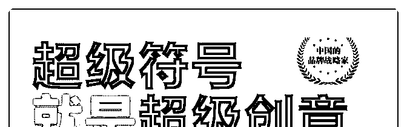
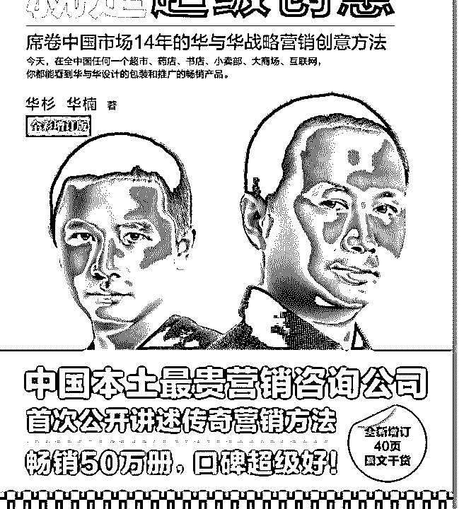
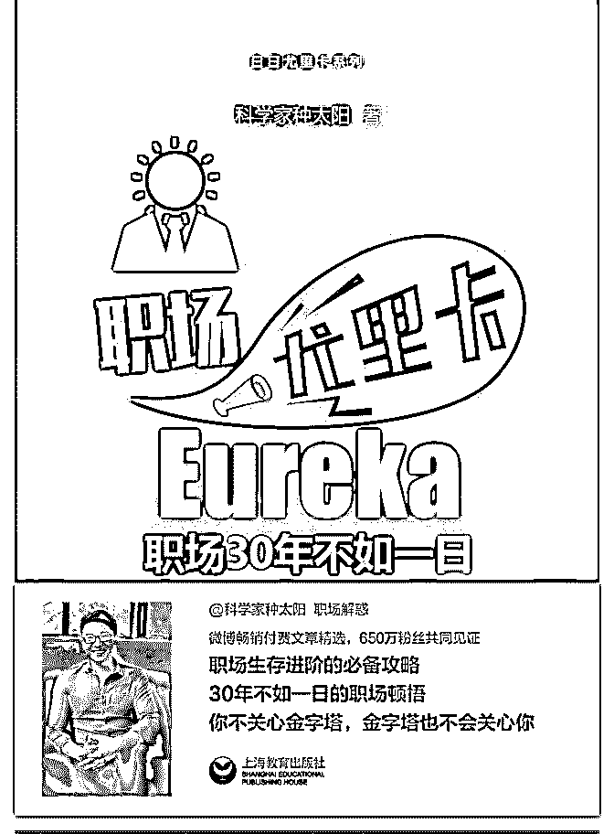
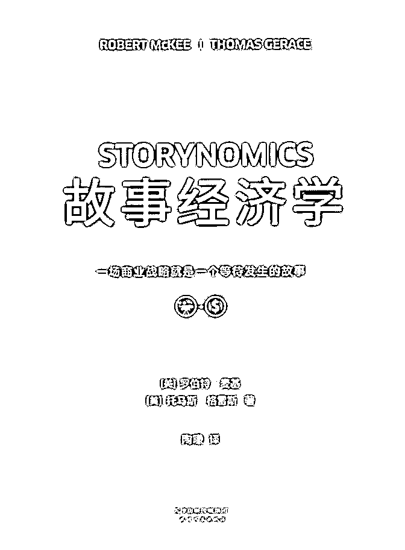
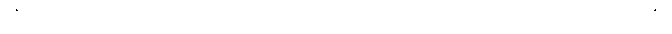

# 来，中秋，给花友抽

花爷梦呓换酒钱 : 来，中秋，给花友抽奖送书。

选了三本不同类型的书，看中哪本，评论里留言书名，花爷 从评论里随机抽 10 个花友包邮送书。

第一本：《超级符号就是超级创意》 华与华的书，华与华是谁？国内顶级的品牌营销团队，西贝

莜面村、得到等企业的服务商，为企业做品牌全包策划价格

是 300-500w 一年。华与华的老板华杉开课，两三天的课

程，10w 一个人，关键这个价还名额有限，你还报不上。

适合谁：对做品牌、做营销感兴趣的花友，来看看最质朴、 也最有效率的品牌方法论。

第二本：《职场尤里卡》 这书估计就没几个人听过，作者科学家种太阳毕业于中科院

研究院，原先有一千多万的微博粉丝，可惜后来被举报封号

了……作者的逻辑能力非常强，自从他有知识付费产品，不

管是一千多的 V+会员还是十几块钱的小讲，我都买了。

适合谁：想在职场多赚钱、少受气，通过培养逻辑能力，看 透职场的本质很重要——这本书就有这个能力。

第三本：《故事经济学》 之前推荐过几次的书，这个时代不管你是做自媒体、做广

告、做商人、做品牌营销，写文案的要求都越来越高。普通

的文案还不行，现在用户口味都刁了，你得有一个好故事， 让用户记住你、认可你、忘不了你。这本书的作者是好莱坞 编剧教父，就有这个能力把写好一个故事的底层逻辑给你讲 清楚。

适合谁：对写文案、写故事感兴趣的花友，期望得到一套标 准的好故事输出框架。

————

来吧，挑一本你感兴趣的，评论里大声告诉我，花爷抽 10 位 花友把知识送到家。（如果参与评论花友太多，会增加中奖 人数）

抽奖截止日期：9 月 14 日（明晚）12 点。 最后，今天又收到几位花友的好消息，职场的创业的都有，

感觉每次大段大段的写干货真没白受累。也跟所有花友说一

句，中秋快乐呀，祝大家健康、自由。

2019-09-13(50 赞)

评论区：

一个脾气很好的人 : 职场尤里卡

Eric : 职场尤里卡

929 : 职场尤里卡

缘 : 职场尤里卡 刚好这本没有

浅。梦 : 职场尤里卡

墨 : 故事经济学

Yukint : 作为刚上班的学生党，我选择职场尤里卡！（大声）

张无技 : 故事经济学

关注公众号"懒人找资源"，星球资源一站式服务

# #金花奖挑战 昨天

(提问)傅超人 : #金花奖挑战 昨天买了一包恰恰瓜子，今天吃完发现有一张这个（图一） 扫一扫后（图二）结果（图三）复制了一下链接：

这是拼多多在恰恰发放广告？还是恰恰单方面的行为？ 请教一下花爷。[拼多多](https://mobile.yangkeduo.com/duo_three_red_packet.html?pid=8932311_103284048&cpsSign=CR_190805_8932311_103284048_8ab81003c6015b6defd00d3f679f6075&duoduo_type=2)

2019-09-11

回答：肯定是联名广告。顺着这点观察，深挖两个细节： 1.

接下来很长一段时间，你会发现品牌联合合作越来越多了。

为什么？刚出的第二季度互联网报告显示，中国网民规模比

上季度减少了 200 万，这是这么多年来，我国网民总数第一次

减少。 没有新的流量了，4G 时代的用户规模已经到天花板

了。 这种情况下，品牌最有效的拉新方式，就是和别的品牌

互推换用户量，你有 1000 万用户，我有 1000 万用户，我们互

推一下，人还是那波人，但双方的用户量都上涨了。 这个玩

法其实在公众号时代就有了，公众号之间互推，大家都涨

粉，美滋滋。所以你看有的 KOL，一个人要开两个公众号，

两个号互相倒流量，形成矩阵，总粉丝量就是上升的。 2.拼

多多的转化用户能力真的太强了。 如果你进入拼多多的页面

体验一下，抛开偏见，你会发现拼多多的页面吸引力真的太

强了。 显眼的红包、紧张的倒计时、领红包后紧接着特价商

品促进下单……一系列流程非常厉害，我有好几个朋友被我

强烈建议体验拼多多后表示： 一旦抛开偏见，在拼多多真是

买的停不下来，就像不要钱一样。 拼多多这种转化用户的能

力，就像一台精密的机器，只要源源不断的把流量投入这套

机器，就可以产生非常值钱的电商客户——而购买流量，恰

恰是电商里最简单的事。 这是这个世界上最好的商业模式之

一，一套精密的系统，投币 1 块钱，就能产出 1.1 元，利润不一

定要高，胜在高效稳定，剩下来就大量投币的问题了。 现在

拼多多的下一个台阶，就是努力打破中产以上的阶层了，我 上次提过，拼多多在这方面做得不错，百亿补贴也衍生出了 不少羊毛： 我长期看好拼多多，它 Q2 的财报也确实让我小赚 了一笔。(12 赞)

评论区：

齐粉 : 现在雪碧和江小白合作

傅超人 : [胜利][胜利]

关注公众号"懒人找资源"，星球资源一站式服务

# #金花奖挑战 线上

(提问)放肆的自我 : #金花奖挑战 线上免费抽奖活动案例 写不下了，直接截图奉上

2019-09-10

回答：你这个拆解基本讲出了“抽奖”这个活动形式的三点精

髓： 1.奖品一定要合理，既有吸引人的大奖，也有让人放下

心理包袱的小奖，最好 100%中奖，千方百计让用户参与抽

奖。 2.用户第一次玩，一定要中奖，他才会继续玩下去。接

下来不断控制中奖概率，先给甜头，然后随机中间，且每次

中奖的间隔在不经意间越拉越大。 3.等到用户用户多次抽

奖，形成了行为习惯，这时候告诉用户，你的抽奖次数已经

结束，需要去完成 xx 任务才能继续抽奖，用户大概率还会按

下“确认”按钮。 为什么这样设置，用户就会丧失心智，顺着

设计者的路径去做呢？ 上个世纪，有个著名的心理实验叫斯

金纳箱。 实验者将一只很饿的小白鼠放入一个有按钮的箱

中，每次按下按钮，则掉落食物，于是小白鼠自发学会了按

按钮。 这个实验告诉我们，奖励可以培养行为习惯。 实验者

一只小白鼠放入一个有按钮的箱中。每次小白鼠不按下按

钮，箱子就通电，于是小白鼠学会了按按钮。 但遗憾的是，

一旦箱子不再通电，小白鼠按按钮的行为就迅速消失。 这个

实验告诉我们，惩罚并不能改变长期行为习惯，也就是我们

常说的吃了亏也不长记性。 接下来，重点来了，实验者将一

只很饿的小白鼠放入斯金纳箱中，多次按下按钮，概率掉落

食物。于是小白鼠不仅学会了按钮，而且一直不停的按按

钮。 这个实验告诉我们，随机性使人痴狂。 所以一个不停点

确认抽奖的人，在获取抽奖机会的任务时，才会不假思索的

点下确认按钮。 赌博、抽奖、彩票，本质上都是对人性渴望

随机性的利用。去年有一款小程序就海盗来了，一年上亿的

营收，靠的是什么，让人痴迷的随机抽奖机制。 当然，我不

是让你去开赌场，但理解了背后的原理，在教育、商业、产

品设计上，带来的帮助是不可限量的。(16 赞)

关注公众号"懒人找资源"，星球资源一站式服务