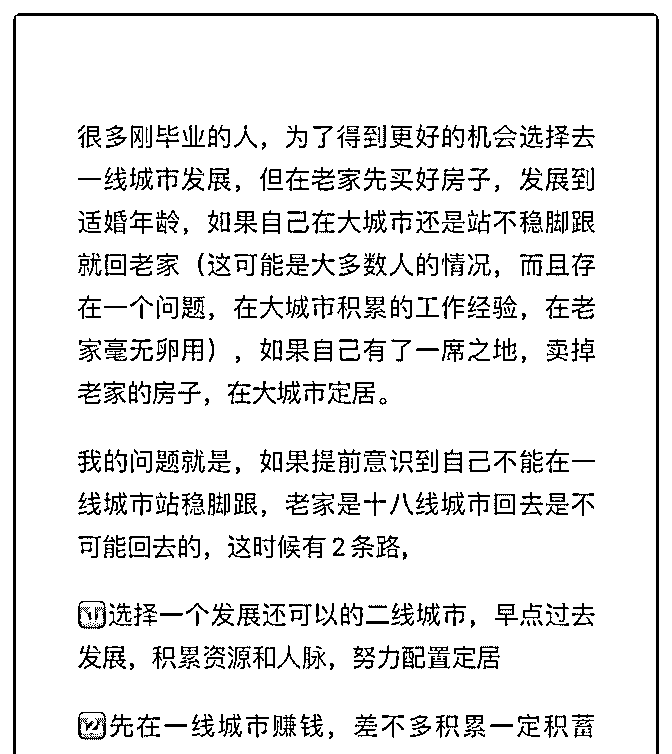
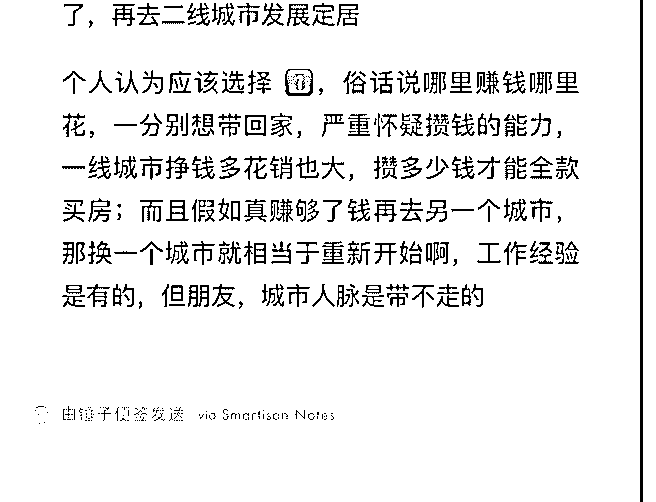

# 花爷你好，最近在思

(提问)远方有诗吗 : 花爷你好，最近在思考一个问题，这也是 一批年轻人的现状。写不下了，请看图：

想听下花爷怎么看？

2019-09-02

回答：大多数人对人生的误解，就是他们觉得不选 1 就要选

2。其实呢，根据人和社会背景不同，选 1 没错，选 2 也没错，

还是得看人。 1.如果你是体制内工作，或者区域性的生意，

那肯定选 1，先去二线城市完成积累更重要。 2.如果你从事互

联网、外贸、金融这种工作，只有一线城市有最好的环境和

发展空间，那肯定选 2 更合适。干得好能搏个大的在一线城市

留下来，干得一般以后回到二线城市，你的履历也足够漂

亮，基本可以直接空降二线公司管理层。 另外我说一句啊，

从你的问题里，我感觉到你对一线城市是有一点抵触情绪

的，我也理解，很多人不喜欢一线城市，觉得消费高，压力

大。 但事实上呢，一线城市除了房价房租贵点，消费真的没

有高很多，非常多的基层劳动者愿意到一线城市打工，为

啥，去掉消费和房租，攒的还是比二三线城市多呗……你也

不用担心换城市会浪费人脉资源，很明确的告诉你，不会，

除非你是 1 里描述的工作，否则资源在这个时代大多是可以随

身带走的，比如我，人在上海和人在南京，资源没太大区

别。 我不是鼓励大家一定要去一线城市，我只是说，一线城

市作为机会更大的城市，应该是你正视的一个人生选项。 应

试教育告诉我们，任何一道题都有正确答案，但现实生活

里，我们只是在复杂环境里选一个最优解，不要轻易排除任

何一个人生选项，人这一生能选的选项本身就不多。(12 赞)

评论区：

Acii 阿奇 : 这个问题有个前置条件：先在老家买好房，再去一线。 我认为应该会有一些人不在老家买，留下自己的房票，去

一线搏一搏，能留在一线更好，即使不能留在一线，在一线攒够了钱，房票在手也不愁买不到房吧。不知各位认为什么情

况下适合做这种选择呢？

远方有诗吗 : 我为什么会有舍一线去二线城市的想法呢，1.在一线城市两年我并没有感觉机遇和发展有多大（这可能就是个

人能力和运气的问题）2.一线城市房价太高最终也不会留在这里同时由于女性慢慢进入适婚生子年龄，27 岁之前最好能长 期稳定在一个公司从而不影响婚、产后事业。

远方有诗吗 : 看情况吧，合理估量你能买得起房子的时间，在有限时间内能力不及一线城市房子时，可以先在一个不错的 二线城市买房，像花爷说的，在一线先打拼，有机遇了卖掉二线城市房子买一线，反正有退路

Acii 阿奇 : 男生和女生的选择和侧重点果然也不同呢。 直接排除一线这个选择，在某种程度上也是给自己设限吧，个人意 见。

Acii 阿奇 : 是的，量财力而行也是一种最优解呢。

远方有诗吗 : 是的吧，所以说我选择二线城市的时候，最看重的也是个人发展的机会了，城市互联网发展情况

Aileen : 我在四线，加上身体本来就不好，即使想去一二线城市也是不现实的，但不得不承认，四线城市能选择的职业非常

少，确实会影响个人发展，但综合来看，比起一线城市的压力和长远的健康状态，四线反而适合我

花爷梦呓换酒钱 : 所以说看人

关注公众号"懒人找资源"，星球资源一站式服务