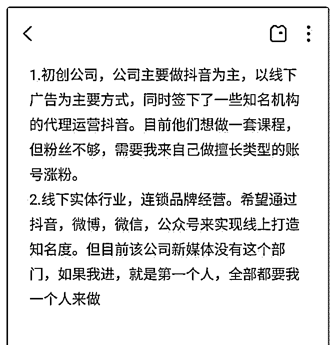

# 花爷好。我今天去面

(提问)遇夏 : 花爷好。我今天去面试了两家公司，感觉蛮典型 的，我也很迷茫，刚好可以问问您:

1.背景:我 25 岁啦，从新媒体公司离职，一直做的都是裂变涨 粉，不管群裂变，任务宝都是熟悉且做出过涨粉成绩。同同 时自己一个人做抖音，多账号 2 个月 240 万+的粉丝。都卖啦， 手上还有 10 万左右吧。

2.我的意向，希望和新媒体运营相关，涨粉和裂变都行

3.公司的情况已经在图片中写了出来，我迷茫在于不知道怎么 去选择，对于初创公司我做的基本都是我会的，重复的事 情。对于实体，又只有我一个做新媒体，我担心能力或者一 个人事情会忙不过来。所以，花爷，怎么判断一家公司是否 适合自己呢？

2019-08-28

回答：上次在群里说到，运营职场生涯到一定程度之后，只

有三条分叉路：专家运营、管理层、商业运营通才。 第一

个，专家运营，只存在于垂直行业里最顶尖的互联网公司，

小池塘是不需要有龙的。所以想成运营专家，你得先进大公

司，只有操盘过上亿的盘子，才能称之为真正的专家。实话

说，你的经历还比较单薄，进大公司有难度，只能走第二条

迂回路线。 第二个，管理层。管理层和运营专家的成长路径

是交错的，比如你现在很难进大公司，可以先进小公司做管

理层，做出成绩再跳进大公司。相反，大公司的专家运营也

可以跳出来到中小公司当管理层。 第三个，商业运营通才。

比如你会做裂变，但裂变只是技能，只有你靠裂变生意（授

课或者服务企业）能养活自己、养活一个小型的公司，才算

是一门生意。我相信不少人希望往这个类型走，门槛低，生

意不用做的太大，就能获得不错的收入。 再回过头来看你的 两个公司，全都差强人意，不符合以上三个路线的要求。第 一个初创公司规模太小，除非让你做运营管理层才纳入考 虑，第二个可以直接滤过，跟上面三条路不沾边。 所以综合 来看，建议你再找找看，选一条适合自己的方向，往那条路 去准备。(11 赞)

评论区：

遇夏 : 谢谢花爷，解决了困扰我好几天的问题。这个答案非常值

花爷梦呓换酒钱 : 不客气，再来

关注公众号"懒人找资源"，星球资源一站式服务