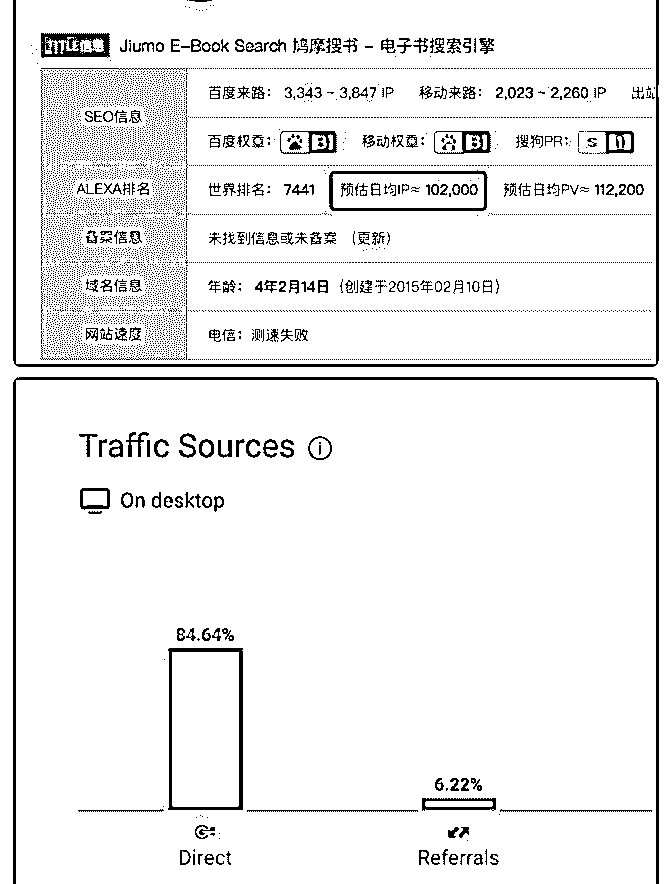

# 思路真的很关键，赚

阿和 : 思路真的很关键，赚大钱真的不一定要做大事。

有一个网站名字叫做鸠摩搜书功能说起来，很简单，就是提 供电子书的搜索服务，我本人也是它的忠实用户，只要有想 看的书，第一时间会打开这个网站。

通过爱站网可以查询到，平均每天独立 IP 访问超 10 万。(图一) similiarWeb 可以看到直接访问的来源占到将近 85%。（图二）

网站的盈利方式，一个是在搜索栏下方放了一个“图书类”的 淘宝客网站链接，第二是在搜索结果的右侧有相应书籍的淘 宝客链接、喜马拉雅有声书等其他网站的链接。因为客户精 准，所以转化应该不会太差。

[没有高深的技术，没有炫技的网站，紧贴用户需求和使用场 景。而且运营和运维成本低，但是流量很稳定。开发完成之 后，几乎就是一直躺赚了](https://www.jiumodiary.com/)[Jiumo+Search+](https://www.jiumodiary.com/)[鸠摩搜索](https://www.jiumodiary.com/)[+-+](https://www.jiumodiary.com/)[文档搜索](https://www.jiumodiary.com/)  [引擎](https://www.jiumodiary.com/)

2019-08-24(28 赞)

评论区：

朱较瘦 : 用了很久，确实很方便，搜索出来的结果，基本囊括免费途径能找到的资源。

花爷梦呓换酒钱 : 金花奖挑战成功！加我微信：huayebenren，发送星球内容截图领取红包奖励。大家如果觉得这条内容不

错，记得点赞，本周点赞最多的金花奖内容，会有额外的红包翻倍奖励。

人好话不多 : 这里是否设计盗版书版权问题・_・?

大话晓说 : 涉及版权问题怎么解决的

斑马 sir : 版权是硬伤。

关注公众号"懒人找资源"，星球资源一站式服务