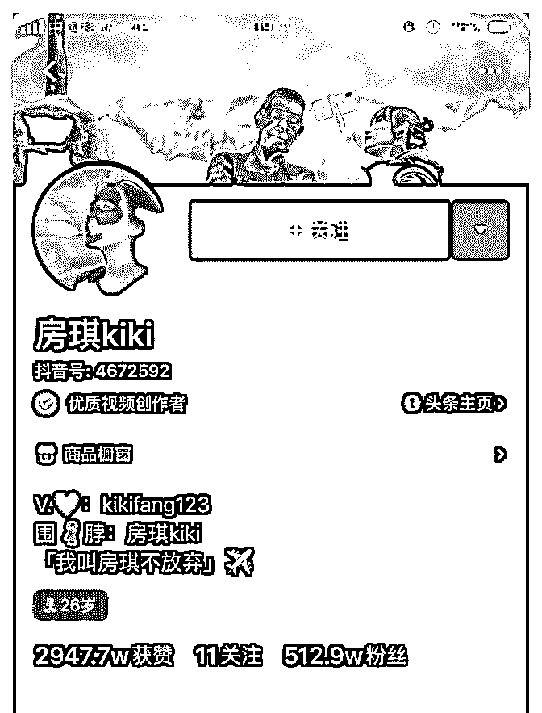

# 旅行自媒体的思考花

你是年少的欢喜 : 旅行自媒体的思考

花爷，最近我在抖音等一些流量平台上，了解到了旅行自媒 体这个职业。发现这真是一个有趣的职业，不过也不太容 易。因为

1 工作强度大。经常需要坐高铁坐大巴乘飞机辗转各地，睡 眠时间挺少的，就为了赶时间去游览拍摄。 2 需要很坚韧的毅力。前期做旅行自媒体粉丝稀少的时候，得 先坚持下去，毕竟积累流量是需要一个过程的。

但是我想了好久还是没想明白，旅行自媒体是靠什么方式来 变现的呢？ 以我观察的这个旅行自媒体抖主来说，我看到她一直在祖国 各地甚至全世界旅游，然后拍视频分享她的旅游见闻，难道 是靠抖音粉丝关注数量来变现？我做了以下猜想：

1 抖音的商品橱窗也是一个很好的展示销售渠道，用户通过 短视频找到需求的商品，从而购买实现变现。 2 与旅行社合作，拍摄相关的景点视频，熟悉景点路线，方便 旅行社指定旅行路线，帮助旅行社引流。 3 代购。帮需要买买买的朋友带货，不过代购的竞争力也挺大 的。

不知道分析得对不对，请花爷指教。

2019-08-20(13 赞)

评论区：

纯洁的微笑 : 只有有流量，怎么都能变现。

你是年少的欢喜 : 我一开始没想通，后来写着写着好像又懂了一点哈哈

demo : 这个是大 v，可以翻翻她的经历

你是年少的欢喜 : 有粗略翻过一下，感觉如果是刚做旅行自媒体，不是想她这样的大 v 估计变现不容易

demo : 有前期的粉丝积累

你是年少的欢喜 : 我明白了，谢谢你

花爷梦呓换酒钱 : 你猜的几点盈利方式，都有，但旅行 KOL 最大的收入，是品牌方的广告费。比如酒店、航空公司、景点

等等，这些品牌方预算充足，出手阔绰，基本是包吃住玩最后再奉上广告费让你去做内容——这点跟汽车自媒体有点像。

因为品牌方有钱到处花，所以旅行自媒体的大 V 小 V 水分其实特别大，很多粉丝、阅读都是刷的，反正品牌方人傻钱多，看

到你播放量阅读量蹭蹭涨，就觉得预算花得值了。旅行类 KOL，不刷数据老老实实赚钱的，说实话只是少数。

花爷梦呓换酒钱 : 本条内容已被选为精华，金花奖挑战成功！加我微信：huayebenren，发送星球内容截图领取红包奖励。 大家如果觉得这条内容不错，记得点赞，本周点赞最多的金花奖内容，会有额外的红包翻倍奖励。

关注公众号"懒人找资源"，星球资源一站式服务