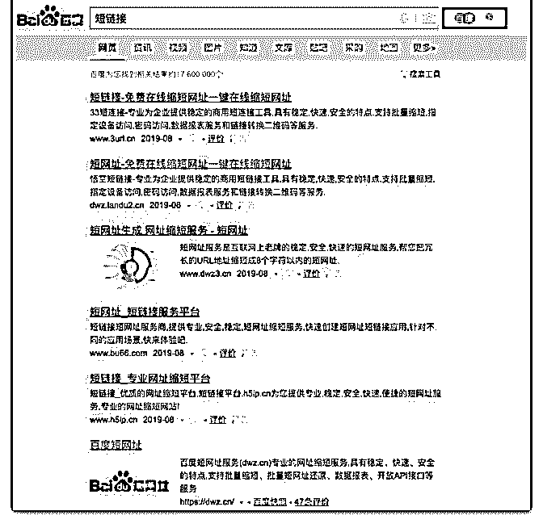

# 在百度搜索“短链接

阿和 : 在百度搜索“短链接”，你会看到如图 1 的景象，整整 5 个 广告！这点我真的是很好奇，免费提供短链接服务的那么 多，包括图 1 所示，广告之后的第一条就是百度官方的短链接 生成服务，既然已经有免费的服务了，为什么还有人不惜竞 价去推广自己的短链接服务？而且有限制，要去除限制还要 另外收费。

还请花爷分析下，通过竞价推广生成短链接的服务，真的有 利可图么？

2019-08-15(4 赞)

评论区：

言不尽 : 建网站肯定是为了赚钱，既然要赚钱，那肯定要有流量或用户数，所以会去百度上投广告，网站提供免费服务不

代表没有盈利点，比如，通过免费转短链接获取用户，网站内再通过广告或者其他付费服务盈利？

光光 : 假如你的链接是 A,通过加工生成短连接为 B 正常情况下是可以直接由 B 跳转到 A 的。 但是吧，有很多做短连接的人，

会在中间做些手脚。 比如当在微信中打开 B,可能会跳转到 C,C 是一个加菠菜、彩票、网赚的群 比如在浏览器里打开 B,可能

会跳转到 D,D 是一个 APP 下载地址 这其中的想象空间就大了，短网址用的人多了就相当于 C 端流量不用愁，直接找 B 端去变

现就行了

光光 : 一般也不会一棒子打死，会按照一定的概率，比如打开 100 次 B,有 10 次是 C,5 次是 D,剩下的是 A。 C 和 D 还会根据后台的

数据分析，进行动态调整，达到利益最大化。

watson : 这么搞谁还敢用他的短链？

花爷梦呓换酒钱 : 有的是卖增值服务的，包括链接后续的流量跟踪分析。剩下的，我估计上面光光说的可能性比较大，这

个我以前还真没注意过，有了解的来聊几句。

花爷梦呓换酒钱 : 只是一部分流量被劫持，再加上用户大多不会反馈，商户很难察觉的。再退一步，商户及时察觉到偶尔

有劫持，大多也会认为是基站劫持，很少有想到短链接上的。

花爷梦呓换酒钱 : 本条内容已被选为精华，金花奖挑战成功！加我微信：huayebenren，发送星球内容截图领取红包奖励。

大家如果觉得这条内容不错，记得点赞，本周点赞最多的金花奖内容，会有额外的红包翻倍奖励。

关注公众号"懒人找资源"，星球资源一站式服务