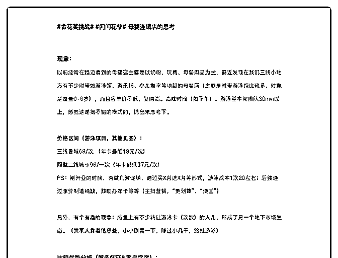
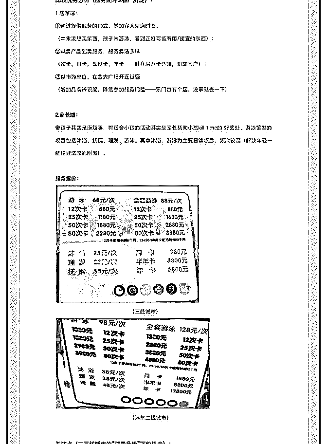
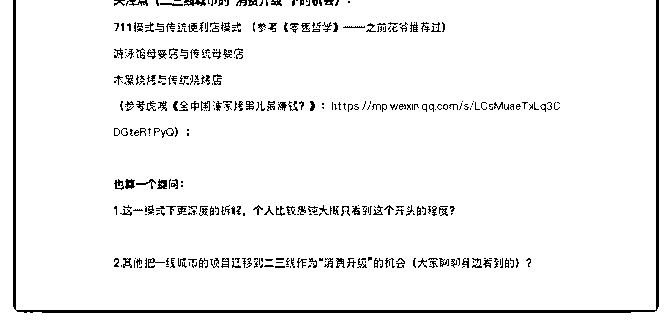

# 母婴连锁思考木屋烧

大海石斑鱼 : 母婴连锁思考 木屋烧烤参考链接：

想探讨一下“二三线升级”的机会[全中国谁家烤串儿最赚钱？](https://mp.weixin.qq.com/s/LCsMuaeTxLq3CDGteR1PyQ)

2019-08-13(1 赞)

评论区：

花爷梦呓换酒钱 : 很棒的分析，我指出一点，母婴游泳馆这类线下店，是很棒的母婴流量入口，这没错。但如果觉得只要

用户精准，就能在游泳馆里卖出很多母婴用品，就没有那么简单了。 你看大多数母婴游泳馆，可以扩展理发、沐浴等服务

项目，但能卖货的，几乎没有。 为什么？ 因为人对公司、对机构，是很难产生强连接的。游泳馆就是游泳的，当你买奶粉

买衣服时，还是会转头去问朋友的建议，问问身边的宝妈的建议，不会听游泳馆的。 所以我跟各类传统企业老板一直强

调： 让用户跟你公司的人产生联系，而不是只跟你的店产生联系。 好孩子是全国最大的母婴行业企业之一，它们已经采用

了一种全新的销售模式。要求店铺员工加用户的微信，并且统一运营员工的工作微信，相当于每个员工手下有一个小用户

池，所有员工的小用户池加起来，就是企业的大用户池。 这样一来，企业的员工在用户心里，不是服务员的形象，而是母

婴专业从业者形象，信任度、连接度、触达频率都大幅提升。 实际上在北上广买衣服的话，你也会发现，不少线下店销售

员会让你加她的微信，这些销售员的微信都是公司统一运营管理的。 这种运营模式一定会慢慢渗透到三四五线城市，开母

婴游泳馆的门槛不高，能建立用户流量池，会成为新的线下店门槛。

花爷梦呓换酒钱 : 本条内容已被选为精华，金花奖挑战成功！加我微信：huayebenren，发送星球内容截图领取红包奖励。

大家如果觉得这条内容不错，记得点赞，本周点赞最多的金花奖内容，会有额外的红包翻倍奖励。

关注公众号"懒人找资源"，星球资源一站式服务