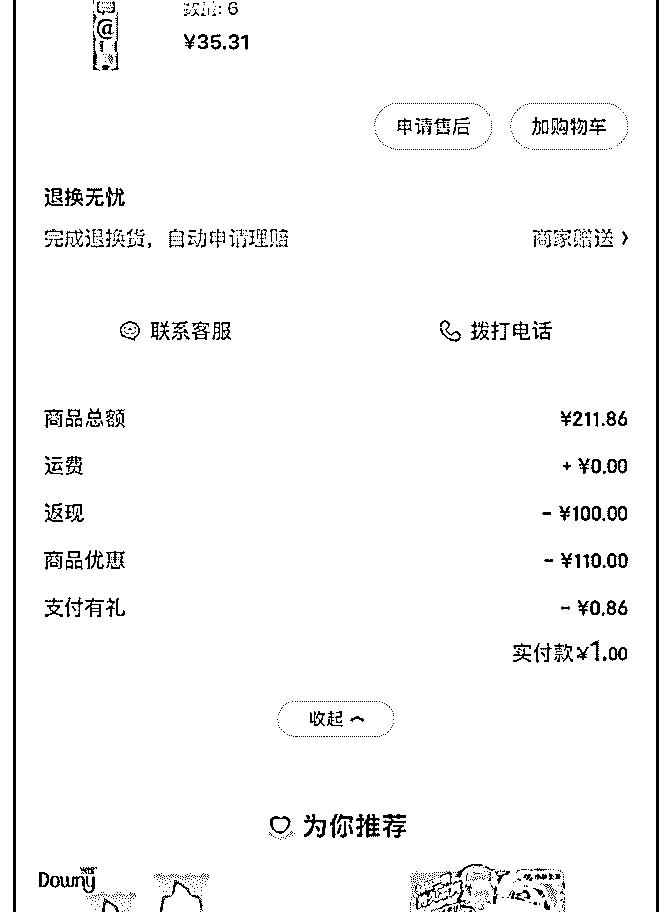
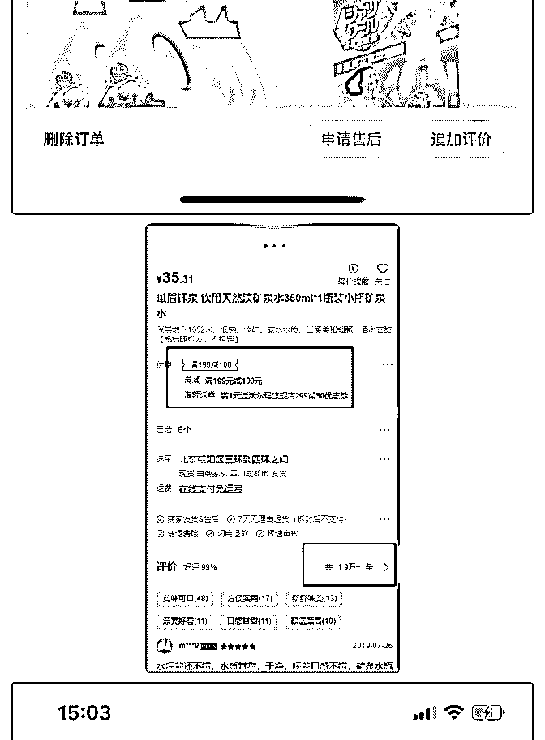
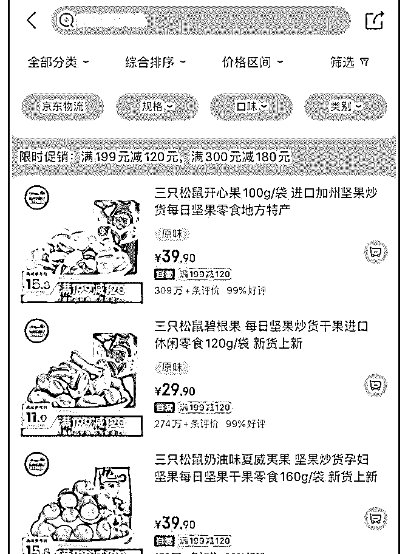
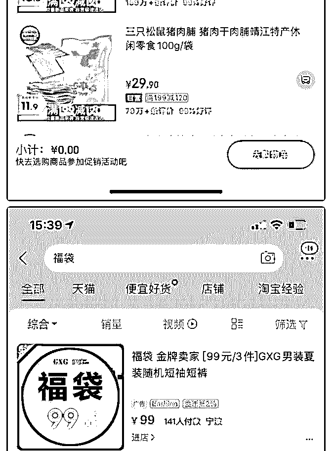
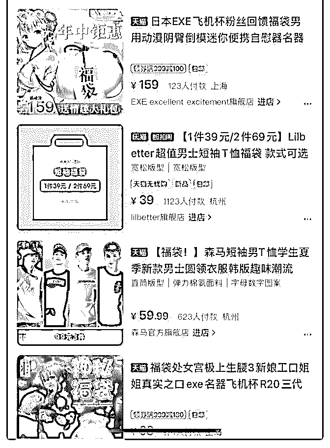

# 分享一个在群内前几

张鹏 : 分享一个在群内前几天在群内发过的案例 《商家如何 撸京东羊毛》 最近在逛什么值得买的时候发现了一个有趣的现象，有好多 京东的大额券 1 元单，9.9 元单（见图 1），618 都过去了，平行 规则都上线好久了，为什么还是有这么多“傻商家”呢？

凭借着强烈的兴趣，我跟着买了几单，发现了一个新世界。 以这个矿泉水为例，玩法是这样的： 1、原本 1 瓶矿泉水的价格在 1 块钱左右，可能小瓶更偏一点， 日常买比较难，毕竟不是啥品牌货。 2、把价格改为 35.31 元，拍 6 件的话 6 件*35.31 元=211.86 元

3、然后产品满 199 元立减 100 元，产品下方再送一张 199-100

元的优惠券

4、那么产品付款金额是 211.86 元-100 元立减-100 元券=11.86

元，这个是普通用户价格。

5、骚套路：京东 plus 每月可以领取 105-5，200-10 的京东补贴

优惠券，【平行优惠可以叠加】以上的 100 元券，所以 211.86

元-100 元立减-100 元券-10 元（京东补贴 200-10 券） =1.86 元。

6、那么 1 plus 顾客实付 1.86 元可以买到 6 瓶水，2 商家实收

11.86 元还赚了几千上万的销量，3 东哥白白补贴 10 元京东券。

【大额券玩法】见图 3，三只松鼠、百草味、良品铺子常搞的 199-120 券，299-200 的券，产品规格缩水，价格翻倍，也是这 个套路，毕竟买的没有卖的精。

【福袋玩法】见图 4，福袋，也称盲盒，线下火热的抓盒子抓 口红机器，线上淘宝经常搞得福袋，当然日常玩法都是情趣 类用品，但双 11 这类大促，淘客圈内的福袋混带着刷单就非 常有意思了，有幸参与了几届，下次可以展开介绍下。

搞定了这个套路，你只要去什么值得买这类爆料和白菜网站 放出去，就分钟出单几千件。

---提问---

1、请问花爷，这种 200-10 的券 应该明确是在薅东哥的毛，京

东那帮人反映这么迟钝吗？还是说因为风险有限，所以刻意

放任这种行为，用来刺激日常消费的。

2、这种模式好处是出单快，但坏处也很明显，容易被抓以及

需要巨大的人工发货能力，是否是可持续的？或者这就是拼

多多的京东化玩法？

--案例购买路径（已失效）-- 峨眉钰泉饮用天然淡矿泉水 350ml*6 瓶 下单 6 件：

目前京东商城售价 35.31 元，满 199-100 叠加优惠券 199 减 100， 叠加 200 减 10 优惠券，下单 6 件，实付 1.86 元包邮

200-10 券的领取方式：

1、打开京东 app -首页领券按钮-下拉 有 200-10 的券

2、plus 领全品

3、京豆换全品 [京东网上商](https://u.jd.com/IyhNW0)[城京东网上商](https://u.jd.com/UeUgPy)[城京东网上商城](https://u.jd.com/uPC8dV)

2019-08-08(20 赞)

评论区：

花爷梦呓换酒钱 : 1.京东 plus 送的券，主要看的是大盘，也就是整体送出的补贴，有没有拉起足够量的营收增量。这件事必

须从大盘看，才能判断 plus 会员策略是否有效，只看局部的话就没有意义了，因为一定有人用 plus 获得了超值的利益。 当然

像你举例的这种矿泉水的玩法，是明显的套利，如果京东发现了，我估计还是会出策略制止的。京东的态度应该是：你用

plus 省钱省得再多都没问题，但你不能直接套利。 2.商家这样充销量，不光是为了赚这笔订单的钱，而是把数据冲上去之

后，店铺在搜索、投放时能获得更多的自然流量，也有了以后宣传的素材（数万好评）。 其实跟以前淘宝店家冲销量差不

多，但以前是亏钱冲，现在是冲了还能小赚一笔。

花爷梦呓换酒钱 : 本条内容已被选为精华，金花奖挑战成功！加我微信：huayebenren，发送星球内容截图领取红包奖励。

大家如果觉得这条内容不错，记得点赞，本周点赞最多的金花奖内容，会有额外的红包翻倍奖励。

关注公众号"懒人找资源"，星球资源一站式服务